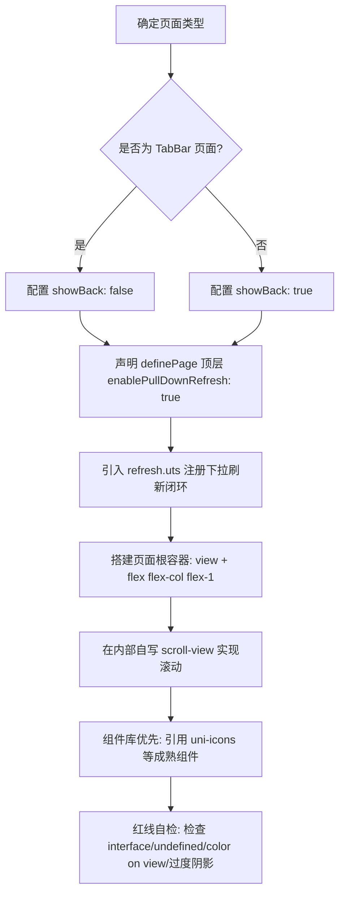

# unibestX-skill (uni-app X & UTS 规范、真实案例与代码生成指南)

## 概述

> 🚨 **AI / Agent 必读铁律**：所有参与本项目开发的 AI、Agent 在进行任何编码、重构、修 bug 或新增页面任务前，**必须首先完整阅读并严格遵循本 Skill**。  
> 🔄 **VDOM 与 Vapor 差异自动回写机制**：若在开发或排错过程中，遇到任何 UTS 语法、组件属性、生命周期、CSS 样式在 **VDOM 模式与 Vapor 模式不通用 / 存在渲染差异** 的问题，AI / Agent **必须主动根据分类（1.1 语法规范、1.2 样式限制、1.3 运行时约束、3.3 对照表及 3.4 红线清单）自动追加并同步到本 Skill**，严禁遗漏！

uni-app X 采用 UTS (uni type script) 语言与原生渲染引擎，跨端直接编译为原生代码（Android 编译为 Kotlin，iOS 插件编译为 Swift，鸿蒙插件编译为 ArkTS，Web/小程序编译为 JS）。  
与宽容的 TypeScript/JavaScript 不同，UTS 采用**名义强类型系统（Nominal Strong Typing）**与**原生渲染规范**。

本文档按照以下三大维度结构化组织：

1. **UTS 与原生规范**：语法、严格类型、CSS / Tailwind 样式引擎限制与跨端运行时铁律；
2. **项目正确案例**：来自本项目的生产级标杆案例（页面骨架、TabBar、二级详情页、滚动与下拉刷新）；
3. **项目代码生成规范**：智能体与开发者新增页面、生成组件、调用组件库的流程、模板与红线自检清单。

---

## 何时使用

- 编写、重构或新增 `.uvue`、`.uts`、`.ts`、`.scss` 文件时
- 规划或生成新页面结构、骨架布局与视口高度（`computedAvailableHeight`）时
- 使用 Tailwind CSS 编写跨端 UI、按钮排版、文本颜色与安全区适配时
- 遇到 UTS 强类型编译错误（`UTS110111163`、`UTS110111119`、`UTS110111120`、`UTS100006`、`error17`）
- 遇到 Android/iOS 原生运行时报错（`ClassCastException: Map cannot be cast to UTSJSONObject`）
- 进行跨端渲染模式（VDOM / Android VDOM / Vapor）兼容或 Easycom 组件库开发时

---

## 一、UTS 核心规范与原生渲染限制

### 1.1 UTS 强类型系统与语法核心铁律

#### 1.1.1 一律禁止使用 `interface`，全面统一使用 `type`

- **错误码**：`UTS110111163: Object literals only support object types defined by construction type, and do not support interfaces`
- **底层原理**：UTS 将 `interface` 严格映射为底层面向对象纯接口，禁止将对象字面量（如 `{ name: 'foo' }`）、Mock 数据或 API 返回值赋值给 `interface`。
- **强制规范**：定义任何对象结构、状态、参数或返回值类型时，**一律禁止使用 `interface`，全部统一使用 `type`（类型别名）**。

```ts
// ❌ 错误：触发 UTS110111163 编译崩溃
interface UserInfo {
  name: string
  age: number
}
const user: UserInfo = { name: "Tom", age: 18 }

// ✅ 正确：统一使用 type
type UserInfo = {
  name: string
  age: number
}
const user: UserInfo = { name: "Tom", age: 18 }
```

#### 1.1.2 不支持 `undefined`，必须初始化为 `null`

- **错误码**：`UTS110111119`
- **规范**：UTS 语言不支持 `undefined`。所有变量必须被初始化；表示空值必须使用 `null`，且联合类型目前**仅支持与 `null` 的联合**（`Type | null`）。

```ts
// ❌ 错误
let value: string | undefined
function test(param?: string): void {}

// ✅ 正确
let value: string | null = null
function test(param: string | null): void {}
```

#### 1.1.3 条件语句必须为显式布尔表达式

- **错误码**：`UTS110111120`
- **规范**：严禁使用 JS 中的 truthy / falsy 隐式转换（如 `if (str)` 或 `arr || []`），必须显式与 `null`、空字符串或数值进行布尔比较。

```ts
// ❌ 错误
if (obj) {}
if (str) {}
const list = arr || []

// ✅ 正确
if (obj != null) {}
if (str != null && str != "") {}
const list = arr != null ? arr : []
```

#### 1.1.4 等值比较使用 `==` / `!=`，禁止对基础类型使用 `===` / `!==`

- **底层原理**：在 Kotlin (Android) 原生端，`===` 会编译为引用/身份比较（Identity Equality）。对于字符串，比较的是内存地址而非文本内容；对于数值/布尔值，隐式装箱（Implicit Boxing）会导致不同包装对象的引用比较返回 `false`。
- **规范**：对 `string`、`number`、`boolean` 一律使用值比较运算符 `==` 和 `!=`。
- **构建期警告实证（本项目实测）**：`===` 在 Kotlin 阶段会直接吐警告，**连模板表达式也算**：

  ```text
  warning: Identity equality for arguments of types 'Number' and 'Int' can be unstable because of implicit boxing.
  at src/sub/nested-scroll/nested-scroll.uvue:21:16
  21 |  :empty="articleList.length === 0"
  ```

  这行的实际后果是「空状态可能永远不显示」（`length` 为 `Int`、字面量 `0` 被装箱成 `Number`，身份比较不稳定）。**构建日志里的这条 warning 要当作缺陷看，不要当噪音**；`grep -n "Identity equality" <build.log>` 可一次性扫出全项目残留。

```ts
// ❌ 错误：在 Android 原生端即使内容相同也可能判断为 false
if (statusCode === 200) {}
if (routePath === '/home') {}

// ✅ 正确：安全的值比较
if (statusCode == 200) {}
if (routePath == '/home') {}
```

#### 1.1.5 数字与数组必须显式声明类型

- **规范**：除 `string` 和 `boolean` 可以依据字面量可靠推导外，**`number` 和 `Array` 必须显式注明类型**，避免不同原生平台（如 Kotlin Int/Double 差异）下的推导歧义。

```ts
// ❌ 错误
let count = 0
let list = []

// ✅ 正确
let count: number = 0
let list: Array<string> = []
// 或
let list: string[] = []
```

#### 1.1.6 函数参数、返回值类型与安全调用运算符 `?.`

- **规范**：所有函数参数及返回值必须显式声明类型；无返回值函数必须明确声明为 `:void`。对可空类型调用属性或方法时必须使用安全调用运算符 `?.`。

```ts
// ❌ 错误
function calculate(score) {
  return score * 2
}

// ✅ 正确
function calculate(score: number): number {
  return score * 2
}
function getLength(str: string | null): number {
  return str?.length ?? 0
}
```

#### 1.1.7 类型定义必须在文件顶层作用域

- **错误码**：`UTS100006`（type）、`UTS110111166`（interface）
- **规范**：`type` 严禁声明在函数或代码块内部，必须提取到文件最顶层作用域。

#### 1.1.8 作用域插槽解构变量推断为 `Any?`

- **错误码**：`error17: 参数类型不匹配：实际类型为 'Any?'，预期类型为 'UTSJSONObject'`
- **规范**：在 `.uvue` 模板中，作用域插槽（如 `#default="{ item, index }"`）解构出的属性会被推导为 `Any?`。传参给强类型函数时必须在模板调用点显式使用 `as` 进行类型断言收窄。

```html
<!-- ❌ 错误：item 为 Any?，导致编译失败 -->
<text>{{ formatItem(item) }}</text>
<text>{{ index + 1 }}</text>

<!-- ✅ 正确：在模板调用点显式断言 -->
<text>{{ formatItem(item as UTSJSONObject) }}</text>
<text>{{ (index as number) + 1 }}</text>
```

#### 1.1.9 Class 语法使用约束

- **私有属性**：禁止使用 `#prop`，统一使用 `private prop` (`UTS110111128`)。
- **下标访问**：Class 实例禁止 `obj[key]` 下标访问，必须用点操作符 `obj.prop` (`UTS110111129`)。
- **静态初始化**：禁止静态块 `static {}`，使用私有静态方法 `private static initData()` 初始化 (`UTS110111130`)。
- **继承要求**：子类继承必须显式声明 `constructor()` 并调用 `super()` (`UTS110111131`)。
- **禁止传递 Class**：Class 仅作为类型使用，禁止赋值给变量或作为普通对象传递，需使用工厂函数 (`UTS110111151`)。
- **`super(...)` 构造实参中不能引用 `this`**：Kotlin 端父类构造先于子类字段初始化执行，`super(...)` 的实参里引用 `this` 会编译失败。需要把「子类自己的状态」交给父类构造时（典型如 `class Subject extends Observable`），**改用组合而非继承**：让 `Subject` 持有一个私有 `_observers` 数组，并额外提供 `asObservable(): Observable<T>` 返回一个由 `this` 闭包驱动的 `Observable` 供下游 `.pipe()` 使用。本项目实现见 `src/utils/rxjs-lite/index.uts` 的 `Subject`。

#### 1.1.10 严禁在对象字面量（UTSJSONObject）中放入顶层函数作为聚合对象导出

- **报错现象**：Android (Kotlin) 编译失败，报错：`error: Function invocation 'xxx()' expected. at src/utils/xxx.uts`
- **底层原理**：UTS 在 Android 端将对象字面量 `{ getApiBaseUrl }` 编译为 Kotlin 的 `_uO("getApiBaseUrl" to getApiBaseUrl)`。在 Kotlin 语法中，顶层函数名 `getApiBaseUrl` 不能作为裸值赋值给键值对，编译器会强行要求函数调用 `getApiBaseUrl()`；且 `UTSJSONObject` 在强类型原生端无法动态调用方法。
- **强制规范**：
  1. 所有工具库必须使用标准 ES 模块具名函数导出：`export function getApiBaseUrl(): string { ... }`；
  2. 业务方统一按需具名解构导入：`import { getApiBaseUrl } from '@/src/utils/env/index.uts'`；
  3. **一律严禁**写出如 `export const env = { getApiBaseUrl, ... }` 或 `export default { ... }` 这种包裹函数的对象字面量导出。

#### 1.1.11 严禁顶层函数与同名属性采用 Getter 命名冲突（Kotlin 平台声明冲突导致 NoSuchMethodError）

- **报错现象**：Android 运行时崩溃：`error: java.lang.NoSuchMethodError: No static method getWindowHeight()Lio/dcloud/uniapp/vue/ComputedRef; in class Luni/.../IndexKt;`
- **底层原理**：在 Kotlin 原生编译中，包顶层属性 `val windowHeight = computed(...)` 会被 Kotlin 编译器自动生成静态 getter：`public static final ComputedRef getWindowHeight()`。若同文件在顶层还显式导出了同名顶层函数 `export function getWindowHeight(): number`，在 JVM 字节码层面上会产生方法签名冲突（Platform Declaration Clash），函数的返回类型覆盖挤占了响应式属性的 getter。当 Vue 模板在执行 `{{ windowHeight }}` 时，因找不到匹配的 getter 而在运行时直接崩溃。
- **强制规范**：
  1. 顶层若已导出属性 `export const windowHeight = computed(...)`，**严禁在顶层额外导出 `export function getWindowHeight()`**；
  2. 若需面向对象风格的调用，封装在独立 class 的实例方法中（如 `systemUtils.getWindowHeight()`），因为类实例方法编译为类成员虚拟方法，绝不会干扰包顶层的静态方法签名。
- **⚠️ 极易漏判**：冲突的判定只取决于**名字形状**（`foo` ↔ `getFoo`），与两个声明的**业务语义是否相关无关**。只要顶层有 `export const tabBarHeight = computed(...)`，那么同文件的顶层 `export function getTabBarHeight(includeSafeArea: boolean)` 就必然冲突 —— 哪怕它带参数、语义上看着是"另一个函数"。**同理，顶层 `export function getScrollHeight()` 与顶层 `export const scrollHeight = computed(...)` 也会撞**。
- **⚠️ 为什么 H5 / 本地开发期发现不了**：H5 编译目标是 JS，不产生 Kotlin 静态 getter；`launch app-android --compile true` 也**不到 Kotlin 阶段**。所以本项目 `pnpm build:h5` 全绿、真机才炸，**不能用 H5 构建通过来证明这条规则没被违反**。
- **本项目真实案例（2026-09-15，`src/utils/systemInfo/index.uts` 重构）**：该文件同时存在顶层 `export const tabBarHeight = computed(...)` 与顶层 `export function getTabBarHeight(includeSafeArea)`，正好命中此坑。处置方式：
  - 顶层 `getTabBarHeight(includeSafeArea)` → 改名为**私有** `calcTabBarHeight(includeSafeArea)`（去掉 `export`，且主动避开 `get` 前缀）；
  - 顶层 `getNavBarHeight()` → **直接删除**（它只是 `navBarHeight.value` 的转发，无独立逻辑）；
  - 两个带参数的对外入口统一收敛到 `SystemUtils` 类的实例方法 `getNavBarHeight()` / `getTabBarHeight(includeSafeArea)`；
  - 同轮把可写 `ref`（`menuRect`）改为「私有 `menuRectRef` + 对外只读 `computed`」，让对外导出面里**没有可写 ref**，顺带消掉一类"外部误写状态"的隐患。
- **自查命令（改完 `.uts` 导出面后跑一次）**：

  ```bash
  # 1) 列出顶层属性/computed —— 每个名字都隐含一个 get<Name>() Kotlin 静态 getter
  grep -nE "^export const [A-Za-z_]" src/utils/xxx/index.uts
  # 2) 顶层若出现 get* 函数，逐个与上一步的名字比对；命中即违规
  grep -nE "^export function get[A-Z]" src/utils/xxx/index.uts
  ```

#### 1.1.12 严禁多层 / 重复 `export *` 星号重导出同一顶层符号（Kotlin 端符号被改名 `xxx__1`）

- **报错现象（一错两态，同一根因）**：
  1. **编译期**：`.uts` 文件引用处报 `error18 找不到名称"useTokenStore"`（`参考: compiler-known-issues.html#error18`）；
  2. **运行期**：`.uvue` 页面调用处崩溃 `java.lang.NoSuchMethodError: No static method getUseAppStore()Lkotlin/jvm/functions/Function0; in class Luni/UNIB120614/IndexKt`。
- **底层原理**：UTS 在 Android 端会把**多个 `.uts` 源文件合并**生成同一个 Kotlin 文件（如 `unpackage/cache/.app-android/src/index.kt`，Kotlin 类名 `IndexKt`）。当同一个顶层符号（如 `useAppStore`）被 **两层门面重复 `export *` 转发**（例如 `src/store/index.uts` → `./vdom/app.uts`，同时 `src/store/vdom/index.uts` 也 → `./app`），合并后会产生重名声明，UTS 编译器将后者**自动改名为 `useAppStore__1`**：
  - `.uts` 文件内的调用点会被**同步改写**为 `useTokenStore__1()`，因此 `.uts` 之间可能"看起来正常"；
  - `.uvue` 页面编译为**独立的 Kotlin 文件**（如 `App.ku.kt`），其调用点不会同步改写，仍写 `useAppStore()` → Kotlin 按顶层属性生成 getter 访问 `IndexKt.getUseAppStore()` → 该静态方法不存在 → 编译期 or 运行期崩溃。
- **强制规范**：
  1. 一个顶层符号**只允许在一层门面中 `export *` 转发**；门面链严禁套娃（`index.uts` 再 `export *` 一个同样做 `export *` 的 `index.uts`）；
  2. 本项目 `src/store/index.uts` 是**唯一**门面，`src/store/vdom/index.uts`、`src/store/vapor/index.ts` 只负责创建并默认导出 pinia 实例，**严禁再 `export *` 转发 stores**；
  3. 同理，新增聚合门面（如 `src/tabbar/index.uts`、`src/router/index.uts`）时，被聚合的子模块自身不得再对外做整包重导出，避免形成两层转发。
- **排查方法（人工定位）**：直接检查生成的 Kotlin 产物，若出现 `useXxx__1`、`val useAppStore__1 =` 字样即命中：

  ```bash
  grep -n "val use" unpackage/cache/.app-android/src/index.kt
  ```

- **错误示例**（两层 `export *` 转发同一 store，导致 `useAppStore__1`）：

```uts
// ❌ src/store/vdom/index.uts —— 子模块内部又转发一次
export default pinia;
export * from './app';
export * from './token';
export * from './user';

// ❌ src/store/index.uts —— 门面再次转发，形成两层重导出
export * from './vdom/app.uts';
export * from './vdom/token.uts';
export * from './vdom/user.uts';
```

```uts
// ✅ src/store/vdom/index.uts —— 只创建并默认导出 pinia 实例
export default pinia;
```

```uts
// ✅ src/store/index.uts —— 唯一门面，单层转发到具体实现文件
// #ifdef !VUE3-VAPOR
import pinia from './vdom/index.uts';
// #endif
export default pinia;

// #ifdef !VUE3-VAPOR
export * from './vdom/app.uts';
export * from './vdom/token.uts';
export * from './vdom/user.uts';
// #endif
```

#### 1.1.13 蒸汽模式（Vapor）不支持选项式 `<script>`，第三方 Options API 组件一律不可用

- **报错现象**：引用第三方 `uni_modules` 组件后，App 编译直接中断：

  ```
  error: 蒸汽模式仅支持使用<script setup>，不支持<script>选项式
  at uni_modules/xxx/components/xxx/xxx.vue:9:0
  ```

- **底层原理**：本项目 `manifest.json` 视图层使用**蒸汽模式（Vapor）**编译（编译日志可见 `编译器版本：5.24（uni-app x）蒸汽模式`）。Vapor 模式下只接受 `<script setup>` 组合式写法，凡是 `export default { name, components, props, data, computed, methods }` 这种 **Options API 的 `.vue` 组件**（Vue 2 风格插件在 uni_modules 里非常常见）都会**在编译期被拒绝**，且报错定位在该组件文件上，容易误以为是自己的页面写错。
- **强制规范**：
  1. 引入任何第三方组件前，先确认其主组件是 **`.uvue` + `<script setup>`**，而不是 `.vue` + 选项式；
  2. 若插件目录同时存在 `.vue` 与 `.uvue`（例如本项目的 `uni_modules/mp-html` 已提供 `mp-html.uvue` 适配版），**必须删掉/绕开 `.vue` 那份**，否则 easycom 会选中它并触发本错；
  3. 安装插件时看 `package.json` 的 `dcloudext.type` 与平台矩阵：`dcloudext.type` 为 `component-vue` 表示 Vue 组件（大概率选项式），只有 `uts` 类型的 `uni_modules` 才是为 uni-app X 原生重写的。
- **真实案例（本项目已踩）**：`uni_modules/zero-markdown-view` 是 `dcloudext.type: component-vue` 的选项式组件（内部还依赖自带的 `mp-html.vue` + `marked.min.js` + `prism.min.js` 纯 JS 链路），在蒸汽模式下**完全无法编译**；同时它的 `components/mp-html/` 与项目已适配的 `uni_modules/mp-html/components/mp-html/mp-html.uvue` 同名，会额外触发 `easycom组件冲突` 警告。

#### 1.1.14 局部声明在**其自身的初始化表达式内不可见** —— `const timerId = setInterval(() => clearInterval(timerId))` 必炸

- **报错现象**（本项目实测，`src/http/stream.uts`）：

  ```text
  error: 找不到名称"timerId"。参考: https://doc.dcloud.net.cn/uni-app-x/uts/compiler-known-issues.html#error18
  at src/http/stream.uts:292:22
  292|        clearInterval(timerId);
  ```

  报错点看着毫无道理：`timerId` 就在紧外包着它的那个 `setInterval` 的同一条语句上。

- **根因**：Kotlin 里局部声明**在其自身的初始化表达式内不可见** —— 回调体虽然在 `setInterval` 的实参位置，但它的可见域不包含「正在被初始化的那个变量」。JS 之所以侥幸能跑，纯粹因为回调是**延后求值**的。
- **修法**：拆成「先声明、后赋值」，**注意不能用 `const`**（`const` 必须自带初始化器）：

  ```uts
  // ❌ 错误：Kotlin 报 error18 找不到名称
  const timerId = setInterval((): void => {
    clearInterval(timerId);
  }, intervalMs);

  // ✅ 正确：先声明后赋值
  let timerId: number = 0;
  timerId = setInterval((): void => {
    clearInterval(timerId);
  }, intervalMs);
  ```

- **同族情形（一律按此处理）**：任何「回调体引用承载它的那个变量」都命中此坑 —— 定时器句柄、事件监听句柄、递归闭包、`subscribe` 里回读自己的 `subscription`。
- **为什么容易被当成误报**：这类代码在 **H5 上完全正常**（浏览器 JS 引擎延迟执行 + 变量提升），只有走到 Kotlin 阶段才炸；而 `launch app-android --compile true` 根本不到 Kotlin 阶段（见 1.3.15），于是"本地一直是好的"。

---


#### 1.1.15 遍历「值类型为 `any` 的 Map」时，**给回调参数显式标注 `any`** 会炸 —— 去掉标注或改用 `UTSJSONObject.keys()`；且 `map.keys()` 在 Kotlin 里是属性不是函数

- **报错现象**（本项目实测，uni-router-guard 任务 0 探针，真机 VDOM/Kotlin 通道）：

  ```text
  error: 参数类型不匹配：实际类型为 'Function2<Any, String, Unit>'，预期类型为 'Function1<Map.Entry<String, Any?>, Unit>'。
  参考: https://doc.dcloud.net.cn/uni-app-x/uts/compiler-known-issues.html#error17
  at src/sub/routerGuardProbe/routerGuardProbe.uvue:60:27
  60 |      query!.toMap().forEach((value: any, key: string): void => {
  ```

  同一次编译里的同族报错：

  ```text
  error: Expression 'keys' of type 'MutableSet<String>' cannot be invoked as a function. Function 'invoke()' is not found.
  at src/sub/routerGuardProbe/routerGuardProbe.uvue:67:15
  67 |    const ks = m.keys();
  ```

- **根因**：`UTSJSONObject.toMap()` 的值类型是 `any`（即 Kotlin 的 `Any?`）。Kotlin 侧 `Map.forEach` 的真实签名只有 `(Map.Entry<K, V>) -> Unit` 一个；UTS **显式标注** `(value: any, key: string)` 时会按「双参函数」去匹配，生成 `Function2<Any, String, Unit>` 对不上 `Function1<Map.Entry<...>>`。**不写标注**让编译器自行推导就能对上。而 `keys` 在 UTS 的类型声明里是方法、编译到 Kotlin 却是 `Map.keys` **属性**（`MutableSet<String>`），因此不能带括号调用。

- **修法（两种都真机验过，Kotlin 编译 0 error）**：

  ```uts
  // ✅ 写法 1（推荐）：UTSJSONObject.keys() + getAny()
  const keys = UTSJSONObject.keys(query);   // query: UTSJSONObject
  keys.forEach((key: string): void => {
    const value = query.getAny(key);
    if (value == null) { return; }
    parts.push(`${key}=${encodeURIComponent(`${value}`)}`);
  });

  // ✅ 写法 2：双参 forEach，但**不写类型标注**
  query.toMap().forEach((value, key) => {
    parts.push(`${key}=${value}`);
  });
  ```

  ```uts
  // ❌ 禁：给 any 值参数显式标注 → error17
  query.toMap().forEach((value: any, key: string): void => { ... });
  // ❌ 禁：map.keys() → Kotlin 报「属性不能当函数调用」
  const ks = map.keys();
  ```

- **对照（重要）**：本条**只在 Kotlin 阶段暴露**。同一份代码在**蒸汽 / 字节码模式**（本项目 `manifest.json` 默认配置，见 1.3.20）下完全正常。本项目 `uni_modules/lime-i18n/common/composer.uts` 就写着双参 `toMap().forEach((value, key) => ...)` —— 它能跑正是因为**没写类型标注**；一旦「好心」补上 `: any` 就会在 Kotlin 端炸。
- **范围界定**：`Array.forEach` 带标注没问题（`keys.forEach((key: string): void => {})` 实测可用）；`Map<string, string>.forEach((value: string, key: string) => {})` 也实测可用。**只有「值类型为 `any` 的 Map」**命中此坑。

---

#### 1.1.16 Kotlin 下**局部函数不能当值传递** —— `setTimeout(localFn, 100)` 报 `error18`，必须包一层 lambda

- **报错现象**（本项目实测，`App.uvue` 真机 VDOM/Kotlin 通道）：

  ```text
  error: 找不到名称"openProbePage"。参考: https://doc.dcloud.net.cn/uni-app-x/uts/compiler-known-issues.html#error18
  at App.uvue:38:19
  36 |      fail: () => {
  37 |        if (probeTryCount < 8) {
  38 |          setTimeout(openProbePage, 800);
  ```

  两个触发点，同一次编译都报：① 把局部函数名**直接当实参**传给 `setTimeout`；② 在**对象字面量的回调**里引用外层 `<script setup>` 的局部函数（同一个函数在 `uni.navigateTo({ fail: () => { ... } })` 的 `fail` 里也报）。

- **根因**：`<script setup lang="uts">` 的顶层代码会被装进 setup 函数，函数声明随之变成 Kotlin 的**局部函数**。Kotlin 的局部函数是语句级声明，**不能作为函数值直接传递**，在嵌套 lambda / 局部类（对象字面量编译产物）里也可能解析不到。
- **修法**：统一包一层 lambda 再传：

  ```uts
  // ❌ Kotlin 报 error18
  setTimeout(openProbePage, 1200);

  // ✅
  setTimeout(() => {
    openProbePage();
  }, 1200);
  ```

- **与 1.1.14 的关系**：同属「Kotlin 里局部声明的可见域比 JS 窄」这一族 —— 1.1.14 是「在其自身初始化表达式内不可见」，本条是「不能当值传递 / 嵌套作用域内可能不可见」。1.3.14 与 3.4 第 30 条的「局部函数必须定义在调用点之前」是同一族的第三种表现。
- **只在 Kotlin 阶段暴露**：字节码 / 蒸汽模式与 H5 都正常。

---

### 1.2 样式 (CSS & Tailwind CSS) 与原生渲染铁律

#### 1.2.1 CSS 变量动态换肤与原生控件限制

- **根节点绑定**：为了保证 App 原生平台下 CSS 变量跟随 JS 变量动态更新，**必须在根元素（如 layout 根 `view`）上内联绑定该变量**：

  ```html
  <view :style="{ '--theme-color': appStore.state.theme }">
    <slot></slot>
  </view>
  ```

- **iOS 原生控件换肤限制**：对于底层映射为系统原生控件的元素（如 iOS `<button>` 映射为原生 `UIButton`），原生控件无法自动继承重绘 CSS 变量。
  - **正确做法**：在 `<button>` 等原生控件上，通过 Vue 响应式行内样式直接绑定具体变量值：

    ```html
    <button :style="{ backgroundColor: appStore.state.theme }">按钮</button>
    ```

#### 1.2.2 原生 `<button>` 布局对齐限制

- **铁律**：**禁止**在原生 `<button>` 元素上直接使用 flex 布局对齐类名（如 `items-center`、`justify-center`、`justify-content`、`align-items`）。原生平台的 `<button>` 仅作为文本控件实现。
- **正确做法**：使用 `<view>` 作为外层 Flex 容器进行排版，内层使用普通文本或自定义组件：

  ```html
  <!-- ❌ 错误：触发编译报错 style property justify-content|align-items is only supported on view... -->
  <button class="flex flex-row items-center justify-center">按钮</button>

  <!-- ✅ 正确：用 view 容器做 Flex 居中排版 -->
  <view class="w-full h-[36px] rounded-[8px] bg-primary flex flex-row items-center justify-center">
    <text class="text-[#ffffff] text-[14px] font-medium">确认提交</text>
  </view>
  ```

#### 1.2.3 `color` 属性仅支持特定文本元素

- **铁律**：原生平台中 `color` 属性（Tailwind 的 `text-[#1e293b]`、`text-primary`）**仅支持在 `<text>`, `<button>`, `<input>`, `<textarea>`** 元素上使用。**禁止**在 `<view>` 上直接挂载文字颜色类名，否则编译报错：`style property color is only supported on <text>|<button>|<input>|<textarea>`。
- **正确做法**：将文字颜色类名挂载到内部的 `<text>` 标签上：

  ```html
  <!-- ❌ 错误 -->
  <view class="text-[#334155]">
    <text>内容</text>
  </view>

  <!-- ✅ 正确 -->
  <view>
    <text class="text-[#334155] text-[14px]">内容</text>
  </view>
  ```

#### 1.2.4 `<text>` 元素只能包含单个文本节点

- **铁律**：uni-app X 原生渲染引擎要求**一个 `<text>` 元素内部只能包含一个纯文本节点**。严禁在 `<text>` 内混合「裸文本 + 嵌套 `<text>` + 裸文本」，否则编译报错：`A <text> element can only contain one text node`。
- **正确做法**：内联多色/高亮文本排版，使用外层 `flex flex-row flex-wrap` 容器包裹多个同级的兄弟 `<text>`：

  ```html
  <!-- ❌ 错误 -->
  <text class="text-[13px] text-[#475569]">
    根容器 <text class="text-[#1d4ed8]">view</text> 撑满高度
  </text>

  <!-- ✅ 正确：兄弟 text 节点组合 -->
  <view class="flex flex-row flex-wrap items-center">
    <text class="text-[13px] text-[#475569]">根容器 </text>
    <text class="text-[13px] text-[#1d4ed8]">view</text>
    <text class="text-[13px] text-[#475569]"> 撑满高度</text>
  </view>
  ```

#### 1.2.5 颜色值一律强制十六进制，严禁使用英文命名颜色

- **铁律**：**颜色必须全部统一使用标准十六进制色值（如 `#ffffff`、`#ef4444`、`#1e293b`），严禁使用英文单词命名颜色（如 `bg-[red]`、`text-[red]`、`border-[blue]`）**。
- **原因**：原生平台对 CSS 命名颜色的解析不一致，极易失效；且预设类名（如 `text-white`）在鸿蒙 VDOM 或作用域插槽中可能丢失 CSS 变量继承退化为黑色。
- **鸿蒙 VDOM 白色双重防护**：在插槽（slot）、下拉刷新、悬浮按钮等容器内的白色文字，强烈建议使用 `class="text-[#ffffff]"` 并叠加内联样式 `:style="{ color: '#ffffff' }"` 确保 100% 稳定呈现白色。

```html
<!-- ❌ 错误：使用英文命名颜色 -->
<view class="bg-[red] p-[10px]">
  <text class="text-[white]">提示</text>
</view>

<!-- ✅ 正确：全部标准十六进制 + 关键白色双重防护 -->
<view class="bg-[#ef4444] p-[10px]">
  <text class="text-[#ffffff] text-[14px]" style="color: #ffffff;">提示</text>
</view>
```

#### 1.2.6 Tailwind CSS 边框书写规范

- **规范**：原生平台解析器要求明确指定边框宽度、颜色与实线样式，推荐使用带明确属性的组合类名：

  ```html
  <view class="border-[1px] border-solid border-[#e2e8f0] rounded-[12px] p-[16px]"></view>
  ```

#### 1.2.7 禁用字体族工具类

- **铁律**：**严禁**使用 `font-mono`、`font-sans`、`font-serif` 等字体族工具类。这些类生成的 CSS 会被原生平台的严格解析器当作 `font` 简写属性处理，因缺少 `font-size` 报错：`[parse-css-font] Missing required font-size.`。
- **正确做法**：通过内联样式指定字体族：

  ```html
  <text class="text-[13px] text-[#334155]" style="font-family: monospace;">127.0.0.1</text>
  ```

#### 1.2.8 原生平台 Display / Align-Items / Position 限制

- **Display 限制**：原生平台仅支持 `display: flex` 和 `display: none`。**严禁**使用 `display: grid` 或 `inline-block`。
- **Align-Items 限制**：原生平台仅支持 `center`、`flex-start`、`flex-end`、`stretch`。**严禁使用 `items-baseline` (`align-items: baseline`)**，否则编译报错：`property value baseline is not supported for align-items`。需对齐底部时使用 `items-end` 或 `items-center` 配合微调。
- **Position 限制**：原生平台仅支持 `relative`、`absolute`、`fixed`，**不支持 `position: sticky`**。
- **布局推荐 Flex 类名**：`flex flex-row`、`flex-col`、`flex-1`、`items-center`、`justify-between`、`justify-center`。

#### 1.2.9 高度单位与 Flex 布局子元素高度塌陷

- **视口单位限制**：原生平台不支持 `vh`、`vw`，高度仅支持数字、px、百分比或 `auto`。
- **Flex 子元素塌陷陷阱**：在 Flex 布局中，如果父元素是通过 `flex-1` 撑开剩余空间而无固定像素高度，子元素设置 `h-full` (100%) 在原生底层会被解析为 `0`（`100% * auto(0) = 0`），导致内容完全空白消失。
- **解决方案**：子元素也直接使用 `flex-1` 占满剩余空间。

#### 1.2.10 模板 Void 元素自闭合规范

- 在 `.uvue` 模板中，HTML Void 元素（如 `<input />`、`<image />`）必须显式自闭合，否则报错 `Element is missing end tag`。

#### 1.2.11 阴影使用限制（严禁过度依赖阴影）

- **铁律**：**严禁过度依赖阴影（`box-shadow` 或 Tailwind `shadow-*` 类名）**。
- **原因**：在安卓原生端，**VDOM 渲染模式与 Vapor 模式对阴影的底层渲染机制存在明显差异**（如 Elevation 高度映射、扩散模糊度与裁切表现不一致），极易导致同一界面在不同编译模式或不同安卓基座版本下显示效果不一致，甚至可能导致部分卡片边缘渲染异常或掉帧。
- **正确做法**：界面层级与卡片质感优先采用**浅色细腻边框**（如 `border-[1px] border-solid border-[#e2e8f0]` 或 `border-[#f1f5f9]`）结合**浅色背景微反差**（如 `bg-[#f8fafc]`、`bg-[#ffffff]`）进行区分。若确需投影，仅可使用极其轻微的弱阴影，避免深重大面积阴影。

#### 1.2.12 flex 行内子元素不给宽度 ⇒ 按固有宽度排版，长内容横向溢出被裁切（App 原生端尤其明显）

**现象**：内容横向冲出卡片、右半边被硬生生裁掉、且**完全不换行**；同一份代码在 H5 上能自动换行、在 App 上被裁切。

- **根因 1：flex 子元素的宽度下限是内容的 min-content**。
  - `flex:1`（=`flex-grow:1;flex-shrink:1;flex-basis:0`）看着像"等分"，但 `flex-shrink` **无法把元素压到它内容的 min-content 以下**。一个不可断行的长英文 token（`simulateStream`、URL、长数字串）就能把那一列顶宽，把整行挤出行容器。表现为**列宽不均 + 最右一列被裁切**。
  - 同理，flex 行里**裸写的 `<text>` 若不给任何宽度约束，会按固有（单行）宽度排版**，整行因此长出容器。
- **根因 2：原生端没有 `word-break` 兜底**。`word-break: break-all` 在本项目里是 **H5 / 小程序专用** —— 项目内三处用法（[src/sub/lodash/lodash.uvue](file:///Users/chenqi/Desktop/unibestX/src/sub/lodash/lodash.uvue)、[src/sub/httpDemo/httpDemo.uvue](file:///Users/chenqi/Desktop/unibestX/src/sub/httpDemo/httpDemo.uvue)、[src/sub/crypto/crypto.uvue](file:///Users/chenqi/Desktop/unibestX/src/sub/crypto/crypto.uvue)）**全都包在 `/* #ifdef H5 || MP-WEIXIN */` 里**。App 端只能靠"宽度本身给够"来避免溢出。
- **正确做法（按优先级）**：
  1. **等分列 / 等分格：写显式百分比宽度，不要写 `flex:1`**。列数已知就用 `width:(100/N)%`，并**必须同时加 `box-sizing:border-box`**（否则 padding 与边框会额外加宽，N 列总宽超过 100% 又溢出）。N 只在运行时才知道时，用函数按列数算：

     ```uts
     const pct: number = colCount > 0 ? Math.round(10000 / colCount) / 100 : 100
     return 'box-sizing:border-box;width:' + pct.toString() + '%;padding:4px 8px;...'
     ```

  2. **长内容要换行就让它成为"块级"元素**：段落那种 `<view><text>长文本</text></view>`（text 独占一行）本身就能正常换行；列表项不要把"符号 + 内容"拆成 flex 行内的两个 `<text>`，**并进同一个 `<text>`** 即可自动换行（代价是没有悬挂缩进）。
  3. **实在躲不开的长 token，只能改内容**：缩短英文标识符、或换成中文（中文可在任意两字之间断行，min-content 只有 1 个字宽）。
  4. 兜底手段 `min-width:0` 只在 Web 引擎上可靠；**不要把它当作 App 端的解法**。
- **红线**：**不要**用 `flex:1` 去做"等分列"，尤其在内容来自外部（Markdown、接口返回、用户输入）时 —— 你无法保证内容里没有长 token。等分一律用显式百分比 + `box-sizing:border-box`。
- **真实案例（本项目已踩）**：Markdown 表格渲染，见 1.3.9 坑 3。

#### 1.2.13 字号单位：原生端不支持 `em` / `rem` / `ex` / `%` / `small|large` 关键字 —— 动态 `:style` 里写 `em` 会让整行文字不可见

- **症状**：同一份代码 **H5 正常、安卓上某几行文字凭空消失**（排版还在、该占的高度也在，就是看不见字）。本项目实测：Markdown 的 `<h2>` / `<h3>` 两行在安卓端消失，而同一文档里的正文、列表、引用、表格、代码块全都正常 —— 因为**那份 demo 文本里只有标题用了 `em`**。
- **根因**：官方 CSS 文档「font-size」页的 App 平台差异明确写着「**不支持百分比的单位、不支持基于用户默认字体大小的绝对大小关键字，如 small、medium、large 等、不支持 em、rem、ex 等单位**」；且**原生端没有样式继承**，font-size 只作用于当前 text 组件。于是 `font-size:1.5em` 这类相对单位在原生端**没有可依的父级字号，字号塌成 0** → 文字不可见（H5 有继承链，一切正常）。
- **为什么特别难查**：静态样式里的非法值在构建期会被 CSS 校验喊出来（如 1.2.7 的 `[parse-css-font] Missing required font-size.`），但**写在 `:style` 动态绑定里的不会** —— `:style="headingStyle(...)"` 是运行时字符串，构建器看不到，只在运行时安静地失效。所以这类问题**只能靠"两端对照 + 逐个属性排查"定位**。
- **正确做法**：字号**一律用 `px`**（原生唯一可靠的字号单位；`rpx` 官方也明确不推荐用于字号）。需要"相对父级"的效果时，在函数里**算出具体 px**（本项目把上游的 `2em/1.5em/1.17em/1em/0.83em/0.67em` 换算成 `24px/20px/18px/16px/14px/13px`），并把 `font-size:smaller` 这类关键字一并换成具体 px。
- **红线**：**动态 `:style` 里禁止出现 `em` / `rem` / `ex` / `%` / `smaller` / `larger` / `small` / `large`**；写组件级样式表时同样按这条办（原生端不生效，还会因为「H5 好看」而让人误以为写对了）。
- **配合 1.2.9 一起记**：原生端同样不支持 `vh` / `vw`（见 1.2.9）。

#### 1.2.14 文本修饰线：App 端**不支持 `text-decoration` 简写**，必须写 `text-decoration-line`

- **症状**：与 1.2.13 同一类「**H5 对、原生静默失效**」——同一份代码，Web 上有下划线/删除线，安卓上**整条线不出现**（文字本身正常显示，字号、颜色都对，所以很容易被当成"没写样式"而反复检查代码）。
- **根因**：官方 CSS 文档「text-decoration」页的 App 平台说明写着「**app 平台暂不支持 text-decoration 简写样式，仅支持 text-decoration-line 设置修饰线类型**」，且该页的 App 兼容性表格（含蒸汽/拍平模式）均为不支持；只有「text-decoration-line」页给出 App 版本号。简短结论：**简写在 App 上被整个忽略**。
- **正确做法**：一律写**长属性** `text-decoration-line`：
  - `text-decoration:underline` → `text-decoration-line:underline`
  - `text-decoration:line-through` → `text-decoration-line:line-through`
- **额外限制（同一页）**：
  1. App 端**只支持 `underline` 与 `line-through` 两个值**，`overline` / `blink` / `spelling-error` / `grammar-error` 不要指望；
  2. App 端该属性**不支持继承** —— 必须落在**真正承载文字的那个组件**上，别指望套在容器上让子元素继承；
  3. 仅适用于 `text` 与 `button` 组件（`view` 上写无效）；
  4. 版本：蒸汽模式下安卓需 **5.21+**、iOS 5.11+。
- **红线**：**禁止在 `.uvue` / `.uts` 里写 `text-decoration:` 简写**；需要删除线/下划线时写 `text-decoration-line:`。排查「线不见了」时，**先看是不是简写**，再看是不是把属性挂在了容器上（继承限制）。
- **真实案例（本项目已踩）**：Markdown 渲染器的行内样式表把 `~~删除线~~` 映射成 `text-decoration:line-through`，H5 正常、安卓无线；改成长属性后两端一致。见 1.3.9 改造 6。

#### 1.2.15 行内嵌套样式不会自动叠加：`取本节点样式 + 摊平子树` 会丢掉内层样式（`***粗斜体***` 只剩斜体）

- **症状**：Markdown 的 `***粗斜体***` 在**两端都**只显示为斜体（原生和 H5 都错，因为它不是平台差异，而是渲染架构问题），加粗凭空消失；同理 `~~**粗删**~~` 只剩删除线、`[**粗链接**](url)` 链接文字不加粗。
- **根因**：marked 对 `***x***` 输出的是**嵌套** HTML `<em><strong>x</strong></em>`。而原生端渲染行内节点通常采用「**同级兄弟 `<text>`**」架构（因为一个 `<text>` 只能有一个文本节点，见 1.2.4）：每个行内节点渲染成**一个** `<text>`，用 `:style="本节点的样式"` + 「摊平子树取纯文本」的函数（如 `flatText`）取值。于是**内层标签被连同它的样式一起摊平丢掉**，只剩最外层那一层效果。注意这**不是**"原生不叠加样式"，而是**我们自己没把嵌套样式累加**。
- **正确做法**：渲染行内节点时，**沿"纯行内元素链"向下累加样式**，把这些 class 拼成一条 `class` 交给同一个 `<text>`：

  ```uts
  // 只在「单链」时下探：一旦某层子节点不止一个（如 <em>前<strong>后</strong></em>），
  // 那种情形本来也无法用一个 text 表达，剩下的交给摊平函数即可
  //
  // 注意：返回的是 **class 名** 而不是 style 串。行内样式统一写成静态 class（见 1.3.9 改造 8），
  // 原因是动态 `:style` 里的 font-weight 在 App 端不生效（见 1.2.16）；
  // 若本项目尚未做 class 化改造，把这里的 inlineClass/chainClass 换成 inlineStyle/chainStyle、返回值用 `;` 拼接即可。
  function chainClass(n: HtmlNode): string {
    let cls = inlineClass(n.name ?? '')
    let cur: HtmlNode = n
    while (true) {
      const kids: HtmlNode[] | null = cur.children ?? null
      if (kids == null || kids.length != 1) break
      const only: HtmlNode = kids[0]
      if (only.type == 'text') break          // 到文本了，链结束
      if (!isInline(only.name ?? '')) break   // 链上夹着非行内元素，停止下探
      const c: string = inlineClass(only.name ?? '')
      if (c != '') cls += (cls != '' ? ' ' : '') + c
      cur = only
    }
    return cls
  }
  ```

- **⚠️ 前提条件（比链式累加本身更容易漏）**：链式累加**只有在解析阶段保留了子节点结构时才成立**。如果解析器（本项目 `parseHtml` 的行内分支）对行内标签执行 `stripAllTags(inner)`、把子节点摊平成**单个文本节点**，那么 `<em><strong>x</strong></em>` 里的 `<strong>` **在解析阶段就没了**，`chainClass` 沿链下探时第一跳就撞上 `only.type == 'text'` 而 `break`，拿到的只有 `mp-i` —— 表现与"没做链式累加"一模一样。所以**行内节点的 children 必须是 `parseHtml(inner)`（保留树形），而不是摊平的文本**；`pre` 与行内 `code` 例外，它们的内容就该是纯文本（前者交给逐行着色，后者是等宽片段）。文本仍由 `flatText` 递归摊平取得，渲染结果不变、只是树形正确了。
- **验证方式（不要再靠肉眼）**：**必须用「真实解析器产出的树」来断言，不能手搭 fixture** —— 本项目第一次就把 `chainClass` 单独喂了手写的嵌套 HTML 树，20/20 全绿，而真机上内层样式照样丢失，因为 `parseHtml` **从来不产出那种树形**。正确做法是让测试跑完整链路：`真实 marked 输出 → parseHtml → 对每个行内节点断言 chainClass`。本项目落地在 `/tmp/km/ex.py`（按大括号配对从 `.uvue` 原样抽函数，含 `ENTITIES` 与 Vue 无关的那部分）+ `/tmp/km/_p.ts`，断言 `加粗→mp-b` / `斜体→mp-i` / `粗斜体→mp-i mp-b` / `删除线→mp-del` / `行内代码→mp-code`，外加「任何行内标签都不该算出空 class」的反向守卫。**并且要把解析器改回旧写法确认测试会红**（实测旧写法下报 `"粗斜体"：class="mp-i" 缺少 ["mp-b"]`，与真机症状逐字一致）—— 不会红的测试等于没测。**手抄函数会引入偏差，务必原样抽取**。
- **单元级补充**：`chainClass` 自身的边界用例（混排不下探、链上夹 `` 不下探、三层链）仍可单独测，但那只覆盖函数逻辑，**不能替代上面的链路测试**。
- **红线**：**看到"嵌套行内标签"就直接用「本节点样式 + 摊平文本」渲染，等于静默丢内层样式**；要么按上面的链式累加，要么改成嵌套 `<text>`（但受 1.2.4 限制，只在"纯嵌套、无裸文本混排"时可行）。
- **已知未覆盖**：列表项与表格单元格走的是「整格/整项合成单个 `<text>`」路径（为规避 1.2.12 的横向溢出而刻意为之），其中的行内样式（如 `` `code` ``）**仍会被摊平丢掉**，属于已记录的有意取舍。改造清单见 1.3.9 改造 7。

#### 1.2.16 反面教材：不要用「动态 `:style` 里的 `font-weight` 不生效」去解释字重丢失（❌ 该推断已被实测推翻）

- **结论（已实测）**：**App 端动态 `:style` 里的 `font-weight` 是生效的** —— 静态 class（Tailwind `font-bold`）、动态 `:style` 数值 `700`、动态 `:style` 关键字 `bold`、动态 `:style` 带 `font-size` 的 `700`，**四种写法在真机上同样都能显示为粗体**。所以「字重没显示出来」**不能**归因于"动态样式串里的 `font-weight` 被原生端忽略"。
- **为什么把它记下来**：本项目在排查「`***粗斜体***` 看不出加粗」时，曾**按这个错误方向推断** —— 先改写法（`bold` → `700`）无效，再把行内样式整体改成静态 class。最后用「同一行中文四种写法并排」的真机对照一次性证伪：**四个都粗** ⇒ 方向错了，问题不在动态 `:style`。
- **真正的根因在别处**：`***粗斜体***` 看不出加粗的真因是**嵌套行内样式被摊平丢掉**（`<em><strong>x</strong></em>`，只保留了外层 `em` 的斜体）—— 也就是 1.2.15 那条，与 `font-weight` 的写法无关。**教训：先确认「样式是不是压根没到元素上」，再怀疑「样式值的写法对不对」。**
- **仍保留的合理做法（属风格统一，不是修复）**：本项目 `mp-html.uvue` 现在把行内样式写成静态 `.mp-*` class、动态 `:style` 只留字号。这么做的理由是**统一**（与 1.2.13 / 1.2.14 那两条"动态 `:style` 里的非法值静默失效"保持同一种防御姿态），**不是**因为字重非走 class 不可。
- **✅ 推荐排查顺序（下次遇到「某个样式看不出效果」）**：
  1. **先证明样式有没有到达元素**：把该样式同时用「静态 class」和「动态 `:style`」两种写法并排渲染同一行文字（本条目就是很好的对照模板）；
  2. 两种都无效 ⇒ 样式没到元素，往**渲染架构**查（是不是被摊平/被丢弃了、节点是不是走错了分支，见 1.2.15 / 1.3.9 坑 4）；
  3. 只有某一种无效 ⇒ 再怀疑写法本身（这时才轮到 1.2.13 的 `em`、1.2.14 的简写这类"值/属性名不对"的问题）。
- **相关**：1.2.15（嵌套行内样式丢失，本例的真因）；1.2.13 / 1.2.14（那两条**是**真的"动态 `:style` 静默失效"）；1.3.9 改造 8（Class 化的具体落地与理由）。

#### 1.2.17 原生端 `view` 默认 `flex-direction:column` ⇒ 段落里的行内片段各占一行（Markdown 段落被拆成多行）

- **症状**：一段本该连排的 Markdown 文字（`**加粗**、*斜体*、\`代码\``）在 App 端**每个行内片段各占一行**，段落被拆成一列，而 H5 上正常连排。
- **根因**：本项目 `mp-html.uvue` 的**块级容器分支**是裸 `<view>`。原生端 `view` 的默认布局是 `display:flex; flex-direction:column`（**与 Web 的 `block` 不同**），于是容器里那些「每个行内片段一个 `<text>`」的**兄弟节点全都被当成列项**，一个一行。这是"用 Web 的块级直觉写原生容器"的典型翻车，与 1.2.8（原生只支持 flex）是同一族。
- **正确做法（两条路，各有取舍）**：
  1. **按「行内连续段」分组**：把容器里**连续的行内节点合并成一段**，每段渲染成一个 `flex-direction:row;flex-wrap:wrap` 的行容器；块级子节点（`pre` / 表格 / `video` / 嵌套容器）单独占满一行。这是上游 mp-html 的思路，最贴近 HTML 排版语义。
  2. **整段并成单个 `<text>`**：当一段里**没有混排样式**时最省事（本项目渲染列表项、表格单元格用的就是这个办法）。一旦混排（`**加粗**、普通、*斜体*`），单个 `<text>` 表达不了多种样式 —— 受 1.2.4「一个 `<text>` 只能有一个文本节点」限制，**不能靠嵌套 `<text>` 解决**。
- **注意（选路线 1 时的副作用）**：行容器里每个 `<text>` 的宽度下限是 min-content，长英文 token（URL、`simulateStream`）会把整行顶宽、横向溢出 —— 即 1.2.12。中文文本的 min-content 约等于一个字，能正常收缩换行，所以中文段落通常没问题，**英文长词才是雷**。
- **红线**：**在原生端不要用裸 `<view>` 承载「行内混排」的内容**，它的默认列方向会把段落拆行；承载行内内容时必须显式给 `flex-direction:row;flex-wrap:wrap`（或按上面两条路处理）。

#### 1.2.18 `vertical-align` 在原生端不生效（只警告、不报错）—— `<sub>` / `<sup>` 只会变小，不会偏移

- **报错现象**（本项目实测，只有警告、能正常编译运行）：

  ```text
  [plugin:uni:app-uvue-css] WARNING: `vertical-align` is not a standard property name (may not be supported)
  at uni_modules/mp-html/components/mp-html/mp-html.uvue:25:28
  25 |  .mp-sub { font-size: 12px; vertical-align: sub; }
  ```

- **实际后果**：`.mp-sub` / `.mp-sup` 里的 `font-size` 照常生效，**`vertical-align` 被静默忽略** —— Markdown 里的 `<sub>` / `<sup>` 渲染出来只是「小一号的字」，没有上下标的位置偏移。不会炸，所以极易被当成"已实现"。
- **与其他原生不支持的 CSS 同类**（1.2.13 字号单位、1.2.14 `text-decoration` 简写）：**原生端不认的属性一律「警告 + 静默失效」**。所以**看到 `is not a standard property name (may not be supported)` 这类警告，必须回去确认该项样式到底有没有生效**，不能因为"没报错"就放过。
- **规避**：需要真正上下标效果时，改用 `margin-top` / `margin-bottom` 的位移或单独的小号 `<text>` 排版；本项目当前演示文本未使用 `<sub>` / `<sup>`，故仅保留 font-size 效果、不做处理。

---

### 1.3 跨端运行时与渲染模式约束

#### 1.3.1 `Map` / 原生 SDK 对象转 `UTSJSONObject` 的 ClassCastException 与 `:style` 类型安全

- **ClassCastException 陷阱**：
  1. 在 Android (Kotlin) 端，从 Vue props 或动态对象传递过来的样式/属性在底层是 Kotlin `LinkedHashMap`，而不是 `UTSJSONObject`。如果直接执行 `as UTSJSONObject` 会触发运行时崩溃：`java.lang.ClassCastException: LinkedHashMap cannot be cast to UTSJSONObject`；
  2. 原生系统 API（如 `uni.chooseFile`）回调入参在 Android 原生端是 SDK 具体强类型类实例（如 `uts.sdk.modules.DCloudUniMedia.ChooseFileSuccess`），**严禁执行 `res as UTSJSONObject`**，否则会触发致命崩溃：`java.lang.ClassCastException: ChooseFileSuccess cannot be cast to UTSJSONObject`。
- **正确做法**：直接利用编译期类型推断访问其原生属性（如 `res.tempFiles`、`res.tempFilePaths`），严禁非法强转为 `UTSJSONObject`。
- **Nullable 编译报错**：模板中通过下标访问 `parentData['styleKey']` 返回的是 `Any?`，若直接赋给 `:style` 会报：`参数类型不匹配：实际类型为 'Any?'，预期类型为 'Any'`。
- **通用解决方案**：使用 `?? {}` 空兜底并强转为 `as any`：

  ```html
  <view :style="(parentData['labelStyle'] ?? {}) as any"></view>
  ```

#### 1.3.2 Options API 组件方法名与自定义事件同名冲突

- **陷阱**：在 Options API 组件中，若局部方法与声明的 `emits` 事件同名（如模板中 `@change="change"` 且在 `methods` 中声明 `change(e)`），Android 编译器会将方法解析为事件回调属性而非实例方法，导致事件处理函数无法被触发。
- **解决规范**：重命名局部方法加前缀区分，如 `keyboardChange`、`onSelectorChange`。

#### 1.3.3 键盘高度变化事件类型声明与全局监听解绑规范

- **模板事件入参类型**：监听 `@keyboardheightchange` 事件时，事件回调的入参类型必须声明为 `UniInputKeyboardHeightChangeEvent`，严禁声明为 `UniInputKeyboardHeightChangeEventDetail`（否则 Android 端会发生 ClassCastException 崩溃）。

  ```uts
  function onKeyboardHeightChange(event: UniInputKeyboardHeightChangeEvent): void {
    const height: number = event.detail.height;
  }
  ```

- **全局监听与解绑规范**：
  - 调用 `uni.onKeyboardHeightChange` 注册全局监听时，回调函数入参类型必须声明为 `(res: OnKeyboardHeightChangeCallbackResult) => void`，其返回值为一个 `number` 类型的监听器 ID（如 `keyboardListenerId`）；
  - **重要限制**：解绑全局监听时，**必须调用 `uni.offKeyboardHeightChange(keyboardListenerId)` 并传入监听器 ID（`number`）**，严禁传入回调函数自身（否则 Kotlin 编译报错：`参数类型不匹配：实际类型为 'KFunction1<...>'，预期类型为 'Number?'`）。

#### 1.3.4 原生文档预览 API (openDocument) 参数限制

- **限制**：在 uni-app X 原生平台（Android / iOS）中，`uni.openDocument` 的选项类型定义中**不支持 `showMenu` 参数**（仅支持 `filePath`, `fileType`, `success`, `fail`, `complete`）。若传入 `showMenu: true`，Kotlin 编译器会直接报错：`error: No parameter with name 'showMenu' found`。
- **正确做法**：调用 `uni.openDocument` 时仅传递 `filePath`、`fileType` 及回调函数。

#### 1.3.5 VDOM / Android VDOM / Vapor 渲染模式与编译兼容避坑

- **渲染模式判断**：使用条件编译 `#ifdef VUE3-VAPOR` / `#ifndef VUE3-VAPOR`，禁止依赖运行时环境变量或读取 manifest：

  ```ts
  export function isVaporMode(): boolean {
    // #ifdef VUE3-VAPOR
    return true;
    // #endif
    // #ifndef VUE3-VAPOR
    return false;
    // #endif
  }
  ```

- **TabBar `midButton1` 命名**：原生 `midButton` 在 Vapor / 小程序 / 鸿蒙端不可用，统一使用 `midButton1`，并在 `TabBarConfig` type 中显式声明 `midButton1?: TabBarMidButton`。
- **动态读取类型未声明但运行时存在的属性**：禁止 `(obj as any).field` 点操作（触发 `error18 找不到名称`），改用 `UTSJSONObject.getString('field')`：

  ```ts
  const sysInfo = uni.getSystemInfoSync() as UTSJSONObject;
  const compilerVer: string = sysInfo.getString('uniCompileVersion') ?? '';
  ```

- **可空对象属性运算**：禁止对可空属性直接做算术运算（触发 `Operator call is prohibited on a nullable receiver`）。先解构出局部非空变量再运算：

  ```ts
  const ah: number = systemInfo.value?.availableHeight ?? 0;
  const total: number = ah > 0 ? ah + TABBAR_BASE_HEIGHT : 0;
  ```

#### 1.3.6 依赖原生 jar 的 UTS 插件（如 kux-marked）必须打包「自定义基座」，否则整个 App 编译中断

- **报错现象**：只要某个页面 import 了这类插件，**全工程 App 编译失败**（不只是该页面）：

  ```
  [plugin:uts] Could not resolve "io.dcloud.uts.jsreg.JSReg"
  at uni_modules/kux-marked/common/Tokenizer.uts:1:0
  已停止运行...
  ```

- **底层原理**：`uni_modules/kux-marked` 在安卓端依赖一个原生 jar（`utssdk/app-android/libs/JSReg3.jar`，包名 `io.dcloud.uts.jsreg`，用于在 Kotlin 侧还原 JS 正则语义）。**标准基座（HBuilderX 运行到手机/模拟器的默认基座）里不含这个 jar**，因此 `#ifdef APP-ANDROID` 分支里的 `import JSReg from 'io.dcloud.uts.jsreg.JSReg'` 在编译期无法解析。插件 readme 也明确写了「安卓请打包自定义基座使用」。
- **重要影响**：这类插件的破坏性是**全工程级**的 —— 即使页面条件编译写得再对，只要 import 语句存在于 Android 分支，整个 App 就编不过。因此**不能**靠「页面运行时判断」来规避，必须在 **import 语句层面**用条件编译隔离。
- **强制规范**：
  1. 引入含 `utssdk/<platform>/libs/*.jar` 或 `config.json` 里声明原生依赖的 UTS 插件时，先计划好**自定义基座**的产出流程（发行 → 原生 App-云打包 → 制作自定义基座）；
  2. 在自定义基座就绪前，用 `#ifndef APP-ANDROID` 把该插件的 **import + 实例化 + 调用**整段隔离掉，并在同文件写清「做好基座后如何打开」的注释，避免后人误以为是死代码；
  3. 选择第三方能力时优先挑**纯 UTS 实现**（无原生 jar）的插件，可保持标准基座调试流程不被打断。

#### 1.3.7 UTS 内置 `TextDecoder.decode()` 只有单参数签名（没有 Web 端的 `{ stream: true }`）

- **陷阱**：分块接收（`uni.request` 的 `enableChunked` + `onChunkReceived`）时，若对每个 chunk 直接调用 `TextDecoder.decode(chunk)`，被 chunk 边界切断的多字节字符（中文、emoji）会被解成 U+FFFD「�」。
- **根因**：Web 端靠 `decode(buf, { stream: true })` 保留跨块残字节，而 UTS 的 `TextDecoder` **只支持 `decode(input)` 单参数**，没有 stream 语义。
- **正确做法**：自持一个尾部字节缓冲，手动判断尾部是否为不完整的 UTF-8 序列（最多向前回溯 4 字节，跳过 `0b10xxxxxx` 续接字节），只解码完整字符，残缺尾部留给下一块拼接。本项目实现见 `src/http/stream.uts` 的 `Utf8StreamDecoder`。

#### 1.3.8 判断「某平台能不能用某个 UTS 插件」，必须看**实际解析到哪个入口**，不能只看 `utssdk/app-<平台>/index.uts` 是否存在/是否为空

- **陷阱**：`uni_modules/kux-marked/utssdk/app-ios/index.uts` 是 HBuilderX 新建插件时的**模板残留**（只有示例的 `myApi` / `myApiSync`，没有 `export * from '../../common/marked'`），`package.json` 里却写着 `uni-app-x.app.ios: "√"`。据此容易误判「iOS 上的 `import { useMarked } from '@/uni_modules/kux-marked'` 必然解析失败，需要把降级条件从 `#ifndef APP-ANDROID` 扩到 iOS」。
- **真相**：**`app-ios/index.uts` 根本不会被解析到**。构建时页面里的 `'@/uni_modules/kux-marked'` 被解析到 **`utssdk/app-js/index.uts`**（其内容为 `export * from '../../common/marked'` + `export * from '../interface'`），即平台无关的公共 UTS 实现，所以 iOS 上 `useMarked` 能正常解析，**不需要为 iOS 加降级**。
- **各入口的真实内容对照**（kux-marked 1.0.7）：

  | 入口 | 内容 | 是否真实实现 |
  | --- | --- | --- |
  | `utssdk/app-js/index.uts` | `export * from '../../common/marked'` | ✅ |
  | `utssdk/web/index.uts` | 同上 | ✅ |
  | `utssdk/mp-weixin/index.uts` | 同上 | ✅ |
  | `utssdk/app-harmony/index.uts` | 同上 | ✅ |
  | `utssdk/app-android/index.uts` | `export * from '../../common/marked'` + `callJSReg` + **顶层 `import JSReg from 'io.dcloud.uts.jsreg.JSReg'`** | ✅ 但**强制依赖原生 jar**（见 1.3.6） |
  | `utssdk/app-ios/index.uts` | 模板 stub（仅 `myApi` / `myApiSync`） | ❌ 但**不参与解析** |

- **验证方法（负向对照法，强烈推荐）**：想确认某平台的模块解析目标，就往 import 里**故意加一个不存在的符号**，跑一次真机编译，构建日志会点名解析到的文件：

  ```bash
  # 1) 先插一个绝对不存在的符号
  #    import { useMarked, __definitelyNotExported__ } from '@/uni_modules/kux-marked';
  # 2) 编译（仅编译不安装，iOS 需 --iosTarget simulator 绕过签名）
  /Applications/HBuilderX.app/Contents/MacOS/cli launch app-ios --compile true \
    --iosTarget simulator --project <项目根>
  ```

  日志输出（**注意这是 warning 而非 error，构建仍报「编译成功」，别被骗过**）：

  ```text
  "…__definitelyNotExported__" is not exported by
    "…/uni_modules/kux-marked/utssdk/app-js/index.uts",
    imported by "…/src/sub/rxjsDemo/rxjsDemo.uvue?vue&type=script&setup=true&vapor=true&lang.uts"
  ```

  这行同时给出了**解析到的入口文件**（`app-js`）与**调用方文件**。再用只存在于目标 stub 的符号（如 `myApi`）复验一次，同样被报「不存在于 `app-js/index.uts`」，即可确认该 stub 从未参与解析。
- **红线**：**不要**因为某个 `utssdk/app-<平台>/index.uts` 长得像 stub 就贸然加平台降级 —— 会平白废掉该平台上本可正常工作的能力。先用上面的负向对照法确认解析目标，再决定是否降级。

#### 1.3.9 用 Markdown 渲染时，mp-html.uvue 相对上游的 9 处改造 + 表格 / 图片 / 代码块 / 视频的坑

渲染链路是 `kux-marked`（UTS 版 marked）把 markdown 解析成 HTML，再交给项目内已适配 uni-app X 的 `mp-html.uvue` 原生渲染。**本项目保留的是轻量版 `mp-html.uvue`（未接线同目录那份闲置的 `parser.uts` / `node.uvue`）**，并就地做了 9 处改造（文件头有同样的清单）：

1. **表格**：单元格改「按列数等分的百分比宽度 + `box-sizing:border-box`」（上游是 `flex:1`）；
2. **列表**：列表项并进单个块级 `<text>`（上游是 `<text>• </text>` + `<text>内容</text>` 的 flex 行）；
3. **HTML 实体解码**：上游把 `<text>` 的内容直接输出，`&nbsp;` `&amp;` `&#39;` `&#x27;` 之类会**原样显示成字符**。本项目的 `decodeEntities()` 支持命名实体表 + `&#dec;` + `&#xhex;`（用 `parseInt` + `String.fromCharCode`，`code > 0` 守卫），只解一层；`&nbsp;` → U+00A0 这类**非折叠空白**在后续的 `cleanText()` 里被刻意保留（先解码再折空白）。
4. **代码块**：`<pre>` 渲染为「浅底卡片 + 逐行着色」，着色由本项目手写的 `code-highlight.uts` 提供（关键字/字符串/数字/注释四类，纯字符扫描、零正则）。**不要试图接入官方 `highlight` 插件**：它依赖 prismjs（纯 JS），App 原生端跑不了；官方 `node.uvue` 的 `pre`/`code` 分支也只给了等宽字体 + 底色，没有 token 级着色。渲染结构遵循 1.2.4：一行代码 = 一个 `flex flex-row flex-wrap` 行容器，行内各着色片段是**同级兄弟 `<text>`**。
5. **字号**：标题与小字号由 `em` / `smaller` 改为**具体 px**（`24/20/18/16/14/13px`）。原因见 1.2.13。
6. **文本修饰线**：行内样式表里的 `text-decoration:underline|line-through` 改为**长属性 `text-decoration-line:`**。原因见 1.2.14（App 端不支持简写，写了等于没写）。
7. **行内嵌套样式**：行内节点由「本节点样式 + `flatText` 摊平」改为 **`chainClass(node)` 沿纯行内元素链累加 class**，使 `***粗斜体***`（`<em><strong>`）等嵌套写法不再丢内层效果。原因与实现见 1.2.15。`chainClass` 求值顺序与 `flatText` 保持一致（同为深搜摊平），只是多带了样式。
8. **行内样式全部改为静态 class**：上游把行内标签的样式拼成字符串塞进 `:style="inlineStyle(name)"`（`<b>` → `font-weight:bold` 等）。本项目改为 **`inlineClass(name)` 返回静态 class 名**（`b/strong`→`mp-b`、`i/em`→`mp-i`、`u/ins`→`mp-u`、`del/s/strike`→`mp-del`、`code`→`mp-code`、`sub`→`mp-sub`、`sup`→`mp-sup`、`small`→`mp-small`、`big`→`mp-big`、`mark`→`mp-mark`），样式统一写在组件 `<style>` 里的 `.mp-*` 规则中，模板上只留 `:class="chainClass(n)"`。**动态 `:style` 只保留字号**（`headingStyle()` 现在只返回 `font-size:…`，粗体交给模板上的 `class="mp-b"`）。**这是风格统一而非 bug 修复** —— 理由与一则被证伪的推断见 1.2.16。
9. **`<video>` 分支**：新增原生 `<video>` 渲染（顶层 + 嵌套各一条分支），源由 `videoSrc(n)` 提供。**两条分支缺一不可**，原因见下方坑 4；`videoSrc()` 在流式场景下会等到 URL 完整（含 `://` 与已知扩展名）才返回，避免半截 URL 先渲染出一个报错黑框。

- **支持的标签（已确认）**：`mp-html.uvue` 的节点分支里已包含 `table` / `tr` / `th` / `td`（渲染为 flex 行列，单元格宽度按列数等分百分比计算）与 `img`（渲染为 uni `<image>`）；kux-marked 侧 `Renderer.table()` 输出 `<table><thead><tr><th|td>…`，`Renderer` 中图片输出 ``，且 `defaults.uts` 里 `gfm: true` 为默认值，GFM 表格能正常分词与渲染。
- **坑 1：表格单元格内的行内格式会被抹平**。`parseTable()` 对每个单元格执行 `stripAllTags(...)`，只保留纯文本再塞进单个 `<text>`。所以单元格里写 `**加粗**` 或 `` `代码` `` 只会显示为普通文字（文字内容不丢，样式丢失）。确实需要在单元格里保留样式时，只能自行扩展 `parseTable`。
- **坑 2：图片必须给固定宽度，只写 `max-width` 会溢出**。上游 mp-html 渲染 `<image>` 时写死 `style="max-width:750px"` + `mode="widthFix"` 却**不给 `width`**：图片于是按自身自然宽度渲染，只被 750px 上限兜住，一旦超过容器宽度就横向溢出。**本项目已就地改成 `style="width:110px;border-radius:8px"`**（缩略图尺寸，任何素材都不会撑破容器）——若你把它改回只写 `max-width`，或换成别的 `max-width` 方案，这个坑立刻复现。写 markdown 插图时仍建议挑小素材：`static/logo.png` 是 200×200，而 `logo-text-colorful.png`(1329×458)、`qq_uniBestX.jpg`(1284×2289) 这类大图在旧写法下会溢出。
- **坑 3：表格与列表在 App 原生端会横向溢出、最右一列/整行被裁切**。上游把单元格写成 `flex:1`、把列表项写成「`<text>• </text>` + `<text>内容</text>` 的 flex 行」，两者在原生端的宽度下限都是内容的 min-content，于是被长内容顶宽、把整行撑出父容器。**本项目已就地改成：单元格按列数算等分百分比宽度 + `box-sizing:border-box`，列表项并进单个块级 `<text>`**。另外 **Markdown 表格的单元格里不要放长英文 token**（如 `simulateStream`）：原生端没有 `word-break` 兜底，一个不可断行的长词就能把整列顶宽。根因与通用解法见 1.2.12。
- **坑 4：新增一个 HTML 标签要在「解析器 + 模板」两处同时接住，且模板里要接两次**。这是**给渲染器加新标签时最容易踩的连环坑**，本项目加 `<video>` 时连踩三下：
  1. **解析器会把不认识的标签改名成 `div`**：`parseHtml()` 的兜底分支对未在白名单里的标签执行「当普通容器处理」，`video` 就落在这里被改名 —— 于是模板里那条 `n.name == 'video'` 的分支**永远命中不了**，页面一片空白，而代码看着毫无问题。**解法**：在 `br/hr/img` 那一组（只带 `attrs`、不解析子节点的 self-closing 类）里**显式接住**新标签：`if (name == 'video') { result.push({ name: 'video', attrs } as HtmlNode); continue }`；
  2. **marked 把 `<video>` 归在「行内标签表」里** → 源码里单独一行的 `<video …></video>` 会被包进段落，输出成 `<p><video …></video></p>`。也就是说这个节点**是块级容器的子节点，不是顶层节点** —— 只在顶层写分支的话它会落进嵌套分支被渲染成空。**解法**：顶层与嵌套**两条模板分支都要写**（本项目确实两处都写了，嵌套那处带注释说明为什么重复）；
  3. **流式下 URL 是半截到达的**：`mp-html` 每收到一块 chunk 就整体重渲染，`src` 会先出现 `https://qiniu-web-assets.dcloud.n` 这种半截值，`<video>` 拿它去加载就是一个报错黑框。**解法**：取值函数加完成度守卫 —— 必须含 `://` **且**以已知扩展名（`.mp4/.m4v/.mov/.3gp/.webm/.m3u8/.avi`）结尾才返回，否则返回 `''`（模板上是 `videoSrc(n) != ''` 才渲染）。
- **视频相关补充**：`<video>` 组件的属性直接写成 `:controls="true"` + `style="width:100%;height:180px;border-radius:8px"` 即可（本项目实测能在蒸汽模式下编译进包，产物里是 `createSharedDataComponentWithFallback(_component_video, …, {src, controls:true, style:…})`）；**不要写 `autoplay`**，安卓不允许无用户手势的自动播放。写 markdown 时用**远程 URL**（`static/` 里没有视频素材），本项目用的是 DCloud 文档示例 `https://qiniu-web-assets.dcloud.net.cn/unidoc/zh/2minute-demo.mp4`（实测 `200 video/mp4`）。

#### 1.3.10 kux-marked 的安卓 jar 依赖对 uni-app X 4.72+ 是**遗留**，绕开它就能在标准基座用 Markdown

- **症状**：安卓端只要 `import { useMarked } from '@/uni_modules/kux-marked'`，整个项目编译中断：
  `[plugin:uts] Could not resolve "io.dcloud.uts.jsreg.JSReg"`。表现为「安卓上 Markdown 完全渲染不出来」。注意这是**打包器解析模块**失败，不是 Kotlin 编译失败（蒸汽模式下 App 逻辑层打成 JS：`unpackage/dist/dev/app-android/app-service.js`）。
- **根因**：插件为「uni-app X < 4.72 的安卓端没有原生正则」提供了 jar 版正则（`utssdk/app-android/libs/JSReg3.jar`），但**条件编译只按平台、没按版本收窄**，于是 4.72+ 也被牵连：
  1. 包根 `@/uni_modules/kux-marked` 在安卓端解析到 `utssdk/app-android/index.uts`，该文件**顶层无守卫**地 `import JSReg from 'io.dcloud.uts.jsreg.JSReg'`；
  2. `common/rules.uts` 顶部 `#ifdef APP-ANDROID` 的 `import { callJSReg } from '../utssdk/app-android'` —— 但该文件里**所有** `callJSReg` 调用点本来就在 `#ifdef uniVersion < 4.72` 里，import 却无条件拉取；
  3. `common/Tokenizer.uts` 顶部 `#ifdef APP-ANDROID` 的 `import JSReg from ...` —— **这个 import 在该文件里根本没被使用**。
- **正确做法（本项目的落地方式，双管齐下，缺一不可）**：
  1. **页面 import 平台无关的 common 实现，不要用包根**：`import { useMarked } from '@/uni_modules/kux-marked/common/marked.uts'`，类型走纯类型 barrel `import type { I_Marked, TokensList } from '@/uni_modules/kux-marked/utssdk/interface.uts'`。其余平台（iOS / H5 / 鸿蒙 / 小程序）的包根本来也只是 `export * from '../../common/marked'`，所以走 common 与走包根**等价**，一路通用、不再需要 `#ifndef APP-ANDROID` 降级。
  2. **把插件里那三处 jar 牵扯也按版本收窄**（`common/rules.uts`、`common/Tokenizer.uts` 各一处 import，加一层 `#ifdef uniVersion < 4.72` 包裹）。5.24 上等于删除，< 4.72 行为不变。
- **负向对照（已实测）**：只改页面 import、**不打插件补丁** → 仍然 `Could not resolve "io.dcloud.uts.jsreg.JSReg"` 构建中断；两处都补 → `项目 unibestX 编译成功`。所以两者都必需，不能只做一半。
- **产物级验证**：`unpackage/dist/dev/app-android/app-service.js` 里 `useMarked`/`blockquote`/`Lexer`/`Tokenizer` 分别出现 2/69/21/19 次（marked 确实被打进安卓包），`JSReg`/`callJSReg` 为 **0**（jar 依赖彻底消失）。
- **红线**：
  1. **安卓端不要 import `@/uni_modules/kux-marked` 包根** —— 标准基座必炸，且会为了一个用不上的 jar 把整个 App 编译拖死；
  2. 打插件补丁后**必须就近写注释说明**（本项目已在两个文件里标注并指向本节）：`uni_modules` 未纳入 git（`??` 状态），`git checkout` 回不去，插件升级会覆盖，注释是唯一的记录；
  3. 已确认 `#ifndef APP-ANDROID` 那套「安卓降级为纯文本」的做法**可以整体删掉**了，不要留着当兜底。
- **校验表格语法的陷阱**：表格能被识别的前提是「表头行 + 分隔行」同时匹配 `rules.uts` 中 `gfmTable` 的 Header/Align 子模式，且各行列数一致，否则会整体退化成普通段落。注意 Align 子模式里的 `-+` **只要求至少一个短横**，所以无序列表项的那个 `-` 号也能匹配；用多行正则在整个文档里取「第一处匹配」会误命中列表而给出假阳性。务必把正则**锚定到表格块开头**再判断。

#### 1.3.11 `\p{...}` Unicode 属性转义在 App 逻辑层非法 —— 模块初始化即死，整个页面的逻辑一起陪葬

- **症状**：安卓端启动即报，紧跟 `应用【unibestX】已启动`：
  `SyntaxError: Invalid regular expression: /[\p{L}\p{N}]/u: Invalid property name in character class`。**H5 却完全正常**。
- **为什么这么严重**：正则**字面量是在模块求值时编译的**。`\p{...}` 属性转义只在 ES2018+ 的 `u` 模式里合法，App 逻辑层的 JS 引擎不支持（H5 走浏览器 V8，支持）。于是 `app-service.js` 一加载到该模块就抛，**这个模块导出的东西全都拿不到** —— 不是「某个函数跑错」，而是「整块逻辑根本没跑起来」，页面里 watcher 的解析、乃至所有 import 了它的页面一起失效。`\uXXXX` 转义与显式区间在所有引擎都合法。
- **根因位置（本项目已修）**：`kux-marked/common/rules.uts` 里 7 处 `[\p{L}\p{N}]` / `[\p{P}\p{S}]` 系（都带 `u` 标记），全在 `unicodeAlphaNumeric` 与 `_punctuation*` 这组**模块级对象字面量**里（位于强调/加粗的 flanking 判断链上）。
- **修法**：换成显式 `\uXXXX` 区间 —— `RE_ALNUM_CLASS` / `RE_PUNCT_CLASS` 两个字符串常量 + 7 个 `new RegExp(...)` 常量，不再有任何 `\p`、也不依赖 `u`。注意 **`_punctuation*` 的「或空白」变体必须自己保留 `\s`**：新的标点类刻意不含空白，照抄原语义去写反面会让空格判断整个反过来。
- **验证方法（可复用）**：拿 `\p` 逐码位扫全 BMP，与自建区间做差集。本项目实测残留（已写在 `rules.uts` 注释里）：ALNUM 多判 245 / 漏判 9441，PUNCT 多判 78 / 漏判 2729，全部落在生僻文字（希腊/西里尔/希伯来/阿拉伯/天城文/假名/谚文/中日韩）、未分配码位与星光平面；本项目实际内容（中英 + 拉丁）零影响。
- **红线**：给 App 端写正则，**一律不用 `\p{...}` / `\P{...}`**；同代的**后顾 `(?<=` 、命名组 `(?<name>`、`s`/`d` 标记也一律先假定不可用**（本项目已静态扫过，为 0）。

#### 1.3.12 蒸汽模式下「`#ifdef APP-ANDROID`」≠「编译成 Kotlin」——给 Kotlin 写的那一支同样会进 JS 逻辑层

- **症状（本项目实测两条）**：
  1. `ReferenceError: Suppress is not defined`；
  2. `TypeError: match.getOrNull is not a function`（栈顶 `at Tokenizer.emStrong`），伴随 `[Vue warn]: Unhandled error during execution of watcher callback`，表现为「Markdown 一个字都渲染不出来」。
- **根因**：蒸汽模式把 App 逻辑层整体打成 JS（`unpackage/dist/dev/app-android/app-service.js`），而条件编译的 `APP-ANDROID` **在这一层同样成立**。上游作者以为「安卓 = Kotlin」，于是：
  1. 把 Kotlin 注解 `@Suppress("RedundantFieldInitialization")` 用条件块圈在类体里 → 转译成 JS 装饰器 `_blockquote_decorators = [Suppress("...")]` → `ReferenceError`；
  2. 把 Kotlin 的数组扩展 `match.getOrNull(5)`（对 `exec()` 返回值做下标安全取值）写在安卓分支 → JS 的 `Array` 没有这个方法 → 一旦解析到 `**强调**` 就 `TypeError`。
- **修法**：
  1. 纯属「消 Kotlin 警告」的注解直接删（去掉不影响任何行为），要留说明就写普通注释；
  2. 两边统一「先判长度、再取下标」：`const isMatch5Or6 = (match.length > 5 && match[5] != null) || (match.length > 6 && match[6] != null)`。Kotlin 侧不会越界；JS 侧未参与匹配的捕获组是 `undefined`，而 `undefined != null` 恰好也是 `false`，语义与 Kotlin 的 null 判断一致。
- **附带发现（同一个坑的另一面）**：条件编译标记只认行首，所以**注释里不要让 `#ifdef` / `#ifndef` / `#endif` 出现在行首**（包括带前缀斜杠的写法）——那会被预处理器当成真标记，缺配对的 `#endif` 时可能把文件后半段整段吞掉。要在注释里提这些标记，就放在行中间（本项目 `rules.uts` 与 `Tokenizer.uts` 的注释都是这个写法）。

- **⚠️ 同族第二坑：块注释里写「带斜杠前缀的条件编译标记」会让预处理器直接抛错**（本项目实测，`src/store/index.uts`）。在 `/** ... */` 块注释里写了一个斜杠前缀的标记名（形如 `// #ifdef` / `// #endif` 这种），整个 UTS 编译立即中断：

  ```text
  Error: Unbalanced right delimiter found in string at position 1774
      at XRegExp.matchRecursive (.../xregexp/lib/addons/matchrecursive.js:237)
      at matchReplacePass (.../@dcloudio/uni-cli-shared/lib/preprocess/lib/preprocess.js:311)
  ```

  - **根因**：预处理器用 xregexp 的 `matchRecursive` 做注释/标记的分隔符配对。块注释内出现「斜杠 + 标记名」的组合时，配对被打乱，抛出 `Unbalanced right delimiter`。注意**普通 `//` 散文（如引用源码里的 `// 如果是 web 和小程序……`）不会触发**，只有斜杠前缀**紧跟**标记名时才炸 —— 所以这坑极难靠肉眼发现。
  - **修法**：注释里提到这些标记时**只写标记本身、不要带前缀斜杠**（写成 `` `#ifdef` `` 而不是带斜杠的形式）。本项目 `src/store/index.uts` 的注释即按此写法。
  - **定位手法**：报错给的 `position N` 是**字符偏移**，直接切片看上下文即可，不用通读全文：

    ```bash
    python3 -c "
    src=open('src/store/index.uts',encoding='utf-8').read()
    p=1774
    print(repr(src[p-60:p+60]))
    print('line:', src[:p].count('\n')+1)
    "
    ```

  - **红线**：`#ifdef` / `#ifndef` / `#endif` 这三个词，在 `.uts` 文件里**任何时候都不要带前缀斜杠写**，无论是在行首还是行中间、在块注释还是行注释里。
- **排查手法（grep 产物，不要猜）**：

  ```bash
  grep -c "getOrNull" unpackage/dist/dev/app-android/app-service.js    # 必须为 0
  grep -n "isMatch5Or6" unpackage/dist/dev/app-android/app-service.js   # 看真实形态与 &&/|| 优先级
  ```

- **红线**：在 `#ifdef APP-ANDROID` 里下笔前先自问「这段是给 Kotlin 还是给 JS？」，判据是**这个 API 在纯 JS 引擎里存不存在**：
  - **必炸**：Kotlin/UTS 独有的 stdlib 扩展（`getOrNull`、`firstOrNull`、`toIntOrNull`、`isNullOrEmpty`）、Kotlin 注解（`@Suppress`、`@JvmStatic`）；
  - **部分可用、必须逐项验证**：`UTSAndroid.*`。它在 JS 层**存在**（产物里框架自己就在用 `UTSAndroid.getUniActivity()`），但只覆盖部分成员 —— `parse()` 里的 `UTSAndroid.getDispatcher('io').async(...)` 属于**未经本项目验证**的路径，所以 `rxjsDemo` 特意走 `lexer` + `parser`（同步、且绕开 dispatcher，顺带避免打字机效果的 Promise 竞态）。

#### 1.3.13 不用真机、不用反复重启：把 App 逻辑层那条 JS 路径搬到 node 里跑，提前引爆运行时雷

真机一轮「改代码 → 重新编译 → 重启 App → 贴报错」要几分钟，而 1.3.11 / 1.3.12 这三颗雷是**串联**的：每次只炸一颗，下一颗要等下一次部署。把 `kux-marked` 整条解析链搬到 node 里跑，可以一次性把「JS 运行时缺东西」这类雷全引爆。

- **能抓**：JS 运行时缺少的全局/方法（`getOrNull`、`UTSJSONObject` 之类）—— node 同样没有，所以与真机**同构**，误报为零；纯逻辑错误；以及流式渲染的每个前缀（半个 `**`、没闭合的代码围栏）。
- **抓不到**：**引擎版本差异**（node 的 V8 支持 `\p{...}`，App 的引擎不支持）—— 这类只能靠 1.3.11 那样的 grep + 静态排查 + 真机确认。两者互补，缺一不可。
- **步骤**：
  1. 把 `uni_modules/kux-marked/common/*.uts` 复制成 `.ts`，做 4 处纯文本转换：删掉纯类型 barrel（`../utssdk/interface`）的 import、相对导入补 `.ts` 后缀（node ESM 不猜扩展名）、UTS 的 `a ?: A` 形式可选参数 → TS 的 `a?: A`、按 App 的取值跑一遍条件编译（`APP-ANDROID` = 真、`APP-HARMONY` = 假、`uniVersion >= 4.72` = 真）；同级放一个 `{"type":"module"}` 的 `package.json`。
  2. **坑：`ifndef` 必须取反**。我第一版 `evaluate()` 漏了这一步，把 `#ifndef APP-HARMONY` 和 `#ifdef APP-HARMONY` **两支一起删掉**，凭空造出一个源码里根本不存在的 `ReferenceError: cap is not defined`，白白追了一轮。转换完先自检：`grep -c "const cap = " Tokenizer.ts`，数量要与源码一致。
  3. `stub.ts` 补齐 App JS 层的运行时全局（**必须先于 marked 被求值**，即作为第一个 import）：`UTSJSONObject`（含静态 `keys()`、`getString()`）、`UTS.isInstanceOf`、`UTSAndroid.getDispatcher`。
  4. 跑真实 demo 文本的**每一个流式前缀**（`simulateStream` 是 6 字符一块，90 个用例），每块都 `lexer` + `parser` 一遍；命令：`node --experimental-strip-types run.ts`。
- **价值实证**：修复前 `成功 8 / 失败 82`，首个失败点在前缀 **54 字符**处，报 `TypeError: match.getOrNull is not a function` —— 与真机上用户看到的一字不差，并直接把触发点定位到 `**强调**`；修复后 **90/90 通过**，且完整 HTML 的标题/段落/加粗/列表/引用/表格/围栏代码块/图片/分割线全部正确。

#### 1.3.14 `<script setup>` 局部名撞框架全局名 —— 会把「先调用后定义」的错误**掩盖**成编译通过

- **报错现象（两个坑连环，本项目实测 `src/sub/rxjsDemo/rxjsDemo.uvue`）**：

  ```text
  # 第一版：页面里有个局部 function stop()
  error: Cannot infer type for this parameter. Specify it explicitly.
  at src/sub/rxjsDemo/rxjsDemo.uvue:170:2
  error: No value passed for parameter 'runner'.
  at src/sub/rxjsDemo/rxjsDemo.uvue:170:2
  170|    stop();
  ```

  改成 `stopStream()` 之后，同一行换个错法：

  ```text
  error: 找不到名称"stopStream"。参考: ...#error18
  at src/sub/rxjsDemo/rxjsDemo.uvue:170:2
  ```

- **根因（两个独立规则，缺一个都解释不通）**：
  1. **框架全局名里就有 `stop`**：`node_modules/@vue/reactivity/dist/reactivity.d.ts:317` 有
     `export declare function stop(runner: ReactiveEffectRunner): void;`
     UTS 把它当全局可见符号，于是页面里的 `stop()` 被解析成 **Vue 的 `stop(runner)`** —— 参数名对得上，所以报的正是 `No value passed for parameter 'runner'` + `Cannot infer type for this parameter`。
  2. **`<script setup lang="uts">` 里的函数是「局部声明」，Kotlin 局部声明不提升**：先调用、后定义会直接 `error18 找不到名称`。
- **⚠️ 最阴险的一点（务必记住）**：**第 1 条会把第 2 条掩盖掉**。本地 `stop()` 撞名解析到 Vue 的全局符号，于是"定义在调用点之后"这件事**根本没被检查**，编译是过的；**只有改名之后，隐藏的顺序错误才暴露成 `找不到名称`**。所以「改名后反而报"找不到名称"」**不是改坏了，而是把一个一直存在的顺序错误顶出来了** —— **改名与调整定义顺序必须一起做**，否则会在两个错误之间来回弹。
- **排查手法**：

  ```bash
  # 有命中 ⇒ 你的局部名与框架全局撞了
  grep -n "export declare function stop" node_modules/@vue/reactivity/dist/reactivity.d.ts
  ```

- **强制规范**：
  1. `<script setup>` 里的局部方法 **一律加业务前缀**（`stop` → `stopStream`、`start` → `startStream`、`read` → `readToken`），尤其**未 import 就直接使用的名字**，一律先假定它会撞框架全局（`stop`、`effect`、`nextTick`、`reactive`、`toRefs`、`trigger`、`pause`、`resume` 等）；
  2. **定义必须写在所有调用点之前**（同一文件内），不要依赖任何"提升"。

#### 1.3.15 验证 UTS→Kotlin 编译，必须用会真正进入「编译为android class」的命令 —— 另两条都是**假绿**

> 这一条是**验证方法论**，杀伤力最大：它决定了「编译成功」这四个字能不能信。

- **实测证据（同一份代码，本项目）**：

  | 命令 | 是否执行「编译为android class」 | 结论 |
  | :--- | :--- | :--- |
  | `cli launch app-android --project unibestX --compile true` | ❌ **否**（三轮日志 `grep -c` 均为 0） | 只走完 JS/字节码层。**据此宣称"编译成功"是假绿** —— 真实存在的两条 Kotlin 报错被完全掩盖 |
  | `cli compile app-android --project unibestX --file src/http/stream.uts` | ❌ 否 | 反证实测：对**故意写坏的**自引用 `const timerId` 也报 `编译成功`；产物 `unpackage/cache/uts_standard_android/.../index.kt` 里连 `simulateStream` 都没有（只打进了 import 图上的 `rxjs-lite`）。**它不校验文件本体** |
  | ✅ `cli launch app-android --project unibestX --deviceId <序列号>`（**不带** `--compile`） | ✅ 是 | 真机运行流程会进 Kotlin 阶段 |

- **关键澄清**：`--compile true` 的语义是"仅编译代码"（不装机），**恰恰少了 Kotlin 那一段**；`--compile` 不是"更彻底的编译"，而是"不装机的编译"。
- **⚠️ 补充：还有第三个假绿来源，而且在「配置」侧（2026-09-15 实测）** —— 即使命令选对了（不带 `--compile` 的真机 `launch app-android`），只要 `manifest.json` 的 `uni-app-x.vapor-render-target` 仍是 `"bytecode"`，整轮就走蒸汽 / 字节码、**一条 Kotlin 报错都拿不到**（实测 `编译为android class` = 0、`[plugin:uni:app-uts]` 整段不出现，而同一份代码切到 VDOM 立刻报出 3 条 error）。判定前务必先 `grep -c "编译为android class" <log>` ≥ 1，为 0 就先按 **1.3.20** 临时删掉 `vapor` 两个键。
- **判定方法（唯一可信）**：每轮构建后先数这一行，**`< 1` 就直接作废，不许宣称通过**：

  ```bash
  grep -c "编译为android class" /tmp/chg/android-buildXX.log   # 必须 >= 1
  grep -nE "kotlin编译失败|error:|编译成功" /tmp/chg/android-buildXX.log
  ```

  - 通过 ⇒ 紧随 Kotlin 阶段之后是 `项目 xxx 编译成功。`
  - 失败 ⇒ `[plugin:uni:app-uts] kotlin编译失败` + `error: ...`（这两行**只**在真机构建里出现）
- **设备准备**：`cli devices list`（本项目实测可用设备 `Huawei TAS-AL00`）。真机构建会**安装到手机**，跑一轮约 1～2 分钟。
- **⚠️ CLI 构建会被 IDE 里正在进行的运行抢占**：若 HBuilderX 界面里同时在跑真机/预览，CLI 这轮会在编译中途被中断 —— 表现是日志**只跑十几秒就 `已停止运行`，既没有 `编译成功` 也没有 `编译为android class`**。这不是代码问题，重跑即可（或先停掉界面里的运行）。
- **顺手可捡的东西**：真机构建的 Kotlin 阶段还会吐 `warning:`（如 `Identity equality ...`），这些是单文件编译与 `--compile true` 都拿不到的，见 1.1.4。

#### 1.3.16 Kotlin 下标越界会**抛异常**，JS 只返回 `undefined` —— 边界判断排在读取之后的写法**只在真机炸**

- **报错现象**（本项目实测，`uni_modules/kux-marked/common/Parser.uts`）：

  ```text
  error: java.lang.IndexOutOfBoundsException: Index: 1, Size: 1
  at uni_modules/kux-marked/common/Parser.uts:151:5
  151|        const nextToken = tokens[i + 1];
  152|        while (i + 1 < tokens.length && nextToken.type == 'text') {
  ```

  注意 `Size: 1`：`tokens` 只有一个元素（`parse([textToken])`，即「整段是纯文本」的段落），`i = 0`，于是读取 `tokens[1]`。而边界判断 `i + 1 < tokens.length` 明明就在**下一行**。

- **根因**：边界判断在第 152 行，读取在第 151 行是**无条件**的。JS 里越界读得到 `undefined`，而第 152 行的 `nextToken.type` 恰好被 `&&` 短路挡住 ⇒ **JS 全程不报错**；Kotlin 的 `List.get(index)` 越界直接抛 `IndexOutOfBoundsException`。
- **判据（快速区分"只在 Kotlin 炸"还是"两边都炸"）**：看越界读出来的那个值**会不会被解引用**：
  - **会被解引用**（如 `tokens[tokens.length - 1].type`）⇒ JS 同样 `TypeError` ⇒ 若 H5/真机一直正常，说明该分支实际不可达，**不必动**；
  - **恰好被短路或条件挡住**（本例）⇒ **JS 永远绿、Kotlin 必炸**，这是最危险的一类，只能靠真机复现。
- **修法**：边界判断与读取写进**同一个** `&&` 表达式，且判断在前（Kotlin / JS / Swift / ArkTS 的 `&&` 均短路）：

  ```uts
  // ❌ 错误：读取在循环外、无条件执行，末位是 text token 时必崩
  const nextToken = tokens[i + 1];
  while (i + 1 < tokens.length && nextToken.type == 'text') { ... }

  // ✅ 正确：判断在前，靠 && 短路保护读取
  while (i + 1 < tokens.length && tokens[i + 1].type == 'text') { ... }
  ```

- **顺带修掉的第二个缺陷（JS 与 Kotlin 同构，容易被一起漏掉）**：原写法把读取提到循环外，`nextToken` 成了**快照** —— 循环体里 `++i` 之后，后续几轮仍拿**旧** token 判断，会把非 text token（strong / html 等）也当 text 合并掉。修法同上（每轮条件里重新读）。
- **验证分工（重要）**：node harness（1.3.13）**抓不到本例的崩溃**（JS 侧根本不抛），抓的是上面那个**语义**缺陷 —— `/tmp/km/_oob.ts`：修复前 `htmlCalls = 0`（html token 被吞），修复后 `1`。所以这类问题必须「真机复现 + 类型级推理 + 全项目同族扫描」三件一起做。
- **同族扫描（一条 grep 扫完）**：

  ```bash
  grep -n "\[i + 1\]\|\[i - 1\]\|\[length - 1\]\|\[index + 1\]" uni_modules/kux-marked/common/*.uts
  ```

  本项目实测结论：`Lexer.uts` 的 `_getLastToken` 有显式 `length == 0` 守卫（**安全**）；`Tokenizer.uts` 三处 `tokens[tokens.length - 1]` 后面紧跟 `.type` 解引用 ⇒ 空数组时 JS 同样 `TypeError`，而 H5 一直正常 ⇒ **实际不可达，未改**。
- **红线**：任何下标读取，**边界判断必须与读取写在同一个短路表达式内并排在前**；严禁"先在上方/循环外读一个可能越界的下标，再在下方判边界"。

#### 1.3.17 `x as boolean` / `as number` 是**非空**转换 —— 字段缺失（null）直接 NPE，而 JS 侧是空操作

- **报错现象**（本项目实测，`uni_modules/kux-marked/common/Parser.uts`）：

  ```text
  error: java.lang.NullPointerException: null cannot be cast to non-null type kotlin.Boolean
  at uni_modules/kux-marked/common/Parser.uts:242:5
  242|        pre: token.pre as boolean,
  ```

- **根因**：Kotlin 的 `as T`（T 为非空类型）**不允许 null**，值为 null 时直接抛 NPE；**JS 的 `null as boolean` 是空操作** —— 所以 H5 / 小程序 / node 全绿，只有 App 崩。
- **触发条件**：对象字面量里对**可能缺失的字段**做非空断言。本例中行内 html token 由 Tokenizer 这样造（`Tokenizer.uts:793`）：

  ```uts
  return {
    type: 'html', raw: cap[0]!, inLink: ..., inRawBlock: ...,
    block: false, text: cap[0]!, tokens: [] as NodesToken[]
  } as NodesToken;        // ← 没有 pre 字段
  ```

  于是 `pre: token.pre as boolean` 拿到 null → NPE。演示文本里 `<video>` 是唯一的行内 HTML，所以现象就是「**流式到视频那一段必崩**」。
- **修法**：判空后再断言（本项目 `Parser.uts` 里本来就有这个写法，照抄即可）：

  ```uts
  // ❌ 错误：字段缺失即 NPE
  pre: token.pre as boolean,

  // ✅ 正确：判空后再断言
  pre: token.pre == null ? null : (token.pre as boolean),
  ```

- **⚠️ 排查判据（最有用的一条）**：**「只有 App 崩、H5 与小程序都好」⇒ 优先怀疑"UTS 类型系统在 Kotlin 侧更严格"这一族**，而不是业务逻辑。这一族目前已知四类，全部只在真机炸：
  1. **非空断言** `x as T` 遇到 null（本条）；
  2. **下标越界**（1.3.16，抛 `IndexOutOfBoundsException`）；
  3. **名称解析**（1.1.14 / 1.3.14，error18 编译期）；
  4. **原生对象强转**（1.3.1，`ClassCastException`）。
- **一次性把这一族扫完（本项目已落地，`/tmp/km/_tok.ts`）**：拿**真实词法器输出**逐 token 对账「Parser 做了非空断言的字段，词法器是否真的给了」，把缺失字段与已知清单比对 —— 多出一项就是新的未判空断言。本项目实测结论：`html.token` 两个，**只有行内那个缺 `pre`**，全项目这一族仅此一处；`heading.depth`、`list.ordered` / `list.loose` 在 Tokenizer 里都是无条件赋值，安全。
- **红线**：对**可能缺失的字段**做 `as` 非空断言前必须先判空；尤其 `Tokenizer` / `Parser` 这种"构造方与消费方分离"的代码 —— 消费方不能假定构造方永远给全字段。
- **类型层面的证据（说明这个判空是类型正确的，不是打补丁）**：`utssdk/Tokens.interface.uts` 里 `NodesToken` 把 `pre` / `block` 声明为 **`boolean | null`**（Parser 里 `as NodesToken` 的目标类型就是它），所以赋 `null` 合法；而同一文件的 `HTML` 类型把它们声明成**非空** `boolean`。也就是说**行内分支造出来的 token 根本不满足 `HTML` 类型的契约** —— 消费方按 `HTML` 的严格语义去断言，就崩在这里。

#### 1.3.18 多平台门面分流：`VUE3-VAPOR` 只代表「App 蒸汽模式」，**不覆盖 H5 / 小程序**；且小程序（uts2js）**不能从 `.ts` 文件经 `export *` 转发纯类型**

本项目的 `src/store/index.uts` 是「Vapor（官方 Pinia） / VDOM（x-pinia-s）」双实现的**唯一编译期门面**。它同时踩到两颗雷，都会以「明明代码没问题却编译失败 / 平台走错分支」的形式出现。

**雷一：`VUE3-VAPOR` 的语义范围被想当然放大 —— 且 `manifest.json` 的 `vapor` 开关对 Web / 小程序**完全无效**

- `VUE3-VAPOR` 宏由 `uni-cli-shared` 依据 `process.env.UNI_APP_X_DOM2 === 'true'` 写入条件编译上下文（`dist/preprocess/context.js`：`uvueContext.VUE3_VAPOR = process.env.UNI_APP_X_DOM2 === 'true'`）。**它只在 App 蒸汽模式下成立。**
- **关键事实（本项目已核实到框架源码）**：`uni-cli-shared/dist/hbx/alias.js` 对 web / 小程序**强制清除**该变量：

  ```js
  // 如果是 web 和小盘序，目前强制非蒸汽。
  if (isWebOrMpPlatform(utsPlatform) || isWebOrMpPlatform(uniPlatform)) {
      delete process.env.UNI_APP_X_DOM2;
      delete process.env.UNI_APP_X_DOM2_DYNAMIC;
  }
  // isWebOrMpPlatform = (p === 'h5' || p === 'web' || p.startsWith('mp-'))
  ```

  ⇒ **`manifest.json` 里 `uni-app-x.vapor: true` 对 H5 / 全部小程序平台不产生任何效果**，这些平台的 `VUE3-VAPOR` 恒为 `false`。「在 manifest 开了 steam 就该全端走 vapor」这个直觉在 Web / 小程序上是**不成立**的 —— 只能靠代码里按平台名显式放行。
- 因此「只按 `VUE3-VAPOR` 分流」的门面，会把 **H5 与全部小程序甩到 VDOM 分支**（这正是本项目此前的真实状态），而不是设计文档里写的「Web / 小程序也走蒸汽模式」。
- **`#ifndef A || B` 的语义是 `!(A || B)`**，不是 `!(A) || B`。往 `#ifndef` 里追加平台要格外小心，写反了一端分支会整段消失。
- **平台宏怎么选**（`context.js` 的 `initScopedPreContext()` 实测）：
  - `platform.startsWith('mp-')` ⇒ `MP = true`，**且** `normalizeKey(platform) = true`（如 `MP_WEIXIN`、`MP_ALIPAY`）；
  - `platform === 'h5'` ⇒ `WEB = true` **且** `H5 = true`（两者都成立）；
  - App 端 ⇒ `APP = true` + `APP_ANDROID` / `APP_IOS` / `APP_HARMONY`。
  - 所以「Web + 全部小程序」只需 `H5 || WEB || MP`（`H5` 已蕴含 `WEB`，都写上更直观）；只想放行某一个端才用 `MP-WEIXIN` 这种具体名。
- **正确写法**（本项目已落地：manifest 开了蒸汽 ⇒ App 全端 + Web + 全部小程序都走官方 Pinia）：

  ```uts
  // #ifdef VUE3-VAPOR || H5 || WEB || MP
  import pinia from './vapor/index.ts';
  // #endif

  // #ifndef VUE3-VAPOR || H5 || WEB || MP
  import pinia from './vdom/index.uts';
  // #endif
  ```

- **验证手段（不要靠肉眼看 `#ifdef`）**：直接用框架自带的预处理器对源文件求值，一次跑满全部目标平台上下文。本项目脚本 `/tmp/chg/check-pre.cjs`：

  ```js
  const { preprocess } = require('<项目>/node_modules/@dcloudio/uni-cli-shared/lib/preprocess/lib/preprocess.js');
  const out = preprocess(src, ctx, { type: 'js' });   // ctx 逐个开关 H5 / WEB / MP / MP_WEIXIN / MP_ALIPAY / VUE3_VAPOR ...
  ```

  再 `matchAll` 出 `^import pinia from '...'` 与 `^export \* from '...'` 断言分支归属。**这比编译快一个数量级，且能一次覆盖 App-IOS / 鸿蒙 / 各小程序等当前跑不了或跑得慢的目标。**

**雷二：微信小程序链路（uts2js）拿不到 `.ts` 文件里经 `export *` 转发的纯类型**

- **报错现象**（本项目实测）：

  ```text
  [plugin:uts] "ISingleTokenRes" is not exported by ".../src/store/index.uts",
    imported by ".../src/sub/auth/login.uvue?vue&type=script&setup=true&lang.uts".
  at src/sub/auth/login.uvue:10:0
    10: import type { ISingleTokenRes, IUserInfo } from '../../store';
  ```

- **根因**：门面用 `export * from './vapor/token'` 转发时，目标文件是 **`.ts`**；小程序侧的类型信息在 `.ts` 这条链路上丢失。**改写成 `./vapor/token.ts`（补扩展名）完全无效，报错一字不变** —— 所以这不是"扩展名没写全"，而是「`.ts` 经 `export *` 转发纯类型」这条组合在小程序链路不成立。反过来 `./vdom/token.uts`（`.uts` → `.uts`）一直好用。
- **修法（本项目已落地）**：**把跨分支共享类型抽到一个只含 `type` 的 `.uts` 叶子文件，由门面无条件转发**，两个实现分支各自 `import type` 使用，**不再 `export type` 同名类型**：

  ```uts
  // src/store/types.uts  —— 唯一真源，只放 type，不放运行时代码
  export type ISingleTokenRes = { token: string; expiresIn: number };
  ```

  ```uts
  // src/store/index.uts —— 恒定向外转发，必须放在所有 #ifdef 之外
  export * from './types.uts';
  ```

  两个分支的实现文件：

  ```uts
  // src/store/vapor/token.ts 与 src/store/vdom/token.uts 都这样写
  import type { ILoginForm, ISingleTokenRes, IDoubleTokenRes, ITokenState } from '../types.uts';
  ```

- **为什么必须无条件转发**：类型与平台无关，两个分支共用同一套。放进 `#ifdef` 必然漏掉另一端；而 `.ts` / `.uts` 两种后缀的实现文件都要能拿到它。
- **为什么不能让实现文件继续 `export type`**：门面会同时从 `./types.uts` 与 `./vapor/token` 收到同名类型，形成重复导出。
- **本雷与 1.1.12 的关系**：**类型转发也是转发**。抽出的 `types.uts` 是叶子（不再往下星号导出），门面是唯一转发层 —— 依然满足「同一顶层符号只允许在一层门面 `export *`」的红线，不会产生 `useXxxStore__1`。
- **本雷的连带修正**：`src/store/vapor/index.ts` 原本还写了 `export * from './app' | './token' | './user'`，与门面构成**两层转发**（正是 1.1.12 判定的 `__1` 改名场景）。该文件只应 `createPinia()` + 注册插件 + `export default pinia`，转发一律交给门面。

**验证 mp-weixin 到底走了哪一支（看产物，不要看源码）**

```bash
ls unpackage/dist/dev/mp-weixin/src/store/            # 期望：index.js types.js vapor/  且【没有】vdom/
grep -ao 'mode: *"vapor"' unpackage/dist/dev/mp-weixin/src/store/vapor/app.js
grep -ao 'createPinia'    unpackage/dist/dev/mp-weixin/src/store/vapor/index.js
grep -rl 'PiniaStoreBase\|x-pinia-s' unpackage/dist/dev/mp-weixin/   # 期望：只剩 StoreDemoCard 的展示文案
grep -ao '\$persist' unpackage/dist/dev/mp-weixin/common/vendor.js   # 官方持久化插件已随包
```

**⚠️ CLI 编译 mp-weixin 会与开着的 HBuilderX IDE 抢 `unpackage/cache`**

若 HBuilderX IDE 同时开着（尤其还挂着 `cli launch web` 开发服务），`cli launch mp-weixin --compile true` 会在编译尾声随机报：

```text
[plugin:uts] ENOENT: no such file or directory, open '.../unpackage/cache/.mp-weixin/.uts2js/cache/uts_<hash>/code/cache_/<hash>'
```

**报错点每次都落在不同的、与本次改动无关的文件上**（本项目实测多次分别指向 `NavBar.uvue:1:0`、`me.uvue:1:0`、`register.uvue:1:0`、`kux-marked/marked.uts:1:0`、`IndexView.uvue:1:0`），且 `rm -rf unpackage/cache/.mp-weixin` 也压不住。**这是并发共享缓存的竞态，不是代码缺陷** —— 判据是「同一份代码换一次运行报错文件就变」。要干净的 CLI 验证就先关掉 IDE 的编译/监听；否则以产物内容为准，不要以 `已停止运行...` 为准（该行在**原始未改动代码**上同样会出现）。

**根因已定位（2026-09-15）**：HBuilderX IDE 开着时会常驻一整套 `uni.js` 监听进程，**它们也写同一份 `unpackage/cache/.mp-weixin`**：

```bash
ps -eo pid,etime,command | grep -E "uniapp-cli-vite.*uni\.js" | grep -v grep
#  … uni.js -p app        ← IDE 的 App 监听
#  … uni.js -p mp-weixin  ← 与 CLI 抢 cache 的就是它
#  … uni.js -p h5
```

**实测结论：什么代码都不用改，直接重试就能过。** 本项目在**同一份代码**上先失败、`rm -rf` 后重试第 1 次即 `项目 unibestX 编译成功。`，产物齐全。所以遇到这个 ENOENT **不要回头改代码**，重跑一次即可（必要时循环重试几次抓一个干净窗口）。

**⚠️ CLI 的退出码在这个场景下不可信**：编译被竞态打断时 `cli launch mp-weixin --compile true` **依然返回 exit 0**，同时日志里是 `已停止运行...` 且产物目录为空/缺失。**判据必须落到产物上**：

```bash
test -d unpackage/dist/dev/mp-weixin/src/store && echo 产物在，才算真的过
```

---

#### 1.3.19 被 `.ts` / `.uvue` 导入的 `.uts` **必须**有同目录同名的 `<name>.d.uts.ts`，否则 IDE 一直报 `Cannot find module`

**报错现象**（HBuilderX / VSCode 的 tsserver 面板，本项目实测）：

```text
warning: Cannot find module '../types.uts' or its corresponding type declarations.
  at src/store/vapor/app.ts:14:31
warning: Cannot find module '@/src/i18n/index.uts' or its corresponding type declarations.
  at src/store/vapor/app.ts:4:17
```

**机制**：`tsconfig.json` 里的 `allowArbitraryExtensions: true` 是 TS 能把 `./index.uts` 解析到同目录 `index.d.uts.ts` 的**前提**（**同名同目录，不能改名、不能挪走**）。没有这个文件就只剩 `Cannot find module`，该 `.uts` 的导出在 IDE 里全变 `any`、补全全丢。

- **判据：任何 `.uts` 只要被 `.ts` / `.uvue` 以 `xxx.uts` 字面路径导入，就必须有配套声明。** `.uts` 导入 `.uts` 不需要（走的是 UTS 自己那条链路）。
- **本项目由脚本统一生成**：`node scripts/gen-uts-dts.mjs`；校验 `node scripts/gen-uts-dts.mjs --check`（**不同步时退出码 1**，可挂 CI / hook）。产物头部写明「自动生成，请勿手工编辑」。
- **脚本默认只扫 `src/utils/<模块>/index.uts`**。位于别处的 `.uts` 必须显式登记到脚本的 `EXTRA_SOURCES`，本项目已登记这两处：

  | 文件 | 谁导入它 |
  | --- | --- |
  | `src/store/types.uts` | `src/store/vapor/*.ts` |
  | `src/i18n/index.uts` | `src/store/vapor/app.ts`、`src/store/vdom/app.uts` |

  **漏登记的后果就是上面那条 `Cannot find module` 一直挂着** —— 而且它只出现在 IDE 面板里，**不影响任何构建**（H5 / mp-weixin 都照样编译成功），所以极易被当噪音忽略。
- 需要人工维护类型的模块登记在 `HANDWRITTEN`（脚本跳过，`--all` 可强制重生成）；本项目当前只有 `systemInfo`（含 `computed()`，无法静态推断）。
- **`export default <标识符>` 的坑（脚本本次已修）**：若该标识符是**未 `export` 的顶层 `const`**（典型：`src/i18n/index.uts` 的 `const i18n = createI18n({...}); export default i18n;`），旧版脚本会原样拷一句 `export default i18n;` 却**不产出 `declare const i18n`** —— TS 于是改报 `Cannot find name 'i18n'`，**比原来的「找不到模块」更难定位**。现在脚本会补一条兜底声明，推断不出类型时降级 `any` 并打印告警要求人工确认：

  ```ts
  declare const i18n: any;

  export default i18n;
  ```

- **`--check` 曾经是假绿**：用法里承诺「不同步则退出码 1」，但代码从未设置 `process.exitCode`，**CI 里永远通过**。已修（`if (stale > 0) process.exitCode = 1`）。

**怎么确认修好了（不要只看 IDE 是否还红）**：用项目自身 `tsconfig` 复现 tsserver 的解析，一次覆盖全部导入点：

```js
// 脚本必须放在项目根目录跑，否则 require('typescript') 解析不到
const ts = require('typescript');
const raw = ts.readConfigFile('tsconfig.json', ts.sys.readFile);
const parsed = ts.parseJsonConfigFileContent(raw.config, ts.sys, process.cwd());
const host = ts.createCompilerHost(parsed.options);
console.log(ts.resolveModuleName('../types.uts', 'src/store/vapor/app.ts', parsed.options, host).resolvedModule);
// → { resolvedFileName: '<项目>/src/store/types.d.uts.ts', extension: '.d.uts.ts' }
//   undefined ⇒ 仍缺声明
```

**产物影响：只有一行 `"use strict";` 的空壳，无害但会出现在小程序 dev 产物里**

`<name>.d.uts.ts` 是编译路径下的 `.ts` 文件，小程序 dev 产物照吐一份 `<name>.d.uts.js`：

```bash
cat unpackage/dist/dev/mp-weixin/src/i18n/index.d.uts.js   # → "use strict";
```

**这是本项目既有行为**（`src/utils/*/index.d.uts.js` 共 9 份同样存在），内容只有 `"use strict";`，且**没有任何产物 require 它**，可以不管。H5 发行产物（`unpackage/dist/build/web`）里**不会**出现 `*.d.uts.*`。

---

#### 1.3.20 `manifest.json` 的 `vapor-render-target: "bytecode"` 会让真机运行**跳过 Kotlin 阶段** —— 1.3.15 之外的**第三个假绿来源**（更隐蔽：它是项目自身配置，不是命令选择）

- **实测证据（本项目，2026-09-15，同一份代码只改 `manifest.json` 一处）**：

  | `uni-app-x` 配置 | 日志特征 | `grep -c "编译为android class"` | Kotlin 报错 | 结论 |
  | :--- | :--- | :--- | :--- | :--- |
  | `{ "styleIsolationVersion": "2", "vapor": true, "vapor-render-target": "bytecode" }`（**HEAD 默认**） | `编译器版本：5.24（uni-app x）蒸汽模式` + `当前视图层编译目标：字节码` | **0** | 一条都没有（`[plugin:uni:app-uts]` 整段不出现） | 假绿：含 Kotlin 必炸代码也报「编译成功」，真机照跑 |
  | `{ "styleIsolationVersion": "2" }`（临时删掉 `vapor`） | `编译器版本：5.24（uni-app x）VDOM模式` | **89** | 3 条真实 error（见 1.1.15 / 1.1.16） | ✅ 唯一可信的 Kotlin 通道 |

- **机理**：`vapor + bytecode` 下**整个应用走蒸汽模式**，视图层编译成字节码、UTS 逻辑层走 `uts2js`（产物在 `unpackage/cache/vapor/.app-android/.uts2js/`），**完全不进 Kotlin 编译阶段**。此时「编译成功」只代表字节码/JS 链路没报错。
- **判定方法**：真机构建后先数那行，**`< 1` 就说明这轮没进 Kotlin，任何「编译成功」都不作数**：

  ```bash
  grep -c "编译为android class" <log>      # 蒸汽/字节码模式 = 0；VDOM/Kotlin 模式 ≈ 页面数×N
  grep -aE "error:|kotlin编译失败" <log>   # Kotlin 模式才可能出现
  ```
- **要验证 Kotlin，必须临时改配置**（跑完立即还原）：

  ```jsonc
  // manifest.json —— 跑 Kotlin 验证时临时把 vapor 两个键都删掉
  "uni-app-x": {
    "styleIsolationVersion": "2"
  }
  ```
- **两种模式都要跑**：蒸汽/字节码是**项目默认运行方式**（改回去才是真实开发体验），VDOM/Kotlin 是**唯一能暴露 Kotlin 禁令**的通道。只跑一种都会漏。
- **与 1.3.15 的关系**：1.3.15 讲的是「**命令选错**」（`--compile true` / `compile --file`）导致假绿；本条讲的是「**配置导致**」—— 即使命令选对了（不带 `--compile` 的真机 `launch app-android`），只要 `vapor-render-target` 还是 `bytecode`，照样一条 Kotlin 报错都拿不到。

---


## 二、项目正确案例

以下案例均源自 unibestX 本地工程中已验证、可直接编译运行的真实生产级代码。

### 2.1 标杆案例 1：标准“上固定 + 下滚动”骨架与可用高度

> 真实参考源：[src/sub/layoutDemo/layoutDemo.uvue](file:///Users/chenqi/Desktop/unibestX/src/sub/layoutDemo/layoutDemo.uvue)

**设计要点**：

- 页面根容器为 `view` + `flex flex-col flex-1`，自动撑满可用高度；
- 严禁以 `scroll-view` 作为页面根，避免与 `navbar` 布局外层滚动容器发生手势冲突；
- 顶部固定说明卡片拥有天然高度，不随列表滚动；
- 内部自写 `<scroll-view>` 挂载 `flex-1 flex flex-col` 弹性撑满剩余空间，并通过 `@scroll` 与 `@scrolltolower` 独立响应滚动与触底；
- 可用视口高度直接通过 `computedAvailableHeight` 消费框架系统变量。

```html
<template>
  <!-- 1. 页面根容器：普通 view + flex-1，撑满开发高度 -->
  <view class="flex flex-col items-center px-[16px] pt-[8px]">

    <!-- 2. 顶部固定说明区（各自天然高度，不随列表滚动） -->
    <view class="w-full mb-[16px]" :style="{ maxWidth: '520px' }">
      <view class="w-full bg-white rounded-[12px] p-[16px] flex flex-col">
        <view class="flex-row items-center mb-[10px]">
          <view class="w-[6px] h-[16px] rounded-[3px] bg-[#3b82f6] mr-[8px]" />
          <text class="text-[16px] font-bold text-[#1e293b]">布局骨架演示</text>
        </view>
        <text class="text-[13px] text-[#64748b] leading-[19px]">
          根容器用 view + flex-1，滚动区域在内部自写 scroll-view，内容高度直接用 computedAvailableHeight。
        </text>
      </view>
    </view>

    <!-- 3. 内部自写 scroll-view：弹性占满剩余视口 -->
    <scroll-view
      direction="vertical"
      class="w-full flex flex-col flex-1"
      :style="{ maxWidth: '520px' }"
      :lower-threshold="50"
      @scroll="handleScroll"
      @scrolltolower="handleScrollToLower"
    >
      <view class="flex flex-col">
        <!-- 滚动内容列表项 -->
        <view
          v-for="(item, index) in demoItems"
          :key="index"
          class="w-full bg-white rounded-[12px] p-[16px] mb-[12px] flex flex-col"
        >
          <text class="text-[15px] font-semibold text-[#1e293b]">{{ item.title }}</text>
          <text class="text-[13px] text-[#475569] leading-[19px] mt-[4px]">{{ item.desc }}</text>
        </view>

        <view class="flex-col items-center py-[16px]">
          <text class="text-[12px] text-[#94a3b8]">已触底 {{ reachBottomCount }} 次 · 内容结束</text>
        </view>
      </view>
    </scroll-view>

  </view>
</template>

<script setup lang="uts">
import { computed, ref } from 'vue';
import { availableHeight } from '@/src/utils/systemInfo/index.uts';

definePage({
  layout: 'navbar',
  showBack: true,
  hideNavbar: false,
  enablePullDownRefresh: false,
  style: {
    navigationBarTitleText: '布局页面示例',
    navigationStyle: 'custom'
  }
});

/**
 * 开发者可用视口高度（框架已扣除状态栏、导航栏、底部 TabBar，navbar / default 通用）
 */
const computedAvailableHeight = computed<number>((): number => availableHeight.value ?? 0);

type DemoItem = {
  title: string;
  desc: string;
};

const demoItems: Array<DemoItem> = [
  { title: '规则 1', desc: '根容器用 view，禁止用 scroll-view 当根' },
  { title: '规则 2', desc: '要滚动的区域在根内自写 scroll-view' },
  { title: '规则 3', desc: '内容高度直接使用 computedAvailableHeight' }
];

const scrollTop = ref<number>(0);
const reachBottomCount = ref<number>(0);

function handleScroll(e: UniScrollEvent): void {
  scrollTop.value = Math.ceil(e.detail.scrollTop);
}

function handleScrollToLower(): void {
  reachBottomCount.value++;
}
</script>
```

---

### 2.2 标杆案例 2：主包 TabBar 页面与自定义平滑下拉刷新

> 真实参考源：[src/pages/basic/basic.uvue](file:///Users/chenqi/Desktop/unibestX/src/pages/basic/basic.uvue) / [src/pages/index/index.uvue](file:///Users/chenqi/Desktop/unibestX/src/pages/index/index.uvue)

**设计要点**：

- `definePage` 中 `showBack: false`（主 TabBar 页面无需返回箭头）；
- 顶层配置 `enablePullDownRefresh: true` 开启自定义平滑下拉刷新；
- 统一从 `@/src/utils/refresh/index.uts` 引入 `onNavbarPullDownRefresh` 与 `stopNavbarPullDownRefresh`；
- （仅限首页配置 `type: 'home'`，其余 TabBar 页面不填）。

```uts
<script setup lang="uts">
import { onNavbarPullDownRefresh, stopNavbarPullDownRefresh } from '@/src/utils/refresh/index.uts';

definePage({
  layout: 'navbar',
  showBack: false, // 👈 TabBar 页面不展示返回箭头
  hideNavbar: false,
  enablePullDownRefresh: true, // 👈 顶层开启由 navbar 驱动的自定义下拉刷新
  style: {
    navigationBarTitleText: '基础功能',
    navigationStyle: 'custom'
  }
});

onNavbarPullDownRefresh(() => {
  // 1. 发起网络请求或刷新数据
  console.log('执行 TabBar 页面刷新数据');

  // 2. 数据获取完毕后手动停止刷新动画
  setTimeout(() => {
    stopNavbarPullDownRefresh();
  }, 1000);
});
</script>
```

---

### 2.3 标杆案例 3：二级页面 / 子包分包页面标准实现

> 真实参考源：[src/sub/time/time.uvue](file:///Users/chenqi/Desktop/unibestX/src/sub/time/time.uvue) / [src/sub/device/device.uvue](file:///Users/chenqi/Desktop/unibestX/src/sub/device/device.uvue)

**设计要点**：

- `definePage` 中 `showBack: true` 自动渲染返回按钮与手势返回；
- 页面内部滚动通过自写 `scroll-view` 完成；
- 刷新事件响应与关闭机制严密闭环。

```uts
<template>
  <view class="flex flex-col flex-1 px-[16px] pt-[12px]">
    <scroll-view direction="vertical" class="flex-1 flex flex-col">
      <view class="flex flex-col">
        <view class="bg-white rounded-[12px] p-[16px] mb-[12px]">
          <text class="text-[14px] font-semibold text-[#1e293b]">详情页内容卡片</text>
          <text class="text-[12px] text-[#64748b] mt-[4px]">二级页面支持点击返回导航</text>
        </view>
      </view>
    </scroll-view>
  </view>
</template>

<script setup lang="uts">
import { onNavbarPullDownRefresh, stopNavbarPullDownRefresh } from '@/src/utils/refresh/index.uts';

definePage({
  layout: 'navbar',
  showBack: true, // 👈 开启返回上一页按钮
  hideNavbar: false,
  enablePullDownRefresh: true,
  style: {
    navigationBarTitleText: '功能详情',
    navigationStyle: 'custom'
  }
});

onNavbarPullDownRefresh(() => {
  setTimeout(() => {
    stopNavbarPullDownRefresh();
  }, 1000);
});
</script>
```

---

### 2.4 标杆案例 4：整页按内容高度自然滚动

> 真实参考源：[src/utils/refresh/index.uts](file:///Users/chenqi/Desktop/unibestX/src/utils/refresh/index.uts)

**设计要点**：

- 页面根容器使用 `<view class="flex flex-col">`（**不加 `flex-1`**）；
- 滚动完全由 `navbar` 布局的外层 `scroll-view` 容器接管；
- 监听滚动与触底必须使用框架封装的 `onNavbarPageScroll` 与 `onNavbarReachBottom`，替代原生 `onPageScroll` / `onReachBottom`。

```uts
<script setup lang="uts">
import { onNavbarPageScroll, onNavbarReachBottom, PageScrollDetail } from '@/src/utils/refresh/index.uts';

definePage({
  layout: 'navbar',
  showBack: true,
  hideNavbar: false,
  enablePullDownRefresh: true,
  style: {
    navigationBarTitleText: '整页滚动',
    navigationStyle: 'custom'
  }
});

onNavbarPageScroll((e: PageScrollDetail) => {
  console.log('整页滚动位置 scrollTop:', e.scrollTop);
});

onNavbarReachBottom(() => {
  console.log('整页触底，触发上拉加载');
});
</script>
```

---

### 2.5 标杆案例 5：组件库 Easycom 优先导入范式

> 真实参考源：[src/pages/function/views/FunctionView.uvue](file:///Users/chenqi/Desktop/unibestX/src/pages/function/views/FunctionView.uvue)

**设计要点**：

- 优先使用 `uni_modules` 中的成熟组件（`uni-icons`、`e-chart`、`z-paging-x`、`uni-badge-view` 等）；
- 模板中直接以短横线形式使用组件，**严禁在 `<script>` 中手动 `import`**；
- 避免手写繁琐的原生结构，提高跨端渲染一致性。

```html
<template>
  <view class="flex flex-row items-center p-[12px] bg-white rounded-[8px]">
    <!-- ✅ 直接使用 Easycom 自动导入的 uni-icons 组件，无需 import -->
    <uni-icons type="info" size="20" color="#3b82f6" />
    <text class="text-[14px] text-[#1e293b] ml-[8px]">组件库优先示例</text>
  </view>
</template>
```

---

## 三、项目代码生成规范

当 AI 助手或开发者在项目中**创建新页面、生成新组件或修改既有业务代码**时，必须严格遵照本生成规范执行。

### 3.1 新增页面的生成流程与必须要素



#### 必须要素清单

1. **显式 `definePage` 声明**：每一个 `.uvue` 页面必须在 `<script setup lang="uts">` 最顶部显式书写 `definePage({...})`，统一使用 `navbar` 布局接管；
2. **默认开启自定义下拉刷新**：顶层显式设置 `enablePullDownRefresh: true`，严禁在 `style` 内部开原生下拉；
3. **闭环刷新逻辑**：引入 `onNavbarPullDownRefresh` 与 `stopNavbarPullDownRefresh`，在数据拉取结束后必须调用 `stopNavbarPullDownRefresh()`；
4. **根容器骨架铁律**：页面根节点一律为 `<view class="flex flex-col flex-1">`，严禁使用 `<scroll-view>` 作为页面根；
5. **滚动区域实现**：需要滚动的区域在根内自写 `<scroll-view direction="vertical" class="flex-1 flex flex-col">`；
6. **组件库优先**：界面图标使用 `<uni-icons>`，分页列表使用 `<z-paging-x>`，折叠面板使用 `<uni-collapse-x>`，严禁手动 import easycom 范围内的组件。

---

### 3.2 页面代码生成标准模板

#### 模板 1：标准二级/子包/功能页面（常用模板，直接复制落地）

```uts
<template>
  <!-- 页面根容器：view + flex-1 弹性撑满可用高度 -->
  <view class="flex flex-col flex-1 px-[16px] pt-[12px]">

    <!-- 顶部固定区域（可选） -->
    <view class="w-full mb-[12px] bg-white rounded-[12px] p-[16px]">
      <text class="text-[15px] font-semibold text-[#1e293b]">顶部标题区</text>
      <text class="text-[12px] text-[#64748b] mt-[2px]">说明文本</text>
    </view>

    <!-- 内部自写 scroll-view 弹性占满剩余空间 -->
    <scroll-view
      direction="vertical"
      class="flex-1 flex flex-col"
      :lower-threshold="50"
      @scroll="handleScroll"
      @scrolltolower="handleScrollToLower"
    >
      <view class="flex flex-col">
        <!-- 列表或主要内容区域 -->
        <view
          v-for="(item, index) in dataList"
          :key="index"
          class="w-full bg-white rounded-[8px] p-[12px] mb-[8px] flex flex-col"
        >
          <text class="text-[14px] text-[#334155]">{{ item }}</text>
        </view>
      </view>
    </scroll-view>

  </view>
</template>

<script setup lang="uts">
import { ref } from 'vue';
import { onNavbarPullDownRefresh, stopNavbarPullDownRefresh } from '@/src/utils/refresh/index.uts';

// 1. 显式声明页面布局与导航栏配置
definePage({
  layout: 'navbar',
  showBack: true,
  hideNavbar: false,
  enablePullDownRefresh: true, // 开启自定义下拉刷新
  style: {
    navigationBarTitleText: '页面标题',
    navigationStyle: 'custom'
  }
});

// 2. 状态变量显式类型声明（禁 undefined，数字/数组显式声明）
const dataList = ref<Array<string>>(['数据项 1', '数据项 2', '数据项 3']);
const scrollTop = ref<number>(0);

// 3. 注册下拉刷新
onNavbarPullDownRefresh(() => {
  // 执行刷新请求
  setTimeout(() => {
    stopNavbarPullDownRefresh();
  }, 1000);
});

// 4. 滚动事件监听
function handleScroll(e: UniScrollEvent): void {
  scrollTop.value = Math.ceil(e.detail.scrollTop);
}

function handleScrollToLower(): void {
  console.log('触底加载更多');
}
</script>

<style></style>
```

#### 模板 2：TabBar 主页面模板

```uts
<template>
  <view class="flex flex-col flex-1 px-[16px] pt-[12px]">
    <scroll-view direction="vertical" class="flex-1 flex flex-col">
      <view class="flex flex-col">
        <view class="bg-white rounded-[12px] p-[16px] mb-[12px]">
          <text class="text-[16px] font-bold text-[#1e293b]">TabBar 模块标题</text>
        </view>
      </view>
    </scroll-view>
  </view>
</template>

<script setup lang="uts">
import { onNavbarPullDownRefresh, stopNavbarPullDownRefresh } from '@/src/utils/refresh/index.uts';

definePage({
  layout: 'navbar',
  showBack: false, // 👈 TabBar 页面无返回按钮
  hideNavbar: false,
  enablePullDownRefresh: true,
  style: {
    navigationBarTitleText: '首页模块',
    navigationStyle: 'custom'
  }
});

onNavbarPullDownRefresh(() => {
  setTimeout(() => {
    stopNavbarPullDownRefresh();
  }, 1000);
});
</script>

<style></style>
```

---

### 3.3 快速排查与对照表 (Quick Reference Matrix)

| 场景 / 报错现象 | 错误写法 | 正确规范写法 |
| :--- | :--- | :--- |
| **新增页面定义** | 缺少 `definePage` 或 `layout: false` | 顶部声明 `layout: 'navbar'`, `showBack`, `enablePullDownRefresh: true`, `navigationStyle: 'custom'` |
| **页面根容器** | 根用 `<scroll-view>` 导致双重滚动冲突 | 根用 `<view class="flex flex-col flex-1">`，内部需要滚动自写 `<scroll-view>` |
| **可用视口高度** | 手写 `100vh` 或手算状态栏/TabBar | 直接使用 `computedAvailableHeight`（基于 `availableHeight.value ?? 0`） |
| **对象类型定义 (`UTS110111163`)** | `interface User { id: string }` | `type User = { id: string }` |
| **空值定义 (`UTS110111119`)** | `let name: string \| undefined` | `let name: string \| null = null` |
| **条件判断 (`UTS110111120`)** | `if (user)` / `if (str)` | `if (user != null)` / `if (str != null && str != "")` |
| **基础类型等值比较** | `if (code === 200)` / `if (path === '/a')` | `if (code == 200)` / `if (path == '/a')` |
| **插槽变量传参 (`error17`)** | `<text>{{ fn(item) }}</text>` | `<text>{{ fn(item as UTSJSONObject) }}</text>` |
| **动态 `:style` 属性** | `:style="parent['style'] as UTSJSONObject"` | `:style="(parent['style'] ?? {}) as any"` |
| **`<text>` 混合文本** | `<text>a<text>b</text>c</text>` | 外层 `view` 内放多个兄弟 `<text>` 节点 |
| **Tailwind 边框** | `class="border border-gray-200"` | `class="border-[1px] border-solid border-[#e2e8f0]"` |
| **等宽字体显示** | `class="font-mono"` | 内联 `style="font-family: monospace;"` |
| **原生 `<button>` 居中** | `<button class="items-center justify-center">` | 用 `<view class="flex flex-row items-center justify-center">` 包裹 |
| **`<view>` 设置文字颜色** | `<view class="text-[#333]">` | `<text class="text-[#333]">` |
| **Align-Items baseline** | `class="items-baseline"` | `class="items-end"` 或 `class="items-center"` |
| **阴影使用限制** | 过度使用 `shadow-lg` / `box-shadow` | 严禁过度使用阴影，优先使用细腻浅色边框 `border-[1px] border-solid border-[#e2e8f0]` 与微反差背景区分层级（安卓端 VDOM 与 Vapor 阴影表现不一致） |
| **键盘高度事件类型** | `(e: UniInputKeyboardHeightChangeEventDetail)` | `(e: UniInputKeyboardHeightChangeEvent)` |
| **组件库使用** | `import UniIcons from '...'` | 无需 import，模板直接使用 `<uni-icons>` |
| **安全区底部适配** | 内联计算 paddingBottom | `class="pb-safe"` |
| **对象字面量包含函数导出** | `export const env = { getApiBaseUrl }`（Kotlin 编译报 `Function invocation expected`） | 统一使用标准具名函数导出 `export function getApiBaseUrl()`，使用方 `import { getApiBaseUrl }` |
| **文档预览参数 (openDocument)** | `uni.openDocument({ showMenu: true })`（Kotlin 报错 `No parameter with name 'showMenu' found`） | 移除 `showMenu`，仅传 `filePath` 与 `fileType` |
| **键盘全局监听解绑** | `uni.offKeyboardHeightChange(callback)`（Kotlin 报错 `预期类型为 'Number?'`） | 保存 `listenerId = uni.onKeyboardHeightChange(...)`，通过 `uni.offKeyboardHeightChange(listenerId)` 解绑 |
| **原生回调参数访问** | `(res as UTSJSONObject).tempFiles`（Kotlin 运行时崩溃 `ChooseFileSuccess cannot be cast to UTSJSONObject`） | 直接利用原生类型推断访问 `res.tempFiles` / `res.tempFilePaths`，严禁强转 `UTSJSONObject` |
| **多层 `export *` 重导出（`error18 找不到名称"useXxxStore"` / 运行期 `NoSuchMethodError: getUseXxxStore()`）** | 子模块 `vdom/index.uts` 与门面 `store/index.uts` 对同一符号各 `export *` 转发一次（生成 `useXxxStore__1`） | 同一顶层符号只在一层门面中 `export *`；子模块 `index.uts` 只创建并默认导出实例，严禁再转发 |
| **App 端「某个样式看不出效果」** | 直接断定是"写法不对"就去改写法 / 改成 class（本项目曾据此误判 `font-weight`，见 1.2.16） | 先用「静态 class + 动态 `:style` 并排渲染同一行」对照：两种都无效 ⇒ 样式没到元素，往渲染架构查（1.2.15 / 1.3.9 坑 4）；只有一种无效 ⇒ 才怀疑写法（1.2.13 / 1.2.14） |
| **行内嵌套样式丢失（`***粗斜体***` 只剩斜体）** | `:style="inlineStyle(本节点)"` + `flatText(子树)`（内层标签连样式一起被摊平丢掉） | `:class="chainClass(n)"` 沿纯行内单链累加 class（见 1.2.15 / 1.3.9 改造 7） |
| **给渲染器新增 HTML 标签后一片空白** | 只在模板里加 `n.name == 'video'` 分支，忘了改解析器（未知标签会被兜底分支**改名成 `div`**，分支永不命中） | 解析器里在 `br/hr/img` 那组**显式接住**新标签；且因 marked 把 `<video>` 当行内标签包进 `<p>`，**顶层与嵌套两条模板分支都要写**（见 1.3.9 坑 4） |
| **流式渲染下媒体 `src` 半截** | `<video :src="src">` 直接用流式到达的半截 URL（渲染出报错黑框） | 取值函数加完成度守卫：含 `://` 且以已知扩展名结尾才返回，否则返回 `''`（模板 `src != ''` 才渲染，见 1.3.9 坑 4） |
| **段落里的行内片段各占一行（段落被拆行）** | 用裸 `<view>` 承载行内混排内容（原生 `view` 默认 `flex-direction:column`，行内兄弟节点被当成列项） | 行内内容容器必须显式 `flex-direction:row;flex-wrap:wrap`，或按「行内连续段」分组 / 无混排时并成单个 `<text>`（见 1.2.17） |
| **链式累加 class 却拿不到内层样式** | 解析阶段对行内标签 `stripAllTags(inner)` 摊平（内层标签在解析期就没了，`chainClass` 第一跳即 break） | 行内节点 children 用 `parseHtml(inner)` **保留树形**；`pre` / 行内 `code` 例外（见 1.2.15） |
| **`error18 找不到名称"stop"` 的兄弟报错 `No value passed for parameter 'runner'`** | 页面里写 `function stop()`（与本页无关，但 `@vue/reactivity` 全局就有 `stop(runner: ReactiveEffectRunner)`，页面内 `stop()` 被解析成框架那个） | 局部方法**一律加业务前缀**（`stop` → `stopStream`）；未 import 就直接用的名字都要先假定会撞框架全局（见 1.3.14） |
| **改名后反而报 `找不到名称"stopStream"`** | 以为是自己改坏了，把名字改回去 | **这是把被掩盖的顺序错误顶出来了**：`<script setup>` 局部声明不提升，定义必须在调用点之前。改名与调整顺序**必须一起做**（见 1.3.14） |
| **回调引用承载它的那个变量（`error18 找不到名称"timerId"`）** | `const timerId = setInterval(() => { ... clearInterval(timerId) ... })` | `let timerId: number = 0;` 先声明，再 `timerId = setInterval(...)` 赋值（局部声明在自身初始化表达式内不可见，见 1.1.14） |
| **宣称"编译成功"却漏掉 Kotlin 报错** | 用 `launch app-android --compile true`（或 `compile app-android --file`）当 UTS 编译验证 | 必须用**不带 `--compile`** 的真机 `launch app-android`，并先 `grep -c "编译为android class" <log>` ≥ 1；两条捷径对故意写坏的代码也报"编译成功"（见 1.3.15） |
| **真机 `IndexOutOfBoundsException` 但 H5/单测一切正常** | `const next = arr[i + 1];` 写在循环外，边界判断 `i + 1 < arr.length` 写在下一行（JS 越界给 `undefined` 且被 `&&` 短路挡住，Kotlin 直接抛） | 把边界判断与读取写进**同一个** `&&`、判断在前：`while (i + 1 < arr.length && arr[i + 1].type == 'text')`（见 1.3.16） |
| **原生端某条 CSS 只报警告、样式却没了（如 `vertical-align`）** | 看到 `is not a standard property name (may not be supported)` 就当噪音放过（`<sub>` / `<sup>` 实际只有字号生效、没有上下标偏移） | 这类警告一律回头确认该项样式是否真的生效 —— 原生端不认的属性全是「警告 + 静默失效」，同 1.2.13 / 1.2.14（见 1.2.18） |
| **真机 `NullPointerException: null cannot be cast to non-null type kotlin.Boolean`** | 对可能缺失的字段做非空断言 `pre: token.pre as boolean`（行内 html token 根本没给 `pre`；JS 里 `null as boolean` 是空操作，所以 H5/小程序都好） | 判空后再断言：`token.pre == null ? null : (token.pre as boolean)`（见 1.3.17） |
| **H5 / 微信小程序没走到预期的蒸汽（Vapor）分支** | 门面只用 `#ifdef VUE3-VAPOR` 分流（该宏**只在 App 蒸汽模式**成立；且框架对 web/小程序**强制删除** `UNI_APP_X_DOM2`，所以 `manifest.json` 里写 `vapor: true` 对它们**毫无作用**，二者双双落进 VDOM 分支） | 分流条件显式并列平台：`#ifdef VUE3-VAPOR \|\| H5 \|\| WEB \|\| MP`（`MP` 覆盖全部小程序；`H5` 已蕴含 `WEB`）；注意 `#ifndef A \|\| B` 语义是 `!(A \|\| B)`（见 1.3.18） |
| **UTS 编译抛 `Error: Unbalanced right delimiter found in string at position N`** | 在 `/** */` 块注释里写了**带斜杠前缀**的条件编译标记名（形如 `// #ifdef` / `// #endif`）—— 普通斜杠散文不会触发，只有斜杠**紧跟**标记名时才炸，极难肉眼发现 | 注释里提到这些标记只写标记本身、不带前缀斜杠；定位用报错的字符偏移直接切片看上下文（见 1.3.12） |
| **小程序报 `[plugin:uts] "ISingleTokenRes" is not exported by ".../store/index.uts"`** | 门面 `export * from './vapor/token'` 从 **`.ts`** 文件转发纯类型（补成 `./vapor/token.ts` 也**无效**，报错一字不变） | 跨分支共享类型抽到只含 `type` 的 **`.uts`** 叶子文件（如 `src/store/types.uts`），门面**无条件** `export * from './types.uts'`，两分支实现各自 `import type` 且不再 `export type` 同名类型（见 1.3.18） |
| **CLI 编译 mp-weixin 报 `ENOENT ... .uts2js/cache/...` 且报错文件每次都不同** | 以为是代码缺陷，改源码 / 反复 `rm -rf unpackage/cache/.mp-weixin` | 这是**开着的 HBuilderX IDE 与 CLI 抢 `unpackage/cache` 的竞态**（判据：同一份代码换次运行报错文件就变）。**同一份代码直接重试即可通过**；注意 CLI **被打断时仍返回 exit 0**，必须 `test -d unpackage/dist/dev/mp-weixin/src/store` 看产物才算数（见 1.3.18） |
| **IDE 报 `Cannot find module '../types.uts' or its corresponding type declarations`，但构建全绿** | 当成噪音忽略 / 手工补一个声明文件 | 凡被 `.ts` / `.uvue` 以 `xxx.uts` 导入的 `.uts` 都必须有**同目录同名** `<name>.d.uts.ts`（靠 `allowArbitraryExtensions`）。跑 `node scripts/gen-uts-dts.mjs`；不在 `src/utils/*/` 下的要登记进脚本的 `EXTRA_SOURCES`（见 1.3.19） |
| **遍历值类型为 `any` 的 Map 报 `error17`**（`实际类型为 'Function2<Any, String, Unit>'，预期类型为 'Function1<Map.Entry<String, Any?>, Unit>'`） | `query.toMap().forEach((value: any, key: string): void => {})`（给值参数显式标注 `any`） | 去掉标注写 `query.toMap().forEach((value, key) => {})`，或改用 `UTSJSONObject.keys(query)` + `query.getAny(key)`（见 1.1.15） |
| **Kotlin 报 `Expression 'keys' of type 'MutableSet<String>' cannot be invoked as a function`** | `map.keys()`（UTS 声明里是方法，Kotlin 侧是属性） | 改用 `UTSJSONObject.keys(obj)`；只取已知键时直接 `getString` / `getAny`，不要遍历 Map（见 1.1.15） |
| **`error18 找不到名称"someLocalFn"`，但函数就在同一个文件里** | `setTimeout(someLocalFn, 1000)`；或在对象字面量的回调里引用外层局部函数 | 包一层 lambda：`setTimeout(() => { someLocalFn(); }, 1000)`（见 1.1.16） |
| **真机运行日志里 `编译为android class` 恒为 0，却报「编译成功」** | 把这种「编译成功」当成 UTS 已过 Kotlin 编译 | 这是 `manifest.json` 的 `vapor-render-target: "bytecode"` 让整轮跳过 Kotlin 阶段；临时删掉 `vapor` 两个键改走 VDOM 模式再验（见 1.3.20） |

---

### 3.4 代码生成红线清单 (Redlines Checklist)

在生成任何 `.uvue`、`.uts` 代码并宣告完成前，必须逐条自检：

- [ ] **1. 新增页面顶层显式声明 `definePage`**（包含 `layout: 'navbar'`, `showBack`, `enablePullDownRefresh: true`, `navigationStyle: 'custom'`）
- [ ] **2. 页面根容器为 `view` 而非 `scroll-view`**（杜绝与布局双重滚动冲突）
- [ ] **3. 视口可用高度直接采用 `computedAvailableHeight`**（严禁写 `100vh` 或手工扣除 TabBar）
- [ ] **4. 严禁使用 `interface`**（所有数据模型统一使用 `type`）
- [ ] **5. 严禁使用 `undefined`**（所有变量显式赋予初始值，空值统一用 `null`，联合类型仅限 `Type | null`）
- [ ] **6. `if` 与三元表达式严禁隐式转换**（必须显式与 `null`、空串或数值比较）
- [ ] **7. 基础类型等值比较严禁使用 `===` 或 `!==`**（一律统一使用 `==` 与 `!=`）
- [ ] **8. 原生 `<button>` 上严禁挂载 flex 对齐类名**（复杂排版一律使用 `<view>` 包裹）
- [ ] **9. `<view>` 上严禁挂载文字颜色样式**（颜色类名必须下沉到子级 `<text>` 上）
- [ ] **10. `<text>` 内部严禁混合嵌套多个文本节点**（多色排版一律使用兄弟 `<text>` 标签）
- [ ] **11. 严禁使用 `font-mono` / `font-sans`**（等宽排版必须使用内联 `font-family: monospace;`）
- [ ] **12. 严禁使用 `items-baseline`**（原生编译器不支持，必须改用 `items-end` 或 `items-center`）
- [ ] **13. 颜色值一律强制十六进制（`#ffffff`）**（严禁使用英文命名颜色如 `bg-[red]`）
- [ ] **14. 严禁过度依赖深重阴影**（安卓端 VDOM 与 Vapor 模式阴影渲染不一致，优先使用浅边框与底色反差划分层级）
- [ ] **15. 模板作用域插槽调用点必须显式添加 `as` 类型断言**（避免触发 `error17`）
- [ ] **16. 组件库组件严禁在 `<script>` 中手动 import**（统一使用 easycom 短横线标签自动导入）
- [ ] **17. 严禁导出包裹了顶层函数的对象字面量**（如 `export const env = { fn }`，会触发 Android Kotlin 编译崩溃 `Function invocation expected`，统一使用标准具名函数导出）
- [ ] **18. 严禁在 `uni.openDocument` 中传递 `showMenu` 参数**（uni-app X 原生 Kotlin 不支持该字段，会触发编译报错 `No parameter with name 'showMenu' found`）
- [ ] **19. 全局键盘监听解绑必须使用 `listenerId: number`**（`uni.offKeyboardHeightChange` 入参为数字 ID 而非回调函数）
- [ ] **20. 严禁将系统 API 回调原生结果对象强转为 `UTSJSONObject`**（如 `chooseFile` 的 `res as UTSJSONObject`，会触发 Android Kotlin 运行时 `ClassCastException` 崩溃，应直接访问对象属性）
- [ ] **21. 严禁多层 / 重复 `export *` 转发同一顶层符号**（会导致 Kotlin 端符号被改名为 `useXxxStore__1`，`.uts` 编译报 `error18 找不到名称`、`.uvue` 运行期报 `NoSuchMethodError: getUseXxxStore()`；同一符号只允许在一层门面中转发，子模块 `index.uts` 不得再整包重导出）
- [ ] **22. 遇到「样式看不出效果」严禁先猜写法**（必须先用「静态 class + 动态 `:style` 并排渲染同一行」对照，区分"样式没到元素"与"写法不对"；本项目曾据此误判动态 `:style` 的 `font-weight`，见 1.2.16）
- [ ] **23. 行内嵌套样式必须沿单链累加，严禁「本节点样式 + 摊平子树」**（否则 `***粗斜体***`、`~~**粗删**~~` 这类内层效果被静默丢掉，见 1.2.15）
- [ ] **24. 给 Markdown 渲染器新增 HTML 标签时，解析器与模板（顶层 + 嵌套）必须同时改**（未知标签会被兜底分支改名成 `div`；marked 把 `<video>` 等当行内标签包进 `<p>`，只写顶层分支会渲染成空，见 1.3.9 坑 4）
- [ ] **25. 流式渲染下的媒体 `src` 必须加完成度守卫**（半截 URL 直接喂给 `<video>` / `<image>` 会闪出报错黑框；含 `://` 且以已知扩展名结尾才返回）
- [ ] **26. 行内混排内容严禁用裸 `<view>` 承载**（原生 `view` 默认 `flex-direction:column`，段落里的行内兄弟节点会各占一行、把段落拆开；必须显式 `flex-direction:row;flex-wrap:wrap`，见 1.2.17）
- [ ] **27. 行内节点的子节点严禁在解析阶段摊平**（`stripAllTags(inner)` 会让内层标签在解析期消失，链式累加 class 无从下探、内层样式静默丢失；必须 `parseHtml(inner)` 保留树形，见 1.2.15）
- [ ] **28. 渲染链路的测试必须跑「真实解析器产出的树」，严禁手搭 fixture**（本项目曾用 20/20 全绿的手搭树测试掩盖了真机上的样式丢失 —— 解析器根本不产出那种树形；并且要验证"改回旧写法测试会红"，见 1.2.15）
- [ ] **29. `<script setup>` 里的局部方法 / 变量严禁与框架全局同名**（未 import 就直接使用的名字一律先 grep 框架 d.ts；`stop` 撞 `@vue/reactivity` 的 `stop(runner)`，且**撞名会掩盖"先调用后定义"的顺序错误**，改名后才会暴露，见 1.3.14）
- [ ] **30. `<script setup>` 里的局部函数必须定义在所有调用点之前**（Kotlin 局部声明不提升，先调用后定义直接 `error18 找不到名称`，见 1.3.14）
- [ ] **31. 回调体内严禁引用承载它的那个局部变量**（`const timerId = setInterval(() => clearInterval(timerId))` 必炸 `error18`；必须 `let` 先声明后赋值，`const` 做不到，见 1.1.14）
- [ ] **32. 严禁用 `launch app-android --compile true` 或 `compile app-android --file` 充当 UTS 编译验证**（两者都**不执行**「编译为android class」，对本项目故意写坏的代码同样报"编译成功"；必须用不带 `--compile` 的真机构建，并先确认日志里 `编译为android class` 出现 ≥ 1 次，见 1.3.15）
- [ ] **33. 数组 / 列表下标读取，边界判断必须与读取写在同一个短路表达式内、且判断在前**（严禁"先在上方或循环外读可能越界的下标，再在下方判边界"：JS 只给 `undefined` 且常被 `&&` 挡住，Kotlin 直接抛 `IndexOutOfBoundsException` —— 真机必崩而 H5 与 node 单测全绿，见 1.3.16）
- [ ] **34. 对可能缺失的字段做 `as` 非空断言前必须先判空**（Kotlin 的 `as T` 不允许 null、直接抛 NPE，JS 侧却是空操作 ⇒ 只在真机崩；尤其构造方与消费方分离的代码，如 `Tokenizer` → `Parser`，见 1.3.17）
- [ ] **35. 多平台门面分流严禁只用 `VUE3-VAPOR`**（该宏只代表 **App 蒸汽模式**；且框架在 `hbx/alias.js` 里对 web/小程序**强制删除** `UNI_APP_X_DOM2`，**`manifest.json` 的 `vapor: true` 对它们完全无效** —— 只按它分流会把 Web 与全部小程序错误甩进 VDOM 分支；必须并列平台：`#ifdef VUE3-VAPOR || H5 || WEB || MP`，并牢记 `#ifndef A || B` 语义是 `!(A || B)`，见 1.3.18）
- [ ] **36. 跨分支共享的纯类型严禁放在 `.ts` 实现文件里经 `export *` 转发**（微信小程序 uts2js 链路拿不到 `.ts` 经 `export *` 转发的类型，业务侧 `import type` 直接报 `"[X]" is not exported by ".../store/index.uts"`；补 `.ts` 扩展名无效。必须抽到只含 `type` 的 `.uts` 叶子文件，由门面**无条件**转发，见 1.3.18）
- [ ] **37. `.uts` 里 `#ifdef` / `#ifndef` / `#endif` 三个词任何时候都不要带前缀斜杠书写**（行首会当真标记、块注释里带斜杠前缀则直接抛 `Unbalanced right delimiter` 中断 UTS 编译；注释里只写标记本身，见 1.3.12）
- [ ] **38. 带条件编译（`#ifdef` 分段）的 `.uts` 文件严禁套用「导入/导出排序」类自动格式化**（排序会跨过 `#endif` 把语句挪出条件块，导致两个平台分支的 `export *` 在**所有平台同时生效** —— 命中 `useXxxStore__1` 红线并触发 1.1.12 的 `NoSuchMethodError`；发现语句顺序异常先 `git diff` 复原，见 1.3.18）
- [ ] **39. 新增 / 移动任何被 `.ts`、`.uvue` 导入的 `.uts` 后，必须跑一次 `node scripts/gen-uts-dts.mjs`**（缺配套 `<name>.d.uts.ts` 就会在 IDE 里挂 `Cannot find module`；不在 `src/utils/*/` 下的还要先登记进 `EXTRA_SOURCES`。这条**不影响构建**、只在 IDE 面板出现，最容易被漏掉，见 1.3.19）
- [ ] **40. 严禁手工编辑 `<name>.d.uts.ts`**（由脚本生成，会被下次运行覆盖；确需人工维护的模块登记进脚本的 `HANDWRITTEN`，见 1.3.19）
- [ ] **41. 遇到 `ENOENT ... .uts2js/cache/...` 时严禁怀疑 / 修改业务代码**（那是 IDE 常驻 `uni.js -p mp-weixin` 与 CLI 抢 `unpackage/cache` 的竞态，**同一份代码重试即可通过**；且 CLI 被打断时仍返回 exit 0，判定必须落到产物目录是否存在，见 1.3.18）
- [ ] **42. 遍历值类型为 `any` 的 `Map` 时，严禁给回调参数显式标注 `any`**（`query.toMap().forEach((value: any, key: string) => {})` 报 `error17` —— `Function2<Any, String, Unit>` 对不上 `Function1<Map.Entry<String, Any?>, Unit>`；去掉标注或改用 `UTSJSONObject.keys()` + `getAny()`，见 1.1.15）
- [ ] **43. 严禁按方法调用 `map.keys()`**（UTS 声明是方法、Kotlin 侧是 `MutableSet` 属性，报 `cannot be invoked as a function`；改用 `UTSJSONObject.keys(obj)`，见 1.1.15）
- [ ] **44. `<script setup>` 里的局部函数严禁当值传递、也严禁在对象字面量回调里引用**（`setTimeout(localFn, 1000)` 报 `error18 找不到名称`，必须包 `() => { localFn(); }`，见 1.1.16）
- [ ] **45. 见到「编译成功」前必须先确认这轮真的进了 Kotlin 阶段**（`manifest.json` 的 `vapor-render-target: "bytecode"` 会让整轮走字节码 / `uts2js`，`grep -c "编译为android class"` 恒为 0；此时的「编译成功」不代表 UTS 过了 Kotlin，见 1.3.20）

---

### 3.5 VDOM 与 Vapor 差异自动分类与 Skill 维护规范

所有智能体（AI / Agent）在维护和使用本项目时，必须严格执行以下闭环同步机制：

1. **自动归类与写入准则**：当发现某项 UTS 语法、Vue 响应式机制、组件属性、CSS 样式或 API 在 VDOM 模式与 Vapor 模式下表现不一致或报错时，**必须立即按照以下四维分类自动追加到本 Skill**：
   - **语法与类型层不通用**（如特定响应式解构、类型推断、事件参数）：追加到 **第一部分 1.1 语法核心铁律**；
   - **样式与渲染层不通用**（如阴影 Elevation、特定 CSS 属性继承、边框裁切）：追加到 **第一部分 1.2 样式与原生渲染铁律**；
   - **运行时与编译引擎不通用**（如 TabBar 配置、反射获取未声明字段、生命周期差异）：追加到 **第一部分 1.3 跨端运行时约束**；
   - **排查表与红线同步**：同步向 **3.3 快速排查表** 追加正反例，并将硬性致命错误追加至 **3.4 红线清单**。
2. **标杆案例持续扩充**：若在业务开发中沉淀了更好的 VDOM/Vapor 双模式通用的骨架、组件组合或页面范式，同步收录至 **第二部分 项目正确案例**。
3. **跨端环境同步保证**：修改 `.agents/skills/unibestX-skill/SKILL.md` 时，必须同步回写更新 `.claude/skills/unibestX-skill/SKILL.md`，保证全 agent 工具链标准统一。
