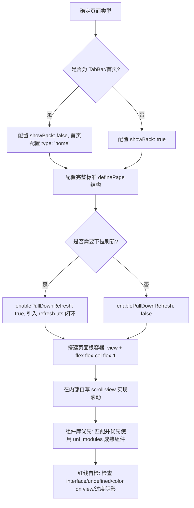

# 三、项目代码生成规范（流程 · 标准模板 · 维护机制）

> **本文件是 `unibestX-skill` 的参考分册**，由 [SKILL.md](../SKILL.md) 按需引用。
>
> **何时读本文件**：新增页面 / 组件前走生成流程、需要复制标准页面模板、或需要按四维分类回写本 Skill 时。
> 注意：**3.3 快速排查对照表**与**3.4 代码生成红线清单**常驻在 [SKILL.md](../SKILL.md) 中，不在本文件。
>
> **回写规则**：新增页面范式与生成流程变更写入本文件对应小节；硬性致命错误同步追加到 [SKILL.md](../SKILL.md) 的 3.4 红线清单。

当 AI 助手或开发者在项目中**创建新页面、生成新组件或修改既有业务代码**时，必须严格遵照本生成规范执行。

## 3.1 新增页面的生成流程与必须要素



### 必须要素清单

1. **显式标准 `definePage` 声明**：每一个 `.uvue` 页面必须在 `<script setup lang="uts">` 最顶部显式书写标准完整的 `definePage({...})`，统一使用 `navbar` 布局接管；必须包含规范注释与默认字段：
   - `customPageClass`: 页面根容器自定义类名（配合 layout 布局使用，支持配置全局样式类，如 `'init-page'` 或 `'page-container'`）
   - `customPageStyle`: 页面根容器自定义行内样式（如 `'background-color: transparent;'`，穿透样式隔离，全端绝对生效）
   - `debug`: `false`，是否开启当前页面沙盒独立调试（设为 true 可单独调试此页；⚠️ 调试完成后改回 false）
   - `debugHome`: `false`，沙盒调试模式下是否将当前页面指定为启动首页（全局仅允许 1 个页面设为 true，排在 pages[0]）
   - `type`: 页面类型标识（仅首页配置 `'home'`，标记当前页面为应用全局启动首页，自动排在 pages[0]；普通二级页不配置）
   - `layout`: `'navbar'`，页面通用布局模板（采用 navbar 布局接管顶部导航与下拉滚动容器）
   - `showBack`: 导航栏左侧是否显示返回箭头（TabBar 首页设为 `false`，普通二级页设为 `true`）
   - `hideStatusBar`: `false`，是否隐藏状态栏（`true` 为隐藏，`false` 为正常显示）
   - `hideNavbar`: `false`，是否隐藏顶部导航栏（`false` 为正常显示）
   - `enablePullDownRefresh`: `false`，是否开启自定义下拉刷新（默认 `false`，由 navbar 布局内的 scroll-view 驱动；若需下拉刷新则显式设为 `true` 并配套闭环逻辑）
   - `style`: 必须包含 `navigationBarTitleText`（页面与导航栏标题文本）和 `navigationStyle: 'custom'`（导航栏样式设为自定义，隐藏系统原生导航栏）
2. **自定义下拉刷新控制**：`enablePullDownRefresh` 默认设为 `false`；若业务需要下拉刷新，显式设为 `true`，严禁在 `style` 内部开原生下拉；
3. **闭环刷新逻辑**：当开启 `enablePullDownRefresh: true` 时，必须引入 `onNavbarPullDownRefresh` 与 `stopNavbarPullDownRefresh`，在数据拉取结束后必须调用 `stopNavbarPullDownRefresh()`；
4. **根容器骨架铁律**：页面根节点一律为 `<view class="flex flex-col flex-1">`，严禁使用 `<scroll-view>` 作为页面根；
5. **滚动区域实现**：需要滚动的区域在根内自写 `<scroll-view direction="vertical" class="flex-1 flex flex-col">`；
6. **组件库优先**：若需求功能与 `uni_modules/` 下已有组件/库匹配（如图标使用 `<uni-icons>`/`<lime-icon>`，图表使用 `<e-chart>`，分页列表使用 `<z-paging-x>`，富文本使用 `<mp-html>`，富文本编辑器使用 `<sp-editor>`，二维码使用 `<lime-qrcode>`，签名使用 `<lime-signature>`，折叠面板使用 `<uni-collapse-x>`，评分使用 `<uni-rate-x>` 等），必须优先使用已有组件，严禁脱离生态手写重复且低效的原生结构；且模板中直接使用短横线标签调用，严禁手动 import easycom 范围内的组件；
7. **数据与 Mock 接口化抽离**：页面与组件内部严禁直接硬编码大段模拟数据或假数据对象（如在 `<script setup>` 中写死数据数组）；必须在 `src/api/` 下建立对应的 API 模块文件，使用 `type` 定义数据模型，将 Mock 数据封装为返回 `Promise<T>` 的标准接口函数（如 `Promise.resolve(MOCK_DATA)`）。页面端一律通过异步 API 函数拉取数据，确保后期对接真实后端接口时，页面业务层零修改无缝平滑切换（详见分册 5 的 5.6）。

---

## 3.2 页面代码生成标准模板

### 模板 1：标准二级/子包/功能页面（常用模板，直接复制落地）

```uts
<template>
  <!-- 页面根容器：view + flex-1 弹性撑满可用高度 -->
  <view class="flex flex-col flex-1 px-[16px] pt-[12px]">

    <!-- 顶部固定区域（可选） -->
    <view class="w-full mb-[12px] bg-white rounded-[12px] p-[16px]">
      <text class="text-[15px] font-semibold text-[#1e293b]">顶部标题区</text>
      <text class="text-[12px] text-[#64748b] mt-[2px]">说明文本</text>
    </view>

    <!-- 内部自写 scroll-view 弹性占满剩余空间 -->
    <scroll-view
      direction="vertical"
      class="flex-1 flex flex-col"
      :lower-threshold="50"
      @scroll="handleScroll"
      @scrolltolower="handleScrollToLower"
    >
      <view class="flex flex-col">
        <!-- 列表或主要内容区域 -->
        <view
          v-for="(item, index) in dataList"
          :key="index"
          class="w-full bg-white rounded-[8px] p-[12px] mb-[8px] flex flex-col"
        >
          <text class="text-[14px] text-[#334155]">{{ item }}</text>
        </view>
      </view>
    </scroll-view>

  </view>
</template>

<script setup lang="uts">
import { ref } from 'vue';

// 1. 显式声明页面布局与导航栏配置（标准二级页面）
definePage({
  customPageClass: 'page-container', // 页面根容器自定义类名（配合 layout 布局使用，支持配置全局样式类）
  customPageStyle: 'background-color: transparent;', // 页面根容器自定义行内样式（穿透任何样式隔离，全端绝对生效）
  debug: false, // 是否开启当前页面沙盒独立调试（设为 true 可单独调试此页；⚠️ 调试完成后改回 false）
  debugHome: false, // 沙盒调试模式下是否将当前页面指定为启动首页（全局仅允许 1 个页面设为 true，排在 pages[0]）
  layout: 'navbar', // 页面通用布局模板（采用 navbar 布局接管顶部导航与下拉滚动容器）
  showBack: true, // 导航栏左侧是否显示返回箭头（普通二级页设为 true）
  hideStatusBar: false, // 是否隐藏状态栏（true 为隐藏）
  hideNavbar: false, // 是否隐藏顶部导航栏（false 为正常显示）
  enablePullDownRefresh: false, // 是否开启自定义下拉刷新（默认 false，按需开启）
  style: {
    navigationBarTitleText: '页面标题', // 页面与导航栏标题文本
    navigationStyle: 'custom' // 导航栏样式设为自定义（隐藏系统原生导航栏）
  }
});

// 2. 状态变量显式类型声明（禁 undefined，数字/数组显式声明）
const dataList = ref<Array<string>>(['数据项 1', '数据项 2', '数据项 3']);
const scrollTop = ref<number>(0);

// 3. 滚动事件监听
function handleScroll(e: UniScrollEvent): void {
  scrollTop.value = Math.ceil(e.detail.scrollTop);
}

function handleScrollToLower(): void {
  console.log('触底加载更多');
}
</script>

<style></style>
```

### 模板 2：TabBar 主页面 / 启动首页模板（真实标杆：src/pages/index/index.uvue）

```uts
<template>
  <view class="flex flex-col flex-1 px-[16px] pt-[12px]">
    <scroll-view direction="vertical" class="flex-1 flex flex-col">
      <view class="flex flex-col">
        <view class="bg-white rounded-[12px] p-[16px] mb-[12px]">
          <text class="text-[16px] font-bold text-[#1e293b]">TabBar 模块标题</text>
        </view>
      </view>
    </scroll-view>
  </view>
</template>

<script setup lang="uts">
// 默认标准 definePage 声明（真实标杆：src/pages/index/index.uvue）
definePage({
  customPageClass: 'init-page', // 页面根容器自定义类名（配合 layout 布局使用，支持配置全局样式类）
  customPageStyle: 'background-color: transparent;', // 页面根容器自定义行内样式（穿透任何样式隔离，全端绝对生效）
  debug: false, // 是否开启当前页面沙盒独立调试（设为 true 可单独调试此页；⚠️ 调试完成后改回 false）
  debugHome: false, // 沙盒调试模式下是否将当前页面指定为启动首页（全局仅允许 1 个页面设为 true，排在 pages[0]）
  type: 'home', // 页面类型标识（仅首页配置 'home'，标记当前页面为应用全局启动首页，自动排在 pages[0]）
  layout: 'navbar', // 页面通用布局模板（采用 navbar 布局接管顶部导航与下拉滚动容器）
  showBack: false, // 导航栏左侧是否显示返回箭头（TabBar 首页无需返回按钮）
  hideStatusBar: false, // 是否隐藏状态栏（true 为隐藏）
  hideNavbar: false, // 是否隐藏顶部导航栏（false 为正常显示）
  enablePullDownRefresh: false, // 是否开启自定义下拉刷新（由 navbar 布局内的 scroll-view 驱动）
  style: {
    navigationBarTitleText: '首页', // 页面与导航栏标题文本
    navigationStyle: 'custom' // 导航栏样式设为自定义（隐藏系统原生导航栏）
  }
});
</script>

<style></style>
```

---

---

## 3.5 VDOM 与 Vapor 差异自动分类与 Skill 维护规范

所有智能体（AI / Agent）在维护和使用本项目时，必须严格执行以下闭环同步机制：

> 📁 **本 Skill 为分册式结构**：入口 `SKILL.md` 只常驻「概述 + 导航 + 3.3 对照表 + 3.4 红线清单」，正文细节分装在 `references/` 下的 7 个分册中。回写时必须写进**对应分册**，并同步入口的导航与速查表。

1. **自动归类与写入准则**：当发现某项 UTS 语法、Vue 响应式机制、组件属性、CSS 样式或 API 在 VDOM 模式与 Vapor 模式下表现不一致或报错时，**必须立即按照以下四维分类自动追加**：
   - **语法与类型层不通用**（如特定响应式解构、类型推断、事件参数）：追加到 **`references/1.1-uts-syntax.md`（1.1 语法核心铁律）**，编号续接 `1.1.20`、`1.1.21`…；
   - **样式与渲染层不通用**（如阴影 Elevation、特定 CSS 属性继承、边框裁切）：追加到 **`references/1.2-styling.md`（1.2 样式与原生渲染铁律）**，编号续接 `1.2.19`、`1.2.20`…；
   - **运行时与编译引擎不通用**（如 TabBar 配置、反射获取未声明字段、生命周期差异）：追加到 **`references/1.3-runtime.md`（1.3 跨端运行时约束）**，编号续接 `1.3.21`、`1.3.22`…；
   - **排查表与红线同步**：同步向入口 `SKILL.md` 的 **3.3 快速排查表** 追加正反例，并将硬性致命错误追加至 **3.4 红线清单**（两条常驻入口，不在分册里）。
2. **标杆案例持续扩充**：若在业务开发中沉淀了更好的 VDOM/Vapor 双模式通用的骨架、组件组合或页面范式，同步收录至 **`references/2-examples.md`（第二部分 项目正确案例）**，编号续接 `2.6`、`2.7`…。
3. **内置工具库同步**：`src/utils/` 下新增模块、或既有模块新增导出 / 改变调用姿势（含新增 API、参数语义变化、新增跨端限制）时，同步更新 **`references/4-utils.md`（第四部分 项目内置工具库）**，编号续接 `4.11`、`4.12`…，并同步入口 `SKILL.md` 导航表中该行的模块清单。
4. **页面与应用基础设施同步**：`src/http/`、`src/router/`、`src/layouts/`、`src/i18n/` 四个目录新增导出、改变调用姿势或新增跨端限制（含请求错误契约变化、新增拦截器、布局新增 `definePage` 字段、语言包命名空间调整）时，同步更新 **`references/5-infra.md`（第五部分 页面与应用基础设施）**，编号续接 `5.6`、`5.7`…；若某条属**静默致命**级别（如 5.4 的 `navigationStyle: 'custom'`），同时追加到入口 `SKILL.md` 的 **3.4 红线清单**。
5. **跨端环境同步保证**：`.claude/skills/unibestX-skill/` 与 `.agents/skills/unibestX-skill/` 是同一套 Skill 的两份副本，**两边的 `SKILL.md` 与 `references/` 下全部 7 个分册必须逐字保持一致**。任一环境（含新增 / 改名分册、调整导航表）发生改动时，必须把整个目录同步过去，保证全 agent 工具链标准统一。
