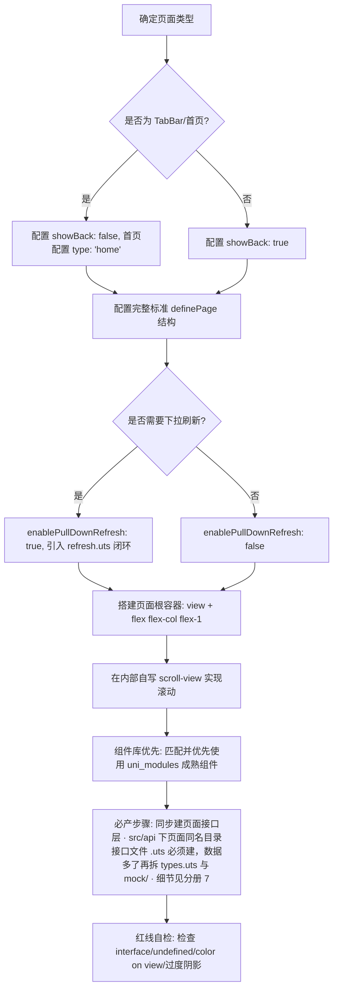

# 5 项目代码生成规范（流程 · 标准模板）

> **本文件是 `unibestX-skill` 的参考分册**，由 [SKILL.md](../SKILL.md) 按需引用。
>
> **何时读本文件**：新增页面 / 组件前走生成流程、需要复制标准页面模板与页面接口文件骨架时。
> 注意：**A.1 快速排查对照表**与**A.2 代码生成红线清单**常驻在 [SKILL.md](../SKILL.md) 中，不在本文件；**接口层（`src/api/<page>/`）的完整规范在分册 [7-api-spec.md](7-api-spec.md)**，本文件的 5.1 第 7 条与 5.2 模板 3 只讲「新增页面时必产什么」。

当 AI 助手或开发者在项目中**创建新页面、生成新组件或修改既有业务代码**时，必须严格遵照本生成规范执行。

## 5.1 新增页面的生成流程与必须要素



### 必须要素清单

1. **显式标准 `definePage` 声明**：每一个 `.uvue` 页面必须在 `<script setup lang="uts">` 最顶部显式书写标准完整的 `definePage({...})`，统一使用 `navbar` 布局接管；必须包含规范注释与默认字段：
   - `customPageClass`: 页面根容器自定义类名（配合 layout 布局使用，支持配置全局样式类，如 `'init-page'` 或 `'page-container'`）
   - `customPageStyle`: 页面根容器自定义行内样式（如 `'background-color: transparent;'`，穿透样式隔离，全端绝对生效）
   - `debug`: `false`，是否开启当前页面沙盒独立调试（设为 true 可单独调试此页；⚠️ 调试完成后改回 false）
   - `debugHome`: `false`，沙盒调试模式下是否将当前页面指定为启动首页（全局仅允许 1 个页面设为 true，排在 pages[0]）
   - `type`: 页面类型标识（仅首页配置 `'home'`，标记当前页面为应用全局启动首页，自动排在 pages[0]；普通二级页不配置）
   - `layout`: `'navbar'`，页面通用布局模板（采用 navbar 布局接管顶部导航与下拉滚动容器）
   - `showBack`: 导航栏左侧是否显示返回箭头（TabBar 首页设为 `false`，普通二级页设为 `true`）
   - `hideStatusBar`: `false`，是否隐藏状态栏（`true` 为隐藏，`false` 为正常显示）
   - `hideNavbar`: `false`，是否隐藏顶部导航栏（`false` 为正常显示）
   - `enablePullDownRefresh`: `false`，是否开启自定义下拉刷新（默认 `false`，由 navbar 布局内的 scroll-view 驱动；若需下拉刷新则显式设为 `true` 并配套闭环逻辑）
   - `style`: 必须包含 `navigationBarTitleText`（页面与导航栏标题文本）和 `navigationStyle: 'custom'`（导航栏样式设为自定义，隐藏系统原生导航栏）
2. **自定义下拉刷新控制**：`enablePullDownRefresh` 默认设为 `false`；若业务需要下拉刷新，显式设为 `true`，严禁在 `style` 内部开原生下拉；
3. **闭环刷新逻辑**：当开启 `enablePullDownRefresh: true` 时，必须引入 `onNavbarPullDownRefresh` 与 `stopNavbarPullDownRefresh`，在数据拉取结束后必须调用 `stopNavbarPullDownRefresh()`；
4. **根容器骨架铁律**：页面根节点一律为 `<view class="flex flex-col flex-1">`，严禁使用 `<scroll-view>` 作为页面根；
5. **滚动区域实现**：需要滚动的区域在根内自写 `<scroll-view direction="vertical" class="flex-1 flex flex-col">`；
6. **组件库优先**：若需求功能与 `uni_modules/` 下已有组件/库匹配（如图标使用 `<uni-icons>`/`<lime-icon>`，图表使用 `<e-chart>`，分页列表使用 `<z-paging-x>`，富文本使用 `<mp-html>`，富文本编辑器使用 `<sp-editor>`，二维码使用 `<lime-qrcode>`，签名使用 `<lime-signature>`，折叠面板使用 `<uni-collapse-x>`，评分使用 `<uni-rate-x>` 等），必须优先使用已有组件，严禁脱离生态手写重复且低效的原生结构；且模板中直接使用短横线标签调用，严禁手动 import easycom 范围内的组件；
7. **同步建出页面接口层（必产步骤，铁律级）**：页面与组件内部严禁直接硬编码大段模拟数据或假数据对象（如在 `<script setup>` 中写死数据数组）；新增页面时**必须在同一次改动里建出「页面同名目录 + 页面同名接口文件」** `src/pages/mall/` ⇒ `src/api/mall/mall.uts`（`src/sub/ball/` ⇒ `src/api/ball/ball.uts`），用 `type` 定义数据模型（**严禁 `interface`**），把数据封装为返回 `Promise<T>` 的标准接口函数（开发期 `return Promise.resolve(MOCK_X)`）。页面端一律通过异步接口函数拉取数据，后期对接真实后端时页面业务层零修改：
   - **目录形态（按体量递进，三选一）**：① 小页面 —— 类型 / 数据集 / 函数三块内联在 `<page>.uts` 里按模块分段（**默认**，此时不建 `types.uts` 与 `mock/`）；② 该文件预计 ≥ 400 行 —— 数据集拆进 `src/api/<page>/mock/<模块>.uts`、契约类型收进 `src/api/<page>/types.uts`，`<page>.uts` 只留接口函数；③ 某个接口域已贴 500 行上限 —— 在 `src/api/<page>/` 下另开兄弟文件，每个文件自带「类型 + 数据集 + 函数」三块；
   - **命名与写法**：`fetchXxxList` / `fetchXxxDetail` / `createXxx`、`MOCK_<模块>_<用途>`、分页容器 `PageResult<T>`、分页入参统一 `(pageNo, pageSize, keyword)` 并给默认值；
   - **页面目录下严禁出现 `mock.uts`**；`.uvue` 里**严禁** `ref([...])` 写死数据；
   - **完整模板、契约类型铁律、mock 造数规则、`http` 请求与后端对接细则，一律以分册 [7-api-spec.md](7-api-spec.md) 为准**（本清单只列必产项，不重复细则）。

---

## 5.2 页面代码生成标准模板

### 模板 1：标准二级/子包/功能页面（常用模板，直接复制落地）

```uts
<template>
  <!-- 页面根容器：view + flex-1 弹性撑满可用高度 -->
  <view class="flex flex-col flex-1 px-[16px] pt-[12px]">

    <!-- 顶部固定区域（可选） -->
    <view class="w-full mb-[12px] bg-white rounded-[12px] p-[16px]">
      <text class="text-[15px] font-semibold text-[#1e293b]">顶部标题区</text>
      <text class="text-[12px] text-[#64748b] mt-[2px]">说明文本</text>
    </view>

    <!-- 内部自写 scroll-view 弹性占满剩余空间 -->
    <scroll-view
      direction="vertical"
      class="flex-1 flex flex-col"
      :lower-threshold="50"
      @scroll="handleScroll"
      @scrolltolower="handleScrollToLower"
    >
      <view class="flex flex-col">
        <!-- 列表或主要内容区域 -->
        <view
          v-for="(item, index) in dataList"
          :key="index"
          class="w-full bg-white rounded-[8px] p-[12px] mb-[8px] flex flex-col"
        >
          <text class="text-[14px] text-[#334155]">{{ item }}</text>
        </view>
      </view>
    </scroll-view>

  </view>
</template>

<script setup lang="uts">
import { ref } from 'vue';

// 1. 显式声明页面布局与导航栏配置（标准二级页面）
definePage({
  customPageClass: 'page-container', // 页面根容器自定义类名（配合 layout 布局使用，支持配置全局样式类）
  customPageStyle: 'background-color: transparent;', // 页面根容器自定义行内样式（穿透任何样式隔离，全端绝对生效）
  debug: false, // 是否开启当前页面沙盒独立调试（设为 true 可单独调试此页；⚠️ 调试完成后改回 false）
  debugHome: false, // 沙盒调试模式下是否将当前页面指定为启动首页（全局仅允许 1 个页面设为 true，排在 pages[0]）
  layout: 'navbar', // 页面通用布局模板（采用 navbar 布局接管顶部导航与下拉滚动容器）
  showBack: true, // 导航栏左侧是否显示返回箭头（普通二级页设为 true）
  hideStatusBar: false, // 是否隐藏状态栏（true 为隐藏）
  hideNavbar: false, // 是否隐藏顶部导航栏（false 为正常显示）
  enablePullDownRefresh: false, // 是否开启自定义下拉刷新（默认 false，按需开启）
  style: {
    navigationBarTitleText: '页面标题', // 页面与导航栏标题文本
    navigationStyle: 'custom' // 导航栏样式设为自定义（隐藏系统原生导航栏）
  }
});

// 2. 状态变量显式类型声明（禁 undefined，数字/数组显式声明）
const dataList = ref<Array<string>>(['数据项 1', '数据项 2', '数据项 3']);
const scrollTop = ref<number>(0);

// 3. 滚动事件监听
function handleScroll(e: UniScrollEvent): void {
  scrollTop.value = Math.ceil(e.detail.scrollTop);
}

function handleScrollToLower(): void {
  console.log('触底加载更多');
}
</script>

<style></style>
```

### 模板 2：TabBar 主页面 / 启动首页模板（真实标杆：src/pages/index/index.uvue）

```uts
<template>
  <view class="flex flex-col flex-1 px-[16px] pt-[12px]">
    <scroll-view direction="vertical" class="flex-1 flex flex-col">
      <view class="flex flex-col">
        <view class="bg-white rounded-[12px] p-[16px] mb-[12px]">
          <text class="text-[16px] font-bold text-[#1e293b]">TabBar 模块标题</text>
        </view>
      </view>
    </scroll-view>
  </view>
</template>

<script setup lang="uts">
// 默认标准 definePage 声明（真实标杆：src/pages/index/index.uvue）
definePage({
  customPageClass: 'init-page', // 页面根容器自定义类名（配合 layout 布局使用，支持配置全局样式类）
  customPageStyle: 'background-color: transparent;', // 页面根容器自定义行内样式（穿透任何样式隔离，全端绝对生效）
  debug: false, // 是否开启当前页面沙盒独立调试（设为 true 可单独调试此页；⚠️ 调试完成后改回 false）
  debugHome: false, // 沙盒调试模式下是否将当前页面指定为启动首页（全局仅允许 1 个页面设为 true，排在 pages[0]）
  type: 'home', // 页面类型标识（仅首页配置 'home'，标记当前页面为应用全局启动首页，自动排在 pages[0]）
  layout: 'navbar', // 页面通用布局模板（采用 navbar 布局接管顶部导航与下拉滚动容器）
  showBack: false, // 导航栏左侧是否显示返回箭头（TabBar 首页无需返回按钮）
  hideStatusBar: false, // 是否隐藏状态栏（true 为隐藏）
  hideNavbar: false, // 是否隐藏顶部导航栏（false 为正常显示）
  enablePullDownRefresh: false, // 是否开启自定义下拉刷新（由 navbar 布局内的 scroll-view 驱动）
  style: {
    navigationBarTitleText: '首页', // 页面与导航栏标题文本
    navigationStyle: 'custom' // 导航栏样式设为自定义（隐藏系统原生导航栏）
  }
});
</script>

<style></style>
```

### 模板 3：页面接口文件（新增页面必产，完整规范见分册 7）

> 页面 `src/pages/mall/` ⇒ 接口文件 `src/api/mall/mall.uts`（`src/sub/ball/` ⇒ `src/api/ball/ball.uts`，目录名逐字同名）。
> 下面是**最小可用骨架**：小页面用形态一（三块内容内联）；**契约类型铁律、mock 造数规则、何时拆 `types.uts` 与 `mock/<模块>.uts`、`http` 请求与后端对接写法**，一律见 [7-api-spec.md](7-api-spec.md)。

```uts
// ==========================================
// 文件位置：src/api/mall/mall.uts（对应页面 src/pages/mall/）
// 开发期：函数体返回本地 mock 数据；后端就绪：只把函数体换成 http.get，签名一字不改
// ==========================================

// ------------------------------------------
// 【模块 A 段】类型 / 数据集 / 接口函数三块相邻摆放
// ------------------------------------------

// 1. 数据模型（一律 type，严禁 interface）
export type MallGoodsItem = {
  id: number;
  title: string;
  price: number;
};

// 2. 本地模拟数据集（私有常量，不导出；严禁在 UI 组件内硬编码）
const MOCK_A_GOODS: Array<MallGoodsItem> = [
  { id: 1, title: '示例商品', price: 99 }
];

// 3. 接口函数（统一返回 Promise<T>，与真实 API 签名 100% 对齐）
/** 获取模块 A 商品列表 */
export function fetchGoodsList(pageNo: number = 1, pageSize: number = 10, keyword: string = ''): Promise<Array<MallGoodsItem>> {
  return Promise.resolve(MOCK_A_GOODS);
}

// ------------------------------------------
// 【模块 B 段】类型、数据集、函数全部独立，与 A 段互不引用
// ------------------------------------------
```

页面侧引用**永远只有一行**（后端就绪也不改）：

```uts
import { fetchGoodsList } from '@/src/api/mall/mall.uts';
import type { MallGoodsItem } from '@/src/api/mall/mall.uts';
```
