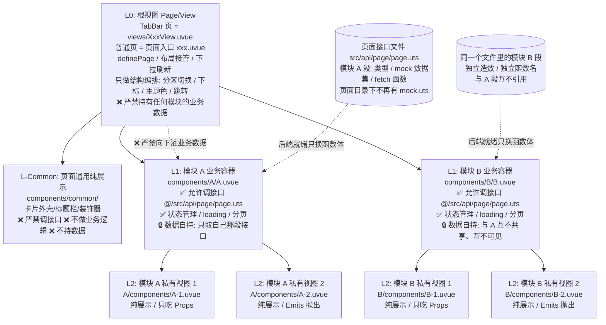

# 6 AI 页面层级与组件设计规范（页面内聚 · 数据所有权下沉 · 容器/视图分离 · Mock 收拢进页面接口文件 · 后端就绪只换函数体）

> **本文件是 `unibestX-skill` 的参考分册**，由 [SKILL.md](../SKILL.md) 按需引用。
>
> **何时读本文件**：当 AI 助手或开发者**规划新页面结构、拆分复杂页面组件、组织页面级公共视图、编写模块私有视图，以及设计 Mock 模拟数据或对接后端真实接口时**，必须首先阅读并严格遵循本分册。
>
> **核心定位**：针对 AI 容易陷入的“万行单文件”或“过度碎裂拆分”两大极端，制定**「高内聚自包含、最多三级封顶、数据所有权下沉（根视图不存模块数据）、容器与展示视图严格解耦、模块数据互不共享、Mock 数据集与接口函数同层收拢在 `src/api/<page>/<page>.uts`、后端就绪只换函数体」**的标准架构范式。
>
> ⚠️ **Mock 的落位**：页面目录下**不再有 `mock.uts`**，模拟数据与接口函数同层收拢在页面同名的 `src/api/<page>/` 目录里 —— `<page>.uts`（接口函数）+ `types.uts`（契约类型）+ `mock/<模块>.uts`（模拟数据集）三件套（**铁律 5** 是完整说明，**6.4** 是对接与迁移细则）。
>
> 🚨 **新增页面必产接口层**：**每新增一个页面，必须在同一次改动里建出 `src/api/<page>/`，没有配套接口层的新页面视为未交付**（判据与目录形态见铁律 5 开头，**接口层自己怎么写 —— 命名 / 类型 / mock / 请求实现 —— 一律以分册 [7-api-spec.md](7-api-spec.md) 为准**）。

---

## 6.1 核心设计哲学与八大铁律



> **一句话记住分层职责**：**根视图只管「装」和「切」，模块自己管「数」和「取」，`common` 只管「长什么样」。**

**分层速查表**（先看这张，再读下面的铁律）：

| 层级 | 目录 / 文件 | 职责 | 能调接口 | 能持模块业务数据 | 数据从哪来 |
| :--- | :--- | :--- | :--- | :--- | :--- |
| **L0 根视图** | TabBar 页 = `views/XxxView.uvue`；普通页 = 页面入口 `xxx.uvue` | 结构编排：分区 / 下标 / 主题色 / 跳转 | ❌ | ❌（只持结构级状态） | 不取数，只向下传结构级意图 |
| **L-Common** | `components/common/*.uvue` | 页面内复用的纯展示外壳（卡片 / 标题栏 / 空状态） | ❌ | ❌ | 只吃 Props |
| **L1 模块容器** | `components/<模块>/<模块>.uvue` | 模块唯一决策中心：取数 / loading / 分页 / 筛选 | ✅ **唯一允许** | ✅ 只持本模块的 | `@/src/api/<page>/<page>.uts` 里自己那一段 |
| **L2 模块私有视图** | `components/<模块>/components/*.uvue` | 纯展示 | ❌ | ❌ | 只吃 Props、只抛 Emits |
| **Data 层** | `src/api/<page>/`（`<page>.uts` 接口函数 + `types.uts` 契约类型 + `mock/<模块>.uts` 数据集） | 类型契约 + mock 数据集 + 接口函数 | —— 它本身就是接口 | ✅ 只持本模块的 mock 数据 | 开发期 `Promise.resolve(MOCK_X)`，后端就绪换 `http.get` |
| **页面常量** | `src/pages/<page>/constants.uts` | 页面结构级只读常量（分区定义 / 排序枚举） | ❌ | 不算业务数据 | 同步导出，本页可共用（唯一例外，见铁律 4） |

### 铁律 1：页面高内聚、自包含（Zero External Component Leaks）

- **一个页面尽量不引用外部公共组件**：除全项目通用组件库（`uni_modules` 里的 `uni-icons`、`e-chart`、`z-paging-x` 等）与全局通用布局（`NavBar`）外，页面业务相关组件必须**严格内聚在当前页面自身的 `components/` 目录下**；**严禁跨页面借用**（如在 `src/pages/index/` 里引用 `src/pages/mall/components/` 的零碎业务组件）。某组件要在 3 个以上业务页面完全无差别复用时，才由资深架构师评估后提升到 `src/components/`。
- **引用路径规范：页面目录之外的一切一律写 `@/` 别名，严禁相对路径往上穿透**：

  | 引用目标 | 写法 | 例子 |
  | :--- | :--- | :--- |
  | **本页面内聚树内部**（`<page>.uvue` ↔ `components/<模块>/` ↔ `components/common/` ↔ 同页 `types.uts` / `constants.uts`） | **相对路径**（同一单元内部，最短最直观） | `./components/HomeBanner.uvue`、`../common/SectionHeader.uvue`、`'../../types.uts'` |
  | **本页面目录之外的一切**（`src/utils/**`、`src/store/**`、**`src/api/**`**、`src/http/**`、`src/tabbar/**`、`src/components/**`、`src/i18n/**`、`src/router/**`、根目录 `theme.json`、其它页面的文件） | **`@/src/...` 别名** | `@/src/utils/systemInfo/index.uts`、`@/src/store`、`@/src/api/mall/mall.uts`、`@/theme.json` |

  - ⚠️ **接口一律走 `@/src/api/<page>/<page>.uts`，哪怕它就在本页面对应的目录里**：`src/api/` 属于页面目录**之外**的全局层，禁用 `'../../api/mall/mall.uts'` 这类相对穿透；同页的 `types.uts` / `constants.uts` 才用相对路径。
  - **反例（本项目真实存在过）**：组件里写 `import { getScrollHeight } from '../../../../utils/systemInfo.uts'` —— 既穿透四层目录，路径本身还是错的（真实文件是 `utils/systemInfo/index.uts`）；正确写法是 `@/src/utils/systemInfo/index.uts`。
  - **为什么必须用 `@/`**：① 相对路径的层数会随组件挪位而失效；② **路径写错的后果是静默的** —— UTS / Vite 解析不到时未必报错，可能直到运行期才暴露；③ `@/` 是编译期固定映射（`@` = 项目根），文件怎么挪都不会断。
  - **同一条规则同样适用于 `src/` 下的全局模块之间**：`src/utils/systemInfo/index.uts` 引用 `src/tabbar/config.uts`、`src/http/request.uts` 引用 `src/utils/env/index.uts` 这类**跨模块**引用，也一律写 `@/src/...`；只有**同一模块目录内部**（如 `src/tabbar/ui/default/` 引用 `src/tabbar/types`）才用相对路径。

### 铁律 2：严禁过度拆分组件（三级封顶，防套娃碎裂）

- 页面组件拆分必须克制，层级**严格限制为最多 3 级**：
  $$\text{页面入口 (Page)} \longrightarrow \text{业务模块容器 (A / B)} \longrightarrow \text{私有叶子视图 (A-1 / A-2)}$$
- **严禁在叶子视图下方继续嵌套组件目录**（如严禁创建 `A-1/components/A-1-1.uvue`）；
- 单个组件代码行数在 **150 ~ 250 行以内**时，强烈建议直接写在单一组件内部，避免过度抽象带来的 Props 钻孔（Props Drilling）与调试定位困难。
- **单文件行数硬上限：500 行**（`<template>` + `<script setup>` + `<style>` 全部计入，`wc -l` 口径）。
  - **> 500 行必须拆组件**，没什么可商量的：按「区块 / 状态 / 子视图」拆成 `components/` 下的私有叶子视图，或把纯逻辑（数据变换、格式化、校验、分页计算）抽到同目录的 `.uts` 模块里；
  - **400 ~ 500 行是预警区**：功能继续叠加前先拆，别等到 800 行再回头返工；
  - 拆分方向**只能向下**（拆成 L2 私有叶子视图），**严禁**为了压行数把内容挪去新的页面或跨页面公共组件（那会踩铁律 1、铁律 4）；
  - 单个 `.uts` / `.ts` 逻辑文件同样适用 500 行上限，超了按功能域拆文件。

### 铁律 3：容器与展示视图严格分离（Smart Container vs Dumb View）

- **L1 业务容器（`A.uvue`、`B.uvue`）**：业务模块的**唯一决策中心**；**唯一允许调用接口**（调 `@/src/api/<page>/<page>.uts` 里自己那段的 Promise 异步函数 —— 该函数开发期返回本地 mock 数据、后端就绪后返回真实响应，对调用方完全透明）；维护局部响应式状态（`loading`、`list`、`page`、`tabIndex` 等）；向下通过 Props 单向分发纯净数据，通过监听 Emits 响应子组件交互。
- **L2 模块私有叶子视图（`A/components/A-1.uvue`）**：**只做视图，不做逻辑**；**严禁调用任何接口与异步请求**；纯粹通过 `defineProps` 接收数据完成排版与 CSS 渲染，通过 `defineEmits` 向上反馈交互事件。
- **L-Common 页面级公共组件（`components/common/common1.uvue`）**：仅用于在**当前页面内部**被多个模块复用（如通用卡片外壳、标题装饰栏、空状态）；**只做视图，不做逻辑，严禁调用接口**，不绑定任何特定业务模型。
- **Props 必须收敛：容器给私有视图传参时，优先只传一个数据对象**（`<A-1 :data="xxx" />`），**严禁把同一份数据的字段摊成一把散参数**：

  ```html
  <!-- ✅ 正例：一个子视图一个数据对象；对象字段增减只动类型定义，不动调用点 -->
  <ProductCard :product="product" @click="onProductClick" />

  <!-- ❌ 反例：同一份数据的字段被摊平成一串 prop，改一个字段这里就得跟着改 -->
  <ProductCard :id="p.id" :title="p.title" :price="p.price" :image="p.image" :badge="p.badge" :stock="p.stock" />
  ```

  - **判定标准**：这几个参数**是不是同一个业务对象的字段**？是 ⇒ 合并成一个对象传（对象类型用 `type` 定义在 `types.uts` 或模块自己的类型文件里）；不是（如「数据对象 + 是否展开」分属不同来源）⇒ 才允许并列第二个 prop；
  - **不算冗余参数的例外**：结构级意图（`:is-expanded`、`:active-id`、`:max-count`）与非业务来源的值可以单独声明；全局态（主题色 / 亮暗 / 语言）**优先由叶子自己从 store 读**，根本不传（铁律 4）；
  - **反面形态**：既有 `:product` 又顺手带上 `:price`、`:title`（冗余），或把整份模块数据透传给每个叶子视图（Props 钻孔，铁律 2 / 铁律 4）；
  - **叶子视图需要派生值时在叶子内部算**：用 `computed` 基于传入对象推导（如「是否售罄」），**不要**让容器多算一份再当 props 灌进去。

### 铁律 4：数据所有权下沉 —— 根视图不存数据，模块数据自持且互不共享

> **这条铁律最容易违反，也最致命**：根视图（页面入口 / 主视图组件）一旦顺手 `ref` 了某个模块的 list、loading、分页，模块就再也不是自包含单元，Props 钻孔与「改 A 崩 B」会同时发生。

- **L0 根视图的两种形态**（职责完全一致，只是落在不同文件上，详见 6.2）：
  - **TabBar 页面**：`src/pages/<page>/<page>.uvue` 只是薄壳（`definePage` + TabBar 联动 + 页面生命周期钩子，模板里只有一行 `<XxxView />`），**真正的 L0 根视图是 `views/XxxView.uvue`**；
  - **非 TabBar 页面**（`src/sub/**` 及普通单页）：**不设 `views/` 目录**，**页面入口 `.uvue` 自己就是 L0 根视图**。
- **L0 根视图只持有「页面结构级状态」**：分区 / 分类切换下标（`currentTabIndex`、`activeTabId`）、`swiper` 锁定开关、下拉刷新信号、主题色、导航跳转 —— 共性是**描述页面长什么样，而不是某个模块里有什么数据**。
- **L0 根视图严禁持有「模块业务数据」**：严禁 `ref` 任何模块的 `list`、`loading`、`page`、`hasMore`、筛选条件、选中项；严禁把模块数据以 Props 形式往下灌（Props 钻孔的起点）；严禁替模块 `fetch` 数据、做分页累加或缓存。
- **模块之间严禁共享数据与状态**：A 的数据、loading、筛选条件、分页游标**只属于 A**，B 严禁读取或复用；严禁共用同一个 `ref` 数组 / `listData` / `selectedIds`，也严禁通过「页面级全局 ref / store」间接共享模块内部数据。跨模块联动**只允许传递「结构级意图」**（如「切到 B 分区」「跳转商品详情」），由根视图承接转发，**严禁把 A 的业务数据带给 B**。
- **模块自持数据的标准形态**（正例，参见 6.3）：

  ```uts
  // ✅ L1 模块容器内部：数据、状态、取数全在模块里闭环，根视图完全不知道它的存在
  const listData = ref<Array<IModuleAItem>>([]);
  const loading = ref<boolean>(false);

  function loadData(): void { /* 只调本模块自己的接口 */ }
  ```

  ```uts
  // ❌ 反例：根视图替模块取数并按 props 下灌，模块沦为「靠父组件喂饭的哑组件」
  //    在 IndexView.uvue 里：
  //    const aList = ref<Array<IModuleAItem>>([]);
  //    fetchModuleAList().then((d) => { aList.value = d; });
  //    <AModule :list="aList" />
  ```

- **唯一例外：页面结构级只读常量**（非模块业务数据）可以放在页面自己的 `constants.uts` 中同步导出，供根视图与各模块共用，例如分区定义、排序枚举：
  - 判定标准：**它随页面结构固化，不由后端下发，也不属于任何单一模块**（如选球页的 `STORE_TABS`：`swiper-item` 的数量与下标基准都依赖它，首帧必须同步拿到）；
  - 归位约定：**放 `src/pages/<page>/constants.uts`（`src/sub/<page>/` 同理），严禁放进 `src/api/`** —— 它是页面结构的一部分，不是后端契约，跟着接口文件走只会在联调时被连带改动；也**不准**再借 `mock.uts` 存放（页面目录下已无此文件，见铁律 5）；
  - 反之，任何「某个模块用、且将来可能换成后端接口」的数据，一律不得做成页面级共享常量，必须回到 `src/api/<page>/<page>.uts` 中该模块自己那段接口函数里。
- **全局 UI 态（主题色 / 亮暗 / 语言…）一律从 store 取，且同样严禁逐层透传 Props**（与模块数据一样，是另一种 Props 钻孔）：

  > **唯一真源是 `src/store`（app store）**：主题色、亮暗 `isDark`、语言 `locale` 都持久化在 app store 里（`persist: true`）。组件**一律 `const appStore = useAppStore()` 后直读 `appStore.state.xxx`**，不要再从 `src/utils/theme` 拿裸 ref、更不要自己 `ref` 一份或用 `import.meta.env` 另起炉灶 —— 那样会绕过持久化，出现「设置页改了主题、别的页面不跟随」。
  >
  > 🚨 **严禁对 store 读取的值做多余判断与拦截**：从 `appStore.state` 读取状态时，**严禁添加任何硬编码条件判断、黑名单拦截或私加假兜底**（例如写 `if (storeTheme.length > 0 && storeTheme != '#37c2bc') return '#a87c55'` 导致 store 里的真实主题色被静默篡改覆盖）。一律直接使用 `appStore.state.xxx`。

  | 全局态 | 正确的取法（各组件 `useAppStore()` 直读） | 错误写法 |
  | :--- | :--- | :--- |
  | 主题色 | `appStore.state.theme`（常用就派生 `computed((): string => appStore.state.theme)`，**直读直用，严禁加 `if` 判断拦截**） | 页面 `computed` 出 `themeColor` 再 `:theme-color` 逐层传；或写 `if (theme != '...')` 私加判断覆盖真实主题色；或从 `@/src/utils/theme` 取裸 ref 绕过 store |
  | 亮 / 暗模式 | `appStore.state.isDark`（`themeMode` 为三态 `auto` / `light` / `dark`） | 页面自己 `getSystemTheme()` 判断后再层层下传 |
  | 语言 | 读文案走 `@/src/utils/i18n/index.uts`（`$t`），**切换**语言走 `appStore.setLocale(lang)` | 页面 `t()` 后把文案当 props 传 |
  | 安全区 / 屏幕尺寸 | `@/src/utils/systemInfo/index.uts`（`safeAreaBottom`、`safeAreaInsets`） | 页面量好再层层下传 |

  - **判定标准**：**值的来源是全局单例 / store（不由父组件决定），且任何一层拿到的都是同一个值** —— 那就是全局态，任何组件都可以直接读，一个 prop 都不要声明；反之，**由父组件决定、或各实例取值可能不同** 的值（如「当前选中项」「本模块的列表」）必须走 Props。
  - **模板里用局部 `computed` 承载**（`appStore.state.theme` 模板里直接写也可以，但派生一个具名 `computed` 更好读、也便于脚本里复用）：

    ```uts
    import { computed } from 'vue';
    import { useAppStore } from '@/src/store';

    const appStore = useAppStore();

    /** 当前主题色（app store 持久化，跟随设置页实时变化） */
    const themeColor = computed<string>((): string => appStore.state.theme);
    ```

    模板里写 `:style="{ color: themeColor }"`（`<script setup>` 的绑定模板自动解包，不用 `.value`），脚本里比较 / 计算时才写 `themeColor.value`。
  - 参考实现：`src/tabbar/ui/default/TabbarItem.uvue`、`src/sub/creator/components/CreatorHeaderCard.uvue`。
  - **历史包袱提醒**：`src/utils/theme/index.uts` 的 `activeThemeColor` 是 store 派生出来的响应式副本，早期组件大量在用它。**新代码与改到的代码一律改为上面 store 直读口径**；`activeThemeColor` 只保留给 store 自身与 tabbar 兜底使用，不要再新增引用。

### 铁律 5：模拟数据（Mock）必须收拢进页面接口层，且按模块独立造数

> **先记住落位**：Mock **不再放页面**。页面目录（`src/pages/<page>/`、`src/sub/<page>/`）下**严禁出现 `mock.uts`**；模拟数据集与它对应的接口函数**同层收拢**在页面同名的 `src/api/<page>/` 目录里。

- 🚨 **新建页面 = 同一次改动里建出接口层（硬门槛，不因「先搭 UI」「后端还没来」而豁免）**：
  - 每新增一个页面（`src/pages/<page>/` 或 `src/sub/<page>/`），**必须同步创建 `src/api/<page>/`，至少建出 `<page>.uts` 并导出该页用到的接口函数**；页面与组件里**不许出现任何 `ref([...])` 硬编码假数据**，也不许留「等后端接好了再抽接口」的尾巴；
  - **判定标准（交付前自查）**：这个新页面里每一块会由后端下发的数据，都能顺着「页面组件 → `@/src/api/<page>/<page>.uts` 里的某个 `fetchXxx()`」找到出处。找不到 ⇒ 接口层没建完，**视为未交付**。
  - **接口层内部怎么写**（落位命名 / 契约类型 / 按模块造数 / `http` 请求与后端对接）**一律以分册 [7-api-spec.md](7-api-spec.md) 为准** —— 本铁律只规定「数据落在哪、归谁用」，同属铁律体系，不重复也不冲突。
  - 接口层是**全局层**，永远走别名引用：组件里写 `import { fetchXxx } from '@/src/api/<page>/<page>.uts'`，禁用 `'../../api/<page>/<page>.uts'` 这类相对穿透（铁律 1）。
- **严禁**在 `.uvue` 组件或页面内部通过 `ref([...])` 硬编码写死模拟数据；每个页面在 `src/api/` 下**按页面同名**建目录与同名接口文件：`src/pages/mall/` ⇒ `src/api/mall/mall.uts`（映射规则见 6.2 / 6.4）。
- **标准目录形态（三件套，标杆：`src/api/index/`）**：

  ```text
  src/api/<page>/
  ├── <page>.uts          # ★ 必须：页面同名接口文件 —— 只放接口函数（按模块用注释分段）+ 各段的 type
  ├── types.uts           #   契约类型叶子文件：只放后端 DTO 类型与分页结果容器，一律 type（严禁 interface），不写函数、不写数据
  └── mock/               #   模拟数据集目录：一个模块一份文件，各自 export MOCK_*，只服务本模块
      ├── <模块 A>.uts
      └── <模块 B>.uts
  ```

  - `types.uts` 存在时，`<page>.uts` 与 `mock/*.uts` **都从它 `import type`**（写 `'./types.uts'` / `'../types.uts'`），保证契约类型只有一份真源；
  - `mock/*.uts` 里的 `MOCK_*` 常量**必须 `export`**（数据集拆了文件，就是给同目录的 `<page>.uts` 取数用的），但**仍严禁被另一个模块的数据文件或接口函数引用**（见下方「按模块独立造数」）。
- 该文件内固定三块内容，**按模块分段**摆放：
  1. **接口类型契约**：一律 `type` 定义（**严禁 `interface`**，规避 `UTS110111163`）；
  2. **mock 数据集**：**形态一**下是写在文件内的私有常量（`const MOCK_A_LIST: Array<IModuleAItem> = [...]`，不导出、只在文件内部使用）；**形态二**下则落进 `mock/<模块>.uts` 并 `export`（供同目录 `<page>.uts` 取数）；
  3. **返回 `Promise<T>` 的接口函数**：开发期函数体就是 `return Promise.resolve(MOCK_A_LIST);`，写法和真实接口 100% 一致。
- **后端就绪时只换函数体**：把 `Promise.resolve(MOCK_X)` 换成 `http.get(...)`（并补上 `UTSJSONObject` 的安全取值转换），**函数名 / 入参签名 / 返回类型一个字都不改**，页面侧零改动 —— 这就是「无缝切换」的全部含义，不需要任何中间转发层；
- **类型跟着接口走**：后端 DTO 类型收拢在 `src/api/<page>/` —— 默认写在 `<page>.uts` 对应段内；**类型较多、或要被多段共用时（如分页容器 `PageResult<T>`）收进 `src/api/<page>/types.uts`**，这是一个**只含 `type` 的叶子文件**（不写函数、不写数据集），供 `<page>.uts` 与 `mock/*.uts` 各自 `import type`；页面目录的 `types.uts` 只留**页面 UI 层自用**的类型（分区项、下灌给子视图的展示模型、props 结构），**严禁**在页面 `types.uts` 里写后端 DTO。
- **按模块独立造数（与铁律 4 配套，严禁一份数据喂两个模块）**：
  - **各自的 mock 数据集独立造**：`MOCK_A_*` 与 `MOCK_B_*` 各自编写，**严禁 A 的数组被 B 直接复用**（哪怕结构看着一样，也必须各造一份）；
  - **各自的接口函数独立命名、独立收口**：`fetchModuleAList()` 与 `fetchModuleBList()` 是两个函数，严禁抽一个「通用 `fetchList(type)`」让两个模块共用 —— 一旦合并，某天 A 要加分页、B 要加筛选，函数立刻长出 `if (type == 'a')` 分支，模块独立性当场死亡；
  - **各自的类型归属清晰**：模块私有数据结构写在同文件**该模块那一段**，严禁把 A 的类型给 B 当返回值用；
  - **文件可以同一个，数据与函数名绝不能共享**：小页面（形态一）里 A、B 两段都写在 `src/api/<page>/<page>.uts` 里**合法，且是默认推荐**；被禁止的始终是「A 段的数据集或函数被 B 段引用」，而不是「两段同处一个文件」。
- **文件组织三种形态，按页面体量递进选择**（目录名与文件名**不随形态变化**，永远是 `src/api/<page>/` + `<page>.uts`，变的只是「类型与数据集放哪」）：
  - **形态一：单文件内联（默认，预计 < 400 行的小页面）**：只建 `src/api/<page>/<page>.uts` 一个文件，类型、数据集、接口函数三块**按模块用注释分段**全写在里面，模块只 `import` 自己那段的符号；此时不建 `types.uts` 与 `mock/`；
  - **形态二：数据集与类型下沉（该文件预计 ≥ 400 行，或类型被多段共用）**：数据集按模块拆进 `src/api/<page>/mock/<模块>.uts`、契约类型收进 `src/api/<page>/types.uts`，`<page>.uts` 只留接口函数与分段注释，函数体从 `./mock/xxx.uts` 取数、类型从 `./types.uts` `import type`；
  - **形态三：按接口域拆兄弟文件（同页有多个互不相干的接口域，且主文件已贴 500 行硬上限）**：在 `src/api/<page>/` 下再开 `src/api/<page>/<模块>.uts`，**每个文件自带「类型 + 数据集 + 函数」三块**（标杆：登录页式的写回复弹层独立成 `src/api/qa-detail/reply-friends.uts`）；⚠️ 拆的**理由只能是行数**（铁律 2 的 500 行上限），不是为了「看起来更整齐」把三个函数拆成三个文件；
  - ❌ **已废弃的旧形态**：`src/api/<page>/mock.uts` 这种「所有模块的数据集堆一个文件」的写法不再使用 —— 数据集一律按模块落进 `mock/` 目录，一模块一文件（这也是迁移表 6.4 里 `mock/*.uts` 的由来）；
  - 无论哪种形态，**铁律不倒**：各模块的 mock 数据集与接口函数独立命名、独立造数、互不引用。

### 铁律 6：注释加在「组件」「模板里的组件与功能块」「脚本功能块与方法」上 —— 严禁中文注释刷屏

- **必须写注释的三个位置**：
  1. **组件文件顶部的用途说明**：每个 `.uvue` 顶部写一句用途说明（这是什么、归谁用、在哪被引）；涉及踩坑写法的组件，再补一段「为什么必须这么写」的约束说明；
  2. **`<template>` 里的每个组件与功能块**：每个自定义组件（`<HomeBanner>`、`<ProductCard>` …）以及每个独立功能区块（`<view>` 包起来的轮播区 / 双列瀑布流 / 悬浮按钮插槽等）**上方必须有一句中文注释**，说清「这是什么、数据从哪来、交互抛给谁」；注释**按功能块加**，同一功能块内部的元素不重复注释；
  3. **`<script setup>` 里的功能块与其方法**：响应式变量与操作它们的 `function` **按功能成组、相邻摆放**（一组状态 + 操作它的方法紧挨着），**每组上方一句中文注释**说明这组负责什么功能；每个 `function` 再用单行注释或 JSDoc 说明职责，**仅当有入参 / 返回值 / 特殊调用时序时**才补 `@param` 与时机说明。

  ```html
  <!-- ✅ 每个组件 / 功能块上方一句，块内不再重复 -->
  <!-- 1. 顶部轮播（L2 纯视图，数据来自本模块 banners，点击抛 openProduct） -->
  <HomeBanner :banners="banners" @click="onBannerClick" />

  <!-- 2. 热销推荐榜单（up-scroll-list 横向滑动） -->
  <HotSaleSection :hot-sales="hotSales" @click="onHotSaleClick" />
  ```

  ```html
  <!-- ❌ 反例：同一个功能块里每个元素都来一句，属刷屏 -->
  <!-- 轮播容器 -->
  <view class="w-full">
    <!-- 轮播图 -->
    <HomeBanner :banners="banners" />
    <!-- 轮播指示点 -->
    <view class="dots" />
  </view>
  ```

  ```uts
  // ✅ 按功能成组：一组状态 + 操作它的方法紧挨着，组上一句注释，组内变量自身不写
  // —— z-paging-x 分页：滚到底自动翻页，数据经 model-value 回灌到 products
  const pagingX = ref<ComponentPublicInstance | null>(null);
  const products = ref<Array<ProductItem>>([]);

  function onQuery(pageNo: number, pageSize: number): void { /* … */ }

  // —— 头部静态模块：只在首屏拉一次，不参与分页
  const banners = ref<Array<BannerItem>>([]);

  function loadStaticHeaderData(): void { /* … */ }
  ```

  - ⚠️ **分组不得违反「函数定义先于调用点」**：UTS 编译到 Kotlin 后局部声明**不提升**，先调用后定义直接报 `error18`（见 `SKILL.md` A.2 第 16 条）。排组顺序时，**被调用方所在的那一组必须排在调用方之前**；分组与编译约束冲突时，以编译通过为准。
  - **禁止为凑分组把方法抽成"工具函数"另开一个文件**：分组是**同一个文件内的摆放顺序**，不是新增抽象层（超 500 行该拆组件照常拆，见铁律 2）。
- **组内变量一律不写注释**：响应式状态、`defineProps` 字段、局部变量都靠**语义化命名 + 显式类型标注**自解释 —— `const isPullingDown = ref<boolean>(false)` 不需要再补一句「// 是否处于下拉刷新状态」，那属于「注释复述变量名」。
- **严禁逐行注释**：`if` 兜底、`catch`、事件回调、赋值这类「看一眼就懂」的代码不写注释；`<template>` 里同一个功能块内部也不要重复注释。
- **只写「为什么」，不写「做了什么」**：注释额度留给反直觉处、踩过的原生端坑、外部协议约束。判断标准 —— **删掉这条注释会不会让人看不懂？不会就删掉**；要留就留成一句话说明原因或时序，而不是复述代码。

### 铁律 7：生态工具与模块方法优先（Utils & uni_modules First）

- **凡是 `src/utils/` 和 `uni_modules/` 中已有现成方法或能力的，必须绝对优先使用，严禁自行重复造轮子**：
  - **`src/utils/` 基础与业务工具**：路由跳转与传参 → `route/index.uts`（`router.push` / `replace` / `back`）；主题色读取与切换 → **`useAppStore()` 直读 `appStore.state.theme`，切换走 `appStore.setTheme(theme)`**（`src/utils/theme` 只留给 store 自身与 tabbar 兜底，新代码禁止引用，理由见铁律 4）；弹窗与交互反馈 → `toast/index.uts`（`showSuccess` / `showError` / `showLoading`）；文案读取 → `i18n/index.uts`（`$t` / `t`）；视口与安全区 → `systemInfo/index.uts`（`availableHeight` / `systemInfo`）；下拉刷新与触底 → `refresh/index.uts`（`onNavbarPullDownRefresh` / `stopNavbarPullDownRefresh`）；物理返回键 → `backPress/index.uts`（`handleBackPressExit`）；文件上传 → `upload/index.uts`（`uploadFile`）；防抖 / 节流与响应式流 → `rxjs-lite/index.uts`。
  - **`uni_modules/` 组件生态**：图标 → `<uni-icons>` / `<lime-icon>`；标签与滑动列表 → `<up-tabs>` / `<up-scroll-list>`；复杂图表 → `<e-chart>`；分页下拉 / 触底 → `<z-paging-x>`；富文本渲染与编辑 → `<mp-html>` / `<sp-editor>`；二维码与手写签名 → `<lime-qrcode>` / `<lime-signature>`；折叠面板与评分 → `<uni-collapse-x>` / `<uni-rate-x>`。
- 严禁脱离项目现成成熟资产去手写原生重复实现，或引入未经兼容性验证的外部库。

### 铁律 8：可读性优先 —— 少嵌套、少多条件判断、相似逻辑立刻抽函数

> 代码是写给人看的。同一段逻辑，**「一眼看懂」＞「写得短」**。宁可多一个具名函数，也不要一个绕三层的循环。

- **循环嵌套最多两层**：`for` / `while` / `map` 回调里再套循环就必须重构 —— 优先「先预处理成结构，再单层遍历」，而不是靠 `if` 在下标里互相纠缠；
- **`if` 嵌套最多两层、单处分支不超过 3 个**：超了就抽函数 / 提前 `return` 兜底（卫语句）/ 拆成多个 `computed`；`if` 链超过 3 段改用 `switch` 或映射表；
- **复杂条件必须抽成有名字的布尔量或函数**：`if (a && !b && c > 0)` 读不出意图，就抽成 `isXxx(item)`，让调用点变成一句话；

  ```uts
  // ❌ 反例：三层嵌套 + 四个条件挤在一起，真正的逻辑只占一行
  if (list.length > 0) {
    for (let i = 0; i < list.length; i++) {
      if (list[i].status == 'on') {
        if (list[i].price > 0 && list[i].stock > 0) { /* … */ }
      }
    }
  }

  // ✅ 正例：先抽函数把「筛什么」说清楚，主流程只剩一层
  /** 单件商品是否可售：上架 + 有价 + 有货 */
  function isSellable(item: ProductItem): boolean {
    return item.status == 'on' && item.price > 0 && item.stock > 0;
  }

  /** 筛出可售商品 */
  function pickSellable(list: Array<ProductItem>): Array<ProductItem> {
    const result: Array<ProductItem> = [];
    for (let i = 0; i < list.length; i++) {
      if (isSellable(list[i])) {
        result.push(list[i]);
      }
    }
    return result;
  }
  ```

- **重复两遍以上的相似逻辑立刻抽函数**：典型如瀑布流左右两列各自写一遍几乎相同的 `for` + `i % 2` 判断，应抽成 `splitColumns(list, isLeft)`，再由两个 `computed` 各调一次；
- **`else` 能省则省**：能用提前 `return` / 提前赋值消掉的 `else` 一律消掉；多重互斥分支优先「抽函数 + 提前返回」而不是叠 `else if`；
- **⚠️ UTS 硬约束不可为可读性让路**：抽函数、调顺序都必须同时满足「函数定义先于调用点」（见 `SKILL.md` A.2 第 16 条）与「下标读取前先在同一个短路表达式内做边界检查」（`SKILL.md` A.2 第 18 条）。**冲突时以编译通过为准**。

---

## 6.2 标准目录拓扑与接口文件映射

### 1. 先判定页面形态：要不要 `views/`

| 页面形态 | 位置 | 入口 `.uvue` 的角色 | 是否要 `views/` | 模块拆分规则 |
| :--- | :--- | :--- | :--- | :--- |
| **TabBar 页面** | `src/pages/<page>/` | **薄壳**：`definePage` + TabBar 联动 + 页面生命周期钩子，模板只有一行 `<XxxView />` | ✅ **要**，真正的 L0 根视图是 `views/XxxView.uvue` | 见下方拓扑 |
| **普通页面（简单）** | `src/sub/**`、其它单页 | **就是 L0 根视图**：直接写根容器 + 若干 UI 组件，逻辑与数据在本文件内闭环 | ❌ **不要**，严禁为简单页新建 `views/` | 页面内不再拆模块，需要复用的外壳才进 `components/` |
| **普通页面（复杂）** | `src/sub/**`、其它单页 | **就是 L0 根视图**：编排模块容器与公共 UI 组件 | ❌ **不要**（与 TabBar 页唯一的差别） | **与 TabBar 页面完全一样** |

> **一句话**：**`views/` 是 TabBar 页面的专属产物**（因为它被 `TabViews.uvue` 承载），普通页面的入口自己就是根视图，复杂页只是「少了 `views/` 这一层」，其下的模块 / 容器 / 公共组件拆分规则一个字都不变 —— 所以下面只给一份拓扑。

### 2. 标准目录拓扑（以首页 `src/pages/index/` 为例）

```text
src/
├── api/                            # 【全局业务接口目录 · 页面接口文件的家】一页一目录，目录名 = 页面目录名
│   └── index/                      # 对应 src/pages/index 页面（src/sub/xxx/ ⇒ src/api/xxx/）
│       ├── index.uts               # ★ 必须：页面同名接口文件 —— 只放接口函数，内部按模块用注释分段
│       │                           #   开发期函数体 Promise.resolve(MOCK_X) → 后端就绪换成 http.get，签名不变
│       ├── types.uts               #   后端契约类型（只含 type 的叶子文件，供同目录各文件 import type）
│       └── mock/                   #   模拟数据集：一模块一文件，各自 export MOCK_*，只服务本模块
│           ├── follow.uts          #     例：关注段数据集（对应 index.uts 的「关注段」那一节）
│           └── wallpaper.uts       #     例：壁纸段数据集
│
└── pages/
    └── index/
        ├── index.uvue              # 【薄壳 / TabBar 页面专属】definePage、布局接管、TabBar 联动、下拉刷新调度、页面生命周期
        │                           #   模板只有一行 <IndexView />；普通页面没有这一层薄壳，入口本身就是根视图
        ├── constants.uts           # 【页面结构级只读常量】分区定义 / 排序枚举 —— 严禁进 src/api/
        ├── types.uts               # 【页面 UI 层类型】下灌给私有视图的展示模型 / props 结构（后端 DTO 在 src/api/ 内）
        ├── views/                  # 【L0 根视图 · 仅 TabBar 页面需要】(如 IndexView.uvue)
        │                           #   ⚠️ 只做结构编排（分区/下标/主题/跳转），严禁 ref 任何模块的 list / loading / page
        └── components/             # 【页面内聚组件根目录】(严禁暴露给外部页面)
            ├── common/             # 【L-Common: 页面级公共纯展示组件】(只做视图，严禁调接口、严禁持数据)
            │   ├── common1.uvue    #   例：通用卡片包边壳
            │   └── common2.uvue    #   例：通用分段小标题栏
            ├── A/                  # 【L1: 业务模块 A 容器】(可调接口，管理局部状态)
            │   ├── A.uvue          #   ★ 调 @/src/api/<page>/<page>.uts 自己那段接口
            │   │                   #     🔒 数据自持：list / loading / 分页 / 筛选条件全部在这里闭环
            │   └── components/     # 【L2: 模块 A 私有子视图】(只吃 Props、只抛 Emits)
            │       ├── A-1.uvue    #     例：顶部 Banner 轮播展示
            │       └── A-2.uvue    #     例：金刚区快捷入口网格
            └── B/                  # 【L1: 业务模块 B 容器】
                ├── B.uvue          #   🔒 与 A 互不共享：不读 A 的数据、不复用 A 的函数与 mock 数据集
                └── components/     # 【L2: 模块 B 私有子视图】
                    ├── B-1.uvue    #     例：瀑布流筛选分类栏
                    └── B-2.uvue    #     例：商品双列卡片瀑布流
```

**读写关系一眼图（谁碰谁的数据）**：

```text
✅ 允许：A.uvue ──调自己那一段──> @/src/api/index/index.uts
✅ 允许：A.uvue ──Props 下灌──> A-1.uvue / A-2.uvue ──Emits 上抛──> A.uvue
✅ 允许：A.uvue / B.uvue ──复用纯 UI 外壳──> components/common/
✅ 允许：IndexView.uvue（TabBar 页）/ product.uvue（普通页）──传递结构级意图（切分区 / 跳转）──> A.uvue / B.uvue
❌ 禁止：根视图（IndexView.uvue / product.uvue）──持有 A 的 list / loading / 分页──> A.uvue
❌ 禁止：B.uvue ──读或改 A 的状态 / 复用 A 那段的 mock 数据集与 fetch 函数──> A.uvue
❌ 禁止：components/common/ ──调接口 / 持有业务数据──> 任何模块
```

### 3. 两个形态豁免与简单页面

- **模块容器允许不带子目录**：模块只有一个 UI 块时，`components/<模块>/<模块>.uvue` 本身就是 L1 叶子（内部 `ref` 数据、调接口、直接渲染），不必硬拆 L2；
- **扁平形态同样合法**：页面只有一个业务块、或各块彼此独立且很薄（如 `src/sub/product/components/` 下的 `ProductGallery.uvue`、`ProductInfoPanel.uvue` 直挂），可以不走 `<模块>/<模块>.uvue` 两级目录 —— **但铁律不倒**：谁持有数据、谁调接口，必须唯一且不与他人共享；
- **简单页面极简形态**：`src/sub/auth/login.uvue` 这类页面不拆模块，页面入口 = 根视图 + 若干 UI 组件，整页状态（表单、验证码倒计时）在本文件内闭环，取数一律 `import { login } from '@/src/api/auth/auth.uts'`。**禁止**为了「对齐规范」硬造 `views/` 或空壳模块容器；**唯一硬约束是铁律 4** —— 一旦出现「多个互不相干的业务数据块」，就按复杂页拆成模块容器，数据下沉到模块内部。简单页同样**没有** `mock.uts`，铁律 5 不因页面小而放宽。

---

## 6.3 标杆代码落地参考范式

### 1. 【L0 根视图】`views/IndexView.uvue`（只编排结构，不持有模块数据）

> 下例是 **TabBar 页面**的根视图。**普通页面的写法完全相同，只是文件换成页面入口本身**（如 `src/sub/product/product.uvue`），不再另建 `views/` 目录。

```html
<template>
  <!-- 根视图只负责「装」与「切」：分区栏 + swiper，模块自己取数自己渲染 -->
  <view class="w-full flex flex-col flex-1 overflow-hidden bg-[#ffffff]">
    <common2 :tabs="storeTabs" :active-id="activeTabId" @select-tab="onSelectTab" />

    <swiper class="w-full flex-1" :current="currentTabIndex" @animationfinish="onSwiperChange">
      <swiper-item v-for="tab in storeTabs" :key="tab.id">
        <!-- 模块组件不接任何 list / loading / theme-color 入参：数据与全局态都在模块内部自闭环 -->
        <AModule v-if="tab.id == 'a'" @product-click="onProductSelect" />
        <BModule v-else-if="tab.id == 'b'" @product-click="onProductSelect" />
      </swiper-item>
    </swiper>
  </view>
</template>

<script setup lang="uts">
import { computed, ref } from 'vue';
import common2 from '../components/common/common2.uvue';
import AModule from '../components/A/A.uvue';
import BModule from '../components/B/B.uvue';
import type { StoreTabItem } from '../types.uts';
// 分区定义属于「页面结构级只读常量」，是全页唯一允许共享的同步常量（见铁律 4 例外条款）
import { STORE_TABS } from '../constants.uts';

// ✅ 只持有结构级状态：分区下标、swiper 锁 —— 描述「页面长什么样」
const storeTabs = ref<Array<StoreTabItem>>(STORE_TABS);
const currentTabIndex = ref<number>(0);
const isSwiperLocked = ref<boolean>(false);

const activeTabId = computed((): string => {
  const index: number = currentTabIndex.value;
  return index >= 0 && index < storeTabs.value.length ? storeTabs.value[index].id : '';
});

function onSwiperChange(e: UniSwiperAnimationFinishEvent): void { /* 结构级：切换下标 */ }
function onSelectTab(tab: StoreTabItem): void { /* 结构级意图：切分区 */ }
function onProductSelect(productId: string): void { /* 结构级意图：跳详情（只带 id，不带模块数据） */ }
</script>
```

### 2. 【L-Common 页面公共纯展示组件】`components/common/common1.uvue`

```html
<template>
  <!-- 通用卡片外壳：只负责圆角、背景、微边框与统一边距，严禁任何接口调用或业务状态 -->
  <view class="w-full bg-[#ffffff] rounded-[12px] p-[14px] border-[1px] border-solid border-[#f1f5f9] mb-[12px]">
    <!-- 标题栏区域 -->
    <view v-if="title != null && title!.length > 0" class="flex flex-row items-center justify-between mb-[10px]">
      <text class="text-[15px] font-bold text-[#1e293b]">{{ title }}</text>
      <!-- 右侧扩展插槽（如“更多”按钮、状态标签等） -->
      <slot name="extra" />
    </view>
    <!-- 内容默认插槽 -->
    <slot />
  </view>
</template>

<script setup lang="uts">
// 只接收纯展示所需的属性，不做业务判断
defineProps<{
  title?: string | null;
}>();
</script>
```

### 3. 【L1 模块业务容器】`components/A/A.uvue`

```html
<template>
  <!-- 复用页面公共卡片组件 common1 -->
  <common1 title="AI 功能矩阵">
    <!-- 状态 1: 数据正在加载中 -->
    <view v-if="loading" class="py-[16px] items-center justify-center">
      <text class="text-[12px] text-[#94a3b8]">正在加载数据...</text>
    </view>

    <!-- 状态 2: 加载完成，组装私有子视图 A-1，单向灌入数据并监听交互事件 -->
    <A1 v-else :items="listData" @select="onItemSelect" />
  </common1>
</template>

<script setup lang="uts">
import { onMounted, ref } from 'vue';
import common1 from '../common/common1.uvue';
import A1 from './components/A-1.uvue';

// 引入接口层：开发期与联调后都是这一行，后端就绪时页面侧零改动
import { fetchModuleAList } from '@/src/api/index/index.uts';
import type { IModuleAItem } from '@/src/api/index/index.uts';
import { showSuccess } from '@/src/utils/toast/index.uts';

// —— 模块 A 数据段：状态与操作它的方法成组，数据在此闭环
const loading = ref<boolean>(false);
const listData = ref<Array<IModuleAItem>>([]);

function loadData(): void {
  loading.value = true;
  fetchModuleAList()
    .then((data: Array<IModuleAItem>): void => {
      listData.value = data;
    }, (err: any): void => {
      console.error('模块 A 数据加载失败:', err);
    })
    .finally((): void => {
      loading.value = false;
    });
}

/** 响应私有子视图 A-1 的选择事件，@param item 用户选中的条目 */
function onItemSelect(item: IModuleAItem): void {
  showSuccess(`点击了: ${item.name}`);
}

onMounted((): void => {
  loadData();
});
</script>
```

### 4. 【L2 模块私有纯展示视图】`components/A/components/A-1.uvue`

```html
<template>
  <!-- 纯展示视图：仅依据 props 排版渲染，交互统一向外 emit，严禁直接修改数据 -->
  <view class="flex flex-row flex-wrap">
    <view
      v-for="item in items"
      :key="item.id"
      class="flex flex-row items-center px-[10px] py-[6px] bg-[#f8fafc] rounded-[8px] mr-[8px] mb-[8px]"
      @click="handleItemClick(item)"
    >
      <text class="text-[13px] text-[#334155]">{{ item.name }}</text>
      <text class="text-[10px] text-[#2563eb] font-bold ml-[4px]">{{ item.badge }}</text>
    </view>
  </view>
</template>

<script setup lang="uts">
import type { IModuleAItem } from '@/src/api/index/index.uts';

// 1. 严格通过 defineProps 接收来自容器分发的数据
defineProps<{
  items: Array<IModuleAItem>;
}>();

// 2. 交互向外抛出事件，子组件内部严禁修改上层传递的数据
const emit = defineEmits<{
  (e: 'select', item: IModuleAItem): void;
}>();

function handleItemClick(item: IModuleAItem): void {
  emit('select', item);
}
</script>
```

### 5. 【Data 层】`src/api/<page>/`（页面接口层：接口函数 + 契约类型 + 模拟数据集）

> **一页一目录**：页面 `src/pages/index/` ⇒ 接口目录 `src/api/index/`（`src/sub/ball/` ⇒ `src/api/ball/`，以此类推）。
> **接口文件必须存在**：`src/api/index/index.uts` 是**新增页面时的必产文件**，不允许出现「这个页面暂时没接口，就先不建」——页面里每一块将来由后端下发的数据，都必须在这里有对应的 `fetchXxx()`。

#### 形态一（默认，小页面）：类型 / 数据集 / 函数三块内联在一个文件里，按模块分段

```uts
// ==========================================
// 文件位置：src/api/index/index.uts（对应页面 src/pages/index/）
// 开发期：函数体返回本地 mock 数据；后端就绪：只把函数体换成 http.get，签名一字不改
// ==========================================

// ------------------------------------------
// 【模块 A 段】
// ------------------------------------------

// 1. 数据模型定义（全部使用 type，严禁使用 interface 避免原生编译报错）
export type IModuleAItem = {
  id: number;
  name: string;
  badge: string;
  imageUrl: string;
};

export type IModuleAQuery = {
  category?: string | null;
};

// 2. 本地模拟数据集（私有常量，不导出；严禁在 UI 组件内硬编码）
const MOCK_A_LIST: IModuleAItem[] = [
  { id: 1, name: 'AI 问答助手', badge: 'NEW', imageUrl: '/static/icons/ai.png' },
  { id: 2, name: '文生图画廊', badge: 'HOT', imageUrl: '/static/icons/draw.png' },
  { id: 3, name: '代码助手', badge: 'PRO', imageUrl: '/static/icons/code.png' }
];

// 3. 接口函数（统一返回 Promise<T>，与真实 API 签名 100% 对齐）
/** 获取模块 A 列表数据 */
export function fetchModuleAList(_query: IModuleAQuery | null = null): Promise<IModuleAItem[]> {
  // 与真实接口同形：返回 Promise，页面侧感知不到这里是本地数据
  return Promise.resolve(MOCK_A_LIST);
}

// ------------------------------------------
// 【模块 B 段】类型、数据集、函数全部独立，与 A 段互不引用
// ------------------------------------------
```

#### 形态二（该文件预计 ≥ 400 行）：数据集拆进 `mock/`、契约类型收进 `types.uts`，`<page>.uts` 只留函数

```uts
// 文件位置：src/api/index/types.uts —— 只含 type 的叶子文件，不写函数、不写数据集
// 通用分页容器放这里，各段共用同一份真源
export type IndexPageResult<T> = {
  list: Array<T>;
  hasMore: boolean;
  total: number;
};

export type WallpaperItem = {
  id: number;
  title: string;
  url: string;
  category: string;
};
```

```uts
// 文件位置：src/api/index/mock/wallpaper.uts —— 只服务「壁纸段」，禁止被其它模块引用
import type { WallpaperItem } from '../types.uts';

export const MOCK_WALLPAPERS: Array<WallpaperItem> = [
  { id: 601, title: '球房晨光', url: 'https://img.example.com/601.jpg', category: 'star' }
];
```

```uts
// 文件位置：src/api/index/index.uts —— 只剩接口函数，仍按模块用注释分段
import { MOCK_WALLPAPERS } from './mock/wallpaper.uts';
import type { IndexPageResult, WallpaperItem } from './types.uts';

// ------------------------------------------
// 【壁纸段接口】（模块：壁纸）
// ------------------------------------------

/** 分页获取壁纸列表 */
export function fetchWallpaperList(category: string = 'all', pageNo: number = 1): Promise<IndexPageResult<WallpaperItem>> {
  return Promise.resolve({
    list: MOCK_WALLPAPERS,
    hasMore: false,
    total: MOCK_WALLPAPERS.length
  } as IndexPageResult<WallpaperItem>);
}
```

- ⚠️ **拆了文件，调用点一个字都不变**：无论形态一还是形态二，页面侧始终只写 `import { fetchWallpaperList } from '@/src/api/index/index.uts';` —— 内部搬家属于实现细节，**严禁**因此把 import 路径改成 `.../mock/wallpaper.uts` 或 `.../types.uts` 去取业务函数；
- ⚠️ **`mock/*.uts` 必须 `export` 常量**（拆出去就是为了给同目录的 `<page>.uts` 取数），但**仍不得被另一个模块的数据文件或接口函数引用**（铁律 5「按模块独立造数」）；
- ⚠️ **`types.uts` 只放类型**：写进任何 `const` / `function` 都会让它从「纯类型叶子文件」变成实现文件，跨分支转发时容易踩 `.ts` / `export *` 那条红线（见 `SKILL.md` A.2 第 20 条）。

---

## 6.4 后端对接与现网迁移（`src/api/<page>/`）

> **规则本身见铁律 5**，本节只讲对接与迁移的落地细则（**接口层的写法细则 —— 命名 / 契约类型 / 按模块造数 / `http` 调用与类型转换 —— 见分册 [7-api-spec.md](7-api-spec.md)**）。对接后端**不搬迁文件、不改 import 路径**，只把**函数体**从 mock 换成 http。

### 1. 目录与文件名严格对齐（一页一目录）

- **路径映射**：页面目录与接口目录**同名一一对应**，普通页（`src/sub/`）以页面目录名为准，不因挂在 `pages/` 还是 `sub/` 而改变：

  $$\text{页面目录: } \texttt{src/pages/<page_name>/} \quad \Longrightarrow \quad \text{接口目录: } \texttt{src/api/<page_name>/（含 <page_name>.uts + types.uts + mock/）}$$

  | 页面 | 接口目录 | 页面 | 接口目录 |
  | :--- | :--- | :--- | :--- |
  | `src/pages/index/` | `src/api/index/index.uts` | `src/pages/ball/` | `src/api/ball/ball.uts` |
  | `src/pages/mall/` | `src/api/mall/mall.uts` | `src/sub/cart/` | `src/api/cart/cart.uts` |
  | `src/pages/forum/` | `src/api/forum/forum.uts` | `src/sub/product/` | `src/api/product/product.uts` |

- 上表列的是**必产的那个接口文件**；该页是否另有 `types.uts` 与 `mock/`，按铁律 5 的三种形态判定。
- 只有对应模块 import 它自己那段：严禁 B 模块调用为 A 写的接口函数，哪怕后端返回结构一样。

### 2. 后端就绪时：只换函数体，签名一个字都不改

**同一个文件、同一个函数名**，把 mock 实现换成 http 实现，页面侧的 `import` 与 `loadData` 一行都不动：

```uts
// 【对接前】mock 实现：函数体返回本地数据集
export function fetchModuleAList(query: IModuleAQuery | null = null): Promise<IModuleAItem[]> {
  return Promise.resolve(MOCK_A_LIST);
}

// 【对接后】http 实现：函数名 / 入参 / 返回类型与上面完全一致，页面侧零改动
export function fetchModuleAList(query: IModuleAQuery | null = null): Promise<IModuleAItem[]> {
  // 调用全局封装的 http 单例发起 GET 请求（严禁自己写 uni.request）
  return http.get<UTSJSONObject[]>('/api/v1/index/module-a/list', {
    params: (query ?? {}) as any
  } as LimeRequestConfig).then((data: UTSJSONObject[]): IModuleAItem[] => {
    // 统一在 api 层做 UTS 原生安全取值转换与类型断言，防止 ClassCastException
    return data.map((item: UTSJSONObject): IModuleAItem => {
      return {
        id: item.getNumber('id') ?? 0,
        name: item.getString('name') ?? '',
        badge: item.getString('badge') ?? '',
        imageUrl: item.getString('imageUrl') ?? ''
      } as IModuleAItem;
    });
  });
}
```

页面侧的 import **自始至终是同一行，不区分 mock 期与联调期**（L1 容器引函数、L2 私有视图只引类型）：

```uts
import { fetchModuleAList } from '@/src/api/index/index.uts';
import type { IModuleAItem } from '@/src/api/index/index.uts';
```

**换函数体时的三条硬要求**：

1. **签名冻结**：函数名、入参（含默认值）、返回 `Promise<T>` 的类型一个字都不许改 —— 改签名就等于改契约，页面侧的 `.then((data: Array<IModuleAItem>) => ...)` 会当场编译报错；
2. **弱类型就地转换**：后端的 `UTSJSONObject` 必须在 api 层就转成强类型 DTO 再返回（`getString` / `getNumber` + `??` 兜底），**严禁把 `UTSJSONObject` 直接抛给页面**，否则页面模板里必然踩 `UTS110111163` / `error17` / `ClassCastException`；
3. **mock 数据集先留着**：接口刚联调通、后端还在动的时候，`MOCK_*` 常量与 mock 分支不要删（后端挂了可以一行切回来）；等接口验收稳定后再连同常量一起清掉。

### 3. 现网迁移状态（诚实清单）

> ⚠️ **本节描述的是目标形态，现网尚未全部迁移。** 下列 12 个页面的模拟数据目前仍在页面目录下，属**旧形态**；迁移时按上面的映射表逐页搬进 `src/api/<page>/<page>.uts` 并删除页面侧 `mock.uts`（页面侧组件只需把 import 换成 `@/src/api/...`，其余逻辑不动）：

| 页面 | 现网旧位置 | 行数 | 目标位置 |
| :--- | :--- | ---: | :--- |
| 商城 | `src/pages/mall/mock.uts` | 650 | `src/api/mall/mall.uts` + `src/api/mall/mock/*.uts` |
| 选球 | `src/pages/ball/mock/*.uts`（7 个） | 972 | `src/api/ball/ball.uts` + `src/api/ball/mock/*.uts` |
| 首页 | `src/pages/index/mock/*.uts`（6 个） | 707 | `src/api/index/index.uts` + `src/api/index/mock/*.uts` |
| 论坛 | `src/pages/forum/mock.uts` | 353 | `src/api/forum/forum.uts` |
| 服务 | `src/sub/service/mock.uts` | 391 | `src/api/service/service.uts` |
| 订单列表 | `src/sub/order-list/mock.uts` | 377 | `src/api/order-list/order-list.uts` |
| 商品详情 | `src/sub/product/mock.uts` | 280 | `src/api/product/product.uts` |
| 待付款 | `src/sub/order-pending-pay/mock.uts` | 128 | `src/api/order-pending-pay/order-pending-pay.uts` |
| 确认订单 | `src/sub/order-confirm/mock.uts` | 96 | `src/api/order-confirm/order-confirm.uts` |
| 支付结果 | `src/sub/order-pay-result/mock.uts` | 116 | `src/api/order-pay-result/order-pay-result.uts` |
| 购物车 | `src/sub/cart/mock.uts` | 126 | `src/api/cart/cart.uts` |
| 登录 | `src/sub/auth/mock.uts` | 127 | `src/api/auth/auth.uts` |

- 迁移时**顺带处理两处旧约定**：① 页面 `mock.uts` 里同步导出的**页面结构级只读常量**（如选球页 `STORE_TABS`，现在 `src/pages/ball/mock/catalog.uts`）要移到页面自己的 `constants.uts`，**不进 `src/api/`**；② 现网 `src/api/index/index.uts` 仍在从 `@/src/pages/index/types.uts` 反向导入后端 DTO 类型，按铁律 5「类型跟着接口走」应把 DTO 下沉进 api 层，页面 `types.uts` 只留 UI 层类型。

---

## 6.5 AI 代码生成自检红线清单

在为本项目生成页面、组件或网络接口代码时，必须逐条自检。**每条只给判据，展开理由与正反例见括号里的出处**（少部分条目同时受 `SKILL.md` A.2 的编译红线约束）：

- [ ] **1. 严禁跨页面引用业务组件**（铁律 1）
- [ ] **2. 组件拆分严禁超过 3 层** —— 层级止于 `模块/components/Leaf.uvue`，叶子内不得再开 `components/`（铁律 2）
- [ ] **3. 纯展示组件严禁调接口** —— `components/common/` 与各模块 `components/` 内不得出现 `http` 调用、`fetch*` 函数或异步定时器（铁律 3）
- [ ] **4. 严禁组件内硬编码假数据；页面目录下严禁出现 `mock.uts`** —— 数据收拢进 `src/api/<page>/`（接口函数 + 契约类型 + `mock/<模块>.uts` 数据集），且按模块独立造数；**新增页面必须同一次改动里建出接口层**（铁律 5 / 分册 7）
- [ ] **5. 单向数据流** —— 容器经 Props 下灌、叶子经 Emits 上抛，子组件严禁直接改 Props（铁律 3）
- [ ] **6. 严禁用 JS 动态算高度** —— 滚动区域一律 `flex flex-col flex-1`，不得用 `getScrollHeight()` 绑 `:style="{ height }"`
- [ ] **7. 注释只落三处**：组件顶部一句用途、模板里每个组件与功能块上方一句、脚本里每组状态与方法上方一句；变量一律不写（铁律 6）
- [ ] **8. 必须优先用 `src/utils/` 与 `uni_modules/` 的现成能力**，严禁手写重复实现（铁律 7）
- [ ] **9. 接口按页面同名收拢在 `src/api/<page>/`（一页一目录，`<page>.uts` 必产）** —— mock 与真实接口同文件，对接只换函数体、签名冻结（铁律 5 / 6.4 / 分册 7）
- [ ] **10. 长列表严禁用 `<scroll-view>`** —— 一律 `<list-view>` + `<list-item>` 或 `<z-paging-x>`；`<scroll-view>` 只用于短内容或横向滑块
- [ ] **11. 根视图严禁持有模块业务数据** —— 只持结构级状态（分区下标 / swiper 锁 / 主题色 / 下拉信号）（铁律 4）
- [ ] **12. 模块之间的数据、状态、mock 与接口严禁共享** —— 跨模块只传「切分区 / 跳转」这类结构级意图，且不携带业务数据（铁律 4 / 铁律 5）
- [ ] **13. 全局 UI 态一律从 store 直读，严禁声明同名 prop 逐层透传** —— 主题色 / `isDark` 走 `appStore.state.*`，严禁从 `@/src/utils/theme` 取裸 ref 或自己 `ref` 一份（铁律 4）
- [ ] **14. 无人写入的状态与事件线一律不留** —— 如 `props.refreshTick` 若全页找不到写入点，连同 `watch` 与 props 声明一起删（见 3.22）
- [ ] **15. 单个 `.uvue` / `.uts` 文件严禁超过 500 行** —— 交付前 `wc -l` 自查，只允许向下拆（铁律 2）
- [ ] **16. 可读性优先** —— 循环与 `if` 嵌套各不超两层、单处分支不超 3 个、相似逻辑出现两遍立刻抽函数（抽函数与分组同时受 `SKILL.md` A.2 第 16 / 18 条约束）（铁律 8）
- [ ] **17. `<style>` 能不用就不用** —— 只写原子化表达不了的（伪类、`@keyframes`、必须固化的静态 `transition`、原生控件必需样式），且 `scoped` 最小化；空 `<style>` 一律删掉
- [ ] **18. Props 必须收敛** —— 子视图优先只吃一个数据对象，严禁把同一业务对象的字段摊成一串同名 prop（铁律 3）
- [ ] **19. 页面目录之外的引用一律用 `@/` 别名**，严禁相对路径穿透（接口一律 `@/src/api/<page>/<page>.uts`，哪怕就是本页）（铁律 1）
