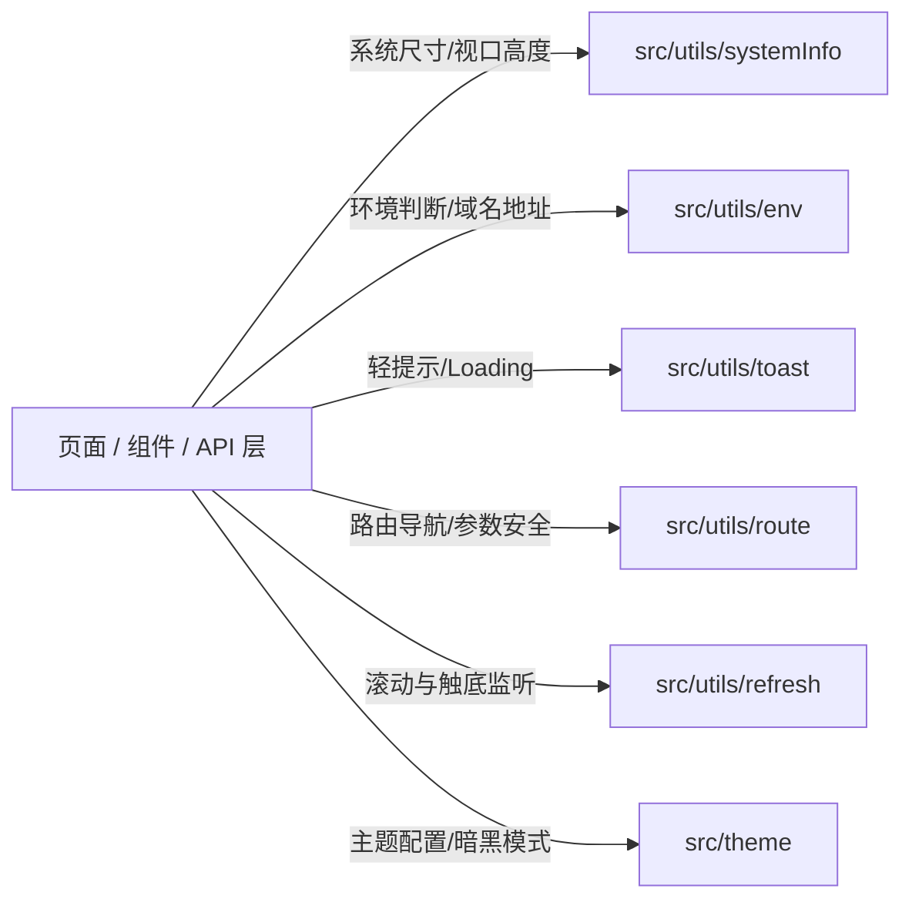

# 8 项目核心工具库使用规范（系统信息 · 环境变量 · 通用工具优先原则）

> **本文件是 `unibestX-skill` 的参考分册**，由 [SKILL.md](../SKILL.md) 按需引用。
>
> **何时读本文件**：
>
> - 获取屏幕尺寸、视口高度、状态栏高度、安全区、导航栏高度、TabBar 高度时；
> - 判断当前运行环境（开发/生产/测试）、获取 API 基础请求地址、OSS 配置、当前编译平台或 Vapor 模式时；
> - 使用轻提示（Toast）、加载动画（Loading）、路由跳转与参数传递、滚动监听、主题切换等通用能力时；
> - 编写任何页面、组件或业务模块，准备手写底层原生 API 前 —— **必须首先阅读并优先使用 `src/utils/` 中的封装工具**。
>
> **核心铁律**：**严禁重复造轮子，严禁在业务层散落原生硬编码**。系统信息优先使用 `@/src/utils/systemInfo`，环境变量优先使用 `@/src/utils/env`，开发中所需的基础通用能力优先检索并使用 `@/src/utils/...`。

---

## 8.1 总原则：工具库优先（Utils-First Principle）

在 uni-app X 跨端原生架构中，底层映射为 Android Kotlin、iOS Swift、鸿蒙 ArkTS 与 Web/小程序。直接在业务页面中调用零散原生 API 存在严重隐患：

1. **多端行为与单位不一致**：原生安卓、iOS 与鸿蒙在状态栏高度、胶囊对齐、底部安全区的表现存在细微差异；
2. **重复调用损耗性能**：频繁同步调用 `uni.getSystemInfoSync()` 会触发原生跨语言桥接，损耗帧率与响应速度；
3. **环境硬编码难以维护**：原生端不存在浏览器 `window` 或 Node `process.env`，散落书写的域名与配置在切换多环境时极易遗漏；
4. **统一封装已具备响应式与兜底**：`src/utils/` 中的核心模块已通过 Vue 响应式计算属性（`computed` / `ref`）做好了强类型封装与全平台兜底。



---

## 8.2 系统信息模块：`src/utils/systemInfo`

### 8.2.1 核心导出与推荐用法

| 导出符号 | 类型 | 说明与典型使用场景 |
| :--- | :--- | :--- |
| `statusBarHeight` | `ComputedRef<number>` | 状态栏高度（px）。自定义导航栏占位、顶部安全避让。 |
| `navBarHeight` | `ComputedRef<number>` | 导航栏内容区高度（px，标准 44px）。 |
| `tabBarHeight` | `ComputedRef<number>` | TabBar 高度（px，标准 50px）。 |
| `availableHeight` | `ComputedRef<number>` | **内容可用区高度（px）**。已自动扣除状态栏、导航栏与 TabBar（根据当前布局与 TabBar 策略自动计算）。页面固定容器直接绑定 `:style="{ height: availableHeight + 'px' }"`。 |
| `safeAreaBottom` | `ComputedRef<number>` | 底部安全区边距（px）。用于底部操作条、固定按钮避让全面屏黑条。 |
| `safeAreaInsets` | `Ref<SystemSafeAreaInsets &#124; null>` | 四周安全区对象（top, right, bottom, left）。 |
| `windowWidth` / `windowHeight` | `ComputedRef<number>` | 窗口可视宽高（px）。 |
| `screenWidth` / `screenHeight` | `ComputedRef<number>` | 物理屏幕宽高（px）。 |
| `menuRect` | `ComputedRef<SystemMenuRect &#124; null>` | 微信小程序右上角胶囊布局信息（px），其他平台为 null。 |
| `systemInfo` | `Ref<SystemInfoType &#124; null>` | 全量响应式系统信息实体。 |
| `sys` / `systemUtils` | `SystemUtils` 单例 | 系统信息工具单例，提供 `isAndroid()`、`isIOS()`、`isHarmony()`、`updateSystemInfo()` 等方法。 |
| `getScrollHeight()` | `(topPadding?: number, bottomPadding?: number) => number` | 计算特定局部滚动容器的安全高度。 |

### 8.2.2 正反例对照

```html
<!-- ❌ 错误做法：在页面中自行调用 uni API 或硬编码高度 -->
<script setup lang="uts">
// ❌ 错误 1：每次都执行同步桥接原生获取系统信息，性能低且非响应式
const sys = uni.getSystemInfoSync();
const topBar = sys.statusBarHeight + 44;

// ❌ 错误 2：样式中手写 100vh 或硬算视口高度，原生端不支持 vh 且底部会被 TabBar 遮挡
</script>
<template>
  <view style="height: 100vh;"></view>
</template>

<!-- ✅ 正确做法：直接按需引入 src/utils/systemInfo 导出的响应式变量 -->
<script setup lang="uts">
import { computed } from 'vue';
import {
  availableHeight,
  statusBarHeight,
  navBarHeight,
  safeAreaBottom
} from '@/src/utils/systemInfo/index.uts';

// 页面内部自定义滚动区高度
const contentHeight = computed((): number => availableHeight.value);
</script>

<template>
  <view class="flex flex-col flex-1" :style="{ height: `${contentHeight}px` }">
    <!-- 顶部状态栏避让占位 -->
    <view :style="{ height: `${statusBarHeight}px` }"></view>
    <!-- 内容区域 -->
    <scroll-view direction="vertical" class="flex-1">
      <!-- 列表内容 -->
    </scroll-view>
    <!-- 底部安全区占位（如有吸底固定按钮） -->
    <view :style="{ height: `${safeAreaBottom}px` }"></view>
  </view>
</template>
```

---

## 8.3 环境变量模块：`src/utils/env`

### 8.3.1 核心导出与推荐用法

| 导出符号 | 类型 / 签名 | 说明与典型使用场景 |
| :--- | :--- | :--- |
| `isDev()` | `() => boolean` | 是否为本地开发环境（`development`）。 |
| `isTest()` | `() => boolean` | 是否为测试环境（`test`）。 |
| `isProd()` | `() => boolean` | 是否为生产发布环境（`production`）。 |
| `getCurrentEnv()` | `() => string` | 获取当前环境标识（`dev` / `test` / `prod`）。 |
| `getCurrentEnvName()` | `() => string` | 获取当前环境友好中文名称（如`开发环境`）。 |
| `getApiBaseUrl()` | `() => string` | **主 API 基础请求地址**（如 `https://api.example.com`）。http 请求层与页面下载直传必须使用。 |
| `getApiSecondaryUrl()` | `() => string` | 备用 / 次级 API 服务地址。 |
| `getOssBaseUrl()` | `() => string` | OSS 静态资源 CDN 根路径。 |
| `getOssUploadUrl()` | `() => string` | OSS 文件直传服务地址。 |
| `getStreamUrl()` | `() => string` | SSE 流式推送或实时通讯服务地址。 |
| `getCompilePlatform()` | `() => string` | 当前编译平台（`app-android`, `app-ios`, `app-harmony`, `h5`, `mp-weixin` 等）。 |
| `getCompileMode()` | `() => string` | 当前渲染编译模式（`vapor` 或 `vdom`）。 |
| `isVaporMode()` | `() => boolean` | 当前是否处于 Vue 3 Vapor 模式。 |
| `getTabBarMode()` | `() => string` | 当前生效的 TabBar 模式（`native` 或 `custom`）。 |
| `isNativeTabBar()` | `() => boolean` | 当前是否为原生 TabBar 模式。 |
| `env` / `envUtils` | `EnvUtils` 单例 | 环境变量集成单例工具。 |

### 8.3.2 正反例对照

```ts
// ❌ 错误做法 1：手写 process.env 或 import.meta.env（原生 Kotlin/Swift 端无法识别或报错）
const baseUrl = process.env.VITE_SERVER_BASEURL; // ❌ 原生平台运行时可能报错或取不到

// ❌ 错误做法 2：业务代码或接口层中硬编码服务器 IP / 域名
const res = await uni.request({ url: 'http://192.168.1.100:8080/api/user/info' }); // ❌ 严禁硬编码

// ❌ 错误做法 3：手写条件编译字符串判断生产环境
// #ifdef H5
if (location.hostname !== 'localhost') { ... } // ❌ 跨端无效
// #endif

// ✅ 正确做法：统一从 @/src/utils/env/index.uts 引入
import {
  getApiBaseUrl,
  getOssBaseUrl,
  isDev,
  isProd,
  getCompilePlatform
} from '@/src/utils/env/index.uts';

// 获取全路径接口地址
const requestUrl = `${getApiBaseUrl()}/api/v1/goods/detail`;

// 获取 OSS 图片绝对地址
function getFullImageUrl(relativePath: string): string {
  if (relativePath.startsWith('http')) return relativePath;
  return `${getOssBaseUrl()}/${relativePath}`;
}

// 环境行为分支
if (isDev()) {
  console.log('[Dev Monitor] 当前编译平台:', getCompilePlatform());
}
```

---

## 8.4 常用通用工具库汇总（优先检索与复用）

在进行业务页面开发时，除 `systemInfo` 和 `env` 外，以下工具库位于 `@/src/utils/` 下，已全面适配 uni-app X 原生平台与强类型规范，必须优先调用：

### 8.4.1 轻提示与 Loading：`@/src/utils/toast/index.uts`

- **导出方法**：
  - `toast(message: string)`：简易黑色背景无图标轻提示，防御原生大对勾乌龙，时长 1500ms。
  - `toastSuccess(message: string)`：成功轻提示（带成功对勾图标），时长 1500ms。
  - `toastError(message: string)`：失败错误轻提示（带错误图标），时长 1500ms。
  - `showLoading(title?: string, mask?: boolean)`：全局加载中菊花遮罩，默认「加载中...」，默认带透明蒙层防重复操作。
  - `hideLoading()`：关闭加载遮罩。
- **规则**：严禁散落手写 `uni.showToast({ title: '...', icon: 'none' })`，统一使用 `toast(msg)` 或 `toastSuccess(msg)`。

### 8.4.2 路由与页面跳转：`@/src/router/index.uts`

- **导出方法 / 单例**：
  - `router.push(url: string)`：普通页面跳转（自带安全校验与参数编码）。
  - `router.replace(url: string)`：页面重定向（关闭当前页）。
  - `router.reLaunch(url: string)`：重启到某页面（清空页面栈）。
  - `router.switchTab(url: string)`：切换 TabBar 页面。
  - `router.back(delta?: number)`：返回上一页或指定层级。
  - `navigateTo` / `redirectTo` / `switchTab` / `navigateBack` 独立函数导出。
- **规则**：优先使用 `router` 单例或模块函数进行页面跳转，统一享受拦截与页面栈保护。

### 8.4.3 Navbar 布局页面滚动监听：`@/src/utils/refresh/index.uts`

- **导出方法**：
  - `onNavbarPageScroll(callback: (scrollTop: number) => void)`
  - `onNavbarReachBottom(callback: () => void)`
- **规则**：在采用了 `layout="navbar"` 或 `layout="default"` 的页面中，由于根容器已被布局自带的 `scroll-view` 接管，原生 `onPageScroll` / `onReachBottom` 不会被触发，**必须使用 `onNavbarPageScroll` 与 `onNavbarReachBottom`**。

### 8.4.4 主题与样式系统：`@/src/theme/index.uts`

- **导出方法**：
  - `getThemeTokens(isDark: boolean): ThemeTokens`：获取当前明暗模式下的颜色代币集合。
  - `getRootThemeStyle(themeColor: string, isDark: boolean): UTSJSONObject`：生成绑定在根容器 `:style` 上的 CSS 变量集合。
  - `applyThemeColor(color: string)`：动态注入全局主题色。

### 8.4.5 跨端物理返回键拦截：`@/src/utils/backPress/index.uts`

- **导出方法**：
  - `useBackPress(callback: () => boolean)`：安全监听 Android 原生物理返回键，返回 `true` 表示拦截默认返回行为。

### 8.4.6 文件上传与 OSS：`@/src/http/upload.uts`

- **架构定位**：文件上传属于网络传输范畴，收敛在 `@/src/http/upload.uts`（与 `request.uts`、`stream.uts` 并列）。
- **导出方法 / 单例**：
  - `uploadFile(options: UploadFileOptions): Promise<string>`：全平台原生文件上传。
  - `uploadOssFile(filePath: string, formData?, ignoreAuth?): Promise<string>`：快捷上传图片到 OSS。
  - `upload` / `uploadUtils`：上传工具全局单例。

---

## 8.5 模块引用与路径铁律

1. **绝对路径导入**：
   一律使用 `@/src/utils/<module>/index.uts`（或 `@/src/utils/<module>`），严禁使用相对路径 `../../utils/...`。

   ```ts
   // ✅ 正确规范写法
   import { availableHeight, statusBarHeight } from '@/src/utils/systemInfo/index.uts';
   import { getApiBaseUrl, isDev } from '@/src/config/index.uts';
   import { toast, showLoading, hideLoading } from '@/src/utils/toast/index.uts';

   // ❌ 错误穿透写法
   import { statusBarHeight } from '../../../../utils/systemInfo/index.uts';
   ```

2. **禁止整包多层重新转发导出 (`export *`)**：
   根据分册 1 铁律 7，UTS 在 Kotlin 编译端对多层重导出容易发生符号重命名或找不到定义。各个页面和组件**应直接精准引入目标工具模块**，不要建立庞大的单文件大而全 `export *` 桶文件。

3. **优先使用具名导出，避免解构纯对象字面量中的方法**：

   ```ts
   // ✅ 优先引入具名函数
   import { isDev, getApiBaseUrl } from '@/src/config/index.uts';
   if (isDev()) { ... }

   // ❌ 避免在原生端解构纯对象中的函数导出（Kotlin 端可能报 Function invocation expected）
   // import { env } from '@/src/config/index.uts';
   // const { isDev } = env; // ❌ 容易出问题
   ```

---

## 8.6 工具库使用自检清单与 10 条红线

- [ ] **红线 1**：严禁在页面各处直接调用 `uni.getSystemInfoSync()`，一律优先从 `@/src/utils/systemInfo/index.uts` 引入响应式变量或使用 `sys` 单例。
- [ ] **红线 2**：严禁在 `<style>` 或行内样式中写 `height: 100vh` 或 `width: 100vw`，高度撑满一律使用 `flex-1` 或绑定 `:style="{ height: availableHeight + 'px' }"`。
- [ ] **红线 3**：严禁在代码中写死 `http://...`、本地开发 IP 或 OSS 资源绝对域名，一律通过 `getApiBaseUrl()`、`getOssBaseUrl()` 动态读取。
- [ ] **红线 4**：严禁使用 `process.env.NODE_ENV === 'development'` 判断环境，一律使用 `isDev()`、`isProd()`、`isTest()`。
- [ ] **红线 5**：严禁在业务页面中散落调用原生 `uni.showToast({ title, icon: 'none' })`，必须统一使用 `toast(msg)` 或 `showToast(...)`。
- [ ] **红线 6**：有自定义导航栏需要避让状态栏时，必须绑定 `:style="{ height: statusBarHeight + 'px' }"`，严禁硬编码 `20px` / `44px`。
- [ ] **红线 7**：在 `navbar` 布局下监听整页滚动，必须使用 `onNavbarPageScroll` / `onNavbarReachBottom`，不可使用原生 `onPageScroll`。
- [ ] **红线 8**：页面跳转必须使用 `@/src/utils/route/index.uts` 提供的 `router` 或封装函数，确保参数安全与平台守卫生效。
- [ ] **红线 9**：引用工具库必须采用 `@/src/utils/<module>/index.uts` 形式，严禁跨层深层相对路径穿透。
- [ ] **红线 10**：实现新功能前，必须首先在 `@/src/utils/` 中查验已有工具，严禁在局部重新手写已有的通用方法（如防抖、格式化、URL解析等）。
