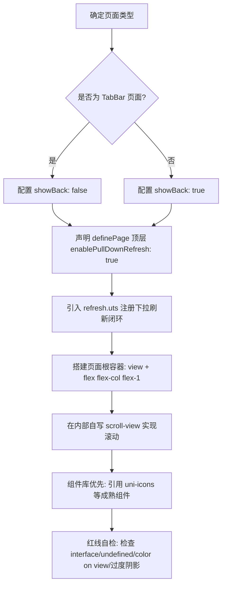

# unibestX-skill (uni-app X & UTS 规范、真实案例与代码生成指南)

## 概述

> 🚨 **AI / Agent 必读铁律**：所有参与本项目开发的 AI、Agent 在进行任何编码、重构、修 bug 或新增页面任务前，**必须首先完整阅读并严格遵循本 Skill**。  
> 🔄 **VDOM 与 Vapor 差异自动回写机制**：若在开发或排错过程中，遇到任何 UTS 语法、组件属性、生命周期、CSS 样式在 **VDOM 模式与 Vapor 模式不通用 / 存在渲染差异** 的问题，AI / Agent **必须主动根据分类（1.1 语法规范、1.2 样式限制、1.3 运行时约束、3.3 对照表及 3.4 红线清单）自动追加并同步到本 Skill**，严禁遗漏！

uni-app X 采用 UTS (uni type script) 语言与原生渲染引擎，跨端直接编译为原生代码（Android 编译为 Kotlin，iOS 插件编译为 Swift，鸿蒙插件编译为 ArkTS，Web/小程序编译为 JS）。  
与宽容的 TypeScript/JavaScript 不同，UTS 采用**名义强类型系统（Nominal Strong Typing）**与**原生渲染规范**。

本文档按照以下三大维度结构化组织：

1. **UTS 与原生规范**：语法、严格类型、CSS / Tailwind 样式引擎限制与跨端运行时铁律；
2. **项目正确案例**：来自本项目的生产级标杆案例（页面骨架、TabBar、二级详情页、滚动与下拉刷新）；
3. **项目代码生成规范**：智能体与开发者新增页面、生成组件、调用组件库的流程、模板与红线自检清单。

---

## 何时使用

- 编写、重构或新增 `.uvue`、`.uts`、`.ts`、`.scss` 文件时
- 规划或生成新页面结构、骨架布局与视口高度（`computedAvailableHeight`）时
- 使用 Tailwind CSS 编写跨端 UI、按钮排版、文本颜色与安全区适配时
- 遇到 UTS 强类型编译错误（`UTS110111163`、`UTS110111119`、`UTS110111120`、`UTS100006`、`error17`）
- 遇到 Android/iOS 原生运行时报错（`ClassCastException: Map cannot be cast to UTSJSONObject`）
- 进行跨端渲染模式（VDOM / Android VDOM / Vapor）兼容或 Easycom 组件库开发时

---

## 一、UTS 核心规范与原生渲染限制

### 1.1 UTS 强类型系统与语法核心铁律

#### 1.1.1 一律禁止使用 `interface`，全面统一使用 `type`

- **错误码**：`UTS110111163: Object literals only support object types defined by construction type, and do not support interfaces`
- **底层原理**：UTS 将 `interface` 严格映射为底层面向对象纯接口，禁止将对象字面量（如 `{ name: 'foo' }`）、Mock 数据或 API 返回值赋值给 `interface`。
- **强制规范**：定义任何对象结构、状态、参数或返回值类型时，**一律禁止使用 `interface`，全部统一使用 `type`（类型别名）**。

```ts
// ❌ 错误：触发 UTS110111163 编译崩溃
interface UserInfo {
  name: string
  age: number
}
const user: UserInfo = { name: "Tom", age: 18 }

// ✅ 正确：统一使用 type
type UserInfo = {
  name: string
  age: number
}
const user: UserInfo = { name: "Tom", age: 18 }
```

#### 1.1.2 不支持 `undefined`，必须初始化为 `null`

- **错误码**：`UTS110111119`
- **规范**：UTS 语言不支持 `undefined`。所有变量必须被初始化；表示空值必须使用 `null`，且联合类型目前**仅支持与 `null` 的联合**（`Type | null`）。

```ts
// ❌ 错误
let value: string | undefined
function test(param?: string): void {}

// ✅ 正确
let value: string | null = null
function test(param: string | null): void {}
```

#### 1.1.3 条件语句必须为显式布尔表达式

- **错误码**：`UTS110111120`
- **规范**：严禁使用 JS 中的 truthy / falsy 隐式转换（如 `if (str)` 或 `arr || []`），必须显式与 `null`、空字符串或数值进行布尔比较。

```ts
// ❌ 错误
if (obj) {}
if (str) {}
const list = arr || []

// ✅ 正确
if (obj != null) {}
if (str != null && str != "") {}
const list = arr != null ? arr : []
```

#### 1.1.4 等值比较使用 `==` / `!=`，禁止对基础类型使用 `===` / `!==`

- **底层原理**：在 Kotlin (Android) 原生端，`===` 会编译为引用/身份比较（Identity Equality）。对于字符串，比较的是内存地址而非文本内容；对于数值/布尔值，隐式装箱（Implicit Boxing）会导致不同包装对象的引用比较返回 `false`。
- **规范**：对 `string`、`number`、`boolean` 一律使用值比较运算符 `==` 和 `!=`。

```ts
// ❌ 错误：在 Android 原生端即使内容相同也可能判断为 false
if (statusCode === 200) {}
if (routePath === '/home') {}

// ✅ 正确：安全的值比较
if (statusCode == 200) {}
if (routePath == '/home') {}
```

#### 1.1.5 数字与数组必须显式声明类型

- **规范**：除 `string` 和 `boolean` 可以依据字面量可靠推导外，**`number` 和 `Array` 必须显式注明类型**，避免不同原生平台（如 Kotlin Int/Double 差异）下的推导歧义。

```ts
// ❌ 错误
let count = 0
let list = []

// ✅ 正确
let count: number = 0
let list: Array<string> = []
// 或
let list: string[] = []
```

#### 1.1.6 函数参数、返回值类型与安全调用运算符 `?.`

- **规范**：所有函数参数及返回值必须显式声明类型；无返回值函数必须明确声明为 `:void`。对可空类型调用属性或方法时必须使用安全调用运算符 `?.`。

```ts
// ❌ 错误
function calculate(score) {
  return score * 2
}

// ✅ 正确
function calculate(score: number): number {
  return score * 2
}
function getLength(str: string | null): number {
  return str?.length ?? 0
}
```

#### 1.1.7 类型定义必须在文件顶层作用域

- **错误码**：`UTS100006`（type）、`UTS110111166`（interface）
- **规范**：`type` 严禁声明在函数或代码块内部，必须提取到文件最顶层作用域。

#### 1.1.8 作用域插槽解构变量推断为 `Any?`

- **错误码**：`error17: 参数类型不匹配：实际类型为 'Any?'，预期类型为 'UTSJSONObject'`
- **规范**：在 `.uvue` 模板中，作用域插槽（如 `#default="{ item, index }"`）解构出的属性会被推导为 `Any?`。传参给强类型函数时必须在模板调用点显式使用 `as` 进行类型断言收窄。

```html
<!-- ❌ 错误：item 为 Any?，导致编译失败 -->
<text>{{ formatItem(item) }}</text>
<text>{{ index + 1 }}</text>

<!-- ✅ 正确：在模板调用点显式断言 -->
<text>{{ formatItem(item as UTSJSONObject) }}</text>
<text>{{ (index as number) + 1 }}</text>
```

#### 1.1.9 Class 语法使用约束

- **私有属性**：禁止使用 `#prop`，统一使用 `private prop` (`UTS110111128`)。
- **下标访问**：Class 实例禁止 `obj[key]` 下标访问，必须用点操作符 `obj.prop` (`UTS110111129`)。
- **静态初始化**：禁止静态块 `static {}`，使用私有静态方法 `private static initData()` 初始化 (`UTS110111130`)。
- **继承要求**：子类继承必须显式声明 `constructor()` 并调用 `super()` (`UTS110111131`)。
- **禁止传递 Class**：Class 仅作为类型使用，禁止赋值给变量或作为普通对象传递，需使用工厂函数 (`UTS110111151`)。

---

### 1.2 样式 (CSS & Tailwind CSS) 与原生渲染铁律

#### 1.2.1 CSS 变量动态换肤与原生控件限制

- **根节点绑定**：为了保证 App 原生平台下 CSS 变量跟随 JS 变量动态更新，**必须在根元素（如 layout 根 `view`）上内联绑定该变量**：

  ```html
  <view :style="{ '--theme-color': appStore.state.theme }">
    <slot></slot>
  </view>
  ```

- **iOS 原生控件换肤限制**：对于底层映射为系统原生控件的元素（如 iOS `<button>` 映射为原生 `UIButton`），原生控件无法自动继承重绘 CSS 变量。
  - **正确做法**：在 `<button>` 等原生控件上，通过 Vue 响应式行内样式直接绑定具体变量值：

    ```html
    <button :style="{ backgroundColor: appStore.state.theme }">按钮</button>
    ```

#### 1.2.2 原生 `<button>` 布局对齐限制

- **铁律**：**禁止**在原生 `<button>` 元素上直接使用 flex 布局对齐类名（如 `items-center`、`justify-center`、`justify-content`、`align-items`）。原生平台的 `<button>` 仅作为文本控件实现。
- **正确做法**：使用 `<view>` 作为外层 Flex 容器进行排版，内层使用普通文本或自定义组件：

  ```html
  <!-- ❌ 错误：触发编译报错 style property justify-content|align-items is only supported on view... -->
  <button class="flex flex-row items-center justify-center">按钮</button>

  <!-- ✅ 正确：用 view 容器做 Flex 居中排版 -->
  <view class="w-full h-[36px] rounded-[8px] bg-primary flex flex-row items-center justify-center">
    <text class="text-[#ffffff] text-[14px] font-medium">确认提交</text>
  </view>
  ```

#### 1.2.3 `color` 属性仅支持特定文本元素

- **铁律**：原生平台中 `color` 属性（Tailwind 的 `text-[#1e293b]`、`text-primary`）**仅支持在 `<text>`, `<button>`, `<input>`, `<textarea>`** 元素上使用。**禁止**在 `<view>` 上直接挂载文字颜色类名，否则编译报错：`style property color is only supported on <text>|<button>|<input>|<textarea>`。
- **正确做法**：将文字颜色类名挂载到内部的 `<text>` 标签上：

  ```html
  <!-- ❌ 错误 -->
  <view class="text-[#334155]">
    <text>内容</text>
  </view>

  <!-- ✅ 正确 -->
  <view>
    <text class="text-[#334155] text-[14px]">内容</text>
  </view>
  ```

#### 1.2.4 `<text>` 元素只能包含单个文本节点

- **铁律**：uni-app X 原生渲染引擎要求**一个 `<text>` 元素内部只能包含一个纯文本节点**。严禁在 `<text>` 内混合「裸文本 + 嵌套 `<text>` + 裸文本」，否则编译报错：`A <text> element can only contain one text node`。
- **正确做法**：内联多色/高亮文本排版，使用外层 `flex flex-row flex-wrap` 容器包裹多个同级的兄弟 `<text>`：

  ```html
  <!-- ❌ 错误 -->
  <text class="text-[13px] text-[#475569]">
    根容器 <text class="text-[#1d4ed8]">view</text> 撑满高度
  </text>

  <!-- ✅ 正确：兄弟 text 节点组合 -->
  <view class="flex flex-row flex-wrap items-center">
    <text class="text-[13px] text-[#475569]">根容器 </text>
    <text class="text-[13px] text-[#1d4ed8]">view</text>
    <text class="text-[13px] text-[#475569]"> 撑满高度</text>
  </view>
  ```

#### 1.2.5 颜色值一律强制十六进制，严禁使用英文命名颜色

- **铁律**：**颜色必须全部统一使用标准十六进制色值（如 `#ffffff`、`#ef4444`、`#1e293b`），严禁使用英文单词命名颜色（如 `bg-[red]`、`text-[red]`、`border-[blue]`）**。
- **原因**：原生平台对 CSS 命名颜色的解析不一致，极易失效；且预设类名（如 `text-white`）在鸿蒙 VDOM 或作用域插槽中可能丢失 CSS 变量继承退化为黑色。
- **鸿蒙 VDOM 白色双重防护**：在插槽（slot）、下拉刷新、悬浮按钮等容器内的白色文字，强烈建议使用 `class="text-[#ffffff]"` 并叠加内联样式 `:style="{ color: '#ffffff' }"` 确保 100% 稳定呈现白色。

```html
<!-- ❌ 错误：使用英文命名颜色 -->
<view class="bg-[red] p-[10px]">
  <text class="text-[white]">提示</text>
</view>

<!-- ✅ 正确：全部标准十六进制 + 关键白色双重防护 -->
<view class="bg-[#ef4444] p-[10px]">
  <text class="text-[#ffffff] text-[14px]" style="color: #ffffff;">提示</text>
</view>
```

#### 1.2.6 Tailwind CSS 边框书写规范

- **规范**：原生平台解析器要求明确指定边框宽度、颜色与实线样式，推荐使用带明确属性的组合类名：

  ```html
  <view class="border-[1px] border-solid border-[#e2e8f0] rounded-[12px] p-[16px]"></view>
  ```

#### 1.2.7 禁用字体族工具类

- **铁律**：**严禁**使用 `font-mono`、`font-sans`、`font-serif` 等字体族工具类。这些类生成的 CSS 会被原生平台的严格解析器当作 `font` 简写属性处理，因缺少 `font-size` 报错：`[parse-css-font] Missing required font-size.`。
- **正确做法**：通过内联样式指定字体族：

  ```html
  <text class="text-[13px] text-[#334155]" style="font-family: monospace;">127.0.0.1</text>
  ```

#### 1.2.8 原生平台 Display / Align-Items / Position 限制

- **Display 限制**：原生平台仅支持 `display: flex` 和 `display: none`。**严禁**使用 `display: grid` 或 `inline-block`。
- **Align-Items 限制**：原生平台仅支持 `center`、`flex-start`、`flex-end`、`stretch`。**严禁使用 `items-baseline` (`align-items: baseline`)**，否则编译报错：`property value baseline is not supported for align-items`。需对齐底部时使用 `items-end` 或 `items-center` 配合微调。
- **Position 限制**：原生平台仅支持 `relative`、`absolute`、`fixed`，**不支持 `position: sticky`**。
- **布局推荐 Flex 类名**：`flex flex-row`、`flex-col`、`flex-1`、`items-center`、`justify-between`、`justify-center`。

#### 1.2.9 高度单位与 Flex 布局子元素高度塌陷

- **视口单位限制**：原生平台不支持 `vh`、`vw`，高度仅支持数字、px、百分比或 `auto`。
- **Flex 子元素塌陷陷阱**：在 Flex 布局中，如果父元素是通过 `flex-1` 撑开剩余空间而无固定像素高度，子元素设置 `h-full` (100%) 在原生底层会被解析为 `0`（`100% * auto(0) = 0`），导致内容完全空白消失。
- **解决方案**：子元素也直接使用 `flex-1` 占满剩余空间。

#### 1.2.10 模板 Void 元素自闭合规范

- 在 `.uvue` 模板中，HTML Void 元素（如 `<input />`、`<image />`）必须显式自闭合，否则报错 `Element is missing end tag`。

#### 1.2.11 阴影使用限制（严禁过度依赖阴影）

- **铁律**：**严禁过度依赖阴影（`box-shadow` 或 Tailwind `shadow-*` 类名）**。
- **原因**：在安卓原生端，**VDOM 渲染模式与 Vapor 模式对阴影的底层渲染机制存在明显差异**（如 Elevation 高度映射、扩散模糊度与裁切表现不一致），极易导致同一界面在不同编译模式或不同安卓基座版本下显示效果不一致，甚至可能导致部分卡片边缘渲染异常或掉帧。
- **正确做法**：界面层级与卡片质感优先采用**浅色细腻边框**（如 `border-[1px] border-solid border-[#e2e8f0]` 或 `border-[#f1f5f9]`）结合**浅色背景微反差**（如 `bg-[#f8fafc]`、`bg-[#ffffff]`）进行区分。若确需投影，仅可使用极其轻微的弱阴影，避免深重大面积阴影。

---

### 1.3 跨端运行时与渲染模式约束

#### 1.3.1 `Map` 转 `UTSJSONObject` 的 ClassCastException 与 `:style` 类型安全

- **ClassCastException 陷阱**：在 Android (Kotlin) 端，从 Vue props 或动态对象传递过来的样式/属性在底层是 Kotlin `LinkedHashMap`，而不是 `UTSJSONObject`。如果直接执行 `as UTSJSONObject` 会触发运行时崩溃：`java.lang.ClassCastException: LinkedHashMap cannot be cast to UTSJSONObject`。
- **Nullable 编译报错**：模板中通过下标访问 `parentData['styleKey']` 返回的是 `Any?`，若直接赋给 `:style` 会报：`参数类型不匹配：实际类型为 'Any?'，预期类型为 'Any'`。
- **通用解决方案**：使用 `?? {}` 空兜底并强转为 `as any`：

  ```html
  <view :style="(parentData['labelStyle'] ?? {}) as any"></view>
  ```

#### 1.3.2 Options API 组件方法名与自定义事件同名冲突

- **陷阱**：在 Options API 组件中，若局部方法与声明的 `emits` 事件同名（如模板中 `@change="change"` 且在 `methods` 中声明 `change(e)`），Android 编译器会将方法解析为事件回调属性而非实例方法，导致事件处理函数无法被触发。
- **解决规范**：重命名局部方法加前缀区分，如 `keyboardChange`、`onSelectorChange`。

#### 1.3.3 键盘高度变化事件类型声明

- **规范**：监听 `@keyboardheightchange` 事件时，事件回调的入参类型必须声明为 `UniInputKeyboardHeightChangeEvent`，严禁声明为 `UniInputKeyboardHeightChangeEventDetail`（否则 Android 端会发生 ClassCastException 崩溃）。

  ```uts
  function onKeyboardHeightChange(event: UniInputKeyboardHeightChangeEvent): void {
    const height: number = event.detail.height;
  }
  ```

#### 1.3.4 VDOM / Android VDOM / Vapor 渲染模式与编译兼容避坑

- **渲染模式判断**：使用条件编译 `#ifdef VUE3-VAPOR` / `#ifndef VUE3-VAPOR`，禁止依赖运行时环境变量或读取 manifest：

  ```ts
  export function isVaporMode(): boolean {
    // #ifdef VUE3-VAPOR
    return true;
    // #endif
    // #ifndef VUE3-VAPOR
    return false;
    // #endif
  }
  ```

- **TabBar `midButton1` 命名**：原生 `midButton` 在 Vapor / 小程序 / 鸿蒙端不可用，统一使用 `midButton1`，并在 `TabBarConfig` type 中显式声明 `midButton1?: TabBarMidButton`。
- **动态读取类型未声明但运行时存在的属性**：禁止 `(obj as any).field` 点操作（触发 `error18 找不到名称`），改用 `UTSJSONObject.getString('field')`：

  ```ts
  const sysInfo = uni.getSystemInfoSync() as UTSJSONObject;
  const compilerVer: string = sysInfo.getString('uniCompileVersion') ?? '';
  ```

- **可空对象属性运算**：禁止对可空属性直接做算术运算（触发 `Operator call is prohibited on a nullable receiver`）。先解构出局部非空变量再运算：

  ```ts
  const ah: number = systemInfo.value?.availableHeight ?? 0;
  const total: number = ah > 0 ? ah + TABBAR_BASE_HEIGHT : 0;
  ```

---

## 二、项目正确案例

以下案例均源自 unibestX 本地工程中已验证、可直接编译运行的真实生产级代码。

### 2.1 标杆案例 1：标准“上固定 + 下滚动”骨架与可用高度

> 真实参考源：[src/sub/layoutDemo/layoutDemo.uvue](file:///Users/chenqi/Desktop/unibestX/src/sub/layoutDemo/layoutDemo.uvue)

**设计要点**：

- 页面根容器为 `view` + `flex flex-col flex-1`，自动撑满可用高度；
- 严禁以 `scroll-view` 作为页面根，避免与 `navbar` 布局外层滚动容器发生手势冲突；
- 顶部固定说明卡片拥有天然高度，不随列表滚动；
- 内部自写 `<scroll-view>` 挂载 `flex-1 flex flex-col` 弹性撑满剩余空间，并通过 `@scroll` 与 `@scrolltolower` 独立响应滚动与触底；
- 可用视口高度直接通过 `computedAvailableHeight` 消费框架系统变量。

```html
<template>
  <!-- 1. 页面根容器：普通 view + flex-1，撑满开发高度 -->
  <view class="flex flex-col items-center px-[16px] pt-[8px]">

    <!-- 2. 顶部固定说明区（各自天然高度，不随列表滚动） -->
    <view class="w-full mb-[16px]" :style="{ maxWidth: '520px' }">
      <view class="w-full bg-white rounded-[12px] p-[16px] flex flex-col">
        <view class="flex-row items-center mb-[10px]">
          <view class="w-[6px] h-[16px] rounded-[3px] bg-[#3b82f6] mr-[8px]" />
          <text class="text-[16px] font-bold text-[#1e293b]">布局骨架演示</text>
        </view>
        <text class="text-[13px] text-[#64748b] leading-[19px]">
          根容器用 view + flex-1，滚动区域在内部自写 scroll-view，内容高度直接用 computedAvailableHeight。
        </text>
      </view>
    </view>

    <!-- 3. 内部自写 scroll-view：弹性占满剩余视口 -->
    <scroll-view
      direction="vertical"
      class="w-full flex flex-col flex-1"
      :style="{ maxWidth: '520px' }"
      :lower-threshold="50"
      @scroll="handleScroll"
      @scrolltolower="handleScrollToLower"
    >
      <view class="flex flex-col">
        <!-- 滚动内容列表项 -->
        <view
          v-for="(item, index) in demoItems"
          :key="index"
          class="w-full bg-white rounded-[12px] p-[16px] mb-[12px] flex flex-col"
        >
          <text class="text-[15px] font-semibold text-[#1e293b]">{{ item.title }}</text>
          <text class="text-[13px] text-[#475569] leading-[19px] mt-[4px]">{{ item.desc }}</text>
        </view>

        <view class="flex-col items-center py-[16px]">
          <text class="text-[12px] text-[#94a3b8]">已触底 {{ reachBottomCount }} 次 · 内容结束</text>
        </view>
      </view>
    </scroll-view>

  </view>
</template>

<script setup lang="uts">
import { computed, ref } from 'vue';
import { availableHeight } from '@/src/utils/systemInfo.uts';

definePage({
  layout: 'navbar',
  showBack: true,
  hideNavbar: false,
  enablePullDownRefresh: false,
  style: {
    navigationBarTitleText: '布局页面示例',
    navigationStyle: 'custom'
  }
});

/**
 * 开发者可用视口高度（框架已扣除状态栏、导航栏、底部 TabBar，navbar / default 通用）
 */
const computedAvailableHeight = computed<number>((): number => availableHeight.value ?? 0);

type DemoItem = {
  title: string;
  desc: string;
};

const demoItems: Array<DemoItem> = [
  { title: '规则 1', desc: '根容器用 view，禁止用 scroll-view 当根' },
  { title: '规则 2', desc: '要滚动的区域在根内自写 scroll-view' },
  { title: '规则 3', desc: '内容高度直接使用 computedAvailableHeight' }
];

const scrollTop = ref<number>(0);
const reachBottomCount = ref<number>(0);

function handleScroll(e: UniScrollEvent): void {
  scrollTop.value = Math.ceil(e.detail.scrollTop);
}

function handleScrollToLower(): void {
  reachBottomCount.value++;
}
</script>
```

---

### 2.2 标杆案例 2：主包 TabBar 页面与自定义平滑下拉刷新

> 真实参考源：[src/pages/basic/basic.uvue](file:///Users/chenqi/Desktop/unibestX/src/pages/basic/basic.uvue) / [src/pages/index/index.uvue](file:///Users/chenqi/Desktop/unibestX/src/pages/index/index.uvue)

**设计要点**：

- `definePage` 中 `showBack: false`（主 TabBar 页面无需返回箭头）；
- 顶层配置 `enablePullDownRefresh: true` 开启自定义平滑下拉刷新；
- 统一从 `@/src/utils/refresh.uts` 引入 `onNavbarPullDownRefresh` 与 `stopNavbarPullDownRefresh`；
- （仅限首页配置 `type: 'home'`，其余 TabBar 页面不填）。

```uts
<script setup lang="uts">
import { onNavbarPullDownRefresh, stopNavbarPullDownRefresh } from '@/src/utils/refresh.uts';

definePage({
  layout: 'navbar',
  showBack: false, // 👈 TabBar 页面不展示返回箭头
  hideNavbar: false,
  enablePullDownRefresh: true, // 👈 顶层开启由 navbar 驱动的自定义下拉刷新
  style: {
    navigationBarTitleText: '基础功能',
    navigationStyle: 'custom'
  }
});

onNavbarPullDownRefresh(() => {
  // 1. 发起网络请求或刷新数据
  console.log('执行 TabBar 页面刷新数据');

  // 2. 数据获取完毕后手动停止刷新动画
  setTimeout(() => {
    stopNavbarPullDownRefresh();
  }, 1000);
});
</script>
```

---

### 2.3 标杆案例 3：二级页面 / 子包分包页面标准实现

> 真实参考源：[src/sub/time/time.uvue](file:///Users/chenqi/Desktop/unibestX/src/sub/time/time.uvue) / [src/sub/device/device.uvue](file:///Users/chenqi/Desktop/unibestX/src/sub/device/device.uvue)

**设计要点**：

- `definePage` 中 `showBack: true` 自动渲染返回按钮与手势返回；
- 页面内部滚动通过自写 `scroll-view` 完成；
- 刷新事件响应与关闭机制严密闭环。

```uts
<template>
  <view class="flex flex-col flex-1 px-[16px] pt-[12px]">
    <scroll-view direction="vertical" class="flex-1 flex flex-col">
      <view class="flex flex-col">
        <view class="bg-white rounded-[12px] p-[16px] mb-[12px]">
          <text class="text-[14px] font-semibold text-[#1e293b]">详情页内容卡片</text>
          <text class="text-[12px] text-[#64748b] mt-[4px]">二级页面支持点击返回导航</text>
        </view>
      </view>
    </scroll-view>
  </view>
</template>

<script setup lang="uts">
import { onNavbarPullDownRefresh, stopNavbarPullDownRefresh } from '@/src/utils/refresh.uts';

definePage({
  layout: 'navbar',
  showBack: true, // 👈 开启返回上一页按钮
  hideNavbar: false,
  enablePullDownRefresh: true,
  style: {
    navigationBarTitleText: '功能详情',
    navigationStyle: 'custom'
  }
});

onNavbarPullDownRefresh(() => {
  setTimeout(() => {
    stopNavbarPullDownRefresh();
  }, 1000);
});
</script>
```

---

### 2.4 标杆案例 4：整页按内容高度自然滚动

> 真实参考源：[src/utils/pageScroll.uts](file:///Users/chenqi/Desktop/unibestX/src/utils/pageScroll.uts)

**设计要点**：

- 页面根容器使用 `<view class="flex flex-col">`（**不加 `flex-1`**）；
- 滚动完全由 `navbar` 布局的外层 `scroll-view` 容器接管；
- 监听滚动与触底必须使用框架封装的 `onNavbarPageScroll` 与 `onNavbarReachBottom`，替代原生 `onPageScroll` / `onReachBottom`。

```uts
<script setup lang="uts">
import { onNavbarPageScroll, onNavbarReachBottom, PageScrollDetail } from '@/src/utils/pageScroll.uts';

definePage({
  layout: 'navbar',
  showBack: true,
  hideNavbar: false,
  enablePullDownRefresh: true,
  style: {
    navigationBarTitleText: '整页滚动',
    navigationStyle: 'custom'
  }
});

onNavbarPageScroll((e: PageScrollDetail) => {
  console.log('整页滚动位置 scrollTop:', e.scrollTop);
});

onNavbarReachBottom(() => {
  console.log('整页触底，触发上拉加载');
});
</script>
```

---

### 2.5 标杆案例 5：组件库 Easycom 优先导入范式

> 真实参考源：[src/pages/function/views/FunctionView.uvue](file:///Users/chenqi/Desktop/unibestX/src/pages/function/views/FunctionView.uvue)

**设计要点**：

- 优先使用 `uni_modules` 中的成熟组件（`uni-icons`、`e-chart`、`z-paging-x`、`uni-badge-view` 等）；
- 模板中直接以短横线形式使用组件，**严禁在 `<script>` 中手动 `import`**；
- 避免手写繁琐的原生结构，提高跨端渲染一致性。

```html
<template>
  <view class="flex flex-row items-center p-[12px] bg-white rounded-[8px]">
    <!-- ✅ 直接使用 Easycom 自动导入的 uni-icons 组件，无需 import -->
    <uni-icons type="info" size="20" color="#3b82f6" />
    <text class="text-[14px] text-[#1e293b] ml-[8px]">组件库优先示例</text>
  </view>
</template>
```

---

## 三、项目代码生成规范

当 AI 助手或开发者在项目中**创建新页面、生成新组件或修改既有业务代码**时，必须严格遵照本生成规范执行。

### 3.1 新增页面的生成流程与必须要素



#### 必须要素清单

1. **显式 `definePage` 声明**：每一个 `.uvue` 页面必须在 `<script setup lang="uts">` 最顶部显式书写 `definePage({...})`，统一使用 `navbar` 布局接管；
2. **默认开启自定义下拉刷新**：顶层显式设置 `enablePullDownRefresh: true`，严禁在 `style` 内部开原生下拉；
3. **闭环刷新逻辑**：引入 `onNavbarPullDownRefresh` 与 `stopNavbarPullDownRefresh`，在数据拉取结束后必须调用 `stopNavbarPullDownRefresh()`；
4. **根容器骨架铁律**：页面根节点一律为 `<view class="flex flex-col flex-1">`，严禁使用 `<scroll-view>` 作为页面根；
5. **滚动区域实现**：需要滚动的区域在根内自写 `<scroll-view direction="vertical" class="flex-1 flex flex-col">`；
6. **组件库优先**：界面图标使用 `<uni-icons>`，分页列表使用 `<z-paging-x>`，折叠面板使用 `<uni-collapse-x>`，严禁手动 import easycom 范围内的组件。

---

### 3.2 页面代码生成标准模板

#### 模板 1：标准二级/子包/功能页面（常用模板，直接复制落地）

```uts
<template>
  <!-- 页面根容器：view + flex-1 弹性撑满可用高度 -->
  <view class="flex flex-col flex-1 px-[16px] pt-[12px]">

    <!-- 顶部固定区域（可选） -->
    <view class="w-full mb-[12px] bg-white rounded-[12px] p-[16px]">
      <text class="text-[15px] font-semibold text-[#1e293b]">顶部标题区</text>
      <text class="text-[12px] text-[#64748b] mt-[2px]">说明文本</text>
    </view>

    <!-- 内部自写 scroll-view 弹性占满剩余空间 -->
    <scroll-view
      direction="vertical"
      class="flex-1 flex flex-col"
      :lower-threshold="50"
      @scroll="handleScroll"
      @scrolltolower="handleScrollToLower"
    >
      <view class="flex flex-col">
        <!-- 列表或主要内容区域 -->
        <view
          v-for="(item, index) in dataList"
          :key="index"
          class="w-full bg-white rounded-[8px] p-[12px] mb-[8px] flex flex-col"
        >
          <text class="text-[14px] text-[#334155]">{{ item }}</text>
        </view>
      </view>
    </scroll-view>

  </view>
</template>

<script setup lang="uts">
import { ref } from 'vue';
import { onNavbarPullDownRefresh, stopNavbarPullDownRefresh } from '@/src/utils/refresh.uts';

// 1. 显式声明页面布局与导航栏配置
definePage({
  layout: 'navbar',
  showBack: true,
  hideNavbar: false,
  enablePullDownRefresh: true, // 开启自定义下拉刷新
  style: {
    navigationBarTitleText: '页面标题',
    navigationStyle: 'custom'
  }
});

// 2. 状态变量显式类型声明（禁 undefined，数字/数组显式声明）
const dataList = ref<Array<string>>(['数据项 1', '数据项 2', '数据项 3']);
const scrollTop = ref<number>(0);

// 3. 注册下拉刷新
onNavbarPullDownRefresh(() => {
  // 执行刷新请求
  setTimeout(() => {
    stopNavbarPullDownRefresh();
  }, 1000);
});

// 4. 滚动事件监听
function handleScroll(e: UniScrollEvent): void {
  scrollTop.value = Math.ceil(e.detail.scrollTop);
}

function handleScrollToLower(): void {
  console.log('触底加载更多');
}
</script>

<style></style>
```

#### 模板 2：TabBar 主页面模板

```uts
<template>
  <view class="flex flex-col flex-1 px-[16px] pt-[12px]">
    <scroll-view direction="vertical" class="flex-1 flex flex-col">
      <view class="flex flex-col">
        <view class="bg-white rounded-[12px] p-[16px] mb-[12px]">
          <text class="text-[16px] font-bold text-[#1e293b]">TabBar 模块标题</text>
        </view>
      </view>
    </scroll-view>
  </view>
</template>

<script setup lang="uts">
import { onNavbarPullDownRefresh, stopNavbarPullDownRefresh } from '@/src/utils/refresh.uts';

definePage({
  layout: 'navbar',
  showBack: false, // 👈 TabBar 页面无返回按钮
  hideNavbar: false,
  enablePullDownRefresh: true,
  style: {
    navigationBarTitleText: '首页模块',
    navigationStyle: 'custom'
  }
});

onNavbarPullDownRefresh(() => {
  setTimeout(() => {
    stopNavbarPullDownRefresh();
  }, 1000);
});
</script>

<style></style>
```

---

### 3.3 快速排查与对照表 (Quick Reference Matrix)

| 场景 / 报错现象 | 错误写法 | 正确规范写法 |
| :--- | :--- | :--- |
| **新增页面定义** | 缺少 `definePage` 或 `layout: false` | 顶部声明 `layout: 'navbar'`, `showBack`, `enablePullDownRefresh: true`, `navigationStyle: 'custom'` |
| **页面根容器** | 根用 `<scroll-view>` 导致双重滚动冲突 | 根用 `<view class="flex flex-col flex-1">`，内部需要滚动自写 `<scroll-view>` |
| **可用视口高度** | 手写 `100vh` 或手算状态栏/TabBar | 直接使用 `computedAvailableHeight`（基于 `availableHeight.value ?? 0`） |
| **对象类型定义 (`UTS110111163`)** | `interface User { id: string }` | `type User = { id: string }` |
| **空值定义 (`UTS110111119`)** | `let name: string \| undefined` | `let name: string \| null = null` |
| **条件判断 (`UTS110111120`)** | `if (user)` / `if (str)` | `if (user != null)` / `if (str != null && str != "")` |
| **基础类型等值比较** | `if (code === 200)` / `if (path === '/a')` | `if (code == 200)` / `if (path == '/a')` |
| **插槽变量传参 (`error17`)** | `<text>{{ fn(item) }}</text>` | `<text>{{ fn(item as UTSJSONObject) }}</text>` |
| **动态 `:style` 属性** | `:style="parent['style'] as UTSJSONObject"` | `:style="(parent['style'] ?? {}) as any"` |
| **`<text>` 混合文本** | `<text>a<text>b</text>c</text>` | 外层 `view` 内放多个兄弟 `<text>` 节点 |
| **Tailwind 边框** | `class="border border-gray-200"` | `class="border-[1px] border-solid border-[#e2e8f0]"` |
| **等宽字体显示** | `class="font-mono"` | 内联 `style="font-family: monospace;"` |
| **原生 `<button>` 居中** | `<button class="items-center justify-center">` | 用 `<view class="flex flex-row items-center justify-center">` 包裹 |
| **`<view>` 设置文字颜色** | `<view class="text-[#333]">` | `<text class="text-[#333]">` |
| **Align-Items baseline** | `class="items-baseline"` | `class="items-end"` 或 `class="items-center"` |
| **阴影使用限制** | 过度使用 `shadow-lg` / `box-shadow` | 严禁过度使用阴影，优先使用细腻浅色边框 `border-[1px] border-solid border-[#e2e8f0]` 与微反差背景区分层级（安卓端 VDOM 与 Vapor 阴影表现不一致） |
| **键盘高度事件类型** | `(e: UniInputKeyboardHeightChangeEventDetail)` | `(e: UniInputKeyboardHeightChangeEvent)` |
| **组件库使用** | `import UniIcons from '...'` | 无需 import，模板直接使用 `<uni-icons>` |
| **安全区底部适配** | 内联计算 paddingBottom | `class="pb-safe"` |

---

### 3.4 代码生成红线清单 (Redlines Checklist)

在生成任何 `.uvue`、`.uts` 代码并宣告完成前，必须逐条自检：

- [ ] **1. 新增页面顶层显式声明 `definePage`**（包含 `layout: 'navbar'`, `showBack`, `enablePullDownRefresh: true`, `navigationStyle: 'custom'`）
- [ ] **2. 页面根容器为 `view` 而非 `scroll-view`**（杜绝与布局双重滚动冲突）
- [ ] **3. 视口可用高度直接采用 `computedAvailableHeight`**（严禁写 `100vh` 或手工扣除 TabBar）
- [ ] **4. 严禁使用 `interface`**（所有数据模型统一使用 `type`）
- [ ] **5. 严禁使用 `undefined`**（所有变量显式赋予初始值，空值统一用 `null`，联合类型仅限 `Type | null`）
- [ ] **6. `if` 与三元表达式严禁隐式转换**（必须显式与 `null`、空串或数值比较）
- [ ] **7. 基础类型等值比较严禁使用 `===` 或 `!==`**（一律统一使用 `==` 与 `!=`）
- [ ] **8. 原生 `<button>` 上严禁挂载 flex 对齐类名**（复杂排版一律使用 `<view>` 包裹）
- [ ] **9. `<view>` 上严禁挂载文字颜色样式**（颜色类名必须下沉到子级 `<text>` 上）
- [ ] **10. `<text>` 内部严禁混合嵌套多个文本节点**（多色排版一律使用兄弟 `<text>` 标签）
- [ ] **11. 严禁使用 `font-mono` / `font-sans`**（等宽排版必须使用内联 `font-family: monospace;`）
- [ ] **12. 严禁使用 `items-baseline`**（原生编译器不支持，必须改用 `items-end` 或 `items-center`）
- [ ] **13. 颜色值一律强制十六进制（`#ffffff`）**（严禁使用英文命名颜色如 `bg-[red]`）
- [ ] **14. 严禁过度依赖深重阴影**（安卓端 VDOM 与 Vapor 模式阴影渲染不一致，优先使用浅边框与底色反差划分层级）
- [ ] **15. 模板作用域插槽调用点必须显式添加 `as` 类型断言**（避免触发 `error17`）
- [ ] **16. 组件库组件严禁在 `<script>` 中手动 import**（统一使用 easycom 短横线标签自动导入）

---

### 3.5 VDOM 与 Vapor 差异自动分类与 Skill 维护规范

所有智能体（AI / Agent）在维护和使用本项目时，必须严格执行以下闭环同步机制：

1. **自动归类与写入准则**：当发现某项 UTS 语法、Vue 响应式机制、组件属性、CSS 样式或 API 在 VDOM 模式与 Vapor 模式下表现不一致或报错时，**必须立即按照以下四维分类自动追加到本 Skill**：
   - **语法与类型层不通用**（如特定响应式解构、类型推断、事件参数）：追加到 **第一部分 1.1 语法核心铁律**；
   - **样式与渲染层不通用**（如阴影 Elevation、特定 CSS 属性继承、边框裁切）：追加到 **第一部分 1.2 样式与原生渲染铁律**；
   - **运行时与编译引擎不通用**（如 TabBar 配置、反射获取未声明字段、生命周期差异）：追加到 **第一部分 1.3 跨端运行时约束**；
   - **排查表与红线同步**：同步向 **3.3 快速排查表** 追加正反例，并将硬性致命错误追加至 **3.4 红线清单**。
2. **标杆案例持续扩充**：若在业务开发中沉淀了更好的 VDOM/Vapor 双模式通用的骨架、组件组合或页面范式，同步收录至 **第二部分 项目正确案例**。
3. **跨端环境同步保证**：修改 `.agents/skills/unibestX-skill/SKILL.md` 时，必须同步回写更新 `.claude/skills/unibestX-skill/SKILL.md`，保证全 agent 工具链标准统一。
