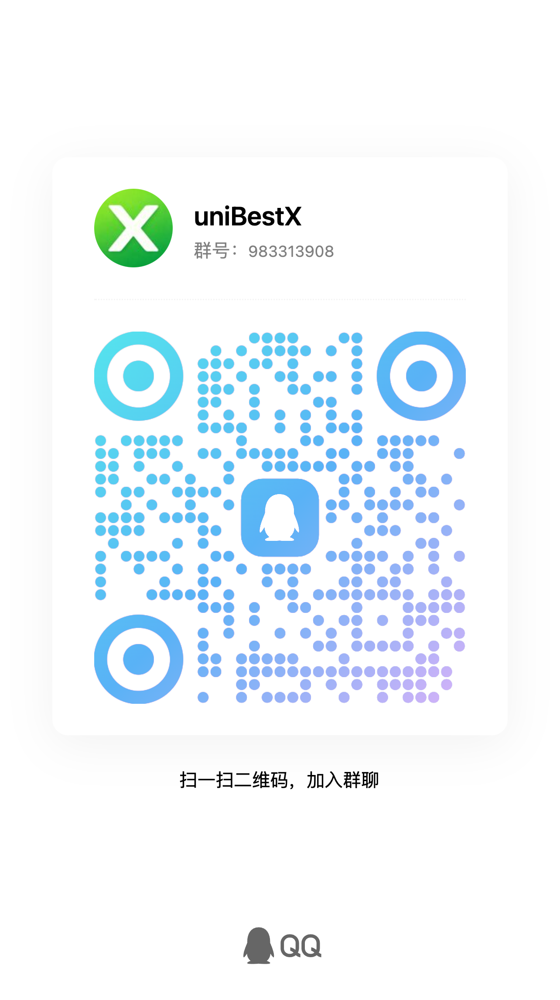

<p align="center">
  <a href="https://github.com/cq112233/unibestX">
    
  </a>
</p>

<h1 align="center">
  <a href="https://github.com/cq112233/unibestX" target="_blank">unibestX - 最好的 uni-app X 开发框架</a>
</h1>

<div align="center">

[](https://github.com/cq112233/unibestX)
[](https://github.com/cq112233/unibestX)


</div>

> 💡 **HBuilderX 版本建议与下载**
>
> - **默认 VDOM 模式**：使用 **HBuilderX 5.15 及之后版本** 均可稳定运行；
> - **若开启体验 Vapor 模式**：推荐使用 **HBuilderX 5.24 及以上版本**（可完整体验与使用无虚拟 DOM 高性能原生渲染）。
>
> 📥 **HBuilderX 5.15 下载地址**：[https://wwbsy.lanzoue.com/b01eupb32d](https://wwbsy.lanzoue.com/b01eupb32d) （密码：`4xdv`）

> ⚡ **渲染模式与 UI 组件库重要说明**
>
> 1. 🚀 **main 分支全面兼容 VDOM 模式与 Vapor 模式（默认 VDOM 模式）**：
>    - `main` 分支现已全面兼通 Vue3 传统 **VDOM 模式** 与 **Vapor 模式**（蒸汽模式，无虚拟 DOM 高性能原生渲染）；
>    - 默认采用 **VDOM 模式**，开发者可在 `manifest.json` 中按需自由切换/开启 Vapor 模式。
> 2. 📦 **关于 uview-ultra 组件库**：
>    - `main` 分支内置了深度修复版的 `uview-ultra`，已全面适配多端与 VDOM/Vapor 模式，常用基础功能**基本够用**；
>    - 因个人精力有限，作者后续将**不再对 uview-ultra 进行维护与定制更新**。
> 3. 🌟 **推荐分支：`uniX-rice-ui`（有团队持续维护）**：
>    - 如需长期维护、享受官方团队持续迭代更新的 UI 组件库，强烈推荐切换使用 **`uniX-rice-ui`** 分支（集成 Rice UI 官方支持，团队持续更新，完美支持 VDOM 与 Vapor 模式）。
>
> ```bash
> # 切换至 uniX-rice-ui 分支
> git checkout uniX-rice-ui
> ```

> ⚠️ **三方组件库与插件修改说明**
>
> 本项目内置的 **`z-paging-x`** 分页组件（如 [z-paging-x.uvue](file:///Users/chenqi/Documents/chenqi-front/unibestX/uni_modules/z-paging-x/components/z-paging-x/z-paging-x.uvue)）已由作者进行了**深度定制修改与修复**，专门用于兼容 `uni-app X` 各端平台（特别针对 Android 原生嵌套手势协商、`type="nested"` 架构支持以及各端 CSS 解析限制等进行了优化）。
> **提示**：请勿直接从官方插件市场重新下载覆盖。若从官方重新下载安装，可能会导致多端兼容性与手势机制失效，届时请务必重新测试与调试！

`unibestX` —— 最好的 `uni-app X` 开发模板，由 `uni-app X` + `Vue3` + `UTS` + `Vite5` + `UnoCSS` + `uview-ultra` + `z-paging-x` 构成，使用了下一代 uni-app 原生开发技术栈，通过 `HBuilderX` 运行 `Android`、`iOS`、`鸿蒙`、`H5` 和 `小程序` 等多端平台。

👉 **在线 H5 演示体验**：[https://cq112233.github.io/unibestX/](https://cq112233.github.io/unibestX/)

📱 **手机扫码体验**👇


📖 **官方文档地址**：[https://cq112233.github.io/unibestX/docs/](https://cq112233.github.io/unibestX/docs/)

🐙 **GitHub 仓库地址**：[https://github.com/cq112233/unibestX](https://github.com/cq112233/unibestX)

🍊 **Gitee 镜像仓库**：[https://gitee.com/htwoO-cq/uni-best-x](https://gitee.com/htwoO-cq/uni-best-x)

如果项目对您有帮助，请帮忙点个 **Star ⭐** 或 **赞 👍** 支持一下！您的鼓励是作者持续优化与维护的动力！

`unibestX` 内置了 `自定义 TabBar`、`Layout 布局`、`请求封装`、`请求拦截`、`登录拦截`、`路由守卫`、`UnoCSS`、`i18n 多语言`、`Pinia 状态管理`、`主题切换` 等基础功能，提供了 `代码提示`、`自动格式化`、`统一配置` 等辅助功能，让你编写 `uni-app X` 拥有 `best` 体验。


<p align="center">
  <a href="https://uniapp.dcloud.net.cn/uni-app-x/" target="_blank">📖 uni-app X 官方文档</a>
</p>

***

## 📦 推荐的 UI 组件库

`unibestX` 提供了多分支与多种 UI 组件库选择，你可以根据项目架构与需求灵活选用：

| 组件库 | 简介 | 推荐分支 / 官网地址 | 维护状态 |
| :--- | :--- | :--- | :--- |
| **Rice UI（强烈推荐）** | 专为 uni-app X 打造的现代 UI 组件库，**完美支持 Vapor 蒸汽模式与 VDOM 模式无缝切换**，由 Rice UI 官方团队持续维护与技术支持。 | **`uniX-rice-ui` 分支** / [https://riceui.cn/](https://riceui.cn/) | 团队持续维护与迭代 |
| **uview-ultra** | 专为 uni-app X 打造的 UI 库，本项目 main 分支内置了深度修复版，已全面兼容 Vapor/VDOM 模式，基础功能基本够用。 | **`main` 分支** / [https://uview-ultra.lingyun.net/](https://uview-ultra.lingyun.net/) | 已停止后续维护与定制 |
| **TMUI** | 功能丰富、高度可定制的企业级组件库，提供完善的业务组件和主题系统。 | [https://tmui.design/](https://tmui.design/) | 社区维护 |
| **Lime UI** | 社区活跃的 uni-app X 组件库，组件风格清新，覆盖常用移动端场景。 | [https://limex.qcoon.cn/](https://limex.qcoon.cn/) | 社区维护 |

> 💡 **选型与分支建议**：
>
> 1. **主分支（`main`）**：全面兼容 **VDOM 模式** 与 **Vapor 模式**（**默认开启 VDOM 模式**）。内置了作者深度修复的 `uview-ultra` 组件库，常用基础组件功能完备、**基本够用**。但由于个人精力有限，作者后续将**不再对其进行维护与后续定制**。
> 2. **`uniX-rice-ui` 分支（强烈推荐）**：集成了由 **Rice UI 官方团队持续维护** 的组件库，同样完美支持 VDOM 和 Vapor 模式。若有新项目或需要长期维护支持，强烈建议选用 **`uniX-rice-ui`** 分支。

## ✨ 特性

* 🚀 **uni-app X (VDOM & Vapor 全面兼容)** — 默认启用传统 VDOM 模式，同时完美兼容 Vapor 蒸汽模式（无虚拟 DOM 高性能原生渲染）自由切换
* 💪 **Vue3 + Vite5** — 最新前端技术栈，开发体验极佳
* 🎨 **UnoCSS** — 原子化 CSS 引擎，高效编写样式
* 📦 **uview-ultra** — 专为 uni-app X 打造的 UI 组件库（内置深度修复版，已全面兼容 VDOM 与 Vapor 模式，常用基础功能完备，基本够用；后续不再单独维护与定制）
* 📜 **z-paging-x** — 强大的分页列表组件（本项目已对 [z-paging-x.uvue](file:///Users/chenqi/Documents/chenqi-front/unibestX/uni_modules/z-paging-x/components/z-paging-x/z-paging-x.uvue) 底层 Android 嵌套手势协商、Flex 布局及 `type="nested"` 架构进行了深度兼容修改与适配）
* 🔧 **Pinia 持久化** — 状态管理 + 本地持久化，开箱即用
* 🌐 **i18n 多语言** — 内置中英文切换，支持自动检测系统语言
* 🛡️ **路由守卫** — 黑名单/白名单策略，灵活的登录拦截
* 🌈 **动态主题** — CSS 变量驱动的主题切换
* 📊 **ECharts** — 图表组件支持
* 📱 **自定义 TabBar** — 支持凸起按钮和角标
* 🔌 **请求封装** — 基于lime-request，支持多域名、Token 自动续期

## 平台兼容性

| Android | iOS | 鸿蒙 | H5 | 微信小程序 |
| ------- | --- | -- | -- | ----- |
| √ | √ | √ | √ | √ |

> 注意：uni-app X 目前兼容以上 5 个端平台。

## 📱 各端首页截图

<p align="center">
  
  
  
  
  
</p>

<p align="center">
  微信小程序 &nbsp;&nbsp;|&nbsp;&nbsp; Android &nbsp;&nbsp;|&nbsp;&nbsp; H5 &nbsp;&nbsp;|&nbsp;&nbsp; iOS &nbsp;&nbsp;|&nbsp;&nbsp; 鸿蒙
</p>

## ⚙️ 环境

* Node >= 22
* pnpm >= 7.30
* HBuilderX >= 5.15（默认 VDOM 模式下使用 5.15+ 即可；若需开启 Vapor 蒸汽模式推荐使用 **HBuilderX 5.24**）
* Vue Official >= 2.1.10
* TypeScript >= 5.0
* JDK >= 17（Android 平台）
* Android SDK（Android 平台）
* Xcode（iOS 平台，仅 macOS）
* DevEco Studio（鸿蒙平台）

## 📁 项目结构

```text
unibestX/
├── plugins/                  # Vite 构建插件
│   ├── uni-layouts-plugin.ts #   自动布局插件（仿 vite-plugin-uni-layouts）
│   └── root-plugin.ts        #   自动包裹 App.ku.uvue 根组件插件
├── src/
│   ├── api/                  # API 请求模块（foo.uts, user.uts, auth.uts 等）
│   ├── assets/               # 静态资源（图标、图片等）
│   ├── components/           # 公共业务组件
│   │   └── NavBar/           #   自定义通用导航栏组件（NavBar.uvue）
│   ├── http/                 # HTTP 客户端封装（基于 lime-request）
│   │   ├── request.uts       #   HttpClient 核心类与拦截器
│   │   ├── types.uts         #   HTTP 响应与请求类型定义
│   │   └── tools/enum.uts    #   HTTP 状态码与业务枚举
│   ├── i18n/                 # 国际化多语言
│   │   ├── index.uts         #   i18n 实例与响应式切换
│   │   └── locales/          #   中英文语言包（zh-Hans / en）
│   ├── layouts/              # 页面布局模板
│   │   └── default.uvue      #   默认根布局
│   ├── pages/                # 主包页面（TabBar 页面）
│   │   ├── index/            #   首页（概览、常用入口）
│   │   ├── basic/            #   基础组件与工具演示（Crypto、Lodash、HTTP、Dayuts 等）
│   │   ├── function/         #   原生能力展示（设备、系统信息、扫码等）
│   │   ├── ai/               #   AI 助手对话演示
│   │   └── me/               #   个人中心与系统设置
│   ├── router/               # 路由守卫与导航控制
│   │   ├── config.uts        #   页面登录白名单/黑名单策略
│   │   └── interceptor.uts   #   全局路由跳转拦截器
│   ├── store/                # Pinia 状态管理
│   │   ├── index.uts         #   Pinia 实例与本地持久化插件
│   │   ├── app.uts           #   应用全局状态（主题、语言等）
│   │   ├── token.uts         #   Token 鉴权状态（单/双 Token 自动续期）
│   │   └── user.uts          #   当前登录用户信息
│   ├── style/                # 全局样式（UnoCSS、变量等）
│   ├── sub/                  # 应用分包页面（按需加载）
│   │   ├── auth/             #   登录、注册、找回密码
│   │   ├── paging/           #   z-paging-x 分页列表各种场景演示
│   │   ├── test/             #   页面间参数传递测试
│   │   ├── uiTest/           #   UI 测试与排版页面
│   │   └── uview-ultra/      #   uview-ultra 组件库示例
│   ├── tabbar/               # 自定义 TabBar
│   │   ├── index.uvue        #   TabBar 底部容器
│   │   ├── TabbarItem.uvue   #   单个 Tab 项与角标
│   │   ├── config.uts        #   TabBar 图标与路由配置
│   │   ├── store.uts         #   TabBar 选中状态管理
│   │   └── types.uts         #   TabBar 类型定义
│   ├── types/                # 全局 TypeScript / UTS 类型定义
│   └── utils/                # 全局工具函数
│       ├── toast.uts         #   全局 Toast 轻提示
│       ├── systemInfo.uts    #   屏幕与系统信息获取
│       ├── backPress.uts     #   Android 物理返回键双击退出
│       ├── env.uts           #   多环境配置管理
│       ├── toLoginPage.uts   #   跳转登录页逻辑封装
│       └── i18n.uts          #   多语言辅助工具
├── uni_modules/              # uni-app 扩展插件模块
│   ├── unix-crypto/          #   全端跨平台加密解密库（AES/DES/RSA/MD5/SHA/HMAC/Base64/UUID）
│   ├── uview-ultra/          #   针对 uni-app X 深度优化适配的 UI 组件库
│   ├── z-paging-x/           #   针对 uni-app X 深度优化适配的分页组件
│   ├── iRainna-lodash/       #   UTS 版 Lodash 工具库
│   ├── lime-request/         #   HTTP 请求核心库
│   ├── lime-signature/       #   手写签名板组件
│   ├── e-chart/              #   ECharts 图表适配组件
│   └── ...                   #   其他官方/三方 uni_modules
├── js_sdk/                   # JS / UTS SDK 资源（a-hua-unocss 等）
├── docs/                     # VitePress 项目文档源码
├── App.ku.uvue               # 全局根包裹组件（动态主题注入、全局 Toast 容器）
├── main.uts                  # 应用主入口文件
├── pages.json                # 页面路由表、分包与 easycom 配置
├── manifest.json             # 应用配置清单（多端 AppID、权限、原生模块配置）
├── vite.config.ts            # Vite 构建配置（UnoCSS 规则与自定义插件）
├── uni.scss                  # 全局 SCSS 变量与主题注入
└── tsconfig.json             # TypeScript / UTS 编译配置文件
```

## 📂 快速开始

### 1. 克隆项目与分支选择

* **主分支（main，默认 VDOM 模式，全面兼通 VDOM & Vapor）**：
  > 内置深度修复与 VDOM/Vapor 兼容的 `uview-ultra`，基础功能完备基本够用（后续不再维护定制）。

  ```bash
  # GitHub
  git clone https://github.com/cq112233/unibestX.git
  cd unibestX

  # Gitee（国内加速推荐）
  git clone https://gitee.com/htwoO-cq/uni-best-x.git
  cd uni-best-x
  ```

* **Rice UI 官方支持分支（推荐，团队持续维护，`uniX-rice-ui`）**：
  > 集成由 Rice UI 官方团队持续维护的组件库，完美支持 Vapor & VDOM 模式自由切换，推荐新项目或需长期维护的项目选用。

  ```bash
  # 直接克隆 uniX-rice-ui 分支
  git clone -b uniX-rice-ui https://github.com/cq112233/unibestX.git
  cd unibestX

  # 或在已有项目中切换到 uniX-rice-ui 分支
  git checkout uniX-rice-ui
  ```

### 2. 安装依赖

在运行项目之前，请先在控制台执行以下命令安装项目所需的 Node 依赖：

```bash
pnpm install
```

### 3. 打开项目

使用 **HBuilderX** 打开项目根目录。

## 📦 运行（支持热更新）

通过 **HBuilderX** 启动运行：

* **Android 平台**：在 HBuilderX 中选择 `运行 → 运行到手机或模拟器`，选择目标设备即可。
* **iOS 平台**：在 HBuilderX 中选择 `运行 → 运行到手机或模拟器`，选择 iOS 设备（需 macOS + Xcode 环境）。
* **鸿蒙平台**：在 HBuilderX 中选择 `运行 → 运行到手机或模拟器`，选择鸿蒙设备（需 DevEco Studio 环境）。
* **H5 平台**：在 HBuilderX 中选择 `运行 → 运行到浏览器`。
* **微信小程序**：在 HBuilderX 中选择 `运行 → 运行到小程序模拟器 → 微信开发者工具`。

## 🔗 发布

* **Android 平台**：在 HBuilderX 中选择 `发行 → 原生App-云打包` 或 `原生App-本地打包`。
* **iOS 平台**：在 HBuilderX 中选择 `发行 → 原生App-云打包`（需 Apple 开发者证书）。
* **鸿蒙平台**：在 HBuilderX 中选择 `发行 → 原生App-鸿蒙`。
* **H5 平台**：在 HBuilderX 中选择 `发行 → 网站-H5手机版`，打包后的文件在 `dist/build/h5`。
* **微信小程序**：在 HBuilderX 中选择 `发行 → 小程序-微信`，然后通过微信开发者工具上传。

## 🧩 核心功能说明

### VDOM 模式与 Vapor 蒸汽模式切换

本项目 `main` 分支全面兼通 **VDOM 模式** 与 **Vapor 模式**，**默认开启 VDOM 模式**。

若需开启 **Vapor 蒸汽模式**（无虚拟 DOM 高性能原生渲染），可通过修改根目录下的 `manifest.json` 进行开启与配置：

```json
{
  "uni-app-x": {
    "styleIsolationVersion": "2",
    "vapor": true // false 为传统 VDOM 模式 (默认)；true 为 Vapor 蒸汽模式
  }
}
```

### 自定义 TabBar

内置自定义 TabBar 组件，支持：

* 5 个 Tab 项配置
* 中间凸起按钮（如 AI 入口）
* 角标显示
* 动态主题色

### 路由守卫

提供灵活的登录拦截策略：

* **黑名单模式**（默认）：仅指定页面需要登录
* **白名单模式**：除指定页面外，全部需要登录
* 支持登录后自动跳回原页面

### 请求封装

基于 `lime-request` 封装的 HTTP 客户端：

* 自动携带 Token
* 请求/响应拦截器
* 多域名支持
* 401 自动登出
* 支持忽略认证的请求

### 状态管理

基于 `x-pinia-s`（Pinia for uni-app X）：

* `AppStore` — 主题色、语言设置
* `TokenStore` — 支持单 Token 和双 Token（access + refresh）模式
* `UserStore` — 用户信息管理
* 内置持久化插件，自动同步到本地存储

### i18n 多语言

基于 `lime-i18n` 的国际化方案：

* 内置中文（zh-CN）和英文（en-US）
* 自动检测系统语言
* VSCode i18n-ally 插件支持
* 非 Vue 文件中也可使用翻译函数

### Layout 布局

通过自定义 Vite 插件实现：

* 自动为页面包裹 Layout 组件
* 支持页面级别 `<route>` 配置自定义布局
* 可通过 `layout: false` 禁用布局

## 🔧 技术栈详情

| 类别      | 技术                    | 说明                                     |
| ------- | --------------------- | -------------------------------------- |
| 框架      | uni-app X (VDOM / Vapor) | 下一代 uni-app，默认 VDOM 模式原生渲染，全面兼容 Vapor 蒸汽模式 |
| 语言      | UTS                   | uni-app Type Script，编译为原生 Kotlin/Swift |
| 前端框架    | Vue 3                 | Composition API                        |
| 构建工具    | Vite 5                | 极速开发体验                                 |
| CSS 引擎  | UnoCSS                | 原子化 CSS，自定义规则                          |
| UI 组件库  | uview-ultra           | uni-app X 专用 UI 库（内置深度修复版，全面兼容 VDOM/Vapor 模式，基础功能完备基本够用；后续不再维护定制） |
| 分页组件    | z-paging-x            | 强大的下拉刷新 + 分页加载                         |
| 状态管理    | x-pinia-s (Pinia)     | uni-app X 版 Pinia                      |
| HTTP 请求 | lime-request          | uni-app X 兼容请求库                        |
| 国际化     | lime-i18n             | vue-i18n 兼容方案                          |
| 图表      | e-chart               | ECharts for uni-app X                  |
| 图标      | uni-icons + lime-icon | 双图标方案                                  |

## ⚠️ UTS 开发注意事项

1. **文件扩展名**：使用 `.uts`（逻辑代码）和 `.uvue`（页面/组件），而非 `.ts` 和 `.vue`
2. **类型系统**：UTS 不支持 `undefined`，联合类型仅限 `null`；使用 `==` 而非 `===`
3. **CSS 限制**：部分 CSS 属性在原生平台不支持，具体参考 [uni-app X 文档](https://uniapp.dcloud.net.cn/uni-app-x/)
4. **API 限制**：原生平台不支持浏览器 API（如 `window`、`document`、`localStorage` 等）
5. **SCSS 变量**：支持 SCSS 变量，但动态覆盖需使用 CSS 变量方式

> \[!IMPORTANT]
> **安卓端语法最严**：Android 编译器的 UTS 类型与语法校验是所有平台中最严格的。一般如果 Android 端编译正常通过，其他平台（H5、微信小程序、iOS等）通常都不会有大问题。

## 🙏 参考

本项目参考自 [unibest](https://github.com/unibest-tech/unibest)，官网地址：<https://unibest.tech/>

## 📄 License

[MIT](https://opensource.org/license/mit/)

Copyright (c) 2026 HTwoO

## 💬 联系 & 交流

有项目、商务合作或遇到问题，可以随时加微信联系我，备注说明来意，微信号：`cq_81894`

👥 **QQ 技术交流群**：扫一扫下方二维码，或搜索群号 `983313908` 加入群聊！

<p align='center'>
  
</p>

## 请作者喝杯咖啡 ☕

如果你觉得这个项目好用，可以请作者喝杯咖啡 ☕

<p align='center'>

