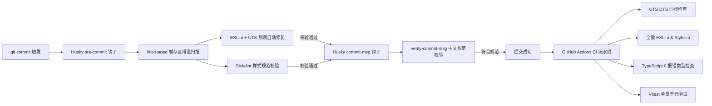

<p align="center">
  <a href="https://github.com/cq112233/unibestX">
    
  </a>
</p>

<h1 align="center">
  <a href="https://github.com/cq112233/unibestX" target="_blank">unibestX —— 最好的 uni-app X 开发模板</a>
</h1>

<div align="center">

[](https://github.com/cq112233/unibestX)
[](https://github.com/cq112233/unibestX)


[](https://vitest.dev/)
[](https://www.typescriptlang.org/)


</div>

`unibestX` 由 **`uni-app X` + `Vue3` + `UTS` + `Vite5` + `Tailwind CSS` + `z-paging-x`** 构成，采用下一代 uni-app 原生开发技术栈，通过 `HBuilderX` 一键运行到 **Android / iOS / 鸿蒙 / H5 / 微信小程序 / 支付宝小程序** 六大平台。

内置 `自定义 TabBar`、`Layout 布局`、`请求封装`、`登录拦截`、`路由守卫`、`Tailwind CSS`、`i18n 多语言`、`主题切换`、`沙盒极速调试` 等基础能力，并提供 `代码提示`、`自动格式化`、`统一配置` 等辅助功能，让你编写 `uni-app X` 拥有 `best` 体验。

🤖 **同时它也是一套「AI 原生」开发模板**：项目自带 **`unibestX-skill`**（「1 个入口 + 8 个分册」的 uni-app X / UTS 规范知识库），Claude Code、Codex 等 AI Agent 克隆即可直接按项目规范写代码、生成页面骨架、自动排查跨端编译报错；运行时亦内置 **AI 对话页**与 **SSE / Chunk 跨端流式传输**能力。详见 [🤖 AI 与 Skill 体系](#-ai-与-skill-体系)。

| 👉 在线 H5 演示 | 📖 官方文档 | 🐙 GitHub | 🍊 Gitee 镜像 |
| :---: | :---: | :---: | :---: |
| [cq112233.github.io/unibestX](https://cq112233.github.io/unibestX/) | [cq112233.github.io/unibestX/docs](https://cq112233.github.io/unibestX/docs/) | [cq112233/unibestX](https://github.com/cq112233/unibestX) | [htwoO-cq/uni-best-x](https://gitee.com/htwoO-cq/uni-best-x) |

<p align="center">
  
</p>

**🤖 Android 安装包真机体验（蓝奏云）**：

- **uniBestX-vdom.apk**（传统 VDOM 原生渲染）：[https://wwbsy.lanzoue.com/il6Aj483qv9c](https://wwbsy.lanzoue.com/il6Aj483qv9c)（密码：`bben`）
- **uniBestX-vapor.apk**（新一代 Vapor 蒸汽模式）：[https://wwbsy.lanzoue.com/iyC2T483qwnc](https://wwbsy.lanzoue.com/iyC2T483qwnc)（密码：`be02`）

如果项目对您有帮助，请帮忙点个 **Star ⭐** 支持一下！您的鼓励是作者持续维护的动力！

---

## 📖 目录

- [🚀 快速开始](#-快速开始)
- [⚙️ 环境要求](#️-环境要求)
- [✨ 特性](#-特性)
- [📦 推荐的 UI 组件库](#-推荐的-ui-组件库)
- [🤖 AI 与 Skill 体系](#-ai-与-skill-体系)
- [📱 各端首页截图](#-各端首页截图)
- [平台兼容性](#平台兼容性)
- [📁 项目结构](#-项目结构)
- [🧩 核心功能说明](#-核心功能说明)
  - [内置工具库（src/utils）](#内置工具库srcutils)
  - [环境变量配置（.env）](#环境变量配置env)
  - [页面路由与配置](#页面路由与配置-uni-pages)
  - [沙盒独立调试模式](#沙盒独立调试模式-page-sandbox)
  - [VDOM 与 Vapor 模式切换](#vdom-模式与-vapor-蒸汽模式切换)
  - [底部 TabBar 体系](#底部-tabbar-体系)
  - [主题切换（暗黑模式）](#主题切换暗黑模式)
  - [路由守卫](#路由守卫)
  - [请求封装](#请求封装)
  - [文件上传](#文件上传)
  - [状态管理](#状态管理)
  - [i18n 多语言](#i18n-多语言)
  - [Layout 布局](#layout-布局)
  - [H5 容器化部署 (Docker & Nginx)](#h5-容器化部署-docker--nginx)
  - [产物体积可视化分析 (Rollup Visualizer)](#产物体积可视化分析-rollup-visualizer)
  - [自动化单元测试体系 (Vitest · 组件与工具单测)](#自动化单元测试体系-vitest--组件与工具单测)
  - [代码规范、类型检查与 CI 流水线 (Husky · Stylelint · Commitlint · TypeCheck · Actions)](#代码规范类型检查与-ci-流水线-husky--stylelint--commitlint--typecheck--actions)
- [🗺️ 演进路线图](#️-演进路线图-roadmap)
- [🔧 技术栈详情](#-技术栈详情)
- [⚠️ UTS 开发注意事项](#️-uts-开发注意事项)
- [🙏 参考](#-参考)
- [📄 License](#-license)
- [💬 联系 & 交流](#-联系--交流)

## 🚀 快速开始

### 1. 创建 / 克隆项目

- **方式一：使用官方脚手架 `create-unibestx`（推荐）**：

  脚手架基于本仓库的分支生成项目，可**交互式引导**或**一行命令**完成创建：

  ```bash
  # 交互式创建（推荐），逐步选择 UI 库、功能特性与演示分包
  pnpm create unibestx my-app

  # 免安装直接运行
  npx create-unibestx my-app

  # 全局安装（提供 bestx / unibestx / create-unibestx 三个等价命令）
  npm i -g create-unibestx
  bestx my-app
  ```

  > 完整参数（`--ui` / `--features` / `--subs` / `--package-manager` / `--keep-unused-modules` 等）见 [create-unibestx 文档](https://www.npmjs.com/package/create-unibestx)。

- **方式二：通过 `degit` 快速创建（不含历史提交记录）**：

  ```bash
  # 主分支（main，默认 Vapor 蒸汽模式，全面兼通 VDOM & Vapor）
  npx degit cq112233/unibestX my-project

  # Rice UI 官方支持分支（强烈推荐，团队持续维护）
  npx degit cq112233/unibestX#uniX-rice-ui my-project
  ```

- **方式三：通过 `git clone` 克隆**：

  ```bash
  # GitHub
  git clone https://github.com/cq112233/unibestX.git
  cd unibestX

  # Gitee（国内加速推荐）
  git clone https://gitee.com/htwoO-cq/uni-best-x.git
  cd uni-best-x

  # 或克隆 Rice UI 官方支持分支（推荐）
  git clone -b uniX-rice-ui https://github.com/cq112233/unibestX.git
  ```

### 2. 填写 AppID（请自行申请）

> [!IMPORTANT]
> 项目内自带的 AppID 仅用于演示，**请自行申请并替换为你自己的**，否则无法真机运行、云打包与上传小程序。

| 平台 | 申请入口 | 填写位置 |
| :--- | :--- | :--- |
| App（Android / iOS / 鸿蒙） | [DCloud 开发者中心](https://dev.dcloud.net.cn/) → 创建应用，获取 `__UNI__` 开头的 AppID | [manifest.json](manifest.json) 的顶层 `appid` |
| 微信小程序 | [微信公众平台](https://mp.weixin.qq.com/) → 注册小程序，获取 `wx` 开头的 AppID | [manifest.json](manifest.json) 的 `mp-weixin.appid` |

- 用 HBuilderX 打开项目后，双击 `manifest.json` 可视化界面也可直接填写，App 端点击「重新获取」可自动申请一个新的 DCloud AppID。
- 微信小程序还需在微信公众平台后台配置 **request 合法域名**（对应 `.env` 的 `VITE_SERVER_BASEURL`）后才能正常请求接口。

### 3. 安装依赖

```bash
pnpm install
```

> 方式一的脚手架在生成时会询问「是否立即安装依赖」，已选择安装的项目可跳过本步。

### 4. 运行项目（支持热更新）

支持 **命令行 CLI** 与 **HBuilderX 图形界面** 两种开发方式。

> [!WARNING]
> **使用 CLI 命令前，必须先启动 HBuilderX**（需 **5.24 及以上**）。CLI 命令本质是通过正在运行的 HBuilderX 来编译运行项目，未打开时会报「未找到 HBuilderX」。App 端（Android / iOS / 鸿蒙）编译只能由 HBuilderX 完成。

#### 🖥️ 方式一：命令行 CLI

```bash
pnpm dev:web            # 运行到 H5 / Web 端
pnpm dev:app-android    # 运行到 Android 原生端
pnpm dev:app-ios        # 运行到 iOS 模拟器（需 macOS + Xcode）
pnpm dev:app-ios:device # 运行到 iOS 真机（需连接 iPhone 并信任此电脑）
pnpm dev:app-harmony    # 运行到鸿蒙原生端（需 DevEco Studio）
pnpm dev:mp-weixin      # 运行到微信小程序
pnpm dev:mp-alipay      # 运行到支付宝小程序
```

#### 🛠️ 方式二：HBuilderX 图形化

用 HBuilderX 打开项目根目录，在顶部菜单选择：

| 平台 | 操作路径 |
| :--- | :--- |
| Android / iOS / 鸿蒙 | `运行 → 运行到手机或模拟器`，选择已连接的设备 |
| H5 | `运行 → 运行到浏览器` |
| 微信小程序 | `运行 → 运行到小程序模拟器 → 微信开发者工具` |
| 支付宝小程序 | `运行 → 运行到小程序模拟器 → 支付宝小程序开发者工具` |

### 5. 打包与发布

#### 🖥️ H5：在自己服务器 / CI 上打包（推荐）

> H5 支持在**自己的服务器 / CI 上打包**，脚本调用 HBuilderX 官方 CLI（`cli publish`）完成构建，产物完整（包含 `src/sub` 分包页面）。
> ⚠️ 纯 CLI 的 `uni build` 产物**不完整**（分包页面不会编译进去），请勿使用。

```bash
# 1. 切换打包环境（默认生产环境，打测试包才需要切换）
pnpm env:test    # 打测试包：生成 .env.production.local（不影响 git）
pnpm env:prod    # 恢复生产环境：删除 .env.production.local

# 2. 打包 H5，产物输出到 unpackage/dist/build/web
pnpm build:h5

# 或一步到位
pnpm build:test  # = env:test + build:h5
pnpm build:prod  # = env:prod + build:h5
```

**环境文件（四件套）：**

| 文件 | 用途 |
| :--- | :--- |
| `.env` | 公用变量，所有环境都会加载 |
| `.env.development` | 开发环境，HBuilderX 运行 / `pnpm dev:*` 自动加载 |
| `.env.test` | 测试环境，`pnpm env:test` 后打测试包 |
| `.env.production` | 生产环境，默认即此环境，打正式包无需切换 |

> 💡 `pnpm env:test` 会把「公用 + 测试」合并写入 `.env.production.local`（Vite 生产模式优先加载它），`pnpm env:prod` 删除它即恢复生产。四个 env 文件本身不会被动修改。

**接口地址（`VITE_SERVER_BASEURL`）各端规则：**

- **H5**：通过 `.env` 的 `VITE_H5_USE_PROXY` 切换——`true` 走反向代理（请求 `/api`，开发配 `vite.config.ts` 的 `server.proxy`，生产配 `deploy/nginx.conf`）；`false` 直连 `VITE_SERVER_BASEURL` 完整域名（默认）。切换只改配置，不用动代码。
- **微信小程序 / App（蒸汽与 VDOM 模式）**：统一读取 `VITE_SERVER_BASEURL`，固定直连完整域名；若误配 `/api` 相对路径会自动回退为默认完整域名。
- **微信小程序**：需在微信公众平台后台配置 request 合法域名。

**服务器要求：**

- 安装 HBuilderX 官方 **Linux 版**（常见安装目录 `/opt/hbuilderx/HBuilderX`，命令行工具为 `cli`），或设置环境变量指定路径：`export HBUILDERX_CLI_PATH=/opt/hbuilderx/HBuilderX/cli`。
- macOS / Windows 本机打包同样支持，脚本会自动查找常见安装路径（macOS 为 `/Applications/HBuilderX.app/Contents/MacOS/cli`）。
- 脚本在构建前后会自动备份并还原 `pages.json`，不会污染工作区。

> [!WARNING]
> **App 端（Android / iOS / 鸿蒙）与小程序发布仍需使用 HBuilderX**：原生 App 云打包 / 小程序上传依赖 HBuilderX 发行能力，命令行仅支持 H5。

#### 🐳 H5：Docker 容器化部署（轻量交付，秒级打包）

项目提供业界标准的 **「宿主机构建 + Nginx:alpine 极简容器」** 部署方案（镜像仅约 25MB，打包仅需 1~2 秒，原生支持 amd64 与 arm64）：

```bash
# 1. 测试环境：一键切换环境 -> H5 编译 -> 构建 Docker 镜像 -> 启动容器（访问 http://localhost:8081）
pnpm docker:build:test
pnpm docker:up:test

# 2. 生产环境：一键切换环境 -> H5 编译 -> 构建 Docker 镜像 -> 启动容器（访问 http://localhost:8080）
pnpm docker:build:prod
pnpm docker:up:prod

# 3. 停止容器
pnpm docker:down
```

- **动态反代与环境变量**：在 `deploy/.env.test` 与 `deploy/.env.prod` 中可直接配置映射端口与 `API_UPSTREAM` 动态代理后端地址，修改后执行 `pnpm docker:up:*` 即刻生效，无需重新构建镜像。
- **详尽操作手册**：详见 [docs/guide/docker-deploy.md](docs/guide/docker-deploy.md)。

#### 🛠️ HBuilderX 发行打包

| 平台 | 操作路径 |
| :--- | :--- |
| Android | `发行 → 原生App-云打包` 或 `原生App-本地打包` |
| iOS | `发行 → 原生App-云打包`（需 Apple 开发者证书） |
| 鸿蒙 | `发行 → 原生App-鸿蒙` |
| H5 | `发行 → 网站-H5手机版`，产物在 `unpackage/dist/build/web` |
| 微信小程序 | `发行 → 小程序-微信`，再通过微信开发者工具上传 |
| 支付宝小程序 | `发行 → 小程序-支付宝`，再通过支付宝小程序开发者工具上传 |

#### 其他常用脚本

```bash
pnpm test           # Vitest 自动化单元测试（含 UVUE / Vue 组件与核心工具库）
pnpm test:watch     # Vitest 交互式监听测试模式
pnpm typecheck      # TypeScript 严格类型检查（tsc --noEmit，0 报错门禁）
pnpm analyze        # 构建产物体积分析报告并自动在浏览器打开（stats.html）
pnpm lint           # ESLint 检查（含 UTS 强类型与 UVUE 模板规则）
pnpm lint:fix       # ESLint 自动修复
pnpm lint:style     # Stylelint 样式检查（支持 SCSS / CSS / UVUE <style>）
pnpm lint:style:fix # Stylelint 样式自动修复
pnpm lint:all       # 全量代码与样式校验（ESLint + Stylelint）
pnpm docs:dev       # 本地启动 VitePress 文档站
pnpm gen:uts-dts    # 生成 UTS 类型声明（.d.uts.ts）
pnpm check:uts-dts  # 校验 UTS 类型声明是否为最新（CI 用）
```

## ⚙️ 环境要求

| 依赖 | 版本要求 |
| :--- | :--- |
| Node | `^22.22.2`（或 `^24.15.0`、`>=26.0.0`） |
| pnpm | >= 7.30 |
| HBuilderX | **5.24 及以上**（Android 蒸汽模式需 >= 5.21，iOS 需 >= 5.11；支付宝小程序需 >= 5.31） |
| Vue Official | >= 2.1.10 |
| TypeScript | >= 5.0 |
| JDK | >= 17（Android 平台） |
| Android SDK | 最低 Android 6.0+ |
| Xcode | 最低 iOS 15+（仅 macOS） |
| DevEco Studio | 鸿蒙平台（最低 API 20+，即鸿蒙 6.0+） |

---

## ✨ 特性

- 🚀 **uni-app X（Vapor 默认 + VDOM 兼容）** — 默认启用 **Vapor 蒸汽模式**（无虚拟 DOM 高性能原生渲染），同时全面兼容传统 VDOM 模式，可在 `manifest.json` 自由切换
- 💪 **Vue3 + Vite5** — 最新前端技术栈，极速开发体验
- 🎨 **Tailwind CSS** — 原子化 CSS 引擎（v4 + weapp-tailwindcss），全端通用，方括号任意值语法
- 📦 **多分支 UI 选型** — `main` 分支为**无 UI 库纯净基线**（原生组件 + Tailwind CSS）；另有 `uniX-rice-ui`（Rice UI，官方团队持续维护）与 `uniX-uview-ultra`（内置深度修复版）两个开箱即用分支
- 📜 **z-paging-x** — 强大的分页列表组件（已针对 Android 嵌套手势协商、Flex 布局与 `type="nested"` 深度适配）
- 🏝️ **多策略 TabBar 体系** — 5 种运行策略 + 2 种视觉形态，支持角标徽标与全端主题联动
- ⚡ **沙盒独立调试模式** — 大型项目本地开发只编译当前页面，秒级热更新，启动直达目标页
- 🔧 **Pinia 持久化** — Vapor 走官方 Pinia，VDOM 走 `x-pinia-s`，按平台自动路由，开箱即用
- 🌐 **i18n 多语言** — 内置中英文切换，支持自动检测系统语言
- 🛡️ **路由守卫** — 黑名单／白名单策略，灵活的登录拦截与登录后回跳
- 🌈 **动态主题** — `theme.json` 单源色板，CSS 变量驱动的明暗主题切换
- 📊 **ECharts** — 图表组件支持
- 🔌 **请求封装** — 基于 `lime-request`，支持多域名、Token 自动续期、SSE 流式传输
- 📤 **文件上传** — 基于原生 `uni.uploadFile` 统一封装，支持 OSS 上传与进度回调
- 🐳 **H5 Docker 极速部署** — 宿主机构建 + Nginx:alpine 轻量容器运行（~25MB，秒级打包），内置动态环境变量反代与 Hash 路由兜底
- 🧪 **完整单元测试体系** — 内置 **Vitest + @vue/test-utils + happy-dom**，原生支持 UTS 核心工具类、自定义构建插件与 `.uvue` 页面组件挂载测试，单测 100% 覆盖核心逻辑
- 📊 **产物体积可视化分析** — 整合 **rollup-plugin-visualizer**，`pnpm analyze` 一键生成交互式 Treemap 产物分析报告，支持 Gzip / Brotli 压缩体积真实对比
- 🛡️ **严格类型检查 (TypeCheck)** — `pnpm typecheck` 一键运行 `tsc --noEmit`，0 报错门禁，杜绝类型隐式推导退化与插件配置类型漂移
- 🤖 **AI 原生开发模板** — 内置 `unibestX-skill`（1 入口 + 8 分册），AI Agent 克隆即可按项目规范写代码；运行时自带 AI 对话页与 SSE 流式传输
- 🔍 **工程化代码规范、Git 拦截与 CI 流水线** — 深度整合 **ESLint**（内置针对 UTS 强类型与 UVUE 模板的自定义规则）、**Stylelint**（针对 SCSS、uni-app 特有单位与标签适配）、**Husky**、**lint-staged**、**Commitlint** 以及 **GitHub Actions CI**，把跨端隐患拦截在本地提交与代码合并前
- 🧰 **官方脚手架** — `pnpm create unibestx` 一键创建项目：UI 库三选一、功能与 12 个演示分包按需裁剪，生成后自动跑四查自检

## 📦 推荐的 UI 组件库

`unibestX` 提供多分支与多种 UI 组件库选择，可根据项目架构与需求灵活选用：

| 组件库 | 简介 | 推荐分支 / 官网 | 维护状态 |
| :--- | :--- | :--- | :--- |
| **Rice UI**（强烈推荐） | 专为 uni-app X 打造的现代 UI 组件库，**完美支持 Vapor 与 VDOM 模式无缝切换**，由 Rice UI 官方团队持续维护与技术支持。 | **`uniX-rice-ui` 分支** / [riceui.cn](https://riceui.cn/) | 团队持续维护与迭代 |
| **uview-ultra** | 专为 uni-app X 打造的 UI 库，`uniX-uview-ultra` 分支内置作者深度修复版，已兼容 Vapor/VDOM，基础功能基本够用。 | **`uniX-uview-ultra` 分支** / [uview-ultra.lingyun.net](https://uview-ultra.lingyun.net/) | 已停止后续维护与定制 |
| **TMUI** | 功能丰富、高度可定制的企业级组件库，提供完善的业务组件和主题系统。 | [tmui.design](https://tmui.design/) | 社区维护 |
| **Lime UI** | 社区活跃的 uni-app X 组件库，组件风格清新，覆盖常用移动端场景。 | [limex.qcoon.cn](https://limex.qcoon.cn/) | 社区维护 |

> 💡 **选型建议**：新项目或需要长期维护支持，优先选 **`uniX-rice-ui`** 分支；只需基础组件可切 **`uniX-uview-ultra`** 分支（内置作者深度修复版）；**不想引入任何第三方 UI 组件库**就直接用 **`main`（默认分支）** —— 它是无 UI 库的纯净基线，原生组件 + Tailwind CSS 起步。

## 🤖 AI 与 Skill 体系

`unibestX` 不只是一个运行时的跨端模板，也是一套**为 AI Agent 准备充分**的开发模板：项目内直接内置了 uni-app X 领域知识库（`unibestX-skill`）与会话级开发规约，让 Claude Code、Codex 等 AI 工具**克隆后无需额外提示词，即可按项目既定规范产出代码**。

### 1. `unibestX-skill` — 项目专属 uni-app X / UTS 规范库

这是与项目强绑定的核心技能，也是仓库中**唯一保留的技能**，采用 **「1 个入口 + 8 个分册」** 结构，把 UTS 强类型约束、跨端样式限制与本项目的生产级写法沉淀成可被 AI 直接检索的知识库。

| 分册 | 内容 |
| :--- | :--- |
| `SKILL.md`（入口，常驻） | 概述 + 分册导航 + A.1 快速对照表 + A.2 红线清单 |
| `1-uts-syntax.md` | UTS 强类型系统与语法核心铁律（`UTS110111163` 等报错成因） |
| `2-styling.md` | CSS & Tailwind 样式引擎与原生渲染限制 |
| `3-runtime.md` | 跨端运行时与 VDOM / Vapor 渲染模式约束 |
| `4-examples.md` | 5 个项目内生产级标杆案例（页面骨架、TabBar、二级详情页、滚动与下拉刷新） |
| `5-codegen.md` | 代码生成流程与标准页面模板 |
| `6-page-component-spec.md` | AI 页面层级与组件设计规范（页面高内聚、三级防过度拆分、容器与纯展示解耦、Mock 接口契约化） |
| `7-api-spec.md` | API 接口层规范（一页一目录、契约类型用 `type`、Mock 数据集与接口函数同层、后端就绪只换函数体） |
| `8-utils-spec.md` | 项目核心工具库使用规范（系统信息 `src/utils/systemInfo`、环境变量 `src/utils/env`、通用工具优先原则） |

**工作机制**：入口文件只常驻导航与红线清单，AI 命中条目后**必须继续读取对应分册**核对完整正反例才允许改代码。

### 2. 任务复杂度分级与门槛控制

在开发过程中，根据 [CLAUDE.md](CLAUDE.md) 与 [AGENTS.md](AGENTS.md) 严格匹配任务复杂度，避免过度设计与流程冗长，按层级匹配执行方案：

| 复杂度 | 典型场景 | 做法 |
| :--- | :--- | :--- |
| 第 1 级 | 单行修改、CSS 样式、文案、简单配置 | 主代理直接改 + 轻量验证，不派生代理、不建 worktree、不写单测 |
| 第 2 级 | 单文件开发、独立 UI 页面、常规 Bug 修复 | 主代理直做；Bug 成因不明时先定位根因再改 |
| 第 3 级 | 跨多文件重构、核心业务系统升级 | 先澄清需求 / 写计划文档，再分步实现 |

**不因任务大小豁免的底线**：声称完成 / 已修复 / 测试通过之前，必须实际运行验证命令并确认输出。

### 3. AI 开发规约文件

| 文件 | 作用 |
| :--- | :--- |
| [CLAUDE.md](CLAUDE.md) | Claude Code 会话级规约（技能路由、内置工具优先复用、基础设施按既有配置走） |
| [AGENTS.md](AGENTS.md) | 通用 AI Agent 规约（Codex 等） |
| [.agents/rules/uniappx.md](.agents/rules/uniappx.md) | uni-app X 开发规范，编写 `.uvue` / `.uts` / `.ts` / `.scss` 前必读 |

> 📌 技能目录有两份副本：`.claude/skills/`（Claude Code）与 `.agents/skills/`（其他 Agent），修改技能时需同步一致。

### 4. 运行时的 AI 能力

模板同时预置了 AI 应用所需的运行时能力，可直接作为 AI 类 App 的起点：

- **AI 对话页** — `src/pages/ai/`（含 TabBar 中间鼓包按钮入口 `AiView`）
- **跨端流式传输** — [src/http/stream.uts](src/http/stream.uts) 提供 SSE / Chunk 流式请求；[src/utils/rxjs-lite/](src/utils/rxjs-lite/) 提供轻量流式算子，配套 `src/sub/rxjsDemo` 流式演示页
- **Markdown 渲染** — 内置 `mp-html` 与 `kux-marked`，支持 Markdown 排版与代码块展示
- **流式接口配置** — 通过 `.env` 的 `VITE_STREAM_URL` 指定（留空时演示页自动使用本地模拟流）

## 📱 各端首页截图

<p align="center">
  
  
  
  
  
  
</p>

<p align="center">
  微信小程序 &nbsp;&nbsp;|&nbsp;&nbsp; 支付宝小程序 &nbsp;&nbsp;|&nbsp;&nbsp; Android &nbsp;&nbsp;|&nbsp;&nbsp; H5 &nbsp;&nbsp;|&nbsp;&nbsp; iOS &nbsp;&nbsp;|&nbsp;&nbsp; 鸿蒙
</p>

## 平台兼容性

| Android | iOS | 鸿蒙 (HarmonyOS) | H5 | 微信小程序 | 支付宝小程序 |
| :---: | :---: | :---: | :---: | :---: | :---: |
| √ | √ | √ | √ | √ | √ |
| **>= 5.21**<br>(蒸汽模式起) | **>= 5.11**<br>(蒸汽模式起) | **>= 5.0** | **>= 4.0** | **>= 4.0** | **>= 5.31** |

> 💡 **支持的 HBuilderX 版本与系统最低要求说明**：
>
> - **Android 端**：**HBuilderX 5.21+** 支持（蒸汽模式起），最低系统要求为 **Android 6.0+**；
> - **iOS 端**：**HBuilderX 5.11+** 支持（蒸汽模式起），最低系统要求为 **iOS 15+**；
> - **鸿蒙 (HarmonyOS)**：**HBuilderX 5.0+** 支持，最低 API 要求为 **20+（即鸿蒙 6.0+）**；
> - **支付宝小程序**：需 **HBuilderX 5.31 及以上**；
> - **H5 / 微信小程序**：从 **HBuilderX 4.0 起** 全面支持。

## 📁 项目结构

```text
unibestX/
├── plugins/                      # Vite 构建插件
│   ├── vite-plugin-uni-pages.ts  #   自动文件路由插件（生成 pages.json / definePage 支持）
│   ├── uni-layouts-plugin.ts     #   跨端 Layout 布局插件（default / empty / navbar）
│   ├── vite-plugin-tabbar-views.ts # 单页 TabBar 脚手架与视图自动生成插件
│   ├── vite-plugin-clean-logger.ts # 过滤编译期控制台噪音日志
│   ├── vite-plugin-tailwind-hmr.ts # Tailwind 入口 CSS 变更的热更新加速
│   └── root-plugin.ts            #   自动包裹 App.ku.uvue 全局根骨架组件
├── scripts/                      # 构建与环境切换脚本
│   ├── build-h5.mjs              #   H5 打包（调用 HBuilderX cli publish）
│   ├── switch-env.mjs            #   env:test / env:prod 环境切换
│   ├── gen-uts-dts.mjs           #   UTS 类型声明生成与校验
│   ├── check-tabbar-surface.mjs  #   TabBar 接口面校验
│   └── router-guard-test/        #   路由守卫决策矩阵测试（node 直跑，无需测试框架）
├── tests/                        # 自动化测试目录（Vitest）
│   ├── setup.ts                  #   测试全局初始化（uni 跨端 API 桩与 Vue 运行时注入）
│   └── unit/                     #   单元测试套件
│       ├── components/           #     NavBar 等 UVue 组件挂载与交互断言
│       ├── utils/                #     route、rxjs-lite 等核心工具库单测
│       └── plugins/              #     ESLint 专属规则与 clean-logger 插件单测
├── .github/                      # GitHub 自动化工作流
│   └── workflows/ci.yml          #   CI 流水线（Lint / Style / DTS / TypeCheck / Test）
├── .husky/                       # Git 提交钩子（pre-commit / commit-msg）
├── .commitlintrc.cjs             # Commitlint 提交信息规范配置
├── stylelint.config.mjs          # Stylelint 样式规范配置（支持 SCSS / UVUE）
├── eslint.config.mjs             # ESLint 扁平化配置（含 UTS 专属规则插件）
├── vitest.config.ts              # Vitest 配置文件（UVue 预转译与组件测试支持）
├── Dockerfile                    # H5 生产部署轻量容器（nginx:alpine）
├── docker-compose.yml            # H5 容器编排服务（h5-test / h5-prod）
├── deploy/                       # 生产与测试部署配置
│   ├── nginx.conf                #   Nginx 动态反代与静态托管配置
│   ├── .env.test                 #   测试环境 Docker 变量配置
│   └── .env.prod                 #   生产环境 Docker 变量配置
├── docs/                         # VitePress 文档站源码（guide/ 下为各专题）
├── .claude/skills/               # AI 技能（Claude Code）：仅 unibestX-skill（1 入口 + 8 分册）
├── .agents/                      # AI 技能与规约（其他 Agent）
│   ├── skills/                   #   与 .claude/skills 一一对应的技能副本（仅 unibestX-skill），需保持同步
│   └── rules/uniappx.md          #   uni-app X 开发规范（编写 .uvue/.uts 前必读）
├── CLAUDE.md / AGENTS.md         # AI Agent 会话级规约（技能路由、内置工具优先复用等）
├── src/
│   ├── api/                      # API 请求模块（foo.uts / user.uts / auth.uts 等）
│   ├── assets/                   # 静态资源（图标、图片等）
│   ├── components/               # 公共业务组件
│   │   ├── NavBar/               #   自定义通用导航栏组件
│   │   ├── NestedScroll/         #   自研嵌套滚动组件
│   │   └── TabbarMaskModal/      #   TabBar 遮罩弹层
│   ├── http/                     # HTTP 客户端封装（基于 lime-request）
│   │   ├── request.uts           #   HttpClient 核心类与拦截器
│   │   ├── stream.uts            #   SSE / Chunk 流式请求封装
│   │   ├── types.uts             #   HTTP 响应与请求类型定义
│   │   └── tools/enum.uts        #   HTTP 状态码与业务枚举
│   ├── i18n/                     # 国际化多语言
│   │   ├── index.uts             #   i18n 实例与响应式切换
│   │   └── locales/              #   中英文语言包（zh-Hans / en）
│   ├── layouts/                  # 页面布局模板
│   │   ├── default.uvue          #   默认页面布局
│   │   ├── empty.uvue            #   空白全屏布局
│   │   └── navbar.uvue           #   自定义导航栏布局（需配 navigationStyle: 'custom'）
│   ├── pages/                    # 主包页面（TabBar 页面）
│   │   ├── index/                #   首页（概览、常用入口）
│   │   ├── basic/                #   基础组件与工具演示
│   │   ├── function/             #   原生能力展示（设备、系统信息、扫码等）
│   │   ├── ai/                   #   AI 助手对话演示
│   │   └── me/                   #   个人中心与系统设置
│   ├── router/                   # 路由守卫与导航控制
│   │   ├── index.uts             #   路由模块统一出口
│   │   ├── config.uts            #   页面登录白名单 / 黑名单策略
│   │   ├── interceptor.uts       #   全局路由跳转拦截器
│   │   └── toLoginPage.uts       #   跳转登录页逻辑封装
│   ├── store/                    # 状态管理（双模式自适应）
│   │   ├── index.uts             #   门面：按平台条件编译路由到 vapor / vdom
│   │   ├── types.uts             #   共享类型（与平台无关，恒定向外转发）
│   │   ├── types.d.uts.ts        #   类型声明
│   │   ├── vapor/                #   官方 Pinia 实现（App Vapor / H5 / Web / 小程序）
│   │   │   ├── index.ts          #     Pinia 实例 + pinia-plugin-persistedstate
│   │   │   ├── app.ts            #     应用全局状态（主题、语言等）
│   │   │   ├── token.ts          #     Token 鉴权状态（单 / 双 Token 自动续期）
│   │   │   └── user.ts           #     当前登录用户信息
│   │   └── vdom/                 #   x-pinia-s 实现（App VDOM 原生端）
│   │       ├── index.uts         #     Pinia 实例（UTS 强类型版）
│   │       ├── app.uts / token.uts / user.uts
│   ├── style/                    # 全局样式（Tailwind、变量等）
│   ├── sub/                      # 应用分包页面（按需加载，13 个演示模块）
│   │   ├── auth/                 #   登录、注册、找回密码
│   │   ├── crypto/               #   加密解密演示
│   │   ├── device/               #   原生设备能力
│   │   ├── httpDemo/             #   HTTP 请求演示
│   │   ├── layoutDemo/           #   Layout 布局示例
│   │   ├── lodash/               #   UTS 版 Lodash
│   │   ├── nested-scroll/        #   自研嵌套滚动
│   │   ├── rxjsDemo/             #   rxjs 流式演示
│   │   ├── tailwindcss/          #   weapp-tailwindcss 示例
│   │   ├── test/                 #   页面间 URL 参数传递测试
│   │   ├── time/                 #   时间日期操作
│   │   ├── uiTest/               #   UI 测试与排版
│   │   └── zpaging/              #   z-paging-x 分页列表各种场景
│   ├── layouts/                  # 全局页面布局容器
│   │   ├── default/              #   默认通用布局 (default.uvue)
│   │   ├── navbar/               #   自定义导航栏布局 (navbar.uvue)
│   │   │   └── utils/            #     下拉刷新与滚动联动控制器 (index.uts)
│   │   └── empty/                #   空白纯净布局 (empty.uvue)
│   ├── router/                   # 路由与全局拦截体系（模块化架构）
│   │   ├── config/               #   登录白/黑名单策略配置
│   │   ├── interceptor/          #   全局路由跳转拦截守卫
│   │   ├── toLoginPage/          #   登录页重定向防抖控制
│   │   ├── utils/                #   路径规范化与 URL 解析工具
│   │   └── index.uts             #   统一门面入口
│   ├── tabbar/                   # 底部 TabBar 体系
│   │   ├── internal/             #   模块内部实现（不对消费者暴露，请走 index.uts 门面）
│   │   │   ├── strategy.uts      #     策略枚举与模式判定
│   │   │   ├── metrics.uts       #     尺寸常量与视口 / 主题计算
│   │   │   ├── state.uts         #     列表与激活状态、路径匹配、激活订阅
│   │   │   ├── navigate.uts      #     跳转行为与原生中间按钮监听
│   │   │   └── native.uts        #     平台桥接（隐藏原生 tabbar）
│   │   ├── ui/                   #   TabBar 视图层
│   │   │   ├── capsule/          #     悬浮胶囊风格
│   │   │   ├── default/          #     标准贴底风格（含 midButton 鼓包）
│   │   │   └── template.uvue     #     TabBar 视图模板
│   │   ├── components/           #   容器与调度组件（TabViews、TabContent）
│   │   ├── tabbar.uvue           #   TabBar 入口组件
│   │   ├── index.uts             #   模块唯一门面（单层 export *）
│   │   ├── config.uts            #   TabBar 统一配置（支持 type 风格切换与 midButton）
│   │   └── types.uts             #   TabBar 强类型定义
│   ├── types/                    # 全局 TypeScript / UTS 类型定义
│   │   └── uni.d.ts              #   definePage 宏、Vue 宏与全局 API 类型补全
│   └── utils/                    # 全局工具函数（统一走 index.uts 导出的对象或纯函数）
│       ├── env/                  #   环境变量读取（getApiBaseUrl / getTabBarMode 等）
│       ├── systemInfo/           #   屏幕、安全区与系统信息
│       ├── theme/                #   主题色与明暗模式工具
│       ├── toast/                #   全局 Toast 轻提示（5 个轻量纯函数）
│       ├── report/               #   数据埋点与异常监控上报（track / error）
│       ├── i18n/                 #   多语言辅助工具（t / $t）
│       ├── backPress/            #   Android 物理返回键双击退出
│       └── rxjs-lite/            #   轻量流式处理工具
├── uni_modules/                  # uni-app 扩展插件模块（精简收敛为 16 个核心插件）
│   ├── z-paging-x/               #   深度优化适配的分页组件
│   ├── unix-crypto/              #   跨端加密解密库（AES/DES/RSA/MD5/SHA/HMAC/Base64/UUID）
│   ├── x-pinia-s/                #   UTS 版 Pinia（VDOM 模式使用）
│   ├── iRainna-lodash/           #   UTS 版 Lodash 工具库
│   ├── lime-request/             #   HTTP 请求核心库
│   ├── lime-i18n/                #   国际化核心库
│   ├── lime-signature/           #   手写签名板组件
│   ├── e-chart/                  #   ECharts 图表适配组件
│   └── ...                       #   其他核心支持库（lime-icon、mp-html、kux-marked、uni-icons 等）
├── js_sdk/                       # JS / UTS SDK 资源
├── App.ku.uvue                   # 全局根包裹组件（动态主题注入、全局 Toast 容器）
├── main.uts                      # 应用主入口文件
├── main.css                      # Tailwind 入口样式（含 iconify）
├── theme.json                    # ⭐ 明暗主题色板唯一真源（light / dark）
├── pages.config.json             # ⭐ 页面路由与全局配置（路由与页面配置请改这里）
├── pages.json                    # ⚠️ 自动生成的页面路由表（编译产物，请勿手动编辑）
├── manifest.json                 # 应用配置清单（多端 AppID、权限、vapor 开关等）
├── vite.config.ts                # Vite 构建配置（Tailwind 与 5 个自定义插件）
├── uni.scss                      # 全局 SCSS 变量与主题注入
└── tsconfig.json                 # TypeScript / UTS 编译配置
```

> [!WARNING]
> **请勿覆盖内置的定制组件**。`uni_modules/` 下的 [z-paging-x.uvue](uni_modules/z-paging-x/components/z-paging-x/z-paging-x.uvue) 等组件都已由作者做了**深度定制修改与修复**（针对 Android 原生嵌套手势协商、`type="nested"` 架构支持、Flex 布局及各端 CSS 解析限制等）。**请勿直接从官方插件市场重新下载覆盖**，否则多端兼容性与手势机制可能失效。

---

## 🧩 核心功能说明

### 内置工具库（`src/utils` 与核心模块）

> [!IMPORTANT]
> **动手实现任何通用能力之前，先查这里。** 系统内已有开箱即用的工具模块，覆盖取路由与路径、取主题色、读环境变量、多语言文案、提示弹窗、返回键接管、下拉刷新与导航栏控制、系统与安全区尺寸、流式处理。
> **严禁重复造轮子** —— 例如自己写 `uni.getSystemInfoSync()`、裸写 `setInterval` 做防抖、直接读 `import.meta.env.VITE_XXX`。

**导入约定**（`@` 指向项目根，且 `.uts` 后缀**必须保留**，否则会丢类型补全并报 `TS2307`）：

```uts
import { toast, toastSuccess } from '@/src/utils/toast/index.uts';
import { getApiBaseUrl, isVaporMode } from '@/src/utils/env/index.uts';
import { sys } from '@/src/utils/systemInfo/index.uts';
```

| 模块 | 用途 | 主要 API / 纯函数 |
| :--- | :--- | :--- |
| `env/` | 环境变量统一读取（禁止裸读 `import.meta.env`） | `getApiBaseUrl()` `getApiSecondaryUrl()` `getAppTitle()` `getAppVersion()` `getTabBarMode()` `getCurrentEnv()` `getCurrentEnvName()` `isDev()` `isTest()` `isProd()` `isVaporMode()` `getStreamUrl()` `getOssUploadUrl()`；实例 `env` |
| `systemInfo/` | 屏幕尺寸、安全区、导航栏 / TabBar 高度（响应式 `computed`） | `windowWidth` `windowHeight` `screenWidth` `screenHeight` `statusBarHeight` `navBarHeight` `tabBarHeight` `safeAreaBottom` `availableHeight` `menuRect` `updateSystemInfo()` `getScrollHeight()`；实例 `sys` |
| `theme/` | 主题色与明暗模式：读取、应用、监听 | `themeColor` `isDarkMode(mode)` `getThemeTokens(isDark)` `getRootThemeStyle()` `applyThemeColor(color)` `applyThemeMode(mode, isDark)` `applyNavbarTheme(isDark)` `watchThemeChange(cb)`；实例 `theme` |
| `toast/` | 全局轻提示与 Loading（极简去油 5 个纯函数） | `toast(title)` `toastSuccess(title)` `toastError(title)` `showLoading(title?, mask?)` `hideLoading()` |
| `report/` | 数据埋点上报与全局异常监控（合并整合） | `track(event, params?)` `reportError(error, context?)` `createBreadcrumb(category, message)`；实例 `tracker` `errorReporter` |
| `i18n/` | 非 Vue 环境下的多语言文案与导航栏 / TabBar 文案设置 | `t(key, named)` `$t(key, named)` `getI18nText(key)` `setTabbarItem()` `setNavigationBarTitle(key)`；实例 `i18nUtils` |
| `backPress/` | Android 物理返回键双击退出 | `handleBackPressExit(): boolean` |
| `rxjs-lite/` | 轻量流式处理（不依赖 RxJS 全量包） | `Observable` `Subject` `Subscription`；创建 `fromArray` `interval` `timer` `throwError`；算子 `map` `scan` `filter` `toArray` `distinctUntilChanged` `debounceTime` `throttleTime` `take` `takeUntil` `tap` `startWith` `catchError` `finalize` `unsubscribeAll` |
| `layouts/navbar/utils/` | 下拉刷新、滚动到底与导航栏联动的跨端控制器 | `onNavbarPageScroll(cb)` `onNavbarReachBottom(cb)` `onNavbarPullDownRefresh(cb)` `stopNavbarPullDownRefresh()` `setNavbarTitle(t)` `setNavbarVisible(v)` `setHideNavbar(h)` `setHideStatusBar(h)` |
| `router/` | 路由守卫、URL 参数解析、路径规范化与登录拦截 | `cleanPath(path)` `getCurrentPath()` `getCurrentRoute()` `isSamePath(a, b)` `parseUrlToObj(url)` `toLoginPage()` `LOGIN_PAGE`；实例 `route` |

> 💡 每个工具模块都配有 `index.d.uts.ts` 类型声明文件，供编辑器补全；修改模块后可用 `pnpm gen:uts-dts` 重新生成、`pnpm check:uts-dts` 校验。

### 环境变量配置（`.env`）

项目的环境配置采用 **「公用 + 按环境拆分」** 的四文件结构，改配置**只改 `.env`，不要改代码**。

#### 1. 公用变量（`.env`，所有环境都加载）

| 变量 | 默认值 | 说明 |
| :--- | :--- | :--- |
| `VITE_APP_TITLE` | `unibestX` | 应用名称（H5 标题等） |
| `VITE_APP_VERSION` | `1.0.0` | 应用版本号。⚠️ 构建时会被 `vite.config.ts` 从 `package.json` 的 `version` 覆盖 |
| `VITE_TABBAR_MODE` | `4` | TabBar 运行策略，`0`～`4`，详见[底部 TabBar 体系](#底部-tabbar-体系) |
| `VITE_DEFAULT_THEME` | `#37c2bc` | 默认主题主色调（十六进制色值） |
| `VITE_DEFAULT_LOCALE` | `zh-CN` | 默认语言（`zh-CN` / `en-US`） |
| `VITE_H5_USE_PROXY` | `false` | H5 是否走反向代理，**仅 H5 生效**；`true` 请求 `/api`，`false` 直连完整域名 |
| `VITE_STREAM_URL` | `/stream/chat` | 流式演示接口，须支持 chunked / SSE；留空时演示页自动使用本地模拟流 |
| `VITE_DEV_SANDBOX` | `false` | 沙盒独立调试开关，详见[沙盒独立调试模式](#沙盒独立调试模式-page-sandbox) |
| `VITE_DEV_SANDBOX_PAGES` | — | 沙盒目标页面，支持单个 / 逗号分隔多个 / `目录/*` 通配 |

#### 2. 按环境拆分的变量（`.env.development` / `.env.test` / `.env.production`）

| 变量 | 说明 |
| :--- | :--- |
| `VITE_ENV_TYPE` | 环境标识：`development` / `test` / `production` |
| `VITE_ENV_NAME` | 环境中文名（`EnvCard` 等界面组件展示用） |
| `VITE_SERVER_BASEURL` | 接口主域名（**完整域名**）。H5 直连、App、小程序均读取此值 |
| `VITE_SERVER_BASEURL_SECONDARY` | 备用 / 第二接口域名，配合多域名请求使用 |
| `VITE_UPLOAD_BASEURL` | 上传接口基础域名，详见[文件上传](#文件上传) |
| `VITE_UPLOAD_PATH` | 上传接口路由路径 |

#### 3. 使用方式与注意事项

```bash
pnpm env:test    # 合并「公用 + 测试」→ 生成 .env.production.local（不影响 git）
pnpm env:prod    # 删除 .env.production.local → 恢复生产环境
```

- 四个 env 文件**本身不会被脚本改写**，`env:test` 通过生成 `.env.production.local`（Vite 生产模式优先加载）覆盖生效。
- **取值一律走 `src/utils/env/index.uts`**（如 `getApiBaseUrl()`），不要直接读 `import.meta.env.VITE_XXX` —— 模块内含兜底默认值与类型转换。
- **App / 小程序固定直连完整域名**，不受 `VITE_H5_USE_PROXY` 影响。该平台分支下若 `VITE_SERVER_BASEURL` 误配成 `/api` 这类相对路径，[src/http/request.uts](src/http/request.uts) 会在编译期自动回退为默认完整域名（回退逻辑在请求层，不在 `env/index.uts`）。
- 新增环境变量时，同步在 `src/utils/env/index.uts` 中补一个带兜底值的 getter。

### 页面路由与配置 (uni-pages)

本项目内置自动文件路由插件 **`vite-plugin-uni-pages`**，递归扫描 `src/pages` 主包与 `src/sub` 分包目录，实时维护生成 `pages.json` 并同步 `pages.config.json`。

> [!WARNING]
> **请勿直接手动修改 `pages.json`！**
> `pages.json` 是 Vite 插件的**自动构建产物**。每次在 HBuilderX 中运行、保存代码或打包时，插件都会根据源配置重新生成并完全覆盖它。

**路由与页面配置使用说明（双向自动同步）**：

1. **方式一：在页面代码中通过 `definePage` 或 `<route>` 配置（推荐）**
   直接在页面 `.uvue` 中内联声明。**当页面写有 `definePage` 或 `<route>` 时，插件会自动双向同步 `pages.config.json` 和 `pages.json`**：

   ```html
   <script setup lang="uts">
   definePage({
     layout: 'navbar',
     style: {
       navigationBarTitleText: '基础',
       navigationStyle: 'custom'
     }
   })
   </script>
   ```

2. **方式二：在根目录 `pages.config.json` 中配置**
   当页面中没有写 `definePage` 时，直接在 `pages.config.json` 中定义全局 `globalStyle`、`tabBar` 以及各页面的 `style`，保存后插件也会**实时自动同步到 `pages.json`**：

   ```json
   {
     "path": "src/pages/basic/basic",
     "layout": "navbar",
     "style": {
       "navigationBarTitleText": "基础",
       "navigationStyle": "custom"
     }
   }
   ```

> [!IMPORTANT]
> **任何 `layout: 'navbar'` 的页面，`style.navigationStyle` 必须显式写 `'custom'`**，漏写会让导航栏、返回箭头、状态栏占位**静默消失且不报错**。

### 沙盒独立调试模式 (Page Sandbox)

在大型多页面或复杂分包项目中，每次热更新或多端（尤其是 App 原生端）编译如果都全量编译所有页面，不仅构建耗时，还容易受到其他页面临时编译报错的干扰。

为此，`unibestX` 原创打造了 **沙盒独立调试模式**：本地开发阶段可将编译范围精准锁定为当前正在编写的单个页面或特定模块，**极速秒级编译，且应用启动直达目标调试页面**！

```text
               沙盒独立调试模式 (Page Sandbox) 运行流程
 ┌─────────────────────────────────────────────────────────────────┐
 │ 开启方式 A: 代码级 definePage({ debug: true, debugHome: true })   │
 │ 开启方式 B: 环境级 .env (VITE_DEV_SANDBOX=true，优先级更高)       │
 └───────────────────────────────┬─────────────────────────────────┘
                                 ▼
           ⚡ 触发 vite-plugin-uni-pages 智能裁剪过滤
 ┌─────────────────────────────────────────────────────────────────┐
 │ 1. 动态生成 pages.json: 仅包含选中的沙盒页面，目标页置顶 pages[0] │
 │ 2. 严密保护 pages.config.json: 沙盒期间绝不回写，全量配置 100% 完整 │
 │ 3. TabBar 智能协同: 单页调试保持底部 UI 占位并优雅拦截未编译页面 │
 │ 4. 生产构建强制熔断: 打包 (build:h5 等) 自动恢复全量，严防调试泄露│
 └─────────────────────────────────────────────────────────────────┘
```

#### 1. 两种开启方式

**方式一：代码内 `definePage` 声明（极简轻便，推荐单页秒开）**

直接在目标页面（主包或 `src/sub` 分包均可）的顶部脚本中配置 `debug: true`：

```html
<script setup lang="uts">
definePage({
  debug: true,       // 开启当前页面独立沙盒调试（仅编译包含此标记的页面）
  debugHome: true,   // 强制置顶为应用冷启动首页（排在 pages[0]；全局仅允许 1 个）
  layout: 'navbar',
  style: {
    navigationBarTitleText: '登录页调试',
    navigationStyle: 'custom'
  }
});
</script>
```

> 💡 **调试完毕**：只需将 `debug: true` 改回 `false`（或直接删除），保存代码后无需重启，自动秒级恢复全量页面编译。

**方式二：`.env` 环境变量配置（最高优先级，支持批量 / 通配符）**

在根目录 `.env`（或 `.env.development`）中开启沙盒模式并指定目标页面：

```bash
# 开启本地开发沙盒模式
VITE_DEV_SANDBOX=true

# 指定需要独立调试的页面列表（支持单个、逗号分隔多页）
VITE_DEV_SANDBOX_PAGES=src/sub/auth/login,src/pages/me/me

# 也支持目录通配符批量调试（例如调试 auth 模块下全部页面）：
# VITE_DEV_SANDBOX_PAGES=src/sub/auth/*
```

#### 2. 优先级与安全保护机制 🛡️

1. **环境级最高优先级（`.env` > 代码标记）**
   - 只要 `.env` 中 `VITE_DEV_SANDBOX=true`，完全以 `.env` 指定的页面列表为主，自动覆盖代码中分散的 `debug` 标记；
   - 当 `.env` 中 `VITE_DEV_SANDBOX=false` 时，自动平滑回退使用代码中的 `definePage({ debug: true })` 标记。
2. **`debug: false` 一票否决权**
   - 页面显式配置了 `debug: false` 时，无论是否配置了 `debugHome`，一律彻底排除出沙盒列表，严防误引入。
3. **全量配置文件严格保护**
   - 沙盒调试期间，插件**绝对不会回写 `pages.config.json`**，全量项目路由永远安全完整。
4. **TabBar 智能协同与 UI 还原**
   - **多 Tab 页面调试**（命中 >= 2 个 Tab）：自动保留合法的 `tabBar` 供原生切换；
   - **单 Tab 页面调试**（仅命中 1 个 Tab）：系统级 `tabBar` 节点自动剔除（防止 uni-app 报路由缺失错误），但**界面底部自定义 TabBar 依然 100% 保持渲染**（保证 UI 视觉和底部安全区一致）；点击未编译 Tab 时自动弹出轻提示 `💡 沙盒调试中：目标页面未编译`，不白屏、不报错。
5. **生产发版打包安全熔断**
   - 执行 `pnpm build:h5` 或正式打包发版时，插件会自动判定生产模式并**强制熔断沙盒模式**，100% 输出完整项目全量页面，绝无将调试配置带入线上的风险！

### VDOM 模式与 Vapor 蒸汽模式切换

#### 什么是 Vapor 蒸汽模式？

uni-app X 推出了新一代的 **蒸汽模式（Vapor）**。新版渲染引擎性能远超原生，考虑到 **AI 友好度、动态性** 以及老 uni-app 用户的升级，蒸汽模式下改用普通的 **TS / JS** 编写：

- 蒸汽模式下**不再依赖 UTS 的原生编译能力**：拥有 JS 的动态性、非常强的 AI 友好度，渲染性能又超过原生；
- 如果写成 **UTS**，Android 和 iOS 也会通过 **uts2js** 运行在 JS 引擎上；
- **鸿蒙（HarmonyOS）** 目前运行在 ArkTS 引擎上，未来为了热更新，也会提供运行在 JS 引擎上的选项；
- 蒸汽模式之后，**UTS 语言的主要作用是开发 UTS 原生插件**：仅 UTS 插件（`utssdk` 目录）继续保留 UTS 向 Kotlin / Swift / ets 的编译能力。

> 🚀 从 **2026 年起**，新的[**蒸汽模式**](https://doc.dcloud.net.cn/uni-app-x/app-vapor.html)将逐渐替代老的 VDOM 模式。

本项目 `main` 分支全面兼通两种模式，**默认采用 Vapor 蒸汽模式**。当前生效值来自根目录 `manifest.json`：

```json
{
  "uni-app-x": {
    "styleIsolationVersion": "2",
    "vapor": true,                    // true = Vapor 蒸汽模式（本项目默认）；false = 传统 VDOM 模式
    "vapor-render-target": "bytecode"
  }
}
```

> 💡 **作者建议优先使用 Vapor 模式**：
>
> - **开发更省心**：Vapor 模式下 Android 端语法要求不那么严格，许多 UTS 强类型检查会更宽松；
> - **注意切换风险**：一旦在 Vapor 模式下开发过，之后若再切换回 **VDOM 模式**，之前可正常编译的代码可能会报类型或语法错误（VDOM 模式编译检查更严格）；
> - **最终看个人选择**：追求开发体验、少踩编译报错建议选 Vapor；追求最大兼容性与传统写法生态可保持 VDOM。
>
> ⚠️ **注意**：`manifest.json` 的 `vapor` 开关仅对 **App 端（Android / iOS / 鸿蒙）** 生效。框架在 `uni-cli-shared` 中对 Web（H5）与全部小程序平台**强制清除**蒸汽标记（这两类平台本就是 JS 运行时），因此它们的 `VUE3-VAPOR` 恒为 `false`。项目已在 `src/store/index.uts` 中按平台名显式放行，让 Web / 小程序也走官方 Pinia。
>
> 📲 **真机双模式 APK 对比体验**：见文首「Android 安装包真机体验」小节。

### 底部 TabBar 体系

项目内置成熟健壮、全端兼容的 **多策略 + 多形态** TabBar 体系，彻底解决了传统 uni-app 项目在多端（尤其是 App-Android/iOS、鸿蒙、微信小程序）下原生 TabBar 白屏闪烁、状态丢失、鼓包兼容差等痛点。

#### 1. 运行策略模式（`.env` 中的 `VITE_TABBAR_MODE`）

可在根目录 `.env` 中通过 `VITE_TABBAR_MODE` 自由切换 5 种底层运行策略（**当前默认 `4`**）：

| 模式值 | 策略名称 | 页面缓存 | 底层路由实现 | 适用场景与特性说明 |
| :---: | :--- | :---: | :---: | :--- |
| **`4`** | **`SINGLE_PAGE_TABBAR`**<br>【当前默认・首推】单页面容器保活模式 | **天然终极保活** | **单页面视图显隐**（免路由跳转） | **【强烈推荐・体验最佳】** 全部 Tab 页面作为子视图挂载于 `TabViews.uvue` 容器中，**0ms 秒级平滑切换、零白屏、零闪烁**，输入框内容、长列表滚动位置天然保活不丢失。 |
| **`2`** | **`CUSTOM_TABBAR_WITH_NATIVE`**<br>带缓存多页面自定义模式 | 支持缓存 | `uni.switchTab` | `pages.json` 生成原生底座并安全隐藏，**保留各 Tab 独立页面组件状态与滚动位置缓存**，通过原生 switchTab 驱动。 |
| **`3`** | **`CUSTOM_TABBAR_WITHOUT_NATIVE`**<br>纯多页面自定义模式 | 不缓存 | `uni.redirectTo` | `pages.json` 中无 `tabBar` 节点，**每次切换重新触发页面生命周期与重新请求接口**。 |
| **`1`** | **`NATIVE_TABBAR`**<br>纯原生 TabBar | 支持缓存 | `uni.switchTab` | 纯原生 `pages.json` TabBar 渲染（⚠️ 原生 `midButton` 在微信小程序 / 鸿蒙 / iOS(Vapor) 端官方不支持）。 |
| **`0`** | **`NO_TABBAR`**<br>无 TabBar | 无 | 无 | 纯单页、登录页或不需要 TabBar 的应用场景。 |

> [!IMPORTANT]
> **模式 `4`（单页面容器保活）的取舍：保活是拿渲染节点换来的，Tab 数量请克制。**
>
> 各 Tab 视图在首次激活后**常驻不卸载** —— [TabContent.uvue](src/tabbar/components/TabContent.uvue) 用 `hasRendered` 闩住渲染，非激活时仅靠 `rootStyle`（移出视口）与 `visibility` 隐藏，**并未销毁节点**。因此：
>
> - 每个访问过的 Tab 都会**永久留在渲染树里**，其子组件、长列表、定时器、监听器全部持续存活；
> - 单页面内的节点总量 ≈ **所有已访问 Tab 之和**，而非当前可见的那一个；
> - Tab 越多、每个 Tab 内列表越长，切换时的合成与内存压力就越接近「把所有页面同时打开」。
>
> **实践建议：Tab 项控制在 3～5 个以内，且不要把节点量大的页面（超长列表、复杂图表、富文本）直接堆成一个 Tab。** 这类页面更适合放进**二级页面**（`router.push` 打开，用完即销毁），Tab 内只保留入口。
>
> 若业务确实需要大量 Tab 页，或某个 Tab 页面节点极重，改用模式 `2`（`CUSTOM_TABBAR_WITH_NATIVE`）—— 它以**原生 `switchTab` + 页面级缓存**承载，同样零白屏，但没有「所有 Tab 同时挂在树上」的问题。

#### 2. 视觉呈现形态（`src/tabbar/config.uts`）

在自定义模式（模式 2 / 3 / 4）下，可通过 `src/tabbar/config.uts` 的 `type` 字段一键切换 UI 风格：

- **`type: 'capsule'`（悬浮胶囊岛屿风格，当前默认）**
  - 位于屏幕底部的悬空圆角 Dock 栏（`rounded-[34px]` + 柔和立体微阴影）；
  - 配备带贝塞尔弹性曲线（`cubic-bezier(0.25, 1, 0.5, 1)`）的滑块胶囊（Animated Slider Pill），切换时平滑穿梭；
  - 按下时具备 iOS 灵动触感反馈（整体微弹放大，松开回弹缩回）；
  - 支持 `glassEffect` 开关（iOS 26+ 液态玻璃），完美适配亮色 / 暗黑主题与底部安全区。
- **`type: 'default'`（标准贴底底座风格）**
  - 采用清晰的三层层叠结构（`tabbar-bg` 底板层 + `tabbar-inner` 图标层 + `safe-area-bg` 安全区层）；
  - 全端 100% 支持立体凸起鼓包按钮（`midButton`，如居中 AI 交互按钮）、字体图标与小红点 / 数字徽标。

#### 3. 单页面 TabBar 自动化脚手架与 Vite 插件

`unibestX` 将页面路由扫描与 TabBar 单页面调度深度结合，在 `vite.config.ts` 中通过专门的 `tabbarViewsPlugin` 实现全自动脚手架闭环：

```ts
// vite.config.ts
import tabbarViewsPlugin from './plugins/vite-plugin-tabbar-views';

export default defineConfig({
  plugins: [
    // 单页 TabBar 基础脚手架与视图组件辅助生成插件
    tabbarViewsPlugin({
      enabled: true,                       // 【总控开关】：默认 true
      configFile: 'src/tabbar/config.uts', // 【TabBar 配置文件路径】
      autoCreateViews: true,               // 【视图脚手架自动生成】：检测到缺失视图时自动按规范创建 views/*View.uvue
      syncNavbarConfig: true               // 【导航栏状态自动同步】：自动感知各 Tab 页面 definePage 的 hideNavbar / hideStatusBar
    }),
    // ... 其他插件
  ]
});
```

#### 4. 自动化生成机制与开发工作流（`VITE_TABBAR_MODE=4`）

当 `.env` 中设置 `VITE_TABBAR_MODE=4` 且插件开启时，开发者**只需要维护 [src/tabbar/config.uts](src/tabbar/config.uts) 一份配置文件**，所有底层的调度容器与视图组件全由插件自动生成与热同步：

```text
src/tabbar/config.uts (唯一样本源)
         │
         ├── 1. 自动生成调度容器 ──────> src/tabbar/components/TabViews.uvue
         │
         └── 2. 缺失视图时自动生成脚手架 ──> src/pages/*/views/*View.uvue
```

**自动生成的文件与职责：**

1. **调度总容器（`src/tabbar/components/TabViews.uvue`）**
   - 插件解析 `config.uts` 的 `list` 与 `midButton`，自动完成导入语句；
   - 自动生成 `<TabContent :content-index="...">` 块，并自动感知各 Tab 页面的 `definePage`，若配置了 `hideNavbar` 或 `hideStatusBar` 会自动注入同步属性。
2. **业务子视图脚手架（`src/pages/<模块>/views/<模块>View.uvue`）**
   - 当在 `config.uts` 中添加了一个新的 Tab 项（例如 `src/pages/order/order`），若该目录下尚未存在 `views/OrderView.uvue`，插件会自动生成一份符合规范的基础组件；
   - 自动生成的组件预置了 UTS `defineOptions` 隔离、`onTabShow` 激活刷新钩子、`onNavbarPullDownRefresh` 自定义下拉刷新联动机制，开箱即用。

**开发者新增 / 调整 Tab 的极简心智流程：**

- **新增 Tab**
  1. 在 `src/tabbar/config.uts` 的 `list` 数组中添加一项（指定 `text`、`icon`、`pagePath` 等）；
  2. 保存后，插件自动生成对应的 `views/*View.uvue` 脚手架，并自动更新 `TabViews.uvue`；
  3. 直接在生成的 `views/*View.uvue` 中编写业务代码，无需手写任何路由容器与挂载代码。
- **中间鼓包按钮（`midButton`）按需启停**
  - **启用鼓包**：解开 `midButton` 注释，插件自动按居中索引插入并挂载 `AiView`；
  - **禁用鼓包**：直接用 `//` 注释掉 `midButton`，插件自动清洗注释并从调度容器中剔除。

> ⚠️ **`midButton` 跨端兼容性**：官方原生底层在 **微信小程序 / 鸿蒙 / iOS(Vapor)** 端**不支持** `midButton`，仅 Web 4.0+ 与 **iOS(VDOM) / Android(VDOM)** 支持。
> 若业务必须使用鼓包立体悬浮效果且需全端一致，请配置 `VITE_TABBAR_MODE=2`（自定义 TabBar 模式），组件层支持 100% 全端一致渲染。

#### 5. 统一路由跳转与安全 API（`src/tabbar`）

模块唯一入口为 [src/tabbar/index.uts](src/tabbar/index.uts)（单层 `export *` 门面），内部实现位于 `internal/`，**请勿绕过门面直接引用内部模块**。

- **`switchTabbar(url: string)`** — 全局统一 TabBar 跳转方法。单页面模式下直接切换索引，多页面模式下自动调度 `switchTab` 或 `redirectTo`（内置 250ms 节流锁，防止快速连击卡死）
- **`onTabShow(target, callback, immediate?)`** — 监听特定 Tab 项激活显示，完美解决单页面模式下子视图没有原生 `onShow` 的问题（可在切换回该 Tab 时触发数据重新请求与刷新）。`target` 推荐直接写 `config.uts` 中该项的 **`tabType` 业务标识**（如 `onTabShow('index', ...)`），不再依赖下标顺序；同时兼容数字下标 `0`、下标字符串 `'0'` 与 `pagePath`。标识无法解析时会在控制台告警，便于发现写错的 `tabType`
- **`onTabPageShow(target, callback, immediate?)`** — 监听特定 Tab **页面显示**（要求「页面可见」且「当前激活 Tab 命中」），是 `onTabShow` 的超集 —— 除切换 Tab 外，还覆盖 `onTabShow` 够不到的「页面回来了」：从子页面 `navigateBack` 返回、App 从后台回到前台。它同时修掉 `onTabShow` 的一个时序坑：在子页面里调 `switchTabbar` 时 `curIdx` 立刻变化，`onTabShow` 会在容器页仍不可见时提前回调，而 `onTabPageShow` 会抑制这次并推迟到页面真正返回时再补发一次。`target` 写法与 `onTabShow` 完全一致
- **`syncCurIdxByCurrentPage()`** — 自动从当前页面路由同步激活 Tab 项索引
- **`notifyPageShow()` / `notifyPageHide()`** — 页面可见性桥接。模式 4 已在容器页 `src/pages/index/index.uvue` 的 `onShow` / `onHide` 中内置；模式 0-3 若也要「从子页面返回时触发」，在对应 Tab 页面的 `onShow` / `onHide` 里各加一行即可（完全未桥接时 `onTabPageShow` 自动退化为 `onTabShow` 的语义，不会静默失效）
- **`safeHideNativeTabBar()`** — 全端安全隐藏原生底板，并在 H5 平台注入动态样式清除视口多余空白
- **`initNativeMidButtonTap()`** — 仅在原生模式且配置 `midButton` 时自动注册监听，无需在页面中硬编码

### 主题切换（暗黑模式）

内置三种外观模式：`auto`（跟随系统）/ `light`（浅色）/ `dark`（深色）。入口位于「基础」页的主题切换卡片（`src/pages/basic/components/ThemeSwitchCard.uvue`），状态管理在 `src/store/`。

**各端跟随机制：**

- **App（Android / iOS / 鸿蒙）**：`auto` 模式监听 `uni.onOsThemeChange` 实时跟随系统深浅色；手动 `light` / `dark` 通过 `uni.setAppTheme` + `uni.onAppThemeChange` 生效。注意 Android 10+ / iOS 13+ 系统才支持深色模式。
- **H5**：通过 `prefers-color-scheme` 媒体查询监听系统深浅色。
- **微信小程序**：读取宿主主题 `hostTheme`，`auto` 模式监听 `uni.onHostThemeChange` 跟随微信宿主主题。

**颜色配置采用单源方案：**

- 根目录 [theme.json](theme.json) 定义 `light` / `dark` 两套色板（导航栏、TabBar、页面背景等）；
- `pages.json` 通过 `@` 变量引用（如 `"navigationBarBackgroundColor": "@navigationBarBackgroundColor"`），驱动原生导航栏 / TabBar / 页面背景；
- 自定义组件（NavBar、TabBar、全局容器）通过 `src/theme/index.uts` 的 `getThemeTokens()` 读取同一份色板，保证与原生配置一致。

> 💡 **修改 `light` / `dark` 主题配色，请统一在根目录 [theme.json](theme.json) 中配置**（单源维护，`pages.json` 与自定义组件自动同步生效，勿在页面或组件中写死颜色）。

> 💡 **全局导航栏如何跟随主题**：uni-app X 没有「运行时全局 navbar 配置」API，原生导航栏样式属于**编译期静态配置**（`pages.json` 的 `@变量`）。运行时切换主题时，由 `applyNavbarTheme()` 同步（挂载在全局根包裹组件 `App.ku.uvue` 的 `onShow` 与主题监听上，每个页面切换都会触发）：H5 直接修改 `uni-page-head` 的 DOM 样式（背景 / 文字 / 按钮色）；微信小程序无 DOM，走官方 `uni.setNavigationBarColor`；App 端由 `uni.setAppTheme` 系统级切换，自动跟随。`navigationStyle: custom` 的页面没有 `uni-page-head`，H5 自动跳过。

> [!IMPORTANT]
> **平台限制说明**
>
> - 小程序原生导航栏背景色 `navigationBarBackgroundColor` 支持 `@theme.json` 变量，**真机可正常随主题切换**，但微信开发者工具模拟器可能无法正确预览深色效果，**以真机效果为准**（真机跟随微信「我 → 设置 → 通用 → 深色模式」）。
> - 微信小程序端 `uni.setNavigationBarColor` 的 `frontColor` 仅支持 `#ffffff` / `#000000`，自定义导航栏文字颜色请通过组件 props 传入（`src/components/NavBar/NavBar.uvue`）。

### 路由守卫

提供灵活的登录拦截策略：

- **黑名单模式**（默认）：仅指定页面需要登录
- **白名单模式**：除指定页面外，全部需要登录
- 支持登录后自动跳回原页面

相关文件：`src/router/`（统一从 `@/src/router/index.uts` 导出，子模块化拆分为 `config/`、`interceptor/`、`toLoginPage/`、`utils/`）。

### 请求封装

基于 `lime-request` 封装的 HTTP 客户端（`src/http/request.uts`）：

- 自动携带 Token
- 请求 / 响应拦截器
- 多域名支持
- 401 自动登出
- 支持忽略认证的请求
- 另有 `src/http/stream.uts` 提供 SSE / Chunk 流式请求能力

> ⚠️ **严禁自己写 `uni.request`** —— 鉴权头、业务码判定、401 跳登录都在 `src/http/request.uts` 的拦截器里统一处理。

### 文件上传

基于原生 `uni.uploadFile` 统一封装的高性能跨端文件上传模块（[src/http/upload.uts](src/http/upload.uts)）：

- **跨端原生适配**：全端通用（App Android / iOS / HarmonyOS、微信小程序、H5）
- **统一鉴权**：自动从 `TokenStore` 注入 `header.token`（支持 `ignoreAuth: true` 跳过鉴权）
- **智能路径拼接**：支持传入完整 URL 或仅传入相对接口路径（如 `/api/upload` 自动与基础域名拼接）
- **上传进度监听**：支持 `onProgress` 进度回调
- **智能响应解析**：兼容 `code: 200`、`code: "10000"`、`success: true`、`data: "url"`、`data: { url: "..." }` 等多种后端返回格式，业务失败时自动提取错误信息

**配置说明（通过 `.env` 环境变量）**：

在对应环境的 `.env` 文件（`.env.development` / `.env.test` / `.env.production`）中配置上传接口基础域名与路由路径：

```ini
VITE_UPLOAD_BASEURL=https://xxx.com                # 上传基础域名
VITE_UPLOAD_PATH=/gateway/user/sys/oss/upload/xxx  # 上传接口路由
```

底层会自动从 `import.meta.env` 读取当前环境的配置，无需改动源码。

**调用示例**：

```uts
import { uploadOssFile, uploadFile } from '@/src/http/upload.uts';

// 1. 快捷上传图片到 OSS
uploadOssFile(filePath)
  .then((ossUrl: string) => {
    console.log('上传成功 OSS 地址:', ossUrl);
  })
  .catch((err: Error | null) => {
    uni.showToast({ title: err?.message ?? '上传失败', icon: 'none' });
  });

// 2. 自定义上传接口与进度监听
uploadFile({
  url: '/api/custom-upload', // 相对路径自动拼接 BaseURL，也可传完整 http(s) URL
  filePath,
  name: 'file',
  onProgress: (progress: number) => {
    console.log(`当前上传进度: ${progress}%`);
  }
});
```

### 状态管理

`src/store/` 采用**双模式自适应**设计，由 [src/store/index.uts](src/store/index.uts) 按平台条件编译自动路由：

```text
src/store/index.uts  (门面：唯一转发层)
   │
   ├── vapor/  ── 官方 Pinia + pinia-plugin-persistedstate
   │     App 蒸汽模式（VUE3-VAPOR） / H5 / Web / 全部小程序平台
   │
   └── vdom/   ── x-pinia-s（UTS 原生强类型实现）
         未开启蒸汽模式的 App 原生端（如 Android VDOM）
```

- `AppStore` — 主题色、语言设置
- `TokenStore` — 支持单 Token 和双 Token（access + refresh）模式
- `UserStore` — 用户信息管理
- 内置持久化，全端复用 `pinia-plugin-persistedstate`

> 💡 **推荐优先选用 Vapor 模式**：可直接使用 Vue 官方 Pinia 组合式 API，无需繁琐的 UTS 类型约束与手工序列化 / 反序列化，并能直接复用官方持久化插件与成熟社区工具。
>
> ⚠️ **重导出红线**：同一顶层符号（`useAppStore` / `useTokenStore` / `useUserStore`）只允许在 `src/store/index.uts` 这一层门面 `export *` 转发，层层转发会让 UTS 在 Android 端生成 `useXxxStore__1` 重名符号并导致运行期 `NoSuchMethodError`。详见该文件头部注释。

### i18n 多语言

基于 `lime-i18n` 的国际化方案：

- 内置中文（zh-CN）和英文（en-US）
- 自动检测系统语言，也可通过 `.env` 的 `VITE_DEFAULT_LOCALE` 指定默认语言
- 支持 VSCode i18n-ally 插件
- 非 Vue 文件中也可通过 `src/utils/i18n/index.uts` 的 `t()` / `$t()` 使用翻译函数

### Layout 布局

通过 `plugins/uni-layouts-plugin.ts` 实现：

- 自动为页面包裹 Layout 组件
- 内置 `default` / `empty` / `navbar` 三种布局，支持页面级别自定义布局
- 可通过 `layout: false` 禁用布局

### H5 容器化部署 (Docker & Nginx)

针对传统前端容器化打包臃肿及 uni-app X 依赖 HBuilderX CLI 编译的特殊性，项目定制了业界标准的 **「宿主机构建 + Nginx:alpine 极简容器」** 部署方案：

- ⚡️ **秒级打包与极致轻量**：镜像仅包含静态产物与 Nginx 运行时，体积仅约 **25MB**，打包过程 1~2 秒即可完成。
- 🌍 **原生多架构支持**：基于 `nginx:alpine`，原生兼容 `linux/amd64` 与 Apple Silicon `linux/arm64`，开发机与云服务器均无转译损耗。
- 🔄 **动态环境变量反代**：容器启动时，官方 entrypoint 自动利用 `envsubst` 读取 `deploy/.env.test` 或 `deploy/.env.prod` 中的 `API_UPSTREAM` 注入 Nginx，**修改后端地址无需重打镜像**。
- 🛡️ **生产级 Web 保障**：内置 Gzip 压缩加速、SPA Hash 路由 `try_files` 兜底、静态资源 `/assets/` 30 天强缓存。

```bash
# 测试环境：一键切换环境 -> H5 编译 -> 构建 Docker 镜像 -> 启动容器（映射 8081）
pnpm docker:build:test && pnpm docker:up:test

# 生产环境：一键切换环境 -> H5 编译 -> 构建 Docker 镜像 -> 启动容器（映射 8080）
pnpm docker:build:prod && pnpm docker:up:prod

# 停止容器服务
pnpm docker:down
```

> 📖 详尽部署指南与服务器上线步骤请参阅 [H5 端 Docker 部署手册](docs/guide/docker-deploy.md)。

### 产物体积可视化分析 (Rollup Visualizer)

为协助开发者直观分析打包产物构成、排查大包依赖与冗余引入，项目深度集成了 `rollup-plugin-visualizer`，并针对 HBuilderX CLI 守护进程打包机制完成了零污染环境变量透传与双格式兼容支持：

- 📊 **交互式 Treemap 报告**：生成清晰的可视化层级矩形树图（Treemap），直观展现各包真实体积、Gzip 压缩体积与 Brotli 压缩体积。
- 🔄 **自动环境透传与零污染还原**：通过 `pnpm analyze` 执行构建时，底层自动将 `VISUALIZER=true` 临时注入 `.env.production.local` 穿透至 HBuilderX 编译进程；打包完成后立即自动清理临时文件，绝不污染 Git 工作区。
- ⚡ **开箱即用命令**：

```bash
# 1. 运行体积分析构建，并在浏览器中自动打开交互式可视化报告（根目录 stats.html）
pnpm analyze
# 或等价命令
pnpm build:analyze

# 2. 静默生成报告（不自动弹窗打开浏览器，适用于 CI / 无头服务器环境）
VISUALIZER_OPEN=false pnpm analyze
```

- 🛡️ **Git 忽略保护**：生成的 `stats.html` 报告已在 `.gitignore` 中默认排除，避免误提至代码仓库。

### 自动化单元测试体系 (Vitest · 组件与工具单测)

`unibestX` 率先在 uni-app X 跨端工程中落地了现代化的自动化测试底座，依托 **Vitest + @vue/test-utils + happy-dom**，不仅能极速测试纯 TS / UTS 工具函数，更**原生兼通 `.uvue` 页面组件的挂载、渲染与交互断言**：

```mermaid
graph LR
    A[Vitest 调度器] --> B[happy-dom 轻量 DOM 环境]
    B --> C[tests/setup.ts 全局运行时桩]
    C --> D[uni 跨端原生 API 模拟]
    C --> E[Vue 响应式全局对象注入]
    A --> F[@vitejs/plugin-vue + UVue 预转译器]
    F --> G[@vue/test-utils 挂载 .uvue 组件]
```

#### 1. 核心技术架构亮点

- **Happy-DOM 高性能仿真环境**：提供比 jsdom 更轻量、启动毫秒级的 DOM 仿真运行时，完美满足组件挂载需求。
- **全局跨端 API 仿真注入 (`tests/setup.ts`)**：提供 `uni.getSystemInfoSync`、`uni.navigateTo`、`uni.showToast` 等原生全局 API 桩函数与 `getCurrentPages()` 页面栈模拟，免去业务层重复 mock 的繁琐样板代码。
- **UVue 视图组件预转译流水线 (`vitest.config.ts`)**：
  - 自动将 `.uvue` 的 `<script setup lang="uts">` 转译为标准 TypeScript 脚本；
  - 识别并处理 `view`、`text`、`scroll-view`、`list-view` 等 uni-app X 原生标签，防止组件挂载解析失败；
  - 将 `.uts` 强类型模块与 `@dcloudio/types` 统一映射，实现逻辑与视图的双重测试验证。

#### 2. 测试覆盖与最佳实践

测试用例位于 `tests/unit/` 目录，涵盖关键业务与工程环节：

- **组件挂载测试 (`tests/unit/components/`)**：验证 [NavBar.uvue](src/components/NavBar/NavBar.uvue) 等组件的标题渲染、返回按钮展示、自定义插槽与事件响应；
- **核心工具库测试 (`tests/unit/utils/`)**：验证 [route](src/utils/route/index.uts) 路由提取、[rxjs-lite](src/utils/rxjs-lite/index.uts) 响应式流处理与算子管道；
- **工程构建插件测试 (`tests/unit/plugins/`)**：验证 `clean-logger` 告警净化插件以及 ESLint UTS 专属规则（十六进制颜色校验、接口规范、未定义检查）。

#### 3. 常用测试命令

```bash
# 运行全量单元测试（单次执行模式，CI 默认执行）
pnpm test

# 进入交互式监听测试模式（代码变更时自动重跑对应测试，TDD 推荐）
pnpm test:watch
```

### 代码规范、类型检查与 CI 流水线 (Husky · Stylelint · Commitlint · TypeCheck · Actions)

`unibestX` 引入了覆盖 **JavaScript / UTS 强类型代码、SCSS / UVUE 样式、TypeScript 静态类型检查、Git 提交日志与 CI 自动化** 的完整工程化质量护航体系：


```mermaid
graph LR
    A[git commit 触发] --> B[Husky pre-commit 钩子]
    B --> C[lint-staged 暂存区增量扫描]
    C --> D[ESLint + UTS 规则自动修复]
    C --> E[Stylelint 样式规范校验]
    D & E -->|校验通过| F[Husky commit-msg 钩子]
    F --> G[verify-commit-msg 中文规范校验]
    G -->|符合规范| H[提交成功]
    H --> I[GitHub Actions CI 流水线]
    I --> J[UTS DTS 同步检查]
    I --> K[全量 ESLint & Stylelint]
    I --> L[TypeScript 0 报错类型检查]
    I --> M[Vitest 全量单元测试]
```

#### 1. ESLint & UTS 平台专属规则插件 (`plugins/eslint-plugin-uts.mjs`)

针对 uni-app X 跨端原生编译对 UTS 类型与模板语法的严苛要求，内置 12 条专项规则：

- **强类型红线**：强制使用 `type` 禁止 `interface`（`uts/no-interface` 支持自动 `--fix`）、禁止 `undefined`、禁止 `map.keys()` 函数式调用；
- **颜色十六进制规范**：要求颜色统一使用标准十六进制色值（`uts/uvue-prefer-hex-color` 支持自动 `--fix`），防止鸿蒙与原生端英文颜色解析异常；
- **原生平台编译防护**：严禁在模板 class 中使用 `!` 修饰符（`uts/uvue-no-important-modifier`），防止 `weapp-tailwindcss` 生成包含 `__weapp_tw_important__` 类名引发鸿蒙 ArkTS 编译器未知类报错；
- **VDOM 兼容性提示（`warn`）**：提示 `<view>` 误挂 `color` 文本颜色、原生不支持的 `gap` 与 `space-*`、`font-mono` 等差异。

#### 2. Stylelint 样式规范 (`stylelint.config.mjs`)

- 基于 `stylelint-config-standard-scss` 与 `stylelint-config-standard-vue/scss`（通过 `postcss-html` 解析 `.uvue` 中的 `<style>` 标签）；
- 原生放行 uni-app 特有尺寸单位（`rpx`、`upx`）及原生组件标签（`page`、`view`、`scroll-view`、`list-view`、`uni-tabbar` 等）；
- 严格遵循现代前端 8 阶段 CSS 属性排列顺序（定位 ➡️ 盒模型 ➡️ 尺寸 ➡️ 布局 ➡️ 排版 ➡️ 视觉 ➡️ 动画 ➡️ 其他）；
- 完美兼容 Tailwind CSS v4 指令（`@theme`、`@utility`、`@source`、`@apply` 等）；
- 针对 App 原生渲染引擎关闭 `inset` 等简写强转，保证 `top`/`bottom`/`left`/`right` 显式声明不被破坏。

#### 3. TypeScript 严格类型检查 (TypeCheck)

针对全工程 TypeScript、构建插件与配置运行 `tsc --noEmit`，杜绝类型隐式推导退化：

```bash
pnpm typecheck       # 运行严格类型检查（tsc --noEmit，0 报错门禁）
```

#### 4. Husky + lint-staged 增量校验

- 提交时触发 `pre-commit` 钩子，**仅对暂存区变动文件执行校验与修复**，秒级完成，免去全量扫描耗时；
- 串行执行并抑制底噪，遇到错误时输出清晰中文横幅与精准行号定位。

#### 5. Commitlint 提交信息中文校验

提交日志遵循 [Conventional Commits](https://www.conventionalchangelog.org/) 规范，格式为 `<type>(<scope>): <subject>`。未按规范书写时，提交会被拦截并输出友好中文说明：

| 类型 | 说明 | 示例 |
| :--- | :--- | :--- |
| `feat` | 新增功能与特性 | `git commit -m "feat(auth): 新增微信小程序一键授权登录"` |
| `fix` | 修复缺陷或问题 | `git commit -m "fix(popup): 修复鸿蒙端手势滑动关闭失效"` |
| `docs` | 文档与注释变更 | `git commit -m "docs: 更新 Docker 容器化部署指南"` |
| `style` | 样式、代码格式调整（不影响功能） | `git commit -m "style: 调整个人中心卡片内边距"` |
| `refactor` | 代码重构（非新增功能、非修 bug） | `git commit -m "refactor(http): 重构网络请求拦截器"` |
| `perf` | 性能优化 | `git commit -m "perf(list): 将长列表优化为 list-view 虚拟复用"` |
| `test` | 增加或修改测试用例 | `git commit -m "test(router): 补充登录拦截守卫测试用例"` |
| `build` / `ci` | 构建系统、外部依赖或 CI 流水线调整 | `git commit -m "build: 升级 Tailwind CSS 与 Vite 插件"` |
| `chore` | 其他杂务、琐事配置变更 | `git commit -m "chore: 更新 .gitignore 过滤规则"` |

#### 6. GitHub Actions CI 持续集成流水线 (`.github/workflows/ci.yml`)

项目已预置生产级 CI 自动化工作流，在开发者向 `main` / `base` 分支发起 Push 或 Pull Request 时自动并行执行五大质量门禁：

1. **ESLint 检查**（`pnpm lint`）
2. **Stylelint 检查**（`pnpm lint:style`）
3. **UTS 声明同步校验**（`pnpm check:uts-dts`）
4. **TypeScript 严格类型检查**（`pnpm typecheck`）
5. **Vitest 自动化单元测试**（`pnpm test`）

#### 7. 常用命令与跳过机制

- **手动触发全量检查**：

  ```bash
  pnpm lint:all        # 全量运行 ESLint + Stylelint 检查
  pnpm lint:fix        # 自动修复 ESLint 问题
  pnpm lint:style:fix  # 自动修复 Stylelint 问题
  pnpm typecheck       # 严格类型检查
  pnpm test            # 单元测试
  ```

- **临时跳过提交钩子（紧急情况）**：

  ```bash
  git commit -m "fix: 紧急修复线上问题" --no-verify
  ```

---

## 🗺️ 演进路线图 (Roadmap)

为满足企业级与前沿跨端商业项目的开发需求，`unibestX` 正在持续规划并推进以下五大高价值核心能力套件：

| 阶段 | 模块名称 | 核心功能与技术亮点 | 支持端 | 优先级 | 当前状态 |
| :---: | :--- | :--- | :---: | :---: | :---: |
| **M1** | **🔐 登录适配器体系** | 微信登录（小程序一键手机号/授权、App 原生 OpenSDK 授权、H5 网页授权/扫码）、钉钉免登、统一 Auth 策略抽象与自动路由拦截 | 全端通用 | **P0** | 🚧 架构就绪，落地推进中 |
| **M2** | **💳 跨端统一支付中心** | 微信支付（小程序/App/JSAPI/H5）、支付宝支付（App/H5/网页收银台）、统一收银台 UI、订单真实状态轮询服务 | 全端通用 | **P1** | 📝 规划完成 |
| **M3** | **🤖 AI-Agent 智能体套件** | SSE / Chunk 跨端流式传输、打字机平滑缓冲、Markdown 富文本解析与代码高亮、多轮对话容器与上下文管理 | 全端通用 | **P1** | 📝 规划完成 |
| **M4** | **💬 WebSocket 实时通信与 IM** | 企业级 SocketClient（心跳保活/退避重连/离线消息队列/Ack）、z-paging 聊天交互、多媒体消息收发 | 全端通用 | **P2** | 📝 规划完成 |
| **M5** | **📹 实时音视频通话 (RTC)** | 双向呼叫信令系统、通话状态机、全屏视频通话 UI（大小画中画自由切换、前后置摄像头切换、静音控制） | App / 小程序 / H5 | **P2** | 📝 规划完成 |

<details>
<summary><b>展开查看各阶段详细设计</b></summary>

### 1. 🔐 多端统一登录适配器 (Auth Adapter) —— P0（优先微信）

采用策略与适配器设计模式，屏蔽各端底层登录 SDK 的巨大差异，提供极简的统一鉴权调用：

- **微信登录全端适配（第一优先级）**
  - **微信小程序（`MP-WEIXIN`）**：通过 `uni.login` 获取凭证，并封装 `<button open-type="getPhoneNumber">` 手机号一键授权；
  - **原生 App（`APP`）**：集成 UTS 原生微信登录模块（已内置 `ul-wechat-login`，兼容 iOS / HarmonyOS，并在 Android 端通过 OpenSDK 桥接），直接调起微信 App 授权换取 code；
  - **H5 / 公众号（`H5`）**：在微信内置浏览器环境走 OAuth2 静默 / 授权重定向获取 code；在 PC 浏览器环境提供微信开放平台扫码登录。
- **钉钉免登与移动端登录**：支持钉钉微应用内通过 JSAPI 获取免登 authCode；移动端支持钉钉开放平台授权流程。
- **与状态层无缝闭环**：授权换取 Token 后自动同步持久化至 `TokenStore` 与 `UserStore`，无缝联动路由守卫拦截器（`interceptor.uts`）实现登录后自动跳回原页面。

### 2. 💳 跨端统一支付中心 (Payment Adapter) —— P1

提供标准统一的支付请求入口 `requestPayment(options)`，自动识别当前端平台与支付渠道：

- **微信支付 (WeChat Pay)**
  - 小程序端走 `uni.requestPayment({ provider: 'wxpay' })`；
  - 原生 App 端调起微信 App 完成安全支付；
  - H5 端支持微信内 JSAPI 支付与外部移动浏览器 H5 支付（唤起微信客户端）。
- **支付宝支付 (Alipay)**
  - 原生 App 端调用 `uni.requestPayment({ provider: 'alipay' })` 唤起支付宝支付；
  - H5 端支持唤起支付宝客户端 Schema 或自动转入手机网页收银台。
- **健壮性保障**
  - 提供**统一收银台 UI 演示组件**（展示订单金额、支付方式切换、防重复点击加锁）；
  - 配备**真实支付状态轮询服务**（避免单一依赖客户端回调，通过轮询后端接口确认订单最终到账状态）。

### 3. 🤖 AI-Agent 智能体套件 (AI Dialog, Markdown, Streaming) —— P1

将现有基础 AI 对话窗口升级为生产级 AI-Agent 智能体交互解决方案：

- **跨端流式通信引擎 (SSE & Chunked Stream)**
  - 原生 App 与微信小程序端利用 `uni.request({ enableChunked: true })` 监听底层数据分块；H5 端基于原生 `ReadableStream` 流式解析；
  - **平滑打字机缓冲区 (Typewriter Buffer)**：动态计算输出速率，消除大段成块刷新的生硬感；
  - 支持随时中止生成（Abort / 停止回答）。
- **高性能 Markdown 渲染与代码高亮**
  - 依托定制适配好的 `mp-html` 解析核心，完美支持 Markdown 标题、列表、表格、引用等排版；
  - 代码块卡片化展示：语言识别、暗色背景、一键快速复制代码；
  - 深度适配系统深色模式（Dark Mode）。
- **智能体对话容器**
  - 支持多轮上下文会话管理、历史记录本地持久化、预设快捷 Prompt 气泡一键发送、重新生成回答、点赞 / 点踩反馈等全套现代化交互。

### 4. 💬 WebSocket 实时通信与 IM 聊天套件 —— P2

提供工业级实时双向数据通道与开箱即用的完整 IM 交互界面：

- **企业级 SocketClient 核心**
  - **智能心跳保活**：定时发送 ping 保活包，连续丢包自动断定断线并重连；
  - **指数退避自动重连**：面对移动端弱网、切后台或网络恢复时，按阶梯递增重试；
  - **离线消息缓冲队列**：连接未建立时的发送请求自动入队，连接建立后有序自动出队补发；
  - **可靠消息机制**：内置消息唯一 ID 与 Ack 回执确认。
- **完整 IM 聊天页面演示**
  - 集成 `z-paging-x` 实现聊天记录向上平滑加载历史消息（位置不跳动）；
  - 丰富消息类型：文本、图片（全屏预览大图）、语音条、系统提示条；
  - 多功能扩展盘（拍照、相册选图并联动统一上传模块发送）。

### 5. 📹 实时音视频通话套件 (RTC & Video Call) —— P2

为 uni-app X 跨端生态补齐高质量音视频互动能力：

- **双向信令控制通道**
  - 依托 WebSocket 实现全套音视频呼叫信令（发起呼叫、振铃、接听、拒绝、挂断、忙线与异常超时熔断）；
  - 全局通话状态机管理（空闲、呼叫中、振铃中、通话中、已挂断），提供来电振铃提示。
- **跨端 RTC 编解码与流渲染**
  - 原生 App 端桥接主流成熟 RTC（如腾讯云 TRTC 等）UTS 原生插件；
  - 小程序端结合 `<live-pusher>` 与 `<live-player>` 标签；
  - H5 端采用标准 WebRTC 通信能力。
- **全屏音视频通话界面**
  - 极具视觉质感的呼叫等待页（全屏毛玻璃、动态呼叫波纹）；
  - 通话界面支持双人连麦、右上角悬浮小窗（画中画）与大画面自由切换、摄像头前后翻转、麦克风静音与扬声器切换。

</details>

---

## 🔧 技术栈详情

| 类别 | 技术 | 版本 | 说明 |
| :--- | :--- | :--- | :--- |
| 框架 | uni-app X | 3.0.0-5020420260813002 | 下一代 uni-app，默认 Vapor 蒸汽模式渲染，全面兼容传统 VDOM 模式 |
| 语言 | UTS | — | uni-app Type Script，编译为原生 Kotlin / Swift |
| 前端框架 | Vue 3 | ^3.5.13 | Composition API |
| 构建工具 | Vite | 5.2.8 | 极速开发体验 |
| CSS 引擎 | Tailwind CSS | ^4.3.3 | v4 + weapp-tailwindcss 5.5.2，方括号任意值语法 |
| UI 组件库 | 多分支选型 | — | `main` 分支无内置 UI 库（原生组件 + Tailwind）；`uniX-rice-ui` 集成 Rice UI（官方维护）、`uniX-uview-ultra` 内置深度修复版 uview-ultra |
| 分页组件 | z-paging-x | 内置定制版 | 强大的下拉刷新 + 分页加载 |
| 状态管理 | Pinia / x-pinia-s | ^3.0.4 / — | Vapor・Web・小程序走官方 Pinia；App VDOM 走 x-pinia-s |
| HTTP 请求 | lime-request | — | uni-app X 兼容请求库 |
| 国际化 | lime-i18n | — | vue-i18n 兼容方案 |
| 图表 | e-chart | — | ECharts for uni-app X |
| 图标 | uni-icons + lime-icon | — | 双图标方案 |
| 单元测试 | Vitest | ^2.1.9 | 极速现代单元测试框架，支持 watch 模式 |
| 组件测试 | @vue/test-utils | ^2.5.1 | 官方 Vue / UVue 组件挂载与交互断言 |
| 测试环境 | happy-dom | ^20.14.5 | 毫秒级轻量 DOM 仿真运行时环境 |
| 产物分析 | rollup-plugin-visualizer | ^5.14.0 | 交互式 Treemap 产物体积分析报告（含 Gzip / Brotli） |
| 代码规范 | ESLint + Stylelint | ^9.39 / ^17.15 | 深度定制 UTS 专属规则与 CSS 属性排序 |
| 文档站 | VitePress | ^1.6.4 | `docs/` 目录 |

## ⚠️ UTS 开发注意事项

1. **文件扩展名**：使用 `.uts`（逻辑代码）和 `.uvue`（页面 / 组件），而非 `.ts` 和 `.vue`
2. **类型系统**：UTS 不支持 `undefined`，联合类型仅限 `null`；使用 `==` 而非 `===`
3. **禁止使用 `interface`**：定义对象结构、状态、参数或返回值类型时**一律使用 `type`（类型别名）**，避免触发 UTS 底层对对象字面量赋值的 `UTS110111163` 编译错误
4. **CSS 限制**：部分 CSS 属性在原生平台不支持，具体参考 [uni-app X 文档](https://uniapp.dcloud.net.cn/uni-app-x/)
5. **API 限制**：原生平台不支持浏览器 API（如 `window`、`document`、`localStorage` 等）
6. **SCSS 变量**：支持 SCSS 变量，但动态覆盖需使用 CSS 变量方式
7. **路由与页面配置**：`pages.json` 为自动构建产物（构建打包时会被覆盖）。页面中写有 `definePage` 或 `<route>` 时会自动双向同步 `pages.config.json` 与 `pages.json`；无配置时请在 `pages.config.json` 中配置，**切勿直接手动修改 `pages.json`**
8. **内置工具优先复用**：动手实现通用能力（取路由与路径、取主题色、读环境变量、多语言文案、提示弹窗、返回键接管、下拉刷新、文件上传、系统与安全区尺寸、流式处理）前，**先查 `src/utils/`** —— 已有 10 个现成模块可直接调用，严禁重复造轮子（如自己写 `uni.getSystemInfoSync()`、裸写 `setInterval` 做防抖、直接读 `import.meta.env.VITE_XXX`）

> [!IMPORTANT]
> **安卓端语法最严**：Android 编译器的 UTS 类型与语法校验是所有平台中最严格的。一般如果 Android 端编译正常通过，其他平台（H5、微信小程序、iOS 等）通常都不会有大问题。

## 🙏 参考

本项目参考自 [unibest](https://github.com/unibest-tech/unibest)，官网地址：<https://unibest.tech/>

## 📄 License

[MIT](https://opensource.org/license/mit/)

Copyright (c) 2026 HTwoO

## 💬 联系 & 交流

有项目、商务合作或遇到问题，可以随时加微信联系我，备注说明来意，微信号：`cq_81894`

👥 **QQ 技术交流群**：扫一扫下方二维码，或搜索群号 `983313908` 加入群聊！

<p align="center">
  
</p>

## 请作者喝杯咖啡 ☕

如果你觉得这个项目好用，可以请作者喝杯咖啡 ☕

<p align="center">
  
</p>
